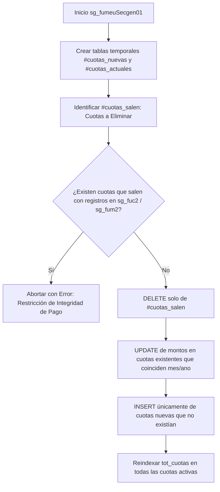

# Decisiones de Arquitectura: Cuotas y Tipos de Pago (PDS / DU288 / DU09)

## 1. Visión General

La tramitación de solicitudes de prestación de servicios y resoluciones (DU288 / DU09) requiere un modelo financiero flexible que permita tanto pagos periódicos fijos como pagos basados en horas de trabajo variables, asegurando al mismo tiempo la integridad referencial histórica cuando una solicitud es editada.

---

## 2. Catálogo de Tipos de Pago (`sg_tpps`)

Se incorporó formalmente el catálogo `sg_tpps` con dos modalidades operativas:

```sql
-- Catálogo sg_tpps
-- cod_tpps | des_tpps       | tip_calc
-- ---------+----------------+----------
--    1     | Cuota Fija     | Monto mensual fijo acordado
--    2     | Cuota Variable | Monto calculado según horas efectivamente reportadas
```

### Reglas de Negocio Asociadas a `cod_tpps`:
1. **Cuota Fija (`cod_tpps = 1`):**
   - El monto total del contrato se divide equitativamente entre los meses de vigencia del servicio (a menos que se especifique un calendario de montos desiguales).
   - No requiere reporte de horas mensuales para el cálculo del valor a pagar, aunque sí se valida el cumplimiento de las actividades convenidas.
2. **Cuota Variable (`cod_tpps = 2`):**
   - El monto mensual depende de las horas de ejecución registradas por período (`sg_fuco` / `sg_fuc2`).
   - El valor hora se define al momento de confeccionar la solicitud y se usa como multiplicador base.
   - Si un período no registra horas trabajadas, la cuota correspondiente tendrá un valor proyectado de $0 o se ajustará en la liquidación.

---

## 3. Modelo de Datos de Cuotas (`sg_fume`)

La tabla `sg_fume` almacena el detalle mensual de cada cuota comprometida:

* `nro_soli` (int): Número de solicitud.
* `ano_soli` (smallint): Año de solicitud.
* `corr_fuen` (smallint): Correlativo del funcionario / prestador.
* `nro_cuota` (smallint): Número correlativo de la cuota (1 a N).
* `ano_cuota` (smallint): Año del período a pagar.
* `mes_cuota` (smallint): Mes del período a pagar (1 a 12).
* `mto_cuota` (numeric/decimal): Monto bruto de la cuota.
* `tot_cuotas` (smallint): Cantidad total de cuotas del convenio.

---

## 4. Algoritmo de Sincronización Diferencial (`sg_fumeuSecgen01`)

### Problema Histórico:
Anteriormente, la actualización de meses o cuotas realizaba un `DELETE` total de `sg_fume` seguido de un `INSERT` masivo de las nuevas cuotas. Esto provocaba:
1. Ruptura de integridad referencial si existían tablas hijas (`sg_fuc2` de pagos de compensación o `sg_fum2` de liquidaciones).
2. Pérdida de claves primarias compuestas y números de cuota previamente aprobados en flujos de visación.

### Solución Implementada (Sync Diferencial):
El procedimiento almacenado `sg_fumeuSecgen01` implementa una estrategia de sincronización en 3 fases:



### Reglas Clave del SP:
1. **Preservación de `nro_cuota`:** Si un mes ya existía, mantiene su `nro_cuota` original para no alterar trazabilidad en reportes previos.
2. **Salvaguarda `ON DELETE RESTRICT`:** Si se intenta recortar el período de una prestación que ya tiene pagos enlazados en `sg_fuc2`, el sistema rechaza la operación informando que existen dependencias activas.
3. **Consistencia de Totales:** La sumatoria de `mto_cuota` debe coincidir con el total de la solicitud si `cod_tpps = 1`.

---

## 5. Integración Frontend (Nuxt / Vue)

1. **Componente `ExecutionMonthsTags.vue`:**
   - Muestra las etiquetas de los meses incluidos en la prestación.
   - Presenta un diseño compacto tipo badge para evitar el crecimiento vertical desmedido cuando el contrato cubre 6 a 12 meses.
2. **Validaciones en Formulario `PdsDu288RequestForm.vue`:**
   - Al cambiar la fecha de inicio o término del servicio, se recalculan automáticamente las cuotas propuestas y se sincronizan contra el backend.

---

## 6. Persistencia real de `cod_tpps` y `tot_cuotas` (2026-09-09)

Verificado extremo a extremo. Los dos campos que el solicitante elige en pantalla
—«Tipo de monto» y «Cuotas esperadas»— fallaban por causas **distintas**.

### 6.1. `tot_cuotas` nunca se guardaba (ADR-008)

`sg_fupsiSecgen01` y `sg_fupsuSecgen01` recibían `@tot_cuotas` y lo descartaban
antes de escribir:

| PA | Cómo lo perdía |
| :--- | :--- |
| `sg_fupsiSecgen01` | `SELECT @tot_cuotas = NULL` dentro de la rama `cod_modprs = 2` |
| `sg_fupsuSecgen01` | Lo anterior **y además** `tot_cuotas = NULL` fijo dentro del `UPDATE` |

El frontend y el backend enviaban el valor correctamente; moría en el PA. Ese
`NULL` venía de cuando DU288 no usaba el campo.

**Decisión:** `sg_fups.tot_cuotas` guarda las **cuotas declaradas por el
solicitante**, que fijan el techo del bruto (tope × cuotas, S0-013 Q-C01/Q-C02).
Ambos PA persisten el valor, con `1` por defecto si no llega — mismo criterio que
`periodos` en esos mismos PA y mismo default que el formulario.

> Las filas anteriores a este cambio tienen `tot_cuotas = NULL`. No hay migración:
> el valor se recompone al siguiente guardado de cada solicitud.

### 6.2. `cod_tpps` sí se guardaba; el defecto era de lectura (ADR-009)

`cod_tpps` **siempre se persistió bien** (`cod_tpps = @cod_tpps` en el `UPDATE`).
El defecto estaba en el frontend: `hydrateDu288StaffSummary` construía
`workerObj` **sin** `codTpps` ni `nroCuotas`, y como `restoreWorkerFromSummary`
hace `this.worker = cloneDeep(source.worker)`, al reabrir un funcionario guardado
ambos campos llegaban `undefined` y el `select` caía a su primera opción.

Efecto observado: se guardaba «Variable», y al volver a editar aparecía «Fija».
**El dato en base era correcto; la pantalla mentía.**

### 6.3. Matriz de verificación del ida y vuelta

| # | Caso | Resultado esperado |
| :--- | :--- | :--- |
| 1 | Guardar borrador con «Variable» y 2 cuotas | `cod_tpps = 2`, `tot_cuotas = 2` |
| 2 | Reabrir el funcionario para editar | Muestra «Variable» y 2 cuotas, no los valores por defecto |
| 3 | Guardar sin informar cuotas | `tot_cuotas = 1`, nunca `NULL` |
| 4 | Solicitud no DU288 | `tot_cuotas` sigue llegando `NULL`; sin cambio de comportamiento |

### 6.4. `sg_fume.mto_apagar` permanece `NULL`

La resolución **no** distribuye el monto por mes; eso lo define la etapa de pago.
Verificado por búsqueda en todo el árbol: `mto_apagar` solo aparece en un `SELECT`
de lectura (`sg_fupssSecgen17`, comparador de prestaciones anteriores) y en
modelos de respuesta del backend. **Ningún PA, backend ni frontend lo escribe**, y
el `INSERT` de `sg_fumeuSecgen01` no lo incluye.

Coherente con `decision_rango_ejecucion_sin_fume.md`. Persistirlo depende de
**Q-B13** (qué par de columnas representa el mes de ejecución), aún sin respuesta.

### 6.5. Corrección pendiente sobre §2 de este documento

Las «Reglas de Negocio Asociadas a `cod_tpps`» de la sección 2 describen para
Cuota Variable un **«valor hora pactado»** usado como multiplicador. Ese campo
**no existe** en el modelo de datos: `sg_fups` no tiene ninguna columna de valor
hora, y ningún PA la calcula.

La regla ratificada en S0-013 (§5 de `reglas_pagos/01_reglas_montos_por_tipo_de_flujo.md`)
dice otra cosa: en Variable *«el monto real de cada mes no se conoce al crear la
solicitud; la solicitud declara solo el techo máximo, y la distribución se define
al pago»*. Se deja marcado para que lo resuelva quien redactó §2, en vez de
reescribirlo aquí.
