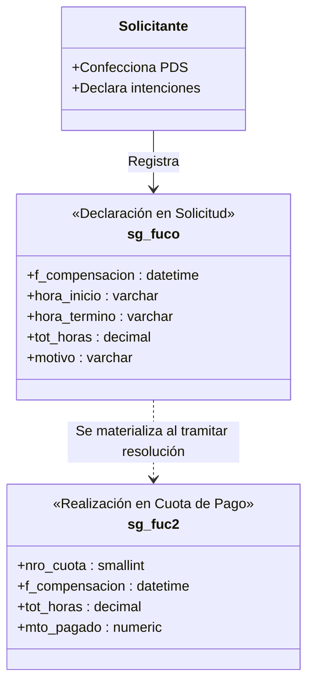

# Decisiones de Arquitectura: Horario de Ejecución y Compensaciones

## 1. Visión General

El subsistema de horarios de prestación de servicios organiza la jornada laboral del prestador en dos dimensiones complementarias:
1. **Horario Semanal Recurrente (`sg_fuho`):** Patrón estándar de días y horas de ejecución dentro de la semana. Hoy implementado de lunes a viernes; ampliarlo a sábado y domingo es lo acordado en §6 (ADR-024, aún no implementado).
2. **Compensaciones y Fechas Específicas (`sg_fuco` / `sg_fuc2`):** Ajustes extraordinarios de ejecución o redistribución de horas.

---

## 2. Horario Semanal Recurrente (`sg_fuho`)

El horario semanal define la distribución estándar de trabajo:

* `id_funprse` (int): Identificador de la función/prestación dueña del horario.
* `cod_diasem` (tinyint): Día de la semana (1=Lunes, ..., 7=Domingo). La implementación vigente acepta solo 1 a 5; ver §6.
* `correlativ` (tinyint): Orden correlativo del bloque dentro de la prestación.
* `hora_ini` (time): Hora de inicio del bloque.
* `hora_ter` (time): Hora de término del bloque; si es menor que `hora_ini`, el bloque continúa al día siguiente.

### Reglas de Negocio para `sg_fuho`:
1. **Límite Semanal de Carga Horaria:** La sumatoria semanal no puede superar las **56 horas cronológicas** para un mismo prestador (considerando todos sus contratos y prestaciones activas en la Universidad).
2. **Prevención de Traslapes:**
   - **Intra-solicitud:** No se permite que dos bloques horarios del mismo prestador se superpongan en el mismo día.
   - **Multi-PDS:** Si el prestador posee otra prestación de servicios vigente con horario recurrente registrado, el sistema alerta sobre cualquier colisión de horario.
3. **Cruce de medianoche:** Inicio y término iguales son inválidos. Un término menor al inicio representa un tramo que continúa al día siguiente y debe dividirse por fecha/día para validar feriados, traslapes y carga semanal.

---

## 3. Modelo de Compensaciones: Desacople `sg_fuco` vs `sg_fuc2`

Para evitar inconsistencias entre la etapa de formulación de la solicitud y la etapa de pago de cuotas, se estableció una estricta separación de responsabilidades:

### Diferencias Clave:
* **`sg_fuco` (Declarativo):** Registro de las fechas propuestas por el solicitante durante la creación del PDS. No está atado a una cuota específica ni a un monto de liquidación.
* **`sg_fuc2` (Financiero / Pago):** Registro que enlaza la compensación ejecutada con una cuota específica de la tabla `sg_fume` (`nro_cuota`). Se genera cuando el servicio pasa a visación y pago.

---

## 4. Validaciones de Negocio en Procedimientos Almacenados

1. **`sg_fuhosSecgen01` (Consulta de Horarios):**
   - Filtra por `nro_solici` y/o `id_funprse` y retorna los bloques ordenados por `id_funprse`, `cod_diasem` y `correlativ`.
2. **`sg_fuhosiSecgen01` (Inserción de Bloque Horario):**
   - Acepta únicamente lunes a viernes (`cod_diasem` 1 a 5). Debe ampliarse a 1 a 7 por ADR-024 (§6).
   - Rechaza horas iguales y permite término menor como cruce al día siguiente.
   - Rechaza que un tramo iniciado el viernes continúe al sábado. Punto abierto en §6.5.
   - El PA no contiene por sí solo los guards de traslape o 56 horas; esas reglas se validan en frontend y backend antes de sincronizar. Esta limitación del PA debe considerarse al evaluar defensa en profundidad.
3. **`sg_fucoiSecgen01` (Inserción de Compensación):**
   - Valida que la fecha se encuentre dentro del rango de vigencia de la prestación.
   - Valida contra `es_cfer` que la fecha no sea Feriado Nacional (`cod_tipfer = 1`).

---

## 5. Reacción ante Cambios de FUHO, Período o Calendario (ADR-013, `APLICADO`)

### 5.1. Principio de conservación

Una compensación `sg_fuco` es una elección explícita del solicitante. Por lo
tanto, ningún cambio en `sg_fuho`, en `f_inicio`/`f_termino` o en el calendario
institucional puede mover, copiar, recortar ni eliminar automáticamente una
compensación ya registrada.

El sistema aplica esta secuencia:

1. Conserva las filas de compensación y sus identificadores.
2. Recalcula las horas efectivas esperadas desde el FUHO vigente, descontando
   solamente feriados nacionales.
3. Recalcula horas compensadas, faltantes o excedidas.
4. Cierra la fecha/formulario que estuviera seleccionado para no continuar con
   límites derivados del estado anterior.
5. Bloquea el guardado cuando exista diferencia de horas o una fecha inválida.
6. Exige que el usuario corrija horarios, restablezca el período o elimine el
   tramo mediante una acción explícita.

### 5.2. Matriz de reacción

| Cambio | Datos conservados | Datos recalculados | Resultado visible |
| :--- | :--- | :--- | :--- |
| Agregar, editar o quitar FUHO | Todas las compensaciones | Horas efectivas requeridas y balance | Faltante, completo o exceso actualizado inmediatamente |
| Cambiar inicio/término | Todas las compensaciones | Meses, fechas hábiles y balance | Las compensaciones no habilitadas aparecen en «requieren ajuste» |
| Cargar/refrescar calendario | Todas las compensaciones | Bloqueos por fecha y horas efectivas | Feriados nacionales bloqueados; tipos 2/3 informativos |
| Eliminar todo FUHO | Compensaciones existentes, si las hay | Requeridas = 0; registradas pasan a exceso/inválidas | Se permite acceder para retirarlas; sin compensaciones se muestra estado vacío |

### 5.3. Alcance del recálculo

* El recálculo modifica el **balance esperado**, no la fecha ni el horario de
  una fila `sg_fuco`.
* No existe una regla determinista para decidir a qué nuevo día trasladar una
  compensación; hacerlo automáticamente inventaría una declaración del usuario.
* El monto autorizado y las cuotas no se recalculan por un feriado. Solo cambia
  la cantidad de horas efectivas que requiere compensación.
* La validación se ejecuta en frontend para retroalimentación y nuevamente en
  backend/PA como autoridad, incluso si el usuario altera el payload.

### 5.4. Evidencia de implementación

* `StaffCompensationSection.vue`: recálculo reactivo, cierre de selección,
  calendario cerrado sin fuente y listado de compensaciones inválidas.
* `PdsDu288RequestForm.vue`: validación previa al guardado sin purga automática.
* `StaffExecutionScheduleSection.vue`: fecha exacta del feriado nacional y horas
  no consideradas en el día FUHO correspondiente.
* `institutionalCalendar.test.cjs`: prueba que al cambiar FUHO se conserva la
  compensación y cambia el balance requerido.
* `service-provision-institutional-calendar.unit.ts`: prueba el rechazo del
  backend en feriado nacional y el carácter informativo del tipo 2.

---

## 6. Días de Ejecución en Fin de Semana (ADR-024, `PROPUESTO`)

### 6.1. Lo acordado

`sg_fuho` debe admitir **sábado (`cod_diasem = 6`) y domingo (`cod_diasem = 7`)**
como días de ejecución de la prestación.

La ampliación es **exclusiva del horario de ejecución**. La compensación
(`sg_fuco`) **no aplica** en fin de semana y mantiene su restricción a días
hábiles sin cambio alguno.

### 6.2. Por qué

Existen prestaciones de servicios que se ejecutan efectivamente en sábado o
domingo. Hasta ahora el sistema no permitía declararlas: el solicitante debía
omitir esos días o desplazarlos a un día hábil, con lo que el horario declarado
dejaba de corresponder a la ejecución real y las horas proyectadas quedaban
subestimadas.

La restricción de lunes a viernes **no proviene de la normativa**. Se revisó
`reglas/reglas_restricciones_du288_d09.md` y el DU 288 / D.09 no fijan días
hábiles para la ejecución: el límite es un supuesto de implementación heredado
de la jornada institucional (08:30 a 17:18, lunes a viernes, Circular Jornada
Única 26.11.1996), que regula **cuándo hay jornada ordinaria**, no **cuándo
puede ejecutarse una prestación**.

La compensación sí depende de la jornada institucional: compensar significa
devolver horas de jornada ordinaria, y en fin de semana no hay jornada que
devolver. Por eso la ampliación se detiene en la ejecución y no se propaga a
`sg_fuco`.

### 6.3. Alcance

| Ámbito | Decisión |
| :--- | :--- |
| Horario de ejecución `sg_fuho` | Admite `cod_diasem` 1 a 7 |
| Compensación `sg_fuco` | Sin cambio: solo días hábiles |
| Regla de 56 horas semanales | Sin cambio de fórmula; ver 6.4 |
| Tope mensual, cuotas y montos | Sin efecto |
| Esquema de base de datos | Sin cambio: `cod_diasem` ya es `tinyint` sin `CHECK` |
| Datos existentes | Sin migración: por construcción no existen filas con 6 o 7 |

### 6.4. Efecto sobre los cálculos

La proyección de horas (`getExpectedScheduleHoursByDate`) recorre **fechas
reales** del período con `getUTCDay() || 7`, no índices de día. La fórmula ya
soporta 6 y 7; lo que la bloquea es un filtro explícito, no el cálculo.

Consecuencias al habilitarlos:

1. **Suben las horas de ejecución esperadas** del período. Cuando la prestación
   requiere compensación, sube también la compensación exigida, que deberá
   registrarse en días hábiles.
2. **La regla de 56 horas no cambia de fórmula.** Se evalúa sobre fechas reales
   de compensación; lo que varía es la contraparte `expectedByWeek`.
3. **Los feriados nacionales pasan a ser relevantes en fin de semana.** Un
   `es_cfer` tipo 1 que caiga en sábado ahora descuenta horas de ejecución;
   antes era inocuo.
4. **La trazabilidad semanal debe incluir el fin de semana.** Hoy el rango
   efectivo de cada semana se arma solo con días hábiles, de modo que una semana
   con ejecución únicamente en sábado quedaría sin fechas visibles.

### 6.5. Puntos abiertos antes de implementar

| # | Punto | Estado |
| :--- | :--- | :--- |
| 1 | **«Dentro de jornada» en fin de semana.** **Resuelto el 2026-09-21: sí se permite.** La franja 08:30–17:18 pasa a ser una restricción de **hora del día**, independiente del día de la semana, y se valida igual en sábado y domingo. `insideWorkday` es un atributo de la prestación, no del tramo. Consecuencia asumida: una prestación con tramos de fin de semana marcada «dentro de jornada» genera obligación de compensar por esas horas, y esa compensación se registra en día hábil (§6.4.1). «Compensación no aplica en fin de semana» significa que no se registran filas `sg_fuco` con fecha de sábado o domingo, no que las horas de fin de semana queden fuera del balance. | `RESUELTO` |
| 2 | **Tramos que cruzan medianoche.** **Resuelto el 2026-09-21: se permiten todos.** Se levanta la prohibición del viernes→sábado y se habilitan sábado→domingo y domingo→lunes. El segundo segmento de un tramo iniciado el domingo se computa como día 1 (lunes): el día 8 se envuelve dentro de la semana. Obliga a revisar traslapes, cálculo de tramos libres y proyección semanal, porque un tramo pasa a poder cruzar el borde de la semana. | `RESUELTO` |
| 3 | **Respaldo formal.** La ampliación no contradice la normativa revisada, pero tampoco está respaldada por un acuerdo documentado previo. Corresponde registrar quién la aprueba. | `ABIERTO` |

### 6.6. Inventario de impacto

Implementado el 2026-09-21 en las tres capas. Se conserva el inventario como
mapa de lo tocado.

**Base de datos**

* `sg_fuhosiSecgen01`: rechaza `cod_diasem > 5` y prohíbe el tramo
  viernes→sábado. Requiere nueva versión en el paquete de certificación.

**Backend**

* `getStaffScheduleInterval`: rango 1 a 5.
* `validateStaffWorkload`: rechaza segmentos mayores a 5.
* `saveStaffSchedule`: mensaje «termina en fin de semana».
* `getStaffSchedule`: **filtra los días 6 y 7 al leer**. Sin este punto, una
  fila de fin de semana se guardaría y desaparecería al reabrir la solicitud.
* `service-provision-staff-schedule.unit.ts`: afirma hoy el rechazo.

**Frontend**

* `getWeeklyScheduleInterval`: rango 1 a 5. Es la fuente de verdad; el resto
  deriva de ella.
* `getWeeklyScheduleVisualSegments`: descarta segmentos mayores a 5 al dibujar.
* `getExpectedScheduleHoursByDate`: filtra los tramos de fin de semana.
* `getCompensationWeeklySummary`: arma el rango semanal solo con días hábiles.
* `StaffExecutionScheduleSection.vue`: `dayOptionsList` alimenta el selector
  **y** las columnas de la grilla; más validación y mensajes de fin de semana.
* `StaffExecutionWeeklyGrid.vue`: la grilla fija cinco columnas y un ancho
  mínimo calculado sobre cinco.
* `PdsDu288RequestForm.vue`: el arreglo de nombres de día llega hasta viernes
  (mostraría «día no válido»), la validación de envío corta en 5, y la rama de
  «fuera de jornada» solo evalúa días 1 a 5, por lo que un sábado pasaría sin
  validar.
* `textSimilarityUtil.js`: los tramos libres frente a PDS previas se calculan
  sobre lunes a viernes.
* `lang/es/pds.js`: faltan las etiquetas de sábado y domingo.

**Sin cambios necesarios.** Ya operan sobre 1 a 7 o sobre fechas reales: el
documento de resolución y su cálculo de horas totales, el resumen del
funcionario, el modal de PDS previas y el detalle de resolución.

### 6.7. Hallazgos surgidos al implementar

Tres puntos no estaban en el inventario inicial y habrían dejado el cambio a
medias:

1. **El cálculo de traslapes comparaba minutos absolutos de la semana.** Un
   tramo domingo 23:00–01:00 quedaba al final de la recta semanal, después del
   lunes de la otra solicitud, de modo que el choque real con un lunes 00:30 no
   se detectaba. Se reemplazó por comparación segmento contra segmento sobre el
   día ya envuelto, en frontend y backend. Para los tramos que no cruzan el
   borde el resultado es idéntico al anterior.
2. **La proyección por fecha derivaba el desplazamiento restando los días.** En
   un tramo iniciado el domingo, `1 - 7` habría puesto el segundo segmento seis
   días antes en vez de uno después. Los segmentos llevan ahora un
   `dayOffset` explícito.
3. **Dos filtros de lectura descartaban los días 6 y 7 al hidratar** (uno en el
   backend, otro en el formulario). Sin corregirlos, un tramo de fin de semana
   se guardaba y desaparecía al reabrir la solicitud, sin aviso.

La carga semanal de 56 horas también ignoraba los tramos de fin de semana al
sumar horas comprometidas; ahora los cuenta.
