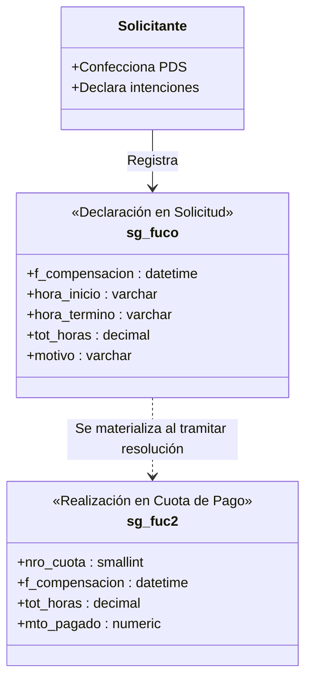

# Decisiones de Arquitectura: Horario de Ejecución y Compensaciones

## 1. Visión General

El subsistema de horarios de prestación de servicios organiza la jornada laboral del prestador en dos dimensiones complementarias:
1. **Horario Semanal Recurrente (`sg_fuho`):** Patrón estándar de días y horas asignados durante la semana laboral (lunes a viernes).
2. **Compensaciones y Fechas Específicas (`sg_fuco` / `sg_fuc2`):** Ajustes extraordinarios de ejecución o redistribución de horas.

---

## 2. Horario Semanal Recurrente (`sg_fuho`)

El horario semanal define la distribución estándar de trabajo:

* `id_funprse` (int): Identificador de la función/prestación dueña del horario.
* `cod_diasem` (tinyint): Día de la semana (1=Lunes, ..., 5=Viernes).
* `correlativ` (tinyint): Orden correlativo del bloque dentro de la prestación.
* `hora_ini` (time): Hora de inicio del bloque.
* `hora_ter` (time): Hora de término del bloque; si es menor que `hora_ini`, el bloque continúa al día siguiente.

### Reglas de Negocio para `sg_fuho`:
1. **Límite Semanal de Carga Horaria:** La sumatoria semanal no puede superar las **56 horas cronológicas** para un mismo prestador (considerando todos sus contratos y prestaciones activas en la Universidad).
2. **Prevención de Traslapes:**
   - **Intra-solicitud:** No se permite que dos bloques horarios del mismo prestador se superpongan en el mismo día.
   - **Multi-PDS:** Si el prestador posee otra prestación de servicios vigente con horario recurrente registrado, el sistema alerta sobre cualquier colisión de horario.
3. **Cruce de medianoche:** Inicio y término iguales son inválidos. Un término menor al inicio representa un tramo que continúa al día siguiente y debe dividirse por fecha/día para validar feriados, traslapes y carga semanal.

---

## 3. Modelo de Compensaciones: Desacople `sg_fuco` vs `sg_fuc2`

Para evitar inconsistencias entre la etapa de formulación de la solicitud y la etapa de pago de cuotas, se estableció una estricta separación de responsabilidades:

### Diferencias Clave:
* **`sg_fuco` (Declarativo):** Registro de las fechas propuestas por el solicitante durante la creación del PDS. No está atado a una cuota específica ni a un monto de liquidación.
* **`sg_fuc2` (Financiero / Pago):** Registro que enlaza la compensación ejecutada con una cuota específica de la tabla `sg_fume` (`nro_cuota`). Se genera cuando el servicio pasa a visación y pago.

---

## 4. Validaciones de Negocio en Procedimientos Almacenados

1. **`sg_fuhosSecgen01` (Consulta de Horarios):**
   - Filtra por `nro_solici` y/o `id_funprse` y retorna los bloques ordenados por `id_funprse`, `cod_diasem` y `correlativ`.
2. **`sg_fuhosiSecgen01` (Inserción de Bloque Horario):**
   - Acepta únicamente lunes a viernes (`cod_diasem` 1 a 5).
   - Rechaza horas iguales y permite término menor como cruce al día siguiente.
   - Rechaza que un tramo iniciado el viernes continúe al sábado.
   - El PA no contiene por sí solo los guards de traslape o 56 horas; esas reglas se validan en frontend y backend antes de sincronizar. Esta limitación del PA debe considerarse al evaluar defensa en profundidad.
3. **`sg_fucoiSecgen01` (Inserción de Compensación):**
   - Valida que la fecha se encuentre dentro del rango de vigencia de la prestación.
   - Valida contra `es_cfer` que la fecha no sea Feriado Nacional (`cod_tipfer = 1`).

---

## 5. Reacción ante Cambios de FUHO, Período o Calendario (ADR-013, `APLICADO`)

### 5.1. Principio de conservación

Una compensación `sg_fuco` es una elección explícita del solicitante. Por lo
tanto, ningún cambio en `sg_fuho`, en `f_inicio`/`f_termino` o en el calendario
institucional puede mover, copiar, recortar ni eliminar automáticamente una
compensación ya registrada.

El sistema aplica esta secuencia:

1. Conserva las filas de compensación y sus identificadores.
2. Recalcula las horas efectivas esperadas desde el FUHO vigente, descontando
   solamente feriados nacionales.
3. Recalcula horas compensadas, faltantes o excedidas.
4. Cierra la fecha/formulario que estuviera seleccionado para no continuar con
   límites derivados del estado anterior.
5. Bloquea el guardado cuando exista diferencia de horas o una fecha inválida.
6. Exige que el usuario corrija horarios, restablezca el período o elimine el
   tramo mediante una acción explícita.

### 5.2. Matriz de reacción

| Cambio | Datos conservados | Datos recalculados | Resultado visible |
| :--- | :--- | :--- | :--- |
| Agregar, editar o quitar FUHO | Todas las compensaciones | Horas efectivas requeridas y balance | Faltante, completo o exceso actualizado inmediatamente |
| Cambiar inicio/término | Todas las compensaciones | Meses, fechas hábiles y balance | Las compensaciones no habilitadas aparecen en «requieren ajuste» |
| Cargar/refrescar calendario | Todas las compensaciones | Bloqueos por fecha y horas efectivas | Feriados nacionales bloqueados; tipos 2/3 informativos |
| Eliminar todo FUHO | Compensaciones existentes, si las hay | Requeridas = 0; registradas pasan a exceso/inválidas | Se permite acceder para retirarlas; sin compensaciones se muestra estado vacío |

### 5.3. Alcance del recálculo

* El recálculo modifica el **balance esperado**, no la fecha ni el horario de
  una fila `sg_fuco`.
* No existe una regla determinista para decidir a qué nuevo día trasladar una
  compensación; hacerlo automáticamente inventaría una declaración del usuario.
* El monto autorizado y las cuotas no se recalculan por un feriado. Solo cambia
  la cantidad de horas efectivas que requiere compensación.
* La validación se ejecuta en frontend para retroalimentación y nuevamente en
  backend/PA como autoridad, incluso si el usuario altera el payload.

### 5.4. Evidencia de implementación

* `StaffCompensationSection.vue`: recálculo reactivo, cierre de selección,
  calendario cerrado sin fuente y listado de compensaciones inválidas.
* `PdsDu288RequestForm.vue`: validación previa al guardado sin purga automática.
* `StaffExecutionScheduleSection.vue`: fecha exacta del feriado nacional y horas
  no consideradas en el día FUHO correspondiente.
* `institutionalCalendar.test.cjs`: prueba que al cambiar FUHO se conserva la
  compensación y cambia el balance requerido.
* `service-provision-institutional-calendar.unit.ts`: prueba el rechazo del
  backend en feriado nacional y el carácter informativo del tipo 2.
