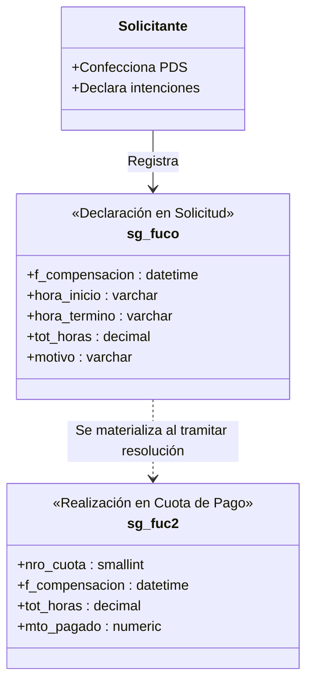

# Decisiones de Arquitectura: Horario de Ejecución y Compensaciones

## 1. Visión General

El subsistema de horarios de prestación de servicios organiza la jornada laboral del prestador en dos dimensiones complementarias:
1. **Horario Semanal Recurrente (`sg_fuho`):** Patrón estándar de días y horas asignados durante la semana (Lunes a Domingo).
2. **Compensaciones y Fechas Específicas (`sg_fuco` / `sg_fuc2`):** Ajustes extraordinarios de ejecución o redistribución de horas.

---

## 2. Horario Semanal Recurrente (`sg_fuho`)

El horario semanal define la distribución estándar de trabajo:

* `nro_soli` (int): Número de solicitud.
* `ano_soli` (smallint): Año de solicitud.
* `corr_fuen` (smallint): Correlativo del funcionario/prestador.
* `cod_dia` (smallint): Día de la semana (1=Lunes, 2=Martes, ..., 7=Domingo).
* `hora_inicio` (varchar/time): Hora de inicio del bloque (HH:MM).
* `hora_termino` (varchar/time): Hora de término del bloque (HH:MM).
* `tot_horas` (decimal): Horas del bloque.

### Reglas de Negocio para `sg_fuho`:
1. **Límite Semanal de Carga Horaria:** La sumatoria semanal no puede superar las **56 horas cronológicas** para un mismo prestador (considerando todos sus contratos y prestaciones activas en la Universidad).
2. **Prevención de Traslapes:**
   - **Intra-solicitud:** No se permite que dos bloques horarios del mismo prestador se superpongan en el mismo día.
   - **Multi-PDS:** Si el prestador posee otra prestación de servicios vigente con horario recurrente registrado, el sistema alerta sobre cualquier colisión de horario.
3. **Mínimo y Máximo de Bloque:** Cada bloque debe tener una duración mínima de 30 minutos y no extenderse más allá de las 23:59 del mismo día.

---

## 3. Modelo de Compensaciones: Desacople `sg_fuco` vs `sg_fuc2`

Para evitar inconsistencias entre la etapa de formulación de la solicitud y la etapa de pago de cuotas, se estableció una estricta separación de responsabilidades:

### Diferencias Clave:
* **`sg_fuco` (Declarativo):** Registro de las fechas propuestas por el solicitante durante la creación del PDS. No está atado a una cuota específica ni a un monto de liquidación.
* **`sg_fuc2` (Financiero / Pago):** Registro que enlaza la compensación ejecutada con una cuota específica de la tabla `sg_fume` (`nro_cuota`). Se genera cuando el servicio pasa a visación y pago.

---

## 4. Validaciones de Negocio en Procedimientos Almacenados

1. **`sg_fuhosSecgen01` (Consulta de Horarios):**
   - Retorna los bloques ordenados por `cod_dia` y `hora_inicio`.
   - Incluye el cálculo del total de horas semanales declaradas.
2. **`sg_fuhoiSecgen01` (Inserción de Bloque Horario):**
   - Valida que `hora_termino > hora_inicio`.
   - Comprueba que no exista traslape con otro bloque en el mismo día.
   - Verifica que el total acumulado no supere las 56 horas semanales.
3. **`sg_fucoiSecgen01` (Inserción de Compensación):**
   - Valida que la fecha se encuentre dentro del rango de vigencia de la prestación.
   - Valida contra `es_cfer` que la fecha no sea Feriado Nacional (`cod_tipfer = 1`).
