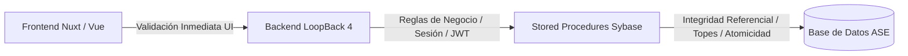
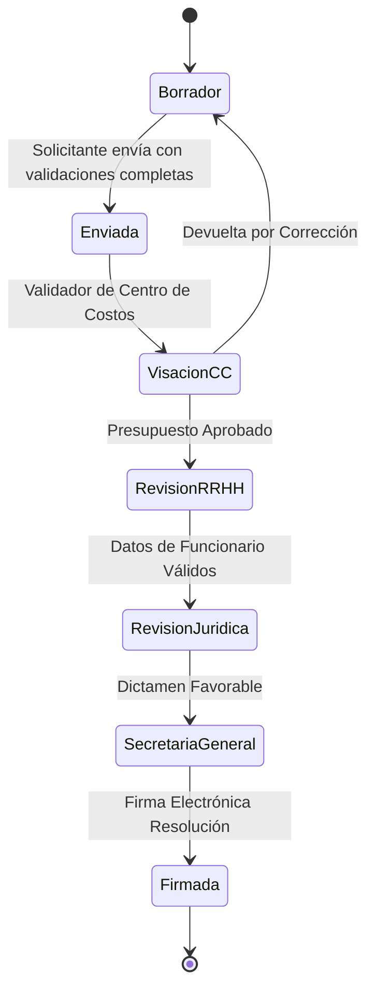

# Matriz Maestra de Validaciones, Topes y Restricciones de Negocio
## Ecosistema SG-Solicitudes / Prestación de Servicios (PDS - DU288 / DU09)

Este documento centraliza **todas las reglas de negocio, límites máximos (topes), validaciones cruzadas y restricciones de seguridad** aplicadas en la base de datos (Sybase), la lógica de negocio (LoopBack 4) y la interfaz de usuario (Nuxt.js).

---

## 1. Matriz de Control: Capas de Validación

Siguiendo el principio de **Defensa en Profundidad (Defense in Depth)**, ninguna validación depende exclusivamente del Frontend:

| Tipo de Validación | Frontend (UI/UX) | Backend (Service/Controller) | Base de Datos (Stored Procedures) |
| :--- | :---: | :---: | :---: |
| **Tope 56 horas semanales** | Feedback visual en tiempo real | Validación de integridad DTO | Autoridad final con rollback |
| **Traslapes horarios (mismo PDS)** | Bloqueo en editor semanal | Rechazo HTTP 400 Bad Request | Rechazo en `sg_fuhoiSecgen01` |
| **Traslapes multi-PDS (mismo RUT)** | Advertencia tras consulta API | Verificación cruzada de vigencia | Validación cruzada en BD |
| **Feriados Nacionales (Compensación)** | Días deshabilitados en rojo | Rechazo en endpoint compensación | Rechazo estricto en `sg_fucoiSecgen01` |
| **Consistencia de Cuotas y Total** | Recálculo dinámico en formulario | Validación matemática de suma | Validación en `sg_fumeuSecgen01` |
| **Integridad de Cuotas Pagadas** | Deshabilitación de edición de mes | Control de flujo de estados | `ON DELETE RESTRICT` safeguard |
| **Vigencia del Contrato (`f_inicio <= f_termino`)** | DatePicker restringido | Validación de rango temporal | Rechazo en guards iniciales |

---

## 2. Topes y Restricciones de Carga Horaria

### 2.1. Tope Máximo Semanal (56 Horas Cronológicas)
* **Regla:** Ningún prestador de servicios (identificado por su RUT) puede acumular más de **56 horas semanales** de trabajo en la Universidad de La Frontera.
* **Cálculo:** Se suman todas las horas semanales recurrentes (`sg_fuho`) del PDS actual más todas las horas de otras prestaciones y contratos vigentes en el mismo rango de fechas.
* **Comportamiento:**
  - **Frontend:** La barra de métricas (`StaffExecutionScheduleSummary.vue`) cambia a color rojo (`bg-danger`) y muestra el mensaje *"Tope máximo alcanzado"*.
  - **Backend / BD:** `sg_fuhoiSecgen01` aborta la transacción y retorna el mensaje:  
    `"El prestador excede el limite maximo de 56 horas semanales permitidas"`.

### 2.2. Restricciones de Bloque Horario Diario
* **Duración Mínima:** 30 minutos por bloque.
* **Límite Horario:** Ningún bloque puede iniciar antes de las `07:00` ni extenderse después de las `23:59`.
* **Coherencia Temporal:** `hora_termino` debe ser estrictamente mayor que `hora_inicio`.

### 2.3. Control de Traslapes Horarios
1. **Traslape Intra-Solicitud:** Dos bloques del mismo prestador para el mismo día de la semana no pueden solaparse.
   - *Ejemplo prohibido:* Lunes 08:30 - 12:30 y Lunes 10:00 - 14:00.
2. **Traslape Multi-PDS:** Si el prestador ya tiene una prestación aprobada con horario los Lunes 09:00 - 11:00, una nueva solicitud no puede utilizar ese mismo tramo.

---

## 3. Restricciones de Calendario y Feriados

### 3.1. Rango de Vigencia
* `f_inicio` debe ser menor o igual a `f_termino`.
* La prestación no puede tener una duración superior a **12 meses corridos** por solicitud (debe renovarse en el año calendario siguiente si corresponde).

### 3.2. Feriados Nacionales vs Compensaciones
* **Regla de Oro:** Está **estrictamente prohibido** asignar horas de compensación (`sg_fuco`) en días declarados como Feriados Nacionales o Feriados Legales Irrenunciables (`es_cfer.cod_tipfer = 1`).
* **Feriados Universitarios y Recesos (`cod_tipfer` 2 y 3):** Se permite la asignación si la naturaleza del servicio lo amerita (ej: eventos especiales, labores de soporte continuo), pero el sistema emite una notificación de advertencia.

---

## 4. Validaciones Financieras y de Cuotas (`sg_fume`)

### 4.1. Cuota Fija (`cod_tpps = 1`)
* La suma de todas las cuotas mensuales (`mto_cuota`) debe coincidir exactamente con el monto total acordado de la prestación:
$$\sum_{i=1}^{tot\_cuotas} mto\_cuota_i = mto\_total$$
* No se permiten cuotas con monto $0 en contratos de cuota fija.

### 4.2. Cuota Variable (`cod_tpps = 2`)
* El valor mensual se proyecta con base en el valor hora pactado multiplicado por las horas declaradas.
* Si un mes no registra horas efectivas, el monto de la cuota proyectada es $0 y no bloquea el flujo.

### 4.3. Integridad de Cuotas en Modificaciones (`sg_fumeuSecgen01`)
* **Salvaguarda de Pagos Asociados:** Si una solicitud pasa por una modificación y se intenta recortar meses de vigencia, el SP verifica si existen registros en `sg_fuc2` (compensaciones liquidadas) o `sg_fum2` (visaciones de pago).
* Si existen pagos asociados, el sistema **bloquea la eliminación del mes** y exige la anulación o ajuste previo del pago en la unidad de finanzas.

---

## 5. Validaciones de Workflow y Seguridad de Estados

### Reglas de Inmutabilidad por Estado:
1. **Estado `Borrador`:** Edición libre de prestadores, horarios, cuotas y centros de costo.
2. **Estados en Trámite (`Enviada`, `Visación`, etc.):** Datos bloqueados para edición. Solo usuarios con rol de revisor pueden emitir visación o devolver a estado `Borrador` con observaciones.
3. **Estado `Firmada / Concluida`:** Inmutabilidad absoluta. Cualquier ajuste posterior debe realizarse mediante una **Resolución Modificatoria**.

---

## 6. Resumen de Códigos y Mensajes Semánticos de Rechazo

| Escenario de Rechazo | Capa de Detección | Mensaje Semántico al Usuario |
| :--- | :--- | :--- |
| Exceso de 56 horas semanales | SP `sg_fuhoiSecgen01` | *"El prestador excede el límite máximo de 56 horas semanales permitidas."* |
| Solapamiento de bloques en mismo día | SP `sg_fuhoiSecgen01` | *"El horario ingresado se superpone con otro bloque existente para este día."* |
| Compensación en Feriado Nacional | SP `sg_fucoiSecgen01` | *"La fecha seleccionada coincide con un feriado nacional no ejecutable."* |
| Intento de borrar cuota con pagos | SP `sg_fumeuSecgen01` | *"No es posible modificar las cuotas porque existen registros de pago asociados."* |
| Discrepancia en suma de cuotas fijas | Backend Service | *"La suma de las cuotas no coincide con el monto total de la prestación."* |
| Fecha de término menor a inicio | Frontend / Backend | *"La fecha de término debe ser posterior a la fecha de inicio del servicio."* |

---

## 7. Atributos de monto: qué contiene cada uno y quién los valida (2026-09-09)

Auditoría completa de las variables de monto del sistema, verificada contra
código y DDL. Es el insumo para cualquier ajuste de validación financiera.

| Atributo | Nulabilidad | Qué contiene **realmente** | Uso en validación |
| :--- | :--- | :--- | :--- |
| `sg_fups.mto_total` | `NOT NULL` | Monto total autorizado. **Única fuente autoritativa.** | Backend: `ceil(total ÷ tope)` vs cuotas. Frontend: techo del bruto |
| `sg_fups.mto_tope` | — | Tope normativo congelado | Base de toda validación de tope |
| `sg_fups.tot_cuotas` | `NULL` permitido | Cuotas declaradas por el solicitante | Techo = tope × cuotas (S0-013 Q-C01) |
| `sg_fups.monto_mes` | **`NOT NULL`** | **El monto TOTAL, no el mensual** | Se expone como `monthlyAmount`; hay que dividirlo por meses antes de usarlo |
| `sg_fups.periodos` | **`NOT NULL`** | Forzado a `1` en DU288 | La resolución calcula `periodos × monto_mes` |
| `sg_fups.cod_tpps` | `NULL` permitido | 1 = Fijo, 2 = Variable | **Ninguna. Solo se usa para MOSTRAR** |
| `sg_fume.mto_apagar` | `NULL` permitido | `NULL` siempre | Ninguna (bloqueado por Q-B13) |

### 7.1. `monto_mes` no contiene el monto mensual

Los PA lo **defaultean** a `mto_total` cuando llega nulo, y el frontend envía
`monthAmmount: row.amount` (el total). Resultado: `monto_mes == mto_total`
siempre en DU288.

El código ya lo reconoce y lo compensa dividiendo por los meses de ejecución, en
dos lugares (`monthlyCapAggregateCheck` y `capNoteForRelated`), donde está
documentado como *«defecto de origen»*.

**Decisión: no se corrige por ahora.** Tres restricciones lo impiden:

1. `monto_mes` es `NOT NULL` — no puede quedar `NULL` para Variable.
2. El invariante `periodos × monto_mes = mto_total` se cumple hoy por accidente
   (`periodos = 1`), y **cuatro** consumidores dependen de él: el fallback de
   `resolution.controller.ts`, `ResolutionDetail.vue`, `HistoryItem.vue` y
   `NormativeResolutionActionPanel.vue`. Cambiar solo `monto_mes` haría que la
   resolución impresa muestre el mensual como si fuera el total.
3. El redondeo descuadra: `$100.000 ÷ 3 = $33.333,33`, y `3 × 33.333,33 =
   $99.999,99 ≠ mto_total`.

Y el problema decisivo es la **ambigüedad histórica**: las filas ya guardadas
tienen el total en `monto_mes`. Si a partir de una fecha se guardara el mensual,
la columna significaría dos cosas distintas sin discriminador confiable, y los
parches de división **no se podrían quitar igual**, porque tendrían que seguir
manejando las filas viejas.

El lugar correcto para el monto por cuota es `sg_fume.mto_apagar`, bloqueado por
**Q-B13**.

## 8. Las validaciones no distinguen Fijo de Variable (ADR-010, `PROPUESTO`)

Verificado por búsqueda de `cod_tpps` en `utils/` y en el backend: aparece
**únicamente** en `getFixedMonthAmount` (que es display) y en el mapeo de
escritura. **Ninguna validación consulta el tipo de monto.**

### 8.1. Dónde importa

`monthlyCapAggregateCheck` (Regla 3, tope mensual entre PDS concurrentes) divide
el monto por los meses de ejecución **para todos por igual**:

* **Fijo** — correcto y exacto. §5 de las reglas de pago define reparto parejo
  entre los meses, así que el promedio *es* el monto real del mes.
* **Variable** — §5 dice que *«el monto real de cada mes no se conoce; la
  solicitud declara solo el techo máximo»*. Dividir por meses **asume reparto
  parejo**, supuesto que la regla no respalda, y es el **optimista**: una PDS
  variable de $1.800.000 en 6 meses aporta $300.000 al cálculo, pero podría
  concentrar bastante más en un mes real.

Lo que **sí es correcto para ambos tipos** y no debe tocarse: la validación de
monto autorizado del backend (`ceil(total ÷ tope)` vs cuotas declaradas), porque
razona sobre techos y no sobre distribución.

### 8.2. Prerrequisito de datos, hoy inexistente

Para distinguir el tipo de una PDS **previa**, el dato no viaja:
`sg_fupssSecgen17` devuelve `mto_total`, `monto_mes`, `tot_cuotas` y `mto_tope`,
pero **no `cod_tpps`**; el modelo de respuesta tampoco lo mapea. Además
`tot_cuotas` llega `NULL` en toda fila histórica (ver ADR-008).

Exponer `cod_tpps` en ese PA y en el modelo de respuesta es **requisito de
cualquiera de las tres opciones** y no altera resultados por sí solo.

### 8.3. Decisión pendiente

Cómo debe aportar una PDS **Variable** al tope mensual concurrente:

| Opción | Regla | Consecuencia |
| :---: | :--- | :--- |
| **A** | Como hoy: `total ÷ meses` | Deja pasar combinaciones que en un mes real pueden exceder |
| **B** | `total ÷ tot_cuotas` | Coherente con T-01/T-06 («el tope se valida por cuota»). Viable desde ADR-008. Con cuotas = meses equivale a A |
| **C** | Peor caso: `min(total, tope)` | Máximamente prudente; casi cualquier PDS concurrente a una Variable dispararía la alerta |

**Recomendación: B.** No se aplica ninguna sin ratificación: es cálculo de pagos,
y §9 de las reglas deja abiertos los puntos vecinos (**Q-C13/Q-C14** qué fecha
determina el tope, **Q-C07** saldo intra-mes entre cuotas).

### 8.4. Corrección pendiente sobre §4 de este documento

La sección 4.1 formula `Σ mto_cuota = mto_total` sobre una columna **`mto_cuota`
que no existe** en el esquema; la columna real es `sg_fume.mto_apagar`, hoy
siempre `NULL`. La sección 4.2 vuelve a apoyarse en un «valor hora pactado» que
tampoco existe en el modelo de datos (misma observación que §6.5 del documento
01). Se deja marcado en vez de reescribirlo aquí.
