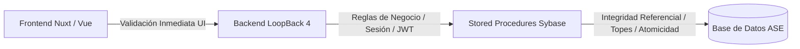
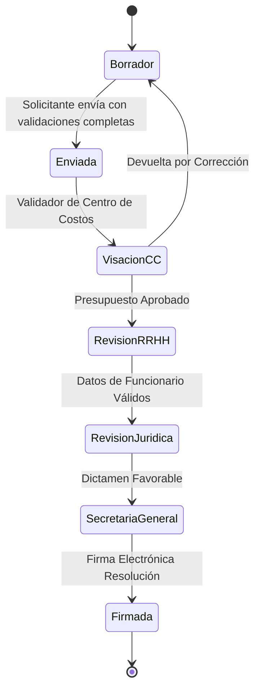

# Matriz Maestra de Validaciones, Topes y Restricciones de Negocio
## Ecosistema SG-Solicitudes / Prestación de Servicios (PDS - DU288 / DU09)

Este documento centraliza **todas las reglas de negocio, límites máximos (topes), validaciones cruzadas y restricciones de seguridad** aplicadas en la base de datos (Sybase), la lógica de negocio (LoopBack 4) y la interfaz de usuario (Nuxt.js).

---

## 1. Matriz de Control: Capas de Validación

Siguiendo el principio de **Defensa en Profundidad (Defense in Depth)**, ninguna validación depende exclusivamente del Frontend:



| Tipo de Validación | Frontend (UI/UX) | Backend (Service/Controller) | Base de Datos (Stored Procedures) |
| :--- | :---: | :---: | :---: |
| **Tope 56 horas semanales** | Feedback visual en tiempo real | Validación normativa autoritativa | El PA actual de inserción FUHO no repite este guard |
| **Traslapes horarios (mismo PDS)** | Bloqueo en editor semanal | Rechazo HTTP 400 Bad Request | El PA actual de inserción FUHO no repite este guard |
| **Traslapes multi-PDS (mismo RUT)** | Advertencia/bloqueo tras consulta API | Verificación cruzada de vigencia | Datos históricos se consultan en BD; el veredicto se arma en backend |
| **Feriados Nacionales (Compensación)** | Días deshabilitados en rojo | Rechazo en endpoint compensación | Rechazo estricto en `sg_fucoiSecgen01` |
| **Feriados Nacionales (Ejecución)** | Fecha y horas excluidas visibles en el día FUHO afectado | Recalcula horas efectivas desde calendario autoritativo | `es_cfersSecgen01` entrega la fecha/tipo |
| **Disponibilidad del calendario** | Sin fuente confirmada no habilita fechas ni guardado | Falla cerrada ante PA ausente sin fallback completo u otro error | PA por rango; respaldo no sustituye cobertura desconocida |
| **Consistencia de Cuotas y Total** | Recálculo dinámico en formulario | Validación matemática de suma | Validación en `sg_fumeuSecgen01` |
| **Integridad de Cuotas Pagadas** | Deshabilitación de edición de mes | Control de flujo de estados | `ON DELETE RESTRICT` safeguard |
| **Vigencia del Contrato (`f_inicio <= f_termino`)** | DatePicker restringido | Validación de rango temporal | Rechazo en guards iniciales |

---

## 2. Topes y Restricciones de Carga Horaria

### 2.1. Tope Máximo Semanal (56 Horas Cronológicas)
* **Regla:** Ningún prestador de servicios (identificado por su RUT) puede acumular más de **56 horas semanales** de trabajo en la Universidad de La Frontera.
* **Cálculo:** Se suman todas las horas semanales recurrentes (`sg_fuho`) del PDS actual más todas las horas de otras prestaciones y contratos vigentes en el mismo rango de fechas.
* **Comportamiento:**
  - **Frontend:** La barra de métricas (`StaffExecutionScheduleSummary.vue`) cambia a color rojo (`bg-danger`) y muestra el mensaje *"Tope máximo alcanzado"*.
  - **Backend:** `validateStaffWorkload` rechaza el payload antes de sincronizar FUHO.
  - **Brecha conocida de defensa:** `sg_fuhosiSecgen01` valida forma, día y cruce nocturno, pero no recalcula por sí solo el tope de 56 horas.

### 2.2. Restricciones de Bloque Horario Diario
* **Duración:** Inicio y término iguales son inválidos.
* **Cruce nocturno:** Un término menor al inicio continúa al día siguiente; no se admite viernes a sábado.
* **Días habilitados:** Solo lunes a viernes.

### 2.3. Control de Traslapes Horarios
1. **Traslape Intra-Solicitud:** Dos bloques del mismo prestador para el mismo día de la semana no pueden solaparse.
   - *Ejemplo prohibido:* Lunes 08:30 - 12:30 y Lunes 10:00 - 14:00.
2. **Traslape Multi-PDS:** Si el prestador ya tiene una prestación aprobada con horario los Lunes 09:00 - 11:00, una nueva solicitud no puede utilizar ese mismo tramo.

---

## 3. Restricciones de Calendario y Feriados

### 3.1. Rango de Vigencia
* `f_inicio` debe ser menor o igual a `f_termino`.
* La prestación no puede tener una duración superior a **12 meses corridos** por solicitud (debe renovarse en el año calendario siguiente si corresponde).

### 3.2. Feriados Nacionales vs Compensaciones
* **Regla de Oro:** Está **estrictamente prohibido** asignar horas de compensación (`sg_fuco`) en días declarados como Feriados Nacionales o Feriados Legales Irrenunciables (`es_cfer.cod_tipfer = 1`).
* **Ejecución programada:** Si un FUHO recurrente cae en `cod_tipfer = 1`, esas horas no forman parte de las horas efectivas esperadas ni del total que debe compensarse. La interfaz muestra fecha exacta y duración excluida.
* **Feriados Universitarios y Suspensiones (`cod_tipfer` 2 y 3):** Se permite ejecución y compensación. Su etiqueta es informativa y no modifica el cálculo.
* **Cruce de medianoche:** Se validan todos los segmentos por fecha. Un tramo que comienza el día anterior también se rechaza si su segundo segmento cae en un feriado nacional.
* **Defensa en profundidad:** El día se bloquea en frontend, se vuelve a validar en backend y `sg_fucoiSecgen01` conserva el rechazo final al insertar.

### 3.3. Cambios de FUHO o Período con Compensaciones Existentes (ADR-013, `APLICADO`)

| Invariante | Regla aplicada |
| :--- | :--- |
| Conservación | No mover, copiar, recortar ni borrar compensaciones automáticamente. |
| Recálculo | Recalcular horas requeridas desde FUHO + período + feriados nacionales; luego comparar contra las compensadas. |
| Diferencia | Tanto faltante como exceso bloquean la validación cuando la compensación es obligatoria. |
| Fecha inválida | Mantener la fila visible como «requiere ajuste» y bloquear el guardado. |
| Corrección | El usuario elimina explícitamente el tramo, ajusta su horario o restablece un período que lo habilite. |
| Estado de edición | Cerrar la fecha seleccionada al cambiar FUHO, período o fuente de calendario. |
| Sin FUHO | Si tampoco hay compensaciones, mostrar estado vacío. Si hay compensaciones, mostrarlas como excedidas/inválidas para permitir su retiro. |

La implementación anterior purgaba algunas filas justo antes de «Guardar
cambios». Ese comportamiento queda **deprecado**: ocultaba la discrepancia al
validador y podía producir pérdida de datos sin una decisión explícita.

---

## 4. Validaciones Financieras y de Cuotas (`sg_fume`)

### 4.1. Cuota Fija (`cod_tpps = 1`)
* La suma de todas las cuotas mensuales (`mto_cuota`) debe coincidir exactamente con el monto total acordado de la prestación:
$$\sum_{i=1}^{tot\_cuotas} mto\_cuota_i = mto\_total$$
* No se permiten cuotas con monto $0 en contratos de cuota fija.

### 4.2. Cuota Variable (`cod_tpps = 2`)
* El valor mensual se proyecta con base en el valor hora pactado multiplicado por las horas declaradas.
* Si un mes no registra horas efectivas, el monto de la cuota proyectada es $0 y no bloquea el flujo.

### 4.3. Integridad de Cuotas en Modificaciones (`sg_fumeuSecgen01`)
* **Salvaguarda de Pagos Asociados:** Si una solicitud pasa por una modificación y se intenta recortar meses de vigencia, el SP verifica si existen registros en `sg_fuc2` (compensaciones liquidadas) o `sg_fum2` (visaciones de pago).
* Si existen pagos asociados, el sistema **bloquea la eliminación del mes** y exige la anulación o ajuste previo del pago en la unidad de finanzas.

---

## 5. Validaciones de Workflow y Seguridad de Estados



### Reglas de Inmutabilidad por Estado:
1. **Estado `Borrador`:** Edición libre de prestadores, horarios, cuotas y centros de costo.
2. **Estados en Trámite (`Enviada`, `Visación`, etc.):** Datos bloqueados para edición. Solo usuarios con rol de revisor pueden emitir visación o devolver a estado `Borrador` con observaciones.
3. **Estado `Firmada / Concluida`:** Inmutabilidad absoluta. Cualquier ajuste posterior debe realizarse mediante una **Resolución Modificatoria**.

---

## 6. Resumen de Códigos y Mensajes Semánticos de Rechazo

| Escenario de Rechazo | Capa de Detección | Mensaje Semántico al Usuario |
| :--- | :--- | :--- |
| Exceso de 56 horas semanales | Backend `validateStaffWorkload` | *"El prestador excede el límite máximo de 56 horas semanales permitidas."* |
| Solapamiento de bloques en mismo día | Frontend / Backend | *"El horario ingresado se superpone con otro bloque existente para este día."* |
| Compensación en Feriado Nacional | SP `sg_fucoiSecgen01` | *"La fecha seleccionada corresponde a un feriado nacional y no admite compensación."* |
| Calendario no disponible | Backend / Frontend | *"No fue posible consultar los feriados del período. No es posible validar el horario ni la compensación hasta resolverlo."* |
| Compensación fuera del nuevo período | Frontend / Backend | *"Compensaciones que requieren ajuste / Fecha no habilitada."* |
| Intento de borrar cuota con pagos | SP `sg_fumeuSecgen01` | *"No es posible modificar las cuotas porque existen registros de pago asociados."* |
| Discrepancia en suma de cuotas fijas | Backend Service | *"La suma de las cuotas no coincide con el monto total de la prestación."* |
| Fecha de término menor a inicio | Frontend / Backend | *"La fecha de término debe ser posterior a la fecha de inicio del servicio."* |

---

## 7. Atributos de monto: qué contiene cada uno y quién los valida (2026-09-09)

Auditoría completa de las variables de monto del sistema, verificada contra
código y DDL. Es el insumo para cualquier ajuste de validación financiera.

| Atributo | Nulabilidad | Qué contiene **realmente** | Uso en validación |
| :--- | :--- | :--- | :--- |
| `sg_fups.mto_total` | `NOT NULL` | Monto total autorizado. **Única fuente autoritativa.** | Backend: `ceil(total ÷ tope)` vs cuotas. Frontend: techo del bruto |
| `sg_fups.mto_tope` | — | Tope normativo congelado | Base de toda validación de tope |
| `sg_fups.tot_cuotas` | `NULL` permitido | Cuotas declaradas por el solicitante | Techo = tope × cuotas (S0-013 Q-C01) |
| `sg_fups.monto_mes` | **`NOT NULL`** | **El monto TOTAL, no el mensual** | Se expone como `monthlyAmount`; hay que dividirlo por meses antes de usarlo |
| `sg_fups.periodos` | **`NOT NULL`** | Forzado a `1` en DU288 | La resolución calcula `periodos × monto_mes` |
| `sg_fups.cod_tpps` | `NULL` permitido | 1 = Fijo, 2 = Variable | **Ninguna. Solo se usa para MOSTRAR** |
| `sg_fume.mto_apagar` | `NULL` permitido | `NULL` siempre | Ninguna (bloqueado por Q-B13) |

### 7.1. `monto_mes` no contiene el monto mensual

Los PA lo **defaultean** a `mto_total` cuando llega nulo, y el frontend envía
`monthAmmount: row.amount` (el total). Resultado: `monto_mes == mto_total`
siempre en DU288.

El código ya lo reconoce y lo compensa dividiendo por los meses de ejecución, en
dos lugares (`monthlyCapAggregateCheck` y `capNoteForRelated`), donde está
documentado como *«defecto de origen»*.

**Decisión: no se corrige por ahora.** Tres restricciones lo impiden:

1. `monto_mes` es `NOT NULL` — no puede quedar `NULL` para Variable.
2. El invariante `periodos × monto_mes = mto_total` se cumple hoy por accidente
   (`periodos = 1`), y **cuatro** consumidores dependen de él: el fallback de
   `resolution.controller.ts`, `ResolutionDetail.vue`, `HistoryItem.vue` y
   `NormativeResolutionActionPanel.vue`. Cambiar solo `monto_mes` haría que la
   resolución impresa muestre el mensual como si fuera el total.
3. El redondeo descuadra: `$100.000 ÷ 3 = $33.333,33`, y `3 × 33.333,33 =
   $99.999,99 ≠ mto_total`.

Y el problema decisivo es la **ambigüedad histórica**: las filas ya guardadas
tienen el total en `monto_mes`. Si a partir de una fecha se guardara el mensual,
la columna significaría dos cosas distintas sin discriminador confiable, y los
parches de división **no se podrían quitar igual**, porque tendrían que seguir
manejando las filas viejas.

El lugar correcto para el monto por cuota es `sg_fume.mto_apagar`, bloqueado por
**Q-B13**.

## 8. Las validaciones no distinguen Fijo de Variable (ADR-010, `PROPUESTO`)

Verificado por búsqueda de `cod_tpps` en `utils/` y en el backend: aparece
**únicamente** en `getFixedMonthAmount` (que es display) y en el mapeo de
escritura. **Ninguna validación consulta el tipo de monto.**

### 8.1. Dónde importa

`monthlyCapAggregateCheck` (Regla 3, tope mensual entre PDS concurrentes) divide
el monto por los meses de ejecución **para todos por igual**:

* **Fijo** — correcto y exacto. §5 de las reglas de pago define reparto parejo
  entre los meses, así que el promedio *es* el monto real del mes.
* **Variable** — §5 dice que *«el monto real de cada mes no se conoce; la
  solicitud declara solo el techo máximo»*. Dividir por meses **asume reparto
  parejo**, supuesto que la regla no respalda, y es el **optimista**: una PDS
  variable de $1.800.000 en 6 meses aporta $300.000 al cálculo, pero podría
  concentrar bastante más en un mes real.

Lo que **sí es correcto para ambos tipos** y no debe tocarse: la validación de
monto autorizado del backend (`ceil(total ÷ tope)` vs cuotas declaradas), porque
razona sobre techos y no sobre distribución.

### 8.2. Prerrequisito de datos, hoy inexistente

Para distinguir el tipo de una PDS **previa**, el dato no viaja:
`sg_fupssSecgen17` devuelve `mto_total`, `monto_mes`, `tot_cuotas` y `mto_tope`,
pero **no `cod_tpps`**; el modelo de respuesta tampoco lo mapea. Además
`tot_cuotas` llega `NULL` en toda fila histórica (ver ADR-008).

Exponer `cod_tpps` en ese PA y en el modelo de respuesta es **requisito de
cualquiera de las tres opciones** y no altera resultados por sí solo.

### 8.3. Decisión adoptada: opción B

Se evaluaron tres reglas para la contribución de una PDS **Variable** al tope
mensual concurrente:

| Opción | Regla | Consecuencia |
| :---: | :--- | :--- |
| A | `total ÷ meses` | Deja pasar combinaciones que en un mes real pueden exceder |
| **B** ✅ | `total ÷ tot_cuotas` | Coherente con T-01/T-06 («el tope se valida por cuota»). Viable desde ADR-008 |
| C | Peor caso: `min(total, tope)` | Máximamente prudente; casi cualquier PDS concurrente a una Variable dispararía la alerta |

**Implementación** (`monthlyContributionOf`, único punto de cálculo, usado por
esta solicitud, por cada PDS previa y por `capNoteForRelated`):

* **Variable con `tot_cuotas`** → `mto_total ÷ min(tot_cuotas, meses)`.
  El `min` es una salvaguarda: dividir por más cuotas que meses daría una
  contribución **menor** que el propio promedio, que es justo el error a evitar.
  Las cuotas declarables ya vienen acotadas a los meses, así que el clamp solo
  actúa ante un dato corrupto.
* **Variable sin `tot_cuotas`** → cae al promedio (opción A). Es el caso de toda
  PDS anterior a ADR-008, que las guardaba como `NULL`.
* **Fijo** → `mto_total ÷ meses`, sin cambios. El reparto parejo está
  comprometido (§5), así que el promedio *es* el monto real del mes.

**El insumo es `mto_total`, nunca `sg_fups.monto_mes`.** Esa columna cambió de
significado con ADR-011: leerla aquí dividiría dos veces en las filas nuevas. El
control se calcula solo desde campos autoritativos — `mto_total`, `tot_cuotas` y
el período — que es también lo que hace irrelevante la ambigüedad histórica de
`monto_mes`.

Cubierto por cinco pruebas de regresión en `textSimilarityUtil.test.cjs`
(prefijo `ADR-010`), incluidas la del clamp y la que verifica que no se divida
dos veces.

> Los puntos vecinos siguen abiertos en §9 de las reglas de pago: **Q-C13/Q-C14**
> (qué fecha determina el tope) y **Q-C07** (saldo intra-mes entre cuotas). Esta
> decisión no los prejuzga.

### 8.4. Corrección pendiente sobre §4 de este documento

La sección 4.1 formula `Σ mto_cuota = mto_total` sobre una columna **`mto_cuota`
que no existe** en el esquema; la columna real es `sg_fume.mto_apagar`, hoy
siempre `NULL`. La sección 4.2 vuelve a apoyarse en un «valor hora pactado» que
tampoco existe en el modelo de datos (misma observación que §6.5 del documento
01). Se deja marcado en vez de reescribirlo aquí.

## 9. Factibilidad del reparto en cuotas (ADR-012, regla T-07)

La validación de monto autorizado —tanto en frontend
(`getPaymentMonthsValidation`) como en backend (`validateStaffAuthorizedAmount`)—
usaba una sola fórmula para ambos tipos de monto:

```
ceil(mto_total ÷ mto_tope) ≤ tot_cuotas
```

Eso responde *«¿puedo partir el total en N pedazos que quepan bajo el tope?»*
**asumiendo que el monto se corta donde sea**. En **Fijo** no se corta donde sea:
cada mes lleva `mto_total ÷ meses` y una cuota agrupa **meses enteros** (C-03).

### 9.1. El caso que se aprobaba y no se podía pagar

| Dato | Valor |
| :--- | :--- |
| `mto_total` | $300.000 |
| Ejecución | 3 meses |
| `mto_tope` | $150.000 |
| `tot_cuotas` | 2 |
| Tipo | Fijo |

`ceil(300.000 ÷ 150.000) = 2 ≤ 2` → **aprobada**. Pero cada mes lleva $100.000 y
toda agrupación de 3 meses en 2 cuotas deja una cuota de 2 meses = **$200.000**,
por sobre el tope. No existe partición válida.

### 9.2. Regla aplicada

* **Fijo** — se mide la **cuota más cargada**, que lleva `ceil(meses ÷ cuotas)`
  meses:

  ```
  meses por cuota   = floor(mto_tope ÷ (mto_total ÷ meses))
  cuotas necesarias = ceil(meses ÷ meses por cuota)
  ```

  Si `meses por cuota < 1`, un mes suelto ya excede el tope y **ninguna cantidad
  de cuotas lo arregla** (bandera `exceedsWithAnyInstallmentCount`): hay que
  bajar el monto o extender la ejecución. Ese caso también pasaba antes — una PDS
  de 1 mes por $500.000 con tope $300.000 daba `ceil(500 ÷ 300) = 2 ≤ 2`.

* **Variable** — sin cambios. El monto de cada mes se define al pagar y se
  reparte libremente, así que `ceil(total ÷ tope) ≤ cuotas` es la condición justa.

* **ANID** — exento, sin cambios.

### 9.3. Efecto en el techo mostrado

`getTopBrutoLabel` mostraba `tope × cuotas` para ambos tipos. En Fijo el techo
real sale de la misma desigualdad:

```
bruto máximo (fijo) = mto_tope × meses ÷ ceil(meses ÷ cuotas)
```

Con 3 meses y 2 cuotas es `tope × 1,5`, no `tope × 2`. Mostrar `tope × 2`
invitaba a pedir un monto que después no se podía pagar.

### 9.4. Sentido del cambio

La regla nueva **nunca es más permisiva**: solo cierra casos que antes pasaban y
no debían. Difiere de la anterior únicamente cuando los meses no se reparten
parejo entre las cuotas.

| total | meses | tope | cuotas | Antes | Ahora (Fijo) |
| ---: | ---: | ---: | ---: | :---: | :---: |
| 300.000 | 3 | 150.000 | 2 | pasaba | **bloquea** |
| 500.000 | 5 | 150.000 | 4 | pasaba | **bloquea** |
| 500.000 | 1 | 300.000 | 2 | pasaba | **bloquea** |
| 600.000 | 4 | 300.000 | 2 | pasaba | pasa |
| 300.000 | 2 | 150.000 | 2 | pasaba | pasa |

Cubierto por ocho pruebas en `paymentMonthsValidation.test.cjs`, incluidas las
tres filas que cambian de veredicto, el caso Variable equivalente (que debe
seguir pasando) y la exención ANID.
