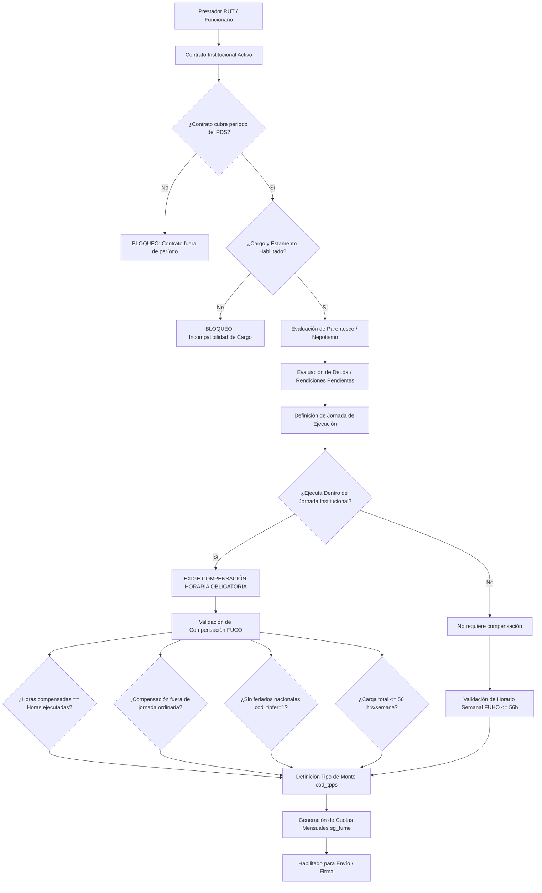
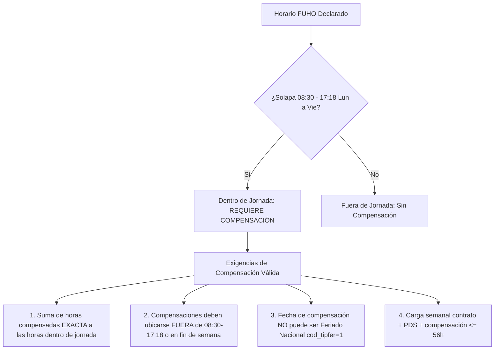
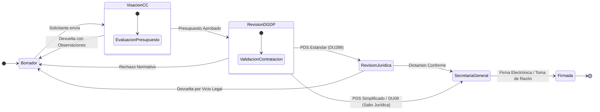

# Árbol de Dependencias de Datos, Validación Normativa y Dinamismo de Roles (Workflow)
## Ecosistema SG-Solicitudes / Prestación de Servicios (PDS - DU288 / DU09)

Este documento detalla **qué datos dependen de cuáles en la evaluación del funcionario/prestador**, cómo se valida cada uno de los indicadores normativos (Contrato, Período, Cargo, Parentesco, Jornada, Compensación, Deuda) y la **arquitectura dinámica del motor de Workflow** (roles, transiciones, condiciones de salto, omisión y devoluciones).

---

## 1. Árbol Jerárquico de Dependencias de Datos

Ningún cálculo u horario se valida de forma aislada. La evaluación sigue una cadena de dependencias estricta:

---

## 2. Detalle de Validaciones Normativas del Prestador

### 2.1. Contrato Cubre Período Solicitado
* **Dependencia:** Fechas del PDS (`f_inicio`, `f_termino`) vs Vigencia del Contrato (`f_inicio_contrato`, `f_termino_contrato`).
* **Regla:** El contrato institucional del funcionario debe estar vigente durante todo el rango de la prestación.
* **Comportamiento:** Si el contrato finaliza antes del término de la actividad, se marca con severidad bloqueante (`CONTRATO_FUERA_PERIODO`), impidiendo el envío hasta que RRHH renueve el contrato o se ajuste el período.

### 2.2. Contrato Principal
* **Dependencia:** Indicador `ind_principal` en catálogo de contratos activos del funcionario.
* **Regla:** Los topes de jornada y valor hora base se calculan sobre el contrato principal. Si el funcionario tiene contratos secundarios (anexos o cátedras), estos se consolidan para el cómputo de la jornada semanal.

### 2.3. Cargo Habilitado
* **Dependencia:** Estamento (`cod_estamento`) y Jerarquía institucional.
* **Regla:** Ciertos cargos directivos (Rector, Vicerrectores, Decanos, Directores de Departamento) tienen prohibición expresa de percibir honorarios por PDS dentro de su misma unidad o sin autorización expresa de Rectoría.

### 2.4. Sin Parentesco (Declaración de Probidad / Nepotismo)
* **Dependencia:** RUT del prestador vs RUT del Jefe de Centro de Costos / Autoridad Solicitante.
* **Validación:**
  - `tieneParentesco = 'S'`: Se detecta consanguinidad o afinidad (cónyuge, hijos, hermanos, padres hasta 3er grado).
  - **Comportamiento:** Emite una observación de alerta (`warning` o `error` según normativa del centro de costos) requiriendo visación especial o abstención de la autoridad requirente.

### 2.5. Sin Deuda (Rendiciones Institucionales)
* **Dependencia:** Consulta a sistemas financieros (`debtValidation`).
* **Regla:** El prestador no debe mantener rendiciones de fondos por rendir o deudas comerciales vencidas con la Universidad.
* **Resultado:**
  - `Cumple / Sin Deuda`: Habilitado (`success`).
  - `Con Deuda`: Bloqueo (`danger`, `NORMATIVE_MESSAGES.checks.debtDetected`).

---

## 3. Matriz de Ejecución: Dentro de Jornada vs Compensación Válida

La jornada institucional ordinaria de la UFRO se extiende de **Lunes a Viernes de 08:30 a 17:18 horas**.

### Criterios de "Compensación Válida" (`getCompensationWorkloadEvaluation`):
1. **Balance de Horas (Cero Diferencia):** $\text{Horas Esperadas} = \text{Horas Compensadas}$. Si existe déficit o exceso, se marca error `totalMismatchErrors`.
2. **No Superposición con Jornada Habitual:** Las horas comprometidas a compensar deben realizarse en horarios donde el funcionario no deba cumplir su jornada contractual regular (`outsideWorkdayErrors`).
3. **No Feriado Nacional:** La fecha de compensación se valida contra `es_cfer`. Si `cod_tipfer = 1`, se bloquea (`institutionalDateErrors`).
4. **Respeto al Límite de 56 Horas:** En ninguna semana ISO el total acumulado puede superar las 56 horas cronológicas (`weeklyErrors`).

---

## 4. Dinamismo de Roles y Motor de Workflow

El flujo de tramitación de resoluciones es dinámico y adapta su ruta de aprobación según atributos de la solicitud:

### 4.1. Roles del Sistema
1. **Solicitante (Creador):** Académico o administrativo que formula el requerimiento y asocia al prestador, horarios y cuotas.
2. **Validador de Centro de Costos (Jefe CC / Decano / Director):** Valida la pertinencia académica/técnica y la disponibilidad presupuestaria del centro.
3. **DGDP / RRHH (Dirección de Gestión y Desarrollo de Personas):** Certifica la legalidad de la contratación, jornada, topes de 56 horas y parentesco.
4. **Dirección Jurídica:** Revisa la legalidad del acto administrativo y la procedencia de cláusulas contractuales.
5. **Secretaría General / Rectoría:** Emite la resolución oficial y formaliza la firma electrónica.

### 4.2. Condiciones de Salto y Omisión de Etapas (Workflow Dinámico)

| Condición / Tipo de Solicitud | Comportamiento del Flujo | Justificación |
| :--- | :--- | :--- |
| **Plantilla Estándar DU09 (Honorarios Menores / Docencia)** | **Omite Revisión Jurídica.** Pasa directo de DGDP a Secretaría General. | Tipología estandarizada previamente autorizada por dictamen general. |
| **Resolución Ordinaria DU288** | **Exige Revisión Jurídica obligatoria.** | Requiere control de legalidad individualizado. |
| **Solicitante es la misma Autoridad del CC** | **Auto-visación inmediata del paso CC.** Avanza automáticamente a DGDP. | Evita redundancia de aprobación por el mismo usuario emisor. |
| **Centro de Costos Exento (Fondos ANID / Proyectos)** | **Cupo de cuotas extendido a 12 meses.** Se omite el tope de 2 meses de pago concentrado. | Normativa especial de agencias externas de financiamiento. |

### 4.3. Reglas de Devolución con Observaciones
* Todo revisor (CC, DGDP, Jurídica, SecGen) tiene la potestad de **Devolver a Borrador** ingresando una observación obligatoria (`motivo_devolucion`).
* Al ser devuelta, la solicitud se desbloquea para que el Solicitante corrija los puntos observados y vuelva a ingresar al flujo en la misma etapa donde fue observada o reiniciando el circuito según la naturaleza del cambio.
