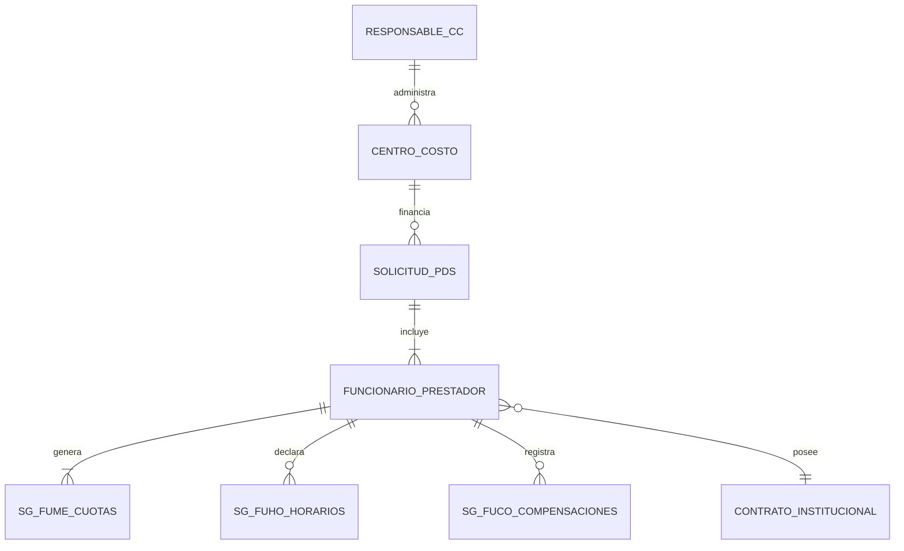
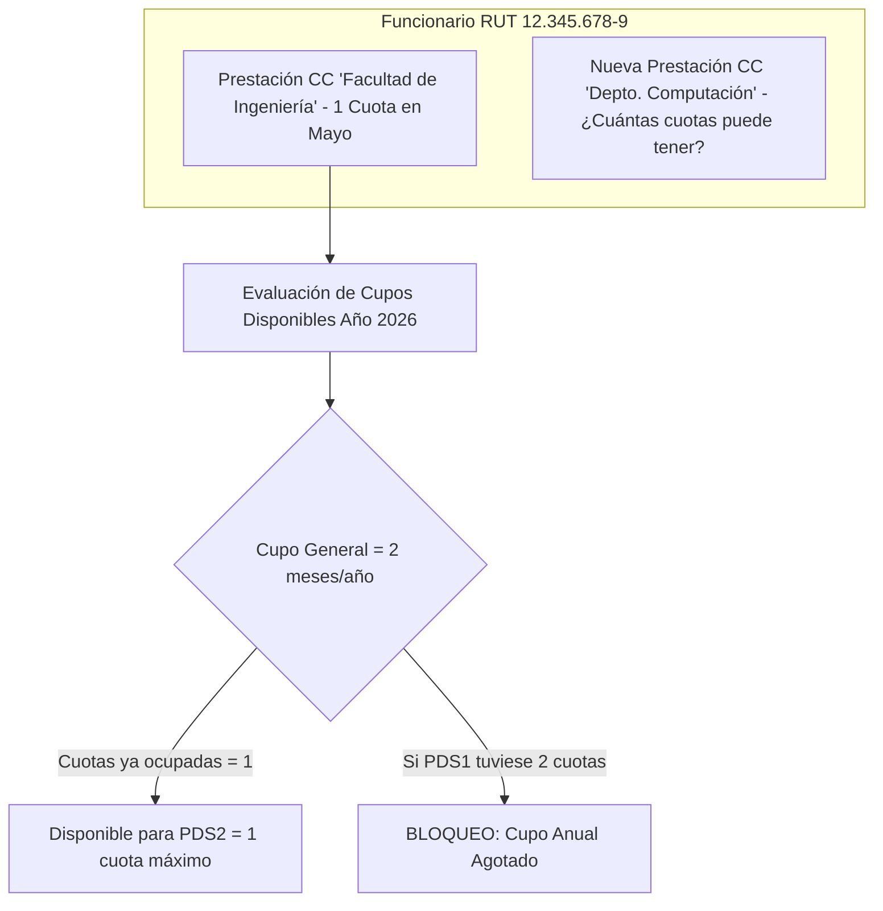
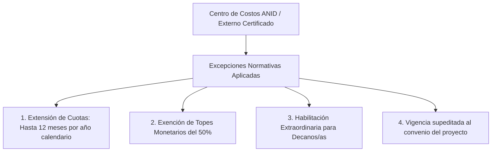

# Decisiones de Arquitectura: Entidades, Centros de Costo, Concurrencia de Prestaciones y Régimen ANID
## Ecosistema SG-Solicitudes / Prestación de Servicios (PDS - DU288 / DU09)

Este documento detalla el **modelo de entidades**, las reglas de **unicidad y cardinalidad** de las prestaciones respecto al Centro de Costos y su Responsable, el cómputo institucional de **cuotas concurrentes por funcionario** y las **excepciones normativas para proyectos ANID / I+D+i**.

---

## 1. Modelo de Entidades y Cardinalidad

### Reglas de Unicidad y Asociación:
1. **Unicidad de la Solicitud:** Cada prestación se identifica por la clave compuesta `(nro_soli, ano_soli)` en la tabla `sg_soli`.
2. **Relación Centro de Costos - Responsable:**
   - Cada solicitud está adscrita a un único **Centro de Costos (`cod_cct`)** perteneciente a la estructura orgánica institucional (`es_ecct` / `ufro_db..orga`).
   - El Centro de Costos tiene un **Responsable / Jefe de Proyecto / Director de Unidad (`rut_responsable`)**, quien posee la autoridad de visación presupuestaria.
3. **Multi-Prestación en un mismo Centro de Costos:**
   - Un Centro de Costos puede financiar **múltiples solicitudes de PDS**, tanto para distintos funcionarios como para un mismo funcionario en diferentes períodos o líneas de actividad.

---

## 2. Cómputo de Concurrencia de Prestaciones por Funcionario

### 2.1. El Principio de Cupo Institucional (Por Funcionario, No por CC)
La normativa (Decreto 009/2026, Numeral 6) estipula que las restricciones de cuotas y meses de pago se evalúan **a nivel institucional consolidado por RUT de funcionario**, sin importar si las prestaciones provienen del mismo Centro de Costos o de unidades diferentes.

### 2.2. Algoritmo de Cupos Disponibles (`getAvailableMonthSlots`):
$$\text{Cupo Disponible} = \max(0, \text{MAX\_PAYMENT\_MONTHS} - \text{Meses Comprometidos en Otras PDS})$$
* **Regla General:** $\text{MAX\_PAYMENT\_MONTHS} = 2$ cuotas por año calendario.
* **Impacto en Nueva Solicitud:** Si el funcionario ya tiene 1 mes comprometido con pago en otra PDS vigente dentro del mismo año calendario, en la nueva solicitud **solo podrá declarar 1 cuota** (`availableSlots = 1`), aun cuando la actividad física dure más meses.
* Si el cupo anual llega a 0, el sistema rechaza la incorporación de una nueva PDS ordinaria bajo la figura de DU288/DU09, debiendo contratarse por el régimen de honorarios tradicional fuera de la asignación.

---

## 3. Concurrencia Horaria y Carga Semanal Multi-PDS

Cuando un funcionario participa en más de una prestación de servicios simultánea:

1. **Sumatoria Consolidada de Horas:**
   $$\text{Horas Contrato Base} + \sum_{i=1}^{N} \text{Horas PDS}_i \le 56 \text{ horas/semana}$$
2. **Prohibición de Solapamiento:**
   - Los bloques horarios semanales (`sg_fuho`) de la Solicitud A no pueden coincidir en día y hora con los bloques de la Solicitud B.
   - La base de datos y el backend realizan una validación cruzada antes de aprobar la inserción de horarios.

---

## 4. Régimen Especial para Proyectos ANID / I+D+i (MOD-11 / S0-013)

Los proyectos de investigación científica y tecnológica con financiamiento externo regulado (ANID, FONDECYT, FONDEF, DITT, DIUFRO) gozan de un tratamiento normativo diferenciado debido a que sus convenios de financiamiento imponen reglas propias:

### Tabla Comparativa: PDS Ordinaria (DU288/DU09) vs Régimen ANID

| Criterio | PDS Ordinaria (DU288 / DU09) | Proyecto ANID / I+D+i Certificado |
| :--- | :--- | :--- |
| **Límite de Cuotas de Pago** | **Máximo 2 cuotas (meses)** por año calendario | **Hasta 12 cuotas** por año calendario (`MAX_ANID_INSTALLMENTS = 12`) |
| **Tope Monetario Mensual** | 50% de haberes efectivos o tope fijo de planta (`sg_trca`) | **Sin tope institucional.** Rigen las bases financieras del proyecto ANID |
| **Participación de Decanos/as** | **Inhabilitados.** Prohibido cobro de asignación PDS | **Habilitados excepcionalmente** si participan en el proyecto |
| **Pruebas de Concurrencia de Horas** | Exige no superar 56 hrs/semana consolidadas | Exige no superar 56 hrs/semana consolidadas |
| **Certificación Requerida** | Visación estándar de Jefatura y CC | Certificación formal de DIUFRO / DITT como proyecto externo |

---

## 5. Trazabilidad en Base de Datos y Persistencia

Para asegurar la auditoría de estas decisiones, el sistema almacena:

* `id_cct` / `cod_cct`: Código único del Centro de Costos financiador.
* `rut_responsable`: RUT del jefe o director responsable del centro.
* `ind_anid` / `tipo_excepcion`: Indicador de si la prestación opera bajo régimen de excepción ANID o proyecto externo.
* `ano_cuota` / `mes_cuota` en `sg_fume`: Identificación temporal de cada cuota para la verificación cruzada de los 2 meses máximos por año.
