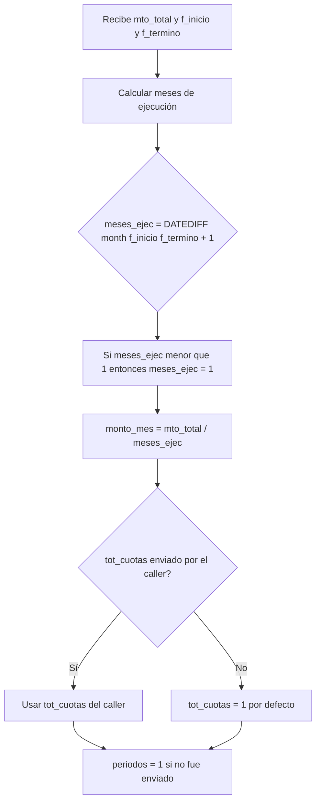
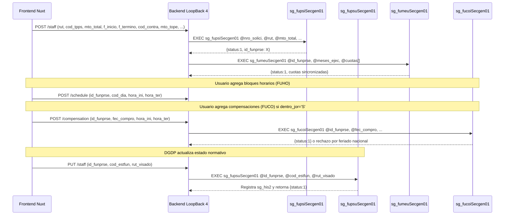

# Especificación Completa: Validaciones, Montos y Determinaciones en el Flujo de Solicitud PDS (DU288 / DU09)

Este documento es la **fuente única de verdad** de todo lo que ocurre en Sybase durante el ciclo de vida de un funcionario/prestador en una solicitud de prestación de servicios. Cubre validaciones en orden de ejecución, cálculos de monto, condiciones de bifurcación (DU288 vs Legacy) y persistencia de trazabilidad.

---

## 1. Parámetros de Entrada y Fuente de Datos

### Campos del funcionario en solicitud (`sg_fups`)

| Parámetro | Tipo | Rol / Descripción | ¿DU288? | ¿Legacy? |
| :--- | :--- | :--- | :---: | :---: |
| `id_funprse` | `int` | Clave primaria del registro de funcionario-prestación | ✓ | ✓ |
| `nro_solici` | `int` | Número de solicitud asociada | ✓ | ✓ |
| `rut` | `char(9)` | RUT del prestador (sin puntos, con dígito verificador) | ✓ | ✓ |
| `cod_cargo` | `smallint` | Código de cargo desde `sisper_db..sp_carg` | ✓ | ✓ |
| `cod_sitm` | `varchar(5)` | Código de situación M del funcionario | ✓ | ✓ |
| `itm_global` | `varchar(15)` | Ítem presupuestario global | ✓ | ✓ |
| `motivo` | `varchar(255)` | Descripción de la actividad a realizar | ✓ | ✓ |
| `periodos` | `tinyint` | Número de períodos (cuotas solicitante); DU288 lo deriva | ✓ | ✓ |
| `monto_mes` | `decimal(19,2)` | Monto mensual; **DU288 lo calcula internamente** | calculado | ✓ |
| `mto_total` | `decimal(19,2)` | Monto total del contrato | ✓ | ✓ |
| `cod_moneda` | `tinyint` | Código de moneda (ej: 1 = CLP) | ✓ | ✓ |
| `cod_tpps` | `smallint` | Tipo de período: **1 = Cuota Fija, 2 = Cuota Variable** | ✓ | ✓ |
| `f_inicio` | `datetime` | Fecha de inicio de la actividad | ✓ | ✓ |
| `f_termino` | `datetime` | Fecha de término de la actividad | ✓ | ✓ |
| `dentro_jor` | `char(1)` | `'S'` si la actividad se ejecuta dentro de la jornada ordinaria | ✓ | — |
| `cod_contra` | `int` | Contrato institucional seleccionado para el cálculo del tope | ✓ | — |
| `mes_haber` | `tinyint` | Mes del haber de referencia (mes anterior a la solicitud) | ✓ | — |
| `ano_haber` | `smallint` | Año del haber de referencia | ✓ | — |
| `mto_haber` | `int` | Haber base utilizado para calcular el tope mensual | ✓ | — |
| `mto_tope` | `int` | Tope mensual calculado o fijo (referencia para validar monto) | ✓ | — |
| `f_cal_tope` | `datetime` | Fecha en que se calculó o congeló el tope | ✓ | — |
| `tot_cuotas` | `tinyint` | Total de cuotas declaradas en la solicitud | ✓ | — |
| `cod_estfun` | `tinyint` | Estado normativo del funcionario dentro del flujo | ✓ | — |
| `rut_visado` | `char(9)` | RUT del usuario que visó el cambio de estado | ✓ | — |

---

## 2. Fuente de Verdad de la Modalidad (`cod_modprs`)

**Regla de Oro:** La modalidad de la prestación (`cod_modprs`) **siempre se lee desde `sg_prse`**, no desde el parámetro de entrada. El parámetro solo actúa como fallback si la solicitud aún no existe en BD.

```sql
SELECT @resolved_modprs = cod_modprs FROM sg_prse WHERE nro_solici = @nro_solici
IF @resolved_modprs IS NOT NULL
    SELECT @cod_modprs = @resolved_modprs
ELSE IF @cod_modprs IS NULL
    SELECT @cod_modprs = 1  -- default: Legacy
```

| `cod_modprs` | Modalidad | Comportamiento del SP |
| :---: | :--- | :--- |
| `1` | **Legacy** (flujo histórico sin DU288) | Persiste solo campos base; sin trazabilidad de tope ni estado |
| `2` | **DU288** (Decreto 009 / DU09) | Persiste todos los campos extendidos, historial de estado y sincroniza actividad en `sg_prse` |

---

## 3. Validaciones en Orden de Ejecución (Guards Previos a `BEGIN TRAN`)

Las siguientes validaciones se ejecutan **antes de abrir la transacción**, siguiendo la regla de prevención del error `010P4` JDBC.

### 3.1. Validaciones de Presencia (Campo Obligatorio)

Ejecutadas en ambos modos (DU288 y Legacy):

| Secuencia | Campo Faltante | Código de Error | Mensaje al Usuario |
| :---: | :--- | :--- | :--- |
| 1 | `id_funprse` (UPDATE) o `nro_solici` (INSERT) | `INVALID_STAFF` / `INVALID_REQUEST` | *"Falta campo Id Funcionarios prestación de servicios"* |
| 2 | `rut` | `INVALID_STAFF` | *"Falta campo RUT"* |
| 3 | `cod_cargo` | `INVALID_STAFF` | *"Falta campo Codigo Cargo"* |
| 4 | `cod_sitm` | `INVALID_STAFF` | *"Falta campo Codigo Situacion M"* |
| 5 | `itm_global` | `INVALID_STAFF` | *"Falta campo Itm Global"* |
| 6 | `motivo` | `INVALID_ACTIVITY` | *"Falta campo Motivo"* |
| 7 | `mto_total` | `INVALID_STAFF` | *"Falta campo Monto Total"* |
| 8 | `cod_moneda` | `INVALID_STAFF` | *"Falta campo Codigo Moneda"* |
| 9 | `cod_tpps` | `INVALID_STAFF` | *"Falta campo tipo de periodo"* *(solo INSERT DU288)* |
| 10 | `f_inicio` | `INVALID_STAFF` | *"Falta campo fecha de inicio"* *(solo INSERT DU288)* |
| 11 | `f_termino` | `INVALID_STAFF` | *"Falta campo fecha de término"* *(solo INSERT DU288)* |

Exclusivas del modo **Legacy** (`cod_modprs <> 2`):

| Campo | Código | Mensaje |
| :--- | :--- | :--- |
| `periodos` | `INVALID_STAFF` | *"Falta campo Periodos"* |
| `monto_mes` | `INVALID_STAFF` | *"Falta campo Monto Mensual"* |

### 3.2. Validaciones de Negocio (Reglas de Dominio)

| Secuencia | Condición | Código | Mensaje al Usuario |
| :---: | :--- | :--- | :--- |
| 1 | DU288 (`cod_modprs = 2`) y `len(motivo) < 10` | `DU288_INVALID_ACTIVITY` | *"La actividad del funcionario debe tener al menos 10 caracteres"* |
| 2 | `f_inicio > f_termino` | `INVALID_PERIOD` | *"La fecha de inicio no puede ser posterior a la fecha de término"* |
| 3 | DU288 y ya existe 1 funcionario en `sg_fups` para la solicitud (INSERT) | `DU288_STAFF_LIMIT` | *"La solicitud DU288 ya posee un funcionario. Debe actualizar el registro existente."* |
| 4 | DU288 y la solicitud tiene ≠ 1 funcionario (UPDATE) | `DU288_CARDINALITY_INCONSISTENT` | *"La solicitud DU288 no posee exactamente un funcionario y no puede actualizarse."* |
| 5 | `id_funprse` no existe en `sg_fups` (UPDATE) | `STAFF_NOT_FOUND` | *"El funcionario especificado no existe"* |

---

## 4. Determinación de Montos y Cálculo de Cuotas (DU288)

En modo DU288 (`cod_modprs = 2`), el SP **recalcula internamente** los valores derivados. El frontend envía `mto_total` como autoridad final; el SP deriva el resto:



### Reglas de Cálculo:

1. **`meses_ejec`** = `DATEDIFF(month, f_inicio, f_termino) + 1`. Si es `< 1`, se fuerza a `1`.
2. **`monto_mes`** = `mto_total / meses_ejec` (división entera con decimal `19,2`).
3. **`tot_cuotas`**: El SP acepta el valor del caller (determinado en Frontend según cupos disponibles). Si no se envía, lo fuerza a `1`.
4. **`periodos`**: Para DU288, se fuerza a `1` si no se envía (el legacy sí requiere el dato del caller).

> **Relación con el Frontend:** `getMaxDeclarableInstallments()` en `formatters.js` calcula cuántas cuotas puede declarar el solicitante según `executionMonths` y `availableSlots` (cupos remanentes del año). Este valor se pasa como `tot_cuotas` al SP.

---

## 5. Estado del Funcionario (`cod_estfun`) y Historización

El campo `cod_estfun` representa el estado normativo del funcionario dentro del flujo de evaluación DGDP:

| `cod_estfun` | Significado (desde `sg_efun`) | Quién lo asigna |
| :---: | :--- | :--- |
| `1` | Estado inicial / Ingresado | SP `sg_fupsiSecgen01` (default DU288) |
| otros | Según catálogo `sg_efun` | DGDP/Revisor mediante `sg_fupsuSecgen01` |

**Regla de Historización:** Cuando el `cod_estfun` cambia en un UPDATE, el SP inserta automáticamente un registro en `sg_his2`:

```sql
INSERT INTO sg_his2 (id_funprse, f_visacion, rut_visado, cod_estact, cod_estnue)
VALUES (@id_funprse, getdate(), @rut_visado, @current_estfun, @cod_estfun)
```

El `rut_visado` fallback es `'SYSTEM'` si no se informa el usuario de la visación.

---

## 6. Sincronización con Tabla Maestra `sg_prse`

En modo DU288, después de actualizar `sg_fups`, el SP realiza siempre una sincronización de la **actividad principal** de la prestación:

```sql
UPDATE sg_prse SET actividad = @motivo WHERE nro_solici = @nro_solici
```

Si este UPDATE falla o afecta ≠ 1 fila, se ejecuta `ROLLBACK TRAN` con código `DU288_ACTIVITY_SYNC_ERROR`.

> **Motivo:** En el modelo DU288, la actividad de la prestación (`sg_prse.actividad`) es parte del texto oficial de la resolución. Debe mantenerse sincronizada con lo que el funcionario declara en `sg_fups.motivo`.

---

## 7. Consulta de Prestaciones Previas (`sg_fupssSecgen17`)

Este SP recupera el historial completo de un funcionario para apoyar la **revisión normativa de concurrencia**. Retorna por cada prestación previa:

| Dato | Descripción |
| :--- | :--- |
| `f_inicio` / `f_termino` | Período de actividad del PDS previo |
| `mto_total` / `monto_mes` / `tot_cuotas` | Montos y cuotas comprometidas |
| `cod_tpps` | Tipo de período (Fija o Variable) |
| `dentro_jor` | Si requirió compensación horaria |
| `mto_tope` / `mto_haber` / `mes_haber` / `ano_haber` | Tope aplicado y haber de referencia histórico |
| `cant_horarios` | Cantidad de bloques semanales declarados en `sg_fuho` |
| `cant_compensa_plan` | Cantidad de compensaciones declaradas en `sg_fuco` |
| `nro_cuota` / `cod_estcuo` / `mto_apagar` | Estado de pago de cada cuota en `sg_fume` |
| `fec_comrea` / `hora_ini_comrea` / `hora_ter_comrea` | Compensaciones realizadas en `sg_fuc2` |

**Filtro de exclusión:** La solicitud actualmente en edición se excluye del histórico (`@nro_solici_excluir`) a nivel de PA. A nivel de backend (`Du288StaffPreviousProvisionResponse.fromListProcedures`) se excluyen además las solicitudes en estado `4` (Rechazada) y `5` (Borrador) — ver ADR-019.

### 7.0. Borradores excluidos del historial de concurrencia (ADR-019, `APLICADO`)

`fromListProcedures` ya excluía solicitudes **Rechazadas** (`cod_estsol = 4`)
del historial de PDS previas por no representar "una labor real ni un
compromiso vigente". El mismo razonamiento aplica a las solicitudes en
**Borrador** (`cod_estsol = 5`): todavía no se envían, se pueden editar o
descartar libremente, y no pasaron por ninguna instancia de revisión — contar
un borrador ajeno como "comprometido" infla el cupo de meses (numeral 6), el
tope mensual agregado (numeral 2), o dispara falsos choques de horario y
compensación (Reglas 1, 2, 9, 11) contra algo que quizá nunca se presente.

Se agrega `5` (Borrador) al filtro de exclusión, junto a `4` (Rechazada) —
mismo punto único (`fromListProcedures`), así que la exclusión aplica por
igual al veredicto del solicitante y al modal DGDP, que consumen el mismo
historial. Cubierto por una prueba nueva en
`du288-staff-previous-provision-response.unit.ts` (7 OK).

### 7.1. Resumen de pago por prestación (ADR-015, `APLICADO`)

`Du288StaffPreviousProvisionResponse.addPaymentSummary` (backend) agrupa las
filas de cuota de `sg_fume` y deriva `paidAmount`, `pendingAmount` y
`paymentStatus`. Las filas pueden venir inconsistentes:

* Más filas en `sg_fume` que las declaradas en `tot_cuotas` — p. ej. una cuota
  **placeholder** creada al decretar (estado inicial, sin `mto_apagar` ni
  `ano_ejec`/`mes_ejec`) que queda junto a la cuota realmente pagada.
* `mto_apagar` llega `NULL` en la práctica (ver [06 §7](06_REGLAS_VALIDACIONES_TOPES_Y_RESTRICCIONES.md)),
  así que el monto de cada cuota se estimaba con el fallback `monto_mes`.

**Caso real (solicitud 205):** `mto_total = $111.111`, `tot_cuotas = 1`, pero
`sg_fume` trae 2 filas: la cuota 2 pagada por `$111.111` y la cuota 1
placeholder. La versión anterior sumaba `monto_mes` ($111.111) de la
placeholder al «por pagar» y marcaba `PAGO_PARCIAL` una prestación ya saldada.

**Regla aplicada:** `mto_total` es el techo autoritativo.

* `paidAmount` = suma de cuotas pagadas, **acotada a `mto_total`**.
* `pendingAmount` = `max(0, mto_total − paidAmount)` — se deriva del total, no
  de sumar filas de cuota (que pueden no tener monto o sobrar).
* `paymentStatus` = `PAGADA` cuando `paidAmount ≥ mto_total`, aunque queden
  filas de cuota sin liquidar.

Sin `mto_total` confiable se mantiene el comportamiento anterior (suma de
filas / conteo de cuotas pagadas). Cubierto por dos pruebas nuevas en
`du288-staff-previous-provision-response.unit.ts`.

### 7.2. Badge de cupo anual por fila (frontend)

El badge de cupo (numeral 6, máx. 2 meses de pago al año por centro de costo)
en la lista de prestaciones previas del modal DGDP mostraba `N/2 meses` en la
fila de cada PDS previa. Con `N` = meses que aporta **esa** PDS, pero `/2` =
cupo **compartido** del centro de costo, se leía como un cupo propio de la
prestación: una PDS de una sola cuota aparecía como «1/2 meses», y dos PDS con
«1/2» cada una sugerían margen cuando el cupo ya estaba lleno (1 + 1 = 2).

Ahora:

* La columna **«Evaluación»** de la lista muestra **solo el nivel de revisión**
  (Requiere revisión / Revisión sugerida / Sin coincidencias). El cupo se
  quitó de ahí: no es una evaluación (bloqueo/advertencia) sino contexto, y
  apretado bajo «Requiere revisión» se leía como parte del veredicto.
* El aporte por PDS — *«Ocupa 1 mes del cupo anual»*, sin `/2`, con el detalle
  del cupo compartido en el tooltip — se mantiene en las **pestañas de
  comparación** (donde ayuda a distinguir varias PDS seleccionadas).
* El total real `X/2` aparece una sola vez, en la fila «Cuotas de pago
  registradas» de la tabla de comparación, y solo cuando se excede.

### 7.3. Tabla de comparación del modal DGDP: qué se evalúa (ADR-016, `APLICADO`)

Ajustes de claridad sobre la tabla de comparación de la PDS previa
seleccionada:

* **«Ejecución dentro de jornada» se retiró** como fila de comparación. No es
  un validador de duplicidad ni de tope; la evaluación de coincidencia se
  apoya solo en: mes + centro de costo (Regla 11), compensaciones, fechas y
  ejecución (período / solapamiento / horario), cuotas y pagos.
* **«Cargo» deja de mostrar badge de coincidencia.** El axioma es centro de
  costo = actividad, no cargo — el cargo queda como dato de contexto (y sigue
  disponible como motivo de cita opcional, no como alerta).
* **Fila «Cuotas de pago registradas»** pasa de mostrar solo «Pagada (1/1)» vs
  «No aplica» a: estado de pago + `Total autorizado $…`, con el estado de la
  fila combinando el cupo del año excedido (numeral 6) y las cuotas ejecutadas
  en un mes distinto al programado (`installmentHasPeriodMismatch`). El N° y el
  estado de la solicitud previa pasan al subtítulo de «Detalle de cuotas,
  pagos y compensaciones».
* Cada bloque de cuota lleva un badge rojo **«Ejecución distinta al período
  programado»** en su encabezado cuando corresponde, en vez de enterrarlo en
  una fila.

### 7.4. Pestaña «Cuotas y pagos» del modal DGDP (ADR-017, `APLICADO`)

La solicitud en revisión **no tiene cuotas generadas** (se crean al decretar;
la distribución mes→cuota la hace el solicitante a mano en el flujo de pago,
C-03). Por eso la pestaña dejó de mostrar un bloque por cuota previa con la
columna «Solicitud actual» vacía («Sin información» en toda la columna), y pasa
a **validar el agregado** —lo único verificable en la etapa de solicitud
(`reglas_pagos/01`, sección «No cubierto»)— comparado contra las cuotas reales
ya gestionadas de la PDS previa. Cuatro secciones:

1. **Cupo de meses de pago (numeral 6).** Meses ya comprometidos en el mismo
   centro de costo por PDS previas (con desglose pagado / en gestión /
   pendiente y N° de solicitud) + cuotas que declara esta solicitud, contra el
   **límite real: 2, o 12 si es ANID** (`monthDistributionEvaluation.limit`).
   Badge: dentro del cupo / en el límite / excede.
2. **Monto total, tope y reparto (T-07 / ADR-012).** Tipo de pago, total, meses
   de ejecución, cuotas declaradas; monto por mes (Fijo = `total ÷ meses`) o
   techo por cuota (Variable = `total ÷ cuotas`); la **cuota más cargada**
   (`ceil(meses ÷ cuotas)` meses en Fijo) y el techo del bruto
   (`tope × meses ÷ ceil(meses ÷ cuotas)` en Fijo, `tope × cuotas` en
   Variable). El veredicto reutiliza `getPaymentMonthsValidation` —el mismo
   cálculo del solicitante y el backend— no una fórmula propia.
3. **Colisión de mes = posible doble pago.** Si la solicitud actual ejecuta en
   un mes donde la PDS previa (mismo centro de costo) ya tiene una cuota
   **pagada o en gestión**, se saca a un aviso rojo propio con el mes, la
   cuota, la fecha y el monto.
4. **Cuotas ya registradas de la PDS previa**, como tabla plana (N°, mes
   programado, mes ejecutado, estado, monto, envío a nómina, pago), con badge
   de incongruencia de fecha y de licencia/permiso por cuota.

**Ajuste posterior (2026-09-11):**

* La sección 1 (cupo de meses) se resume en 3 números en vez de 3 viñetas de
  texto — **Utilizadas** (X/límite), **Disponibles**, **Solicita esta
  prestación** — con el detalle (estado de pago, N° de la PDS que los aporta)
  como texto secundario debajo, no como parte del número. Antes, con solo
  1 cuota declarada (el caso más común), la sección mostraba dos cifras
  redundantes calculadas por otro camino: «cuota más cargada» quedaba
  desalineada en $1 del total por redondeo intermedio, y «techo del monto
  total» coincidía siempre, exactamente, con el tope ya mostrado arriba —
  ambas se ocultan ahora salvo que la solicitud declare más de una cuota.
* La tabla de cuotas de la PDS previa marca, por fila, si el mes (programado
  o ejecutado) de esa cuota **corresponde al período que pide la solicitud
  evaluada** (badge «Corresponde a esta solicitud» + fila resaltada) — para
  distinguir de un vistazo cuál cuota es la relevante para la revisión
  actual y cuáles son simplemente otras cuotas ya registradas/gestionadas de
  la misma prestación previa. Mismo cálculo de mes que ya usa el aviso de
  posible doble pago (`installmentRelatedMonth`), sin duplicar lógica.
* Se explica el caso de una cuota "Propuesta" sin ningún avance (sin monto,
  sin ejecución, sin pago) cuando **otra** cuota de la misma prestación
  previa, con avance real (pagada / en gestión / con monto), comparte su
  **mismo mes programado**: se agrega la nota «Propuesta original de este
  mes, sin avance — el pago quedó registrado en la cuota N° X». Origen
  confirmado en `sg_fumeuSecgen01.sql` (línea 63-68): mientras una cuota siga
  en estado Propuesta/Devuelta, la sincronización de meses del solicitante no
  la borra ni la reutiliza; el flujo de pago, al procesar ese mes, agrega una
  fila **nueva** en `sg_fume` en vez de actualizar la propuesta original in
  situ — la placeholder queda huérfana en la base, no es un defecto de esta
  vista. El mecanismo exacto que crea esa fila nueva vive en el módulo de
  pagos (`template_wf_pagos`), fuera del alcance de los PA de solicitud
  revisados esta sesión.

### 7.5. Regla 2 (choque de horario): gatillo ampliado a ejecución real (ADR-018, `APLICADO`)

`overlapFor` (usado como gatillo de la Regla 2, `schedule_overlap`, y de la
pestaña "Horario de ejecución" del modal DGDP) comparaba el **período
declarado** de la PDS previa (`sg_prse.per_desde`/`per_hasta`) contra el
período de la solicitud actual. Confirmado con datos reales (solicitud 206:
período declarado 18/09–30/11, ejecución real `sg_fups.f_inicio`/`f_termino`
01/10–30/11) que ambos campos **pueden diferir** — el período declarado no
siempre coincide con la ejecución real. Exigir solo el período declarado
podía dejar pasar un choque de horario real cuando la ejecución sí se cruzaba
pero el período declarado no.

**Cambio**: la Regla 2 ahora evalúa horario cuando el período declarado se
solapa **O** cuando las fechas de ejecución reales se solapan
(`executionOverlapFor`, ya usado por la fila "Fechas de ejecución"). Es una
ampliación (`OR`), no un reemplazo: nunca deja de detectar un choque que ya
se detectaba antes, solo agrega los casos donde la ejecución real se cruza
aunque el período declarado no. La Regla 7 (`period_overlap`, advertencia de
período concurrente) **no cambia** — su propósito es justamente informar la
coincidencia de período declarado, aproximada por diseño.

Mismo criterio ya existía para `hasPaymentRisk` en el modal DGDP
(`overlapFor(item) || executionOverlapFor(item) || hasDateContinuityFor(item)`);
se extiende ahora al gatillo de horario en ambos lados (solicitante y DGDP).
Cubierto por una prueba nueva en `textSimilarityUtil.test.cjs` (64 OK).

### 7.6. Colores de la tabla de comparación: rojo solo para lo rechazante (2026-09-11)

* **Se retira el badge «Continuidad»** (una PDS termina justo antes de que
  empiece la otra, sin llegar a cruzarse) de las filas «Período de la
  prestación» y «Fechas de ejecución»: no dispara ninguna regla bloqueante
  por sí sola, así que no amerita un estado de coincidencia en la tabla —
  solo ruido. `hasDateContinuityFor` se mantiene donde sí es relevante
  combinada con otra condición (`hasPaymentRisk`, motivos de cita).
* **Las filas «Horario» y «Compensaciones» pasan de naranja (`warning`) a
  rojo (`danger`)** cuando coinciden: un horario o una compensación
  superpuestos son las Reglas 1, 2 y 9 del veredicto automático —
  bloqueantes para el solicitante, no solo advertencias — y ya se mostraban
  en rojo en la pestaña de detalle de cada una (`item.overlapsCurrent`); la
  fila resumen de arriba usaba un color más débil para la misma señal. Las
  filas «Centro de costo» y «Período» (declarado) se mantienen en naranja:
  por sí solas no bloquean — el bloqueo real por centro de costo + mes lo
  tiene su propia fila, «Mes comprometido» (Regla 11, ya en rojo).

### 7.7. Badges "Cumple" / "Tope validado" del resumen de funcionarios (ADR-022, `APLICADO`)

Auditoría de los checks normativos visibles junto a cada funcionario del
resumen (`Du288StaffSummarySection.vue`): "Cumple", "Sin parentesco", "Cargo
habilitado", "SEA", "Tope validado". `getStaffDisablementMeta` (cargo) y
`getParentescoMeta` (parentesco) están correctamente conectados a
`disablementResult`/`parentescoResult` reales — sin hallazgos.

**Dos bugs reales encontrados en el chequeo de tope** (`getTopValidation`,
edición en vivo, y `buildTopValidationForRow`, filas ya hidratadas — ambas
alimentan `row.topValidation`, de donde salen el badge "Tope validado" y el
issue `TOPE_EXCEDIDO` que decide "Cumple"/"No cumple"):

1. **Mensaje roto**: citaban `NORMATIVE_MESSAGES.normative.topExceededShort`,
   una clave que **no existía** en el catálogo — el tooltip de "Tope
   excedido" mostraba `undefined`. Agregada.
2. **Sin el chequeo T-07/ADR-012**: ambas funciones solo comparaban el
   promedio mensual (`total ÷ meses`) contra el tope — exactamente la razón
   simple que ADR-012 probó insuficiente (`$300.000 en 3 meses, tope
   $150.000, 2 cuotas`: promedio `$100.000 < tope`, pero la cuota más
   cargada de 2 meses = `$200.000 > tope`, impagable). El badge podía
   mostrar **"Tope validado" en verde** para un caso que el backend
   (`validateStaffAuthorizedAmount`) y la tabla de incidencias del
   solicitante ya rechazaban. Se agrega el mismo chequeo
   (`getPaymentMonthsValidation`, T-07) que ya usan esos dos lugares — ahora
   los tres coinciden.

De paso, se retira una rama muerta en `getTopValidation`
(`this.useNormativeTopValidation`, una bandera que nunca se seteaba en
ningún lado — ambas ramas del `if` devolvían exactamente lo mismo).

### 7.8. Cupo agotado permitía una TERCERA prestación (ADR-020, `APLICADO`, bug crítico)

**Caso real detectado por el usuario**: funcionario con 2 prestaciones ya
comprometidas este año calendario en el mismo centro de costo (numeral 6,
cupo = 2 meses, no ANID) intenta crear una **tercera** solicitud Variable de
1 cuota, monto bajo el tope. El sistema la dejaba avanzar sin ninguna
incidencia bloqueante que impidiera guardarla (más allá del bloqueo puntual
de Regla 11 cuando el mes exacto coincidía con una PDS previa).

**Causa raíz**: `getMaxDeclarableInstallments` (frontend,
`utils/services-provision/normative/formatters.js`) y su espejo en el
backend (`validateStaffAuthorizedAmount`) terminaban ambos en
`Math.max(1, Math.min(cap, ...))` — un piso que **nunca dejaba bajar de 1**,
incluso con `availableSlots`/`cap` en **0** (cupo anual totalmente agotado).
Consecuencia: `getDeclaredInstallments()` (frontend) y `effectiveInstallments`
(backend) quedaban en 1 cuota "disponible" que en realidad no existía, y
`getPaymentMonthsValidation`/`minimumPaymentMonths > effectiveInstallments`
podían no dispararse si el monto era pequeño (cabía en esa 1 cuota fantasma)
— dejando pasar la tercera prestación en ambos lados.

**Corrección**: se retira el piso en los 4 puntos (2 frontend, 2 backend);
con cupo en 0, ambas funciones devuelven 0 cuotas disponibles, lo que hace
que la validación *ya existente* (`workerPaymentMonthsValidation.valid` en
`validateWorker()`, y el `throw` en `validateStaffAuthorizedAmount`) se
dispare correctamente — no fue necesario agregar una regla nueva, la
validación siempre estuvo ahí, solo quedaba inalcanzable por el piso.

**Mensaje corregido de paso** (frontend, `topExceededPaymentMonths`): antes
decía siempre *"...supera el máximo general de 2"* sin importar el cupo real
comparado — con el cupo reducido a 0 o 1 por otra PDS, un mensaje como
*"requeriría al menos 1 mes... supera el máximo general de 2"* es confuso (1
no es mayor que 2). Ahora cita el máximo **efectivamente disponible** para
esta solicitud, con el motivo (cuotas ya comprometidas / cuotas declaradas)
cuando aplica — espejo del mensaje que ya arma el backend.

Cubierto por una prueba nueva en `paymentMonthsValidation.test.cjs`
(frontend) y una prueba nueva que reproduce el caso real completo en
`service-provision-authorized-amount.unit.ts` (backend) —
`getMaxDeclarableInstallments({executionMonths: 2, availableSlots: 0})` debe
dar `0`, no `1`.

**Hallazgos adicionales, NO corregidos en esta pasada** (fuera de alcance
inmediato, requieren decisión):

* **Backend: `getCommittedInstallmentMonthsForYear` no filtra por centro de
  costo.** Usa el historial COMPLETO del funcionario (cualquier centro de
  costo) para calcular cuántas cuotas ya están comprometidas este año —
  mientras que el frontend (`editingWorkerCommittedInstallmentMonths`) SÍ
  filtra por centro de costo (axioma centro de costo = actividad, ya
  ratificado). Efecto: el backend es **más restrictivo** de lo que exige el
  decreto — puede reducir el cupo de una solicitud por una PDS previa de una
  actividad totalmente distinta. Dirección opuesta al bug de arriba (ese
  dejaba pasar de más; este bloquea de más), pero misma familia de problema:
  frontend y backend desalineados.
* **ANID no consulta el historial en absoluto.** Tanto frontend
  (`getMaxDeclarableInstallments` con `isCapExempt`) como backend (rama
  `isCapExempt` de `validateStaffAuthorizedAmount`) dan a CADA solicitud ANID
  un techo propio de 12 cuotas, sin sumar lo que otras solicitudes ANID del
  MISMO centro de costo ya hayan comprometido ese año. Si el numeral 6 aplica
  por actividad/proyecto (= centro de costo) también para ANID, varias
  solicitudes ANID del mismo centro de costo podrían sumar más de 12 meses
  entre todas sin que nada lo detecte.

### 7.9. Compensaciones: sin columna "Cuota"; cita del tope corregida (ADR-021, `APLICADO`)

* La tabla de compensaciones de la PDS previa deja de mostrar la columna
  «Cuota» (N° de cuota) y renombra «Estado de la cuota» a «Estado» (genérico,
  reutilizando `statusColumnLabel`): esta tabla compara **fechas y horarios**
  de compensación, no a qué cuota de pago pertenece cada una — esa
  información es de la pestaña «Cuotas y pagos», no de esta.
* **Bug real corregido en la cita del tope mensual agregado**
  (`citationReasonDetail('monthlyCapAggregate')`): el desglose por PDS
  concurrente usaba `concurrentItem.monthlyAmount` (crudo,
  `sg_fups.monto_mes`) en vez de `monthlyContributionOf` (ADR-010 opción B).
  Para una PDS previa **Variable**, esto mostraba el promedio mensual en vez
  del techo por cuota real, pudiendo desalinear la cifra citada en la
  observación oficial del total agregado que sí usa `monthlyContributionOf`
  (vía `monthlyCapAggregateCheck`). Ahora usa el mismo cálculo en ambos
  lugares.

---

## 8. Ciclo de Vida Completo de un Funcionario en una Solicitud



---

## 9. Restricción de Cardinalidad DU288 (1 Funcionario por Solicitud)

Una solicitud bajo modalidad DU288 puede contener **exactamente 1 registro en `sg_fups`**:

* **Al insertar:** Si ya existe 1 registro → rechazo `DU288_STAFF_LIMIT`.
* **Al actualizar:** Si existen ≠ 1 registros → rechazo `DU288_CARDINALITY_INCONSISTENT`.

Esta restricción refleja el modelo de resolución individual: una DU288 resuelve para un único prestador con un único contrato de referencia. Las prestaciones de múltiples prestadores se tramitan como solicitudes independientes en el mismo centro de costos.

---

## 10. Códigos de Error Semánticos (Mapa Completo)

| Código | Contexto | Significado para el Desarrollador |
| :--- | :--- | :--- |
| `INVALID_REQUEST` | INSERT | Falta `nro_solici` |
| `INVALID_STAFF` | INSERT / UPDATE | Campo obligatorio del funcionario ausente |
| `INVALID_ACTIVITY` | INSERT / UPDATE | Campo `motivo` ausente |
| `DU288_INVALID_ACTIVITY` | DU288 | `motivo` tiene menos de 10 caracteres |
| `INVALID_PERIOD` | INSERT / UPDATE | `f_inicio > f_termino` |
| `INVALID_STAFF_STATUS` | DU288 UPDATE | `cod_estfun` no existe en `sg_efun` |
| `STAFF_NOT_FOUND` | UPDATE | `id_funprse` no existe en `sg_fups` |
| `DU288_STAFF_LIMIT` | DU288 INSERT | Ya existe un funcionario en la solicitud |
| `DU288_CARDINALITY_INCONSISTENT` | DU288 UPDATE | La solicitud no tiene exactamente 1 funcionario |
| `CORRELATIVE_ERROR` | INSERT | Fallo al actualizar el correlativo en `sg_parm` |
| `STAFF_INSERT_ERROR` | INSERT | Error DML al insertar en `sg_fups` |
| `STAFF_UPDATE_ERROR` | UPDATE | Error DML al actualizar en `sg_fups` |
| `STAFF_NOT_UPDATED` | UPDATE | UPDATE afectó 0 filas (sin cambios o ID no encontrado) |
| `STAFF_HISTORY_ERROR` | DU288 UPDATE | Error al insertar en `sg_his2` |
| `DU288_ACTIVITY_SYNC_ERROR` | DU288 | Error al sincronizar `sg_prse.actividad` |
