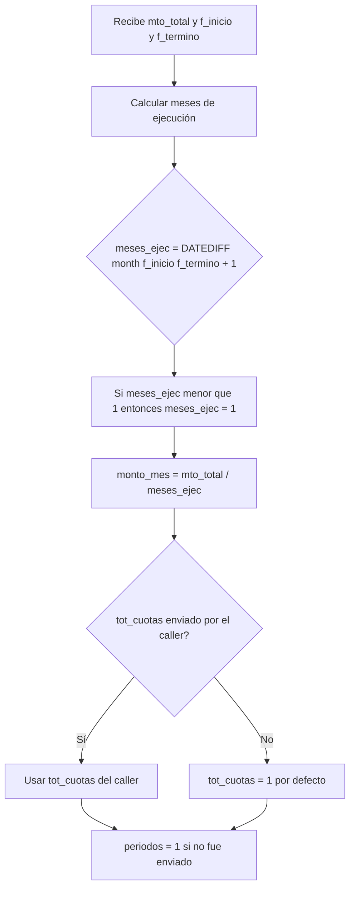
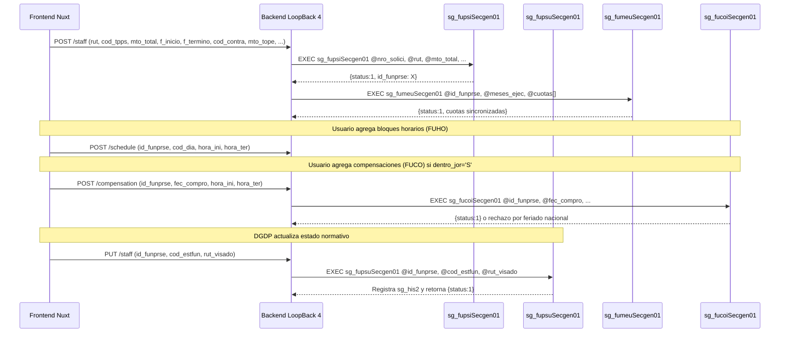

# Especificación Completa: Validaciones, Montos y Determinaciones en el Flujo de Solicitud PDS (DU288 / DU09)

Este documento es la **fuente única de verdad** de todo lo que ocurre en Sybase durante el ciclo de vida de un funcionario/prestador en una solicitud de prestación de servicios. Cubre validaciones en orden de ejecución, cálculos de monto, condiciones de bifurcación (DU288 vs Legacy) y persistencia de trazabilidad.

---

## 1. Parámetros de Entrada y Fuente de Datos

### Campos del funcionario en solicitud (`sg_fups`)

| Parámetro | Tipo | Rol / Descripción | ¿DU288? | ¿Legacy? |
| :--- | :--- | :--- | :---: | :---: |
| `id_funprse` | `int` | Clave primaria del registro de funcionario-prestación | ✓ | ✓ |
| `nro_solici` | `int` | Número de solicitud asociada | ✓ | ✓ |
| `rut` | `char(9)` | RUT del prestador (sin puntos, con dígito verificador) | ✓ | ✓ |
| `cod_cargo` | `smallint` | Código de cargo desde `sisper_db..sp_carg` | ✓ | ✓ |
| `cod_sitm` | `varchar(5)` | Código de situación M del funcionario | ✓ | ✓ |
| `itm_global` | `varchar(15)` | Ítem presupuestario global | ✓ | ✓ |
| `motivo` | `varchar(255)` | Descripción de la actividad a realizar | ✓ | ✓ |
| `periodos` | `tinyint` | Número de períodos (cuotas solicitante); DU288 lo deriva | ✓ | ✓ |
| `monto_mes` | `decimal(19,2)` | Monto mensual; **DU288 lo calcula internamente** | calculado | ✓ |
| `mto_total` | `decimal(19,2)` | Monto total del contrato | ✓ | ✓ |
| `cod_moneda` | `tinyint` | Código de moneda (ej: 1 = CLP) | ✓ | ✓ |
| `cod_tpps` | `smallint` | Tipo de período: **1 = Cuota Fija, 2 = Cuota Variable** | ✓ | ✓ |
| `f_inicio` | `datetime` | Fecha de inicio de la actividad | ✓ | ✓ |
| `f_termino` | `datetime` | Fecha de término de la actividad | ✓ | ✓ |
| `dentro_jor` | `char(1)` | `'S'` si la actividad se ejecuta dentro de la jornada ordinaria | ✓ | — |
| `cod_contra` | `int` | Contrato institucional seleccionado para el cálculo del tope | ✓ | — |
| `mes_haber` | `tinyint` | Mes del haber de referencia (mes anterior a la solicitud) | ✓ | — |
| `ano_haber` | `smallint` | Año del haber de referencia | ✓ | — |
| `mto_haber` | `int` | Haber base utilizado para calcular el tope mensual | ✓ | — |
| `mto_tope` | `int` | Tope mensual calculado o fijo (referencia para validar monto) | ✓ | — |
| `f_cal_tope` | `datetime` | Fecha en que se calculó o congeló el tope | ✓ | — |
| `tot_cuotas` | `tinyint` | Total de cuotas declaradas en la solicitud | ✓ | — |
| `cod_estfun` | `tinyint` | Estado normativo del funcionario dentro del flujo | ✓ | — |
| `rut_visado` | `char(9)` | RUT del usuario que visó el cambio de estado | ✓ | — |

---

## 2. Fuente de Verdad de la Modalidad (`cod_modprs`)

**Regla de Oro:** La modalidad de la prestación (`cod_modprs`) **siempre se lee desde `sg_prse`**, no desde el parámetro de entrada. El parámetro solo actúa como fallback si la solicitud aún no existe en BD.

```sql
SELECT @resolved_modprs = cod_modprs FROM sg_prse WHERE nro_solici = @nro_solici
IF @resolved_modprs IS NOT NULL
    SELECT @cod_modprs = @resolved_modprs
ELSE IF @cod_modprs IS NULL
    SELECT @cod_modprs = 1  -- default: Legacy
```

| `cod_modprs` | Modalidad | Comportamiento del SP |
| :---: | :--- | :--- |
| `1` | **Legacy** (flujo histórico sin DU288) | Persiste solo campos base; sin trazabilidad de tope ni estado |
| `2` | **DU288** (Decreto 009 / DU09) | Persiste todos los campos extendidos, historial de estado y sincroniza actividad en `sg_prse` |

---

## 3. Validaciones en Orden de Ejecución (Guards Previos a `BEGIN TRAN`)

Las siguientes validaciones se ejecutan **antes de abrir la transacción**, siguiendo la regla de prevención del error `010P4` JDBC.

### 3.1. Validaciones de Presencia (Campo Obligatorio)

Ejecutadas en ambos modos (DU288 y Legacy):

| Secuencia | Campo Faltante | Código de Error | Mensaje al Usuario |
| :---: | :--- | :--- | :--- |
| 1 | `id_funprse` (UPDATE) o `nro_solici` (INSERT) | `INVALID_STAFF` / `INVALID_REQUEST` | *"Falta campo Id Funcionarios prestación de servicios"* |
| 2 | `rut` | `INVALID_STAFF` | *"Falta campo RUT"* |
| 3 | `cod_cargo` | `INVALID_STAFF` | *"Falta campo Codigo Cargo"* |
| 4 | `cod_sitm` | `INVALID_STAFF` | *"Falta campo Codigo Situacion M"* |
| 5 | `itm_global` | `INVALID_STAFF` | *"Falta campo Itm Global"* |
| 6 | `motivo` | `INVALID_ACTIVITY` | *"Falta campo Motivo"* |
| 7 | `mto_total` | `INVALID_STAFF` | *"Falta campo Monto Total"* |
| 8 | `cod_moneda` | `INVALID_STAFF` | *"Falta campo Codigo Moneda"* |
| 9 | `cod_tpps` | `INVALID_STAFF` | *"Falta campo tipo de periodo"* *(solo INSERT DU288)* |
| 10 | `f_inicio` | `INVALID_STAFF` | *"Falta campo fecha de inicio"* *(solo INSERT DU288)* |
| 11 | `f_termino` | `INVALID_STAFF` | *"Falta campo fecha de término"* *(solo INSERT DU288)* |

Exclusivas del modo **Legacy** (`cod_modprs <> 2`):

| Campo | Código | Mensaje |
| :--- | :--- | :--- |
| `periodos` | `INVALID_STAFF` | *"Falta campo Periodos"* |
| `monto_mes` | `INVALID_STAFF` | *"Falta campo Monto Mensual"* |

### 3.2. Validaciones de Negocio (Reglas de Dominio)

| Secuencia | Condición | Código | Mensaje al Usuario |
| :---: | :--- | :--- | :--- |
| 1 | DU288 (`cod_modprs = 2`) y `len(motivo) < 10` | `DU288_INVALID_ACTIVITY` | *"La actividad del funcionario debe tener al menos 10 caracteres"* |
| 2 | `f_inicio > f_termino` | `INVALID_PERIOD` | *"La fecha de inicio no puede ser posterior a la fecha de término"* |
| 3 | DU288 y ya existe 1 funcionario en `sg_fups` para la solicitud (INSERT) | `DU288_STAFF_LIMIT` | *"La solicitud DU288 ya posee un funcionario. Debe actualizar el registro existente."* |
| 4 | DU288 y la solicitud tiene ≠ 1 funcionario (UPDATE) | `DU288_CARDINALITY_INCONSISTENT` | *"La solicitud DU288 no posee exactamente un funcionario y no puede actualizarse."* |
| 5 | `id_funprse` no existe en `sg_fups` (UPDATE) | `STAFF_NOT_FOUND` | *"El funcionario especificado no existe"* |

---

## 4. Determinación de Montos y Cálculo de Cuotas (DU288)

En modo DU288 (`cod_modprs = 2`), el SP **recalcula internamente** los valores derivados. El frontend envía `mto_total` como autoridad final; el SP deriva el resto:



### Reglas de Cálculo:

1. **`meses_ejec`** = `DATEDIFF(month, f_inicio, f_termino) + 1`. Si es `< 1`, se fuerza a `1`.
2. **`monto_mes`** = `mto_total / meses_ejec` (división entera con decimal `19,2`).
3. **`tot_cuotas`**: El SP acepta el valor del caller (determinado en Frontend según cupos disponibles). Si no se envía, lo fuerza a `1`.
4. **`periodos`**: Para DU288, se fuerza a `1` si no se envía (el legacy sí requiere el dato del caller).

> **Relación con el Frontend:** `getMaxDeclarableInstallments()` en `formatters.js` calcula cuántas cuotas puede declarar el solicitante según `executionMonths` y `availableSlots` (cupos remanentes del año). Este valor se pasa como `tot_cuotas` al SP.

---

## 5. Estado del Funcionario (`cod_estfun`) y Historización

El campo `cod_estfun` representa el estado normativo del funcionario dentro del flujo de evaluación DGDP:

| `cod_estfun` | Significado (desde `sg_efun`) | Quién lo asigna |
| :---: | :--- | :--- |
| `1` | Estado inicial / Ingresado | SP `sg_fupsiSecgen01` (default DU288) |
| otros | Según catálogo `sg_efun` | DGDP/Revisor mediante `sg_fupsuSecgen01` |

**Regla de Historización:** Cuando el `cod_estfun` cambia en un UPDATE, el SP inserta automáticamente un registro en `sg_his2`:

```sql
INSERT INTO sg_his2 (id_funprse, f_visacion, rut_visado, cod_estact, cod_estnue)
VALUES (@id_funprse, getdate(), @rut_visado, @current_estfun, @cod_estfun)
```

El `rut_visado` fallback es `'SYSTEM'` si no se informa el usuario de la visación.

---

## 6. Sincronización con Tabla Maestra `sg_prse`

En modo DU288, después de actualizar `sg_fups`, el SP realiza siempre una sincronización de la **actividad principal** de la prestación:

```sql
UPDATE sg_prse SET actividad = @motivo WHERE nro_solici = @nro_solici
```

Si este UPDATE falla o afecta ≠ 1 fila, se ejecuta `ROLLBACK TRAN` con código `DU288_ACTIVITY_SYNC_ERROR`.

> **Motivo:** En el modelo DU288, la actividad de la prestación (`sg_prse.actividad`) es parte del texto oficial de la resolución. Debe mantenerse sincronizada con lo que el funcionario declara en `sg_fups.motivo`.

---

## 7. Consulta de Prestaciones Previas (`sg_fupssSecgen17`)

Este SP recupera el historial completo de un funcionario para apoyar la **revisión normativa de concurrencia**. Retorna por cada prestación previa:

| Dato | Descripción |
| :--- | :--- |
| `f_inicio` / `f_termino` | Período de actividad del PDS previo |
| `mto_total` / `monto_mes` / `tot_cuotas` | Montos y cuotas comprometidas |
| `cod_tpps` | Tipo de período (Fija o Variable) |
| `dentro_jor` | Si requirió compensación horaria |
| `mto_tope` / `mto_haber` / `mes_haber` / `ano_haber` | Tope aplicado y haber de referencia histórico |
| `cant_horarios` | Cantidad de bloques semanales declarados en `sg_fuho` |
| `cant_compensa_plan` | Cantidad de compensaciones declaradas en `sg_fuco` |
| `nro_cuota` / `cod_estcuo` / `mto_apagar` | Estado de pago de cada cuota en `sg_fume` |
| `fec_comrea` / `hora_ini_comrea` / `hora_ter_comrea` | Compensaciones realizadas en `sg_fuc2` |

**Filtro de exclusión:** La solicitud actualmente en edición se excluye del histórico (`@nro_solici_excluir`). También se excluyen solicitudes en estado `4` (ej: anuladas).

---

## 8. Ciclo de Vida Completo de un Funcionario en una Solicitud



---

## 9. Restricción de Cardinalidad DU288 (1 Funcionario por Solicitud)

Una solicitud bajo modalidad DU288 puede contener **exactamente 1 registro en `sg_fups`**:

* **Al insertar:** Si ya existe 1 registro → rechazo `DU288_STAFF_LIMIT`.
* **Al actualizar:** Si existen ≠ 1 registros → rechazo `DU288_CARDINALITY_INCONSISTENT`.

Esta restricción refleja el modelo de resolución individual: una DU288 resuelve para un único prestador con un único contrato de referencia. Las prestaciones de múltiples prestadores se tramitan como solicitudes independientes en el mismo centro de costos.

---

## 10. Códigos de Error Semánticos (Mapa Completo)

| Código | Contexto | Significado para el Desarrollador |
| :--- | :--- | :--- |
| `INVALID_REQUEST` | INSERT | Falta `nro_solici` |
| `INVALID_STAFF` | INSERT / UPDATE | Campo obligatorio del funcionario ausente |
| `INVALID_ACTIVITY` | INSERT / UPDATE | Campo `motivo` ausente |
| `DU288_INVALID_ACTIVITY` | DU288 | `motivo` tiene menos de 10 caracteres |
| `INVALID_PERIOD` | INSERT / UPDATE | `f_inicio > f_termino` |
| `INVALID_STAFF_STATUS` | DU288 UPDATE | `cod_estfun` no existe en `sg_efun` |
| `STAFF_NOT_FOUND` | UPDATE | `id_funprse` no existe en `sg_fups` |
| `DU288_STAFF_LIMIT` | DU288 INSERT | Ya existe un funcionario en la solicitud |
| `DU288_CARDINALITY_INCONSISTENT` | DU288 UPDATE | La solicitud no tiene exactamente 1 funcionario |
| `CORRELATIVE_ERROR` | INSERT | Fallo al actualizar el correlativo en `sg_parm` |
| `STAFF_INSERT_ERROR` | INSERT | Error DML al insertar en `sg_fups` |
| `STAFF_UPDATE_ERROR` | UPDATE | Error DML al actualizar en `sg_fups` |
| `STAFF_NOT_UPDATED` | UPDATE | UPDATE afectó 0 filas (sin cambios o ID no encontrado) |
| `STAFF_HISTORY_ERROR` | DU288 UPDATE | Error al insertar en `sg_his2` |
| `DU288_ACTIVITY_SYNC_ERROR` | DU288 | Error al sincronizar `sg_prse.actividad` |
