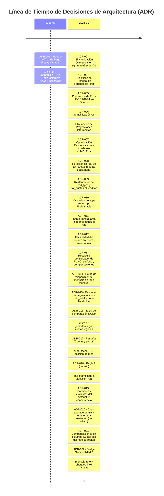

# Contexto, Reglas y Registro de Decisiones de Arquitectura (ADR)
## Ecosistema SG-Solicitudes / Módulo Prestación de Servicios (PDS - DU288 / DU09)

Este directorio constituye la **fuente única de verdad (Single Source of Truth)** para el historial de decisiones técnicas, reglas de negocio, modificaciones de base de datos (Sybase), integraciones backend (LoopBack 4) y diseño frontend (Nuxt.js / Vue) implementadas en el flujo de resoluciones y solicitudes de prestación de servicios.

---

## 1. Índice de Documentación de Decisiones

| Documento | Descripción / Ámbito | Estado |
| :--- | :--- | :---: |
| [01. Cuotas y Tipo de Pago](file:///d:/trabajo_ufro_2026/nuevo_workflow_fase_2/template-du09/cambios_pa_solicitud_wf/contexto_reglas_cambios_agregados/01_DECISIONES_CUOTAS_Y_TIPO_PAGO.md) | Modelo de cuotas (`sg_fume`), tipos de pago (`cod_tpps` Fija/Variable), sincronización diferencial y estabilidad de claves. | `VIGENTE` |
| [02. Calendario Institucional y Feriados](file:///d:/trabajo_ufro_2026/nuevo_workflow_fase_2/template-du09/cambios_pa_solicitud_wf/contexto_reglas_cambios_agregados/02_DECISIONES_CALENDARIO_INSTITUCIONAL_Y_FERIADOS.md) | Integración `es_cfer`, categorización de feriados (Nacionales vs Universitarios vs Suspensión) y reglas de bloqueo. | `VIGENTE` |
| [03. Horario de Ejecución y Compensaciones](file:///d:/trabajo_ufro_2026/nuevo_workflow_fase_2/template-du09/cambios_pa_solicitud_wf/contexto_reglas_cambios_agregados/03_DECISIONES_HORARIO_EJECUCION_Y_COMPENSACIONES.md) | Horario semanal recurrente (`sg_fuho`), topes semanales (56h), traslapes multi-PDS y compensaciones (`sg_fuco`/`sg_fuc2`). | `VIGENTE` |
| [04. UI/UX y Responsividad](file:///d:/trabajo_ufro_2026/nuevo_workflow_fase_2/template-du09/cambios_pa_solicitud_wf/contexto_reglas_cambios_agregados/04_DECISIONES_UI_UX_Y_RESPONSIVIDAD.md) | Principios de diseño limpio, eliminación de proyecciones intermedias confusas, adaptación responsive (1240x911 y móvil). | `VIGENTE` |
| [05. Estándares Sybase y Seguridad OWASP](file:///d:/trabajo_ufro_2026/nuevo_workflow_fase_2/template-du09/cambios_pa_solicitud_wf/contexto_reglas_cambios_agregados/05_ESTANDARES_SYBASE_Y_SEGURIDAD_DATOS.md) | Manejo seguro de transacciones (prevención `010P4`), cabeceras `latin1` y ocultamiento estricto de tablas/columnas en mensajes. | `VIGENTE` |
| [06. Validaciones, Topes y Restricciones](file:///d:/trabajo_ufro_2026/nuevo_workflow_fase_2/template-du09/cambios_pa_solicitud_wf/contexto_reglas_cambios_agregados/06_REGLAS_VALIDACIONES_TOPES_Y_RESTRICCIONES.md) | Matriz maestra de validaciones en Frontend, Backend y Sybase: tope 56h, traslapes, feriados, cuotas y estados. | `VIGENTE` |
| [07. Dependencias de Datos y Workflow Dinámico](file:///d:/trabajo_ufro_2026/nuevo_workflow_fase_2/template-du09/cambios_pa_solicitud_wf/contexto_reglas_cambios_agregados/07_DEPENDENCIAS_DATOS_VALIDACIONES_Y_ROLES_WORKFLOW.md) | Árbol de dependencias (Contrato, Jornada, Compensación, Parentesco, Deuda) y dinamismo de roles con saltos y omisiones. | `VIGENTE` |
| [08. Entidades, Concurrencia y Régimen ANID](file:///d:/trabajo_ufro_2026/nuevo_workflow_fase_2/template-du09/cambios_pa_solicitud_wf/contexto_reglas_cambios_agregados/08_ENTIDADES_CENTROS_DE_COSTO_Y_CONCURRENCIA_PRESTACIONES.md) | Entidades (Centro Costo, Responsable), concurrencia multi-PDS, cupo de cuotas por funcionario y excepciones ANID. | `VIGENTE` |
| [09. Especificación Completa sg_fups (Validaciones y Montos)](file:///d:/trabajo_ufro_2026/nuevo_workflow_fase_2/template-du09/cambios_pa_solicitud_wf/contexto_reglas_cambios_agregados/09_ESPECIFICACION_COMPLETA_SOLICITUD_FUPS_VALIDACIONES_Y_MONTOS.md) | Guards, cálculo de montos/cuotas, historización, cardinalidad DU288 y mapa completo de códigos de error. | `VIGENTE` |

---

## 2. Registro Cronológico de Migraciones de Decisiones (ADR Log)

A continuación se mantiene el log de decisiones aplicadas al sistema. Cada cambio de arquitectura o regla de negocio debe registrarse con su código ADR, fecha y justificación.

### Tabla de Decisiones

| ID | Fecha | Título / Decisión | Motivación / Impacto | Estado |
| :--- | :---: | :--- | :--- | :---: |
| **ADR-001** | 2026-08-15 | **Adopción de catálogo `sg_tpps` para tipos de pago** | Soportar pagos con monto fijo mensual vs monto variable por horas efectivas trabajadas. | `APLICADO` |
| **ADR-002** | 2026-08-22 | **Desacople entre `sg_fuco` y `sg_fuc2`** | El solicitante declara intenciones de compensación (`sg_fuco`), mientras que las cuotas de pago (`sg_fuc2`) se generan al tramitar la resolución. | `APLICADO` |
| **ADR-003** | 2026-09-02 | **Sync diferencial de cuotas en `sg_fumeuSecgen01`** | Evitar borrado total (`DELETE + INSERT`) para no romper llaves foráneas (`sg_fuc2`, `sg_fum2`) y preservar IDs de cuotas ya asociadas. | `APLICADO` |
| **ADR-004** | 2026-09-05 | **Tipología de Feriados `es_cfer` (1, 2, 3)** | Solo feriados nacionales (`cod_tipfer=1`) bloquean la ejecución y la compensación. Feriados universitarios y suspensiones son informativos. | `APLICADO` |
| **ADR-005** | 2026-09-07 | **Ejecución de validaciones previas antes de `BEGIN TRAN`** | Prevenir el fallo `010P4: The server is not ready` en el driver JDBC Sybase cuando un guard retorna antes del commit. | `APLICADO` |
| **ADR-006** | 2026-09-08 | **Eliminación de componente proyector intermedio** | El solicitante no requiere ver métricas intermedias confusas ("Horas no ejecutadas: 0 min"). Los efectos se muestran en el día FUHO afectado y en el calendario de compensación. | `APLICADO` |
| **ADR-007** | 2026-09-09 | **Ajuste de Breakpoints de Cuadrícula a 1240x911** | La resolución estándar de laptops institucionales generaba solapamiento de textos y botones. Se reajustaron anchos mínimos a 118px y flex-wrap responsivo. | `APLICADO` |
| **ADR-008** | 2026-09-09 | **Persistencia real de `sg_fups.tot_cuotas`** | Ambos PA (`sg_fupsiSecgen01`, `sg_fupsuSecgen01`) anulaban el valor antes de escribir, así que «Cuotas esperadas» nunca se guardaba. Ahora se persiste, con `1` por defecto. Fija el techo del bruto (tope × cuotas, Q-C01). Ver [01 §6.1](01_DECISIONES_CUOTAS_Y_TIPO_PAGO.md). | `APLICADO` |
| **ADR-009** | 2026-09-09 | **Restauración de `cod_tpps` y `tot_cuotas` al reeditar** | `cod_tpps` se persistía bien, pero la hidratación no lo devolvía al formulario: al reabrir un funcionario guardado como «Variable» aparecía «Fija». Defecto de lectura, no de guardado. Ver [01 §6.2](01_DECISIONES_CUOTAS_Y_TIPO_PAGO.md). | `APLICADO` |
| **ADR-010** | 2026-09-09 | **Validación del tope mensual según tipo Fijo/Variable** | Se adopta la opción **B**: en Variable la contribución mensual es `mto_total ÷ tot_cuotas` (el tope se valida por cuota, T-01/T-06), acotada por `min(cuotas, meses)`; en Fijo sigue siendo el reparto entre meses. Sin `tot_cuotas` (filas previas al fix) cae al promedio. Requirió exponer `cod_tpps` en `sg_fupssSecgen17`. Ver [06 §8](06_REGLAS_VALIDACIONES_TOPES_Y_RESTRICCIONES.md). | `APLICADO` |
| **ADR-012** | 2026-09-09 | **Factibilidad del reparto en cuotas (monto fijo)** | La validación `ceil(total ÷ tope) ≤ cuotas` asume que el monto se corta donde sea, pero en Fijo los meses son indivisibles y la cuota agrupa meses enteros: aprobaba solicitudes **impagables** ($300.000 / 3 meses / tope $150.000 / 2 cuotas). Se mide la **cuota más cargada**: `ceil(meses ÷ cuotas) × monto_mes ≤ tope`. El techo del bruto en Fijo pasa a `tope × meses ÷ ceil(meses ÷ cuotas)`. Variable sin cambios. Ver regla **T-07** en `reglas_pagos/01_...md`. | `APLICADO` |
| **ADR-011** | 2026-09-09 | **`sg_fups.monto_mes` guarda el monto mensual real** | Contenía `mto_total` pese a llamarse «monto mes» y mostrarse como «Monto mensual». Ambos PA lo **recalculan siempre** (`mto_total ÷ meses`), ignorando el valor del cliente, así queda al día ante cambios de fechas o monto. Se lee junto a `cod_tpps`: comprometido en Fijo, estimado en Variable. **No participa del control de tope**, que sigue en `mto_total`/`mto_tope`/`tot_cuotas`. | `APLICADO` |
| **ADR-013** | 2026-09-09 | **Recálculo conservador de FUHO, período y compensaciones** | Cambiar `sg_fuho`, el período o el calendario recalcula las horas efectivas y el balance, pero nunca reubica ni elimina automáticamente filas `sg_fuco`. Las compensaciones inválidas permanecen visibles y bloquean el guardado hasta su corrección o eliminación explícita. El calendario opera cerrado mientras su fuente no esté confirmada. Ver [02 §6](02_DECISIONES_CALENDARIO_INSTITUCIONAL_Y_FERIADOS.md), [03 §5](03_DECISIONES_HORARIO_EJECUCION_Y_COMPENSACIONES.md) y [06 §3.3](06_REGLAS_VALIDACIONES_TOPES_Y_RESTRICCIONES.md). | `APLICADO` |
| **ADR-014** | 2026-09-09 | **Retiro de "disponible" del mensaje de tope mensual** | En la tabla de incidencias, "Tope mensual: ...disponible: $X" contradecía a la Regla 11 ("no se puede volver a solicitar en ese período") cuando ambas disparaban para la misma PDS previa: una sugería margen en dinero, la otra decía que no quedaba ninguno. El tope se valida por cuota (ADR-010), no como un saldo mensual estable — lo que limita una cuota nueva es el cupo de cuotas, no un monto disponible. Se retira de ambas variantes del mensaje (`monthlyCapContribution`, unificada). Ver [06 §10](06_REGLAS_VALIDACIONES_TOPES_Y_RESTRICCIONES.md). | `APLICADO` |
| **ADR-015** | 2026-09-10 | **Resumen de pago de PDS previa acotado a `mto_total`** | `sg_fume` puede traer más filas de cuota que las declaradas en `tot_cuotas` (p. ej. una cuota placeholder creada al decretar, sin `mto_apagar`). El resumen sumaba `monto_mes` de esa placeholder al «por pagar», mostrando saldo pendiente y `PAGO_PARCIAL` en una prestación ya saldada (caso solicitud 205: `mto_total $111.111`, pagado $111.111, «$111.111 por pagar»). `addPaymentSummary` pasa a derivar `pendingAmount = max(0, mto_total − paidAmount)` y `PAGADA` cuando `paidAmount ≥ mto_total`. Además, el cupo anual sale de la columna «Evaluación» de la lista (que queda solo con el nivel de revisión): el badge `N/2` se leía como cupo propio de la PDS y como parte del veredicto. El aporte por PDS («Ocupa N mes(es) del cupo anual», sin `/2`) queda en las pestañas de comparación; el total `X/2` compartido, solo en la fila «Cuotas de pago registradas». Ver [09 §7.1–7.2](09_ESPECIFICACION_COMPLETA_SOLICITUD_FUPS_VALIDACIONES_Y_MONTOS.md). | `APLICADO` |
| **ADR-016** | 2026-09-10 | **Tabla de comparación DGDP: qué se evalúa y cuotas legibles** | «Ejecución dentro de jornada» se retira como fila (no es validador de duplicidad ni tope). «Cargo» deja de mostrar badge de coincidencia (el axioma es centro de costo = actividad, no cargo; queda como contexto y cita opcional). La fila «Cuotas de pago registradas» pasa de «Pagada (1/1)» vs «No aplica» a estado de pago + `Total autorizado`, con estado que combina cupo anual excedido y cuotas ejecutadas fuera del mes programado; el N° y estado de la solicitud previa van al subtítulo del detalle financiero, y cada bloque de cuota marca la incongruencia de fecha con badge propio. Ver [09 §7.3](09_ESPECIFICACION_COMPLETA_SOLICITUD_FUPS_VALIDACIONES_Y_MONTOS.md). | `APLICADO` |
| **ADR-017** | 2026-09-10 | **Pestaña «Cuotas y pagos» del modal DGDP: validar el agregado, no inventar cuotas** | La solicitud en revisión no tiene cuotas (C-03: el solicitante distribuye los meses a mano en el flujo de pago), así que la pestaña dejaba de comparar nada: bloque por cuota previa con la columna «Solicitud actual» entera en «Sin información». Se reemplaza por 4 secciones: (1) cupo de meses de pago vs límite real 2/12-ANID; (2) monto total, tope y factibilidad del reparto T-07/ADR-012 vía `getPaymentMonthsValidation` (el mismo cálculo del solicitante/backend); (3) aviso de posible doble pago cuando la solicitud ejecuta en un mes con cuota previa pagada/en gestión del mismo centro de costo; (4) tabla plana de las cuotas reales de la PDS previa. Ver [09 §7.4](09_ESPECIFICACION_COMPLETA_SOLICITUD_FUPS_VALIDACIONES_Y_MONTOS.md). | `APLICADO` |
| **ADR-018** | 2026-09-11 | **Regla 2 (choque de horario): gatillo ampliado a ejecución real** | El gatillo de la Regla 2 (`schedule_overlap`, solicitante) y de la pestaña «Horario de ejecución» (DGDP) solo miraba si el período *declarado* (`sg_prse.per_desde`/`per_hasta`) se solapaba. Confirmado con datos reales (solicitud 206) que el período declarado puede diferir de la ejecución real (`sg_fups.f_inicio`/`f_termino`) — exigir solo el período declarado podía dejar pasar un choque de horario real. Se amplía (`OR`, no reemplazo) a período declarado **o** ejecución real solapada (`executionOverlapFor`, mismo cálculo que ya usa `hasPaymentRisk`); nunca deja de detectar lo que ya detectaba. La Regla 7 (período concurrente, aproximada por diseño) no cambia. Ver [09 §7.5](09_ESPECIFICACION_COMPLETA_SOLICITUD_FUPS_VALIDACIONES_Y_MONTOS.md). | `APLICADO` |
| **ADR-019** | 2026-09-11 | **Borradores excluidos del historial de concurrencia** | `fromListProcedures` ya excluía solicitudes Rechazadas (`cod_estsol=4`) del historial de PDS previas por no ser un compromiso vigente. Se agrega `5` (Borrador): se puede editar o descartar libremente y nunca pasó por revisión — contarlo como «comprometido» inflaba el cupo de meses, el tope mensual agregado, o disparaba falsos choques de horario/compensación contra algo que quizá nunca se presente. Un solo punto de exclusión (`fromListProcedures`), así que aplica por igual al veredicto del solicitante y al modal DGDP. Ver [09 §7.0](09_ESPECIFICACION_COMPLETA_SOLICITUD_FUPS_VALIDACIONES_Y_MONTOS.md). | `APLICADO` |
| **ADR-020** | 2026-09-11 | **Cupo agotado permitía una TERCERA prestación (bug crítico)** | `getMaxDeclarableInstallments` (frontend) y su espejo en `validateStaffAuthorizedAmount` (backend) terminaban en `Math.max(1, ...)`: con el cupo anual (numeral 6) totalmente agotado por 2 PDS previas del mismo centro de costo, ambos igual devolvían «1 cuota disponible» ficticia, y una tercera solicitud con monto bajo el tope pasaba sin bloquearse en ninguno de los dos lados — detectado por el usuario en un caso real. Se retira el piso en los 4 puntos (2 frontend, 2 backend): con cupo en 0, la validación *ya existente* (`workerPaymentMonthsValidation`/`validateStaffAuthorizedAmount`) se dispara sola, sin necesidad de una regla nueva. De paso, el mensaje frontend deja de decir siempre «supera el máximo general de 2» y cita el máximo realmente disponible con el motivo. Dos gaps relacionados quedan documentados sin corregir: el backend no filtra el cupo por centro de costo (sobre-restrictivo), y ANID no suma entre solicitudes del mismo centro de costo. Ver [09 §7.8](09_ESPECIFICACION_COMPLETA_SOLICITUD_FUPS_VALIDACIONES_Y_MONTOS.md). | `APLICADO` |
| **ADR-021** | 2026-09-11 | **Compensaciones sin columna «Cuota»; cita del tope mensual corregida** | La tabla de compensaciones de la PDS previa mostraba una columna «Cuota» y «Estado de la cuota» — esa tabla compara fechas/horarios, no a qué cuota pertenece cada compensación; se retira la columna y se renombra a «Estado» genérico. Además, `citationReasonDetail('monthlyCapAggregate')` (texto citable del tope mensual agregado) usaba `concurrentItem.monthlyAmount` crudo en vez de `monthlyContributionOf` (ADR-010 opción B) — para una PDS previa Variable mostraba el promedio mensual en vez del techo por cuota real, pudiendo desalinear la cifra citada en la observación oficial. Ver [09 §7.9](09_ESPECIFICACION_COMPLETA_SOLICITUD_FUPS_VALIDACIONES_Y_MONTOS.md). | `APLICADO` |
| **ADR-022** | 2026-09-11 | **Badge «Tope validado»: mensaje roto y chequeo T-07 faltante** | `getTopValidation` (edición en vivo) y `buildTopValidationForRow` (filas hidratadas) — origen de «Tope validado»/«Tope excedido» y del issue `TOPE_EXCEDIDO` que decide «Cumple»/«No cumple» — citaban `NORMATIVE_MESSAGES.normative.topExceededShort`, una clave inexistente en el catálogo (mensaje `undefined`). Además, ninguna de las dos aplicaba el chequeo de factibilidad T-07/ADR-012 (cuota más cargada): comparaban solo el promedio mensual contra el tope, la misma razón simple que ADR-012 ya probó insuficiente — el badge podía mostrar «Tope validado» en verde para un caso que el backend y la tabla de incidencias ya rechazaban. Se agrega `getPaymentMonthsValidation` (T-07) a ambas, y se retira una rama muerta (`useNormativeTopValidation`, nunca seteada). Ver [09 §7.7](09_ESPECIFICACION_COMPLETA_SOLICITUD_FUPS_VALIDACIONES_Y_MONTOS.md). | `APLICADO` |

---

## 3. Guía para Agregar Nuevas Decisiones

Cuando se introduzca un cambio de regla, nuevo procedimiento almacenado o ajuste en el flujo:

1. **Crear o Actualizar el Documento Temático**: Si la decisión corresponde a un tema existente (ej. Cuotas), editar el archivo `.md` respectivo. Si es un tema nuevo, crear el documento numerado correlativamente.
2. **Registrar en la Tabla ADR**: Agregar una fila en la tabla superior con el código `ADR-XXX`, fecha, título, resumen y estado (`PROPUESTO`, `APLICADO`, `DEPRECADO`).
3. **Respetar la Regla de Oro Jerárquica**:
   - Primero se define el SP / Modelo de Datos (Sybase).
   - Luego el Repositorio y Servicio (LoopBack 4).
   - Finalmente el Controlador, Estado Vuex y Componentes UI (Nuxt.js).
