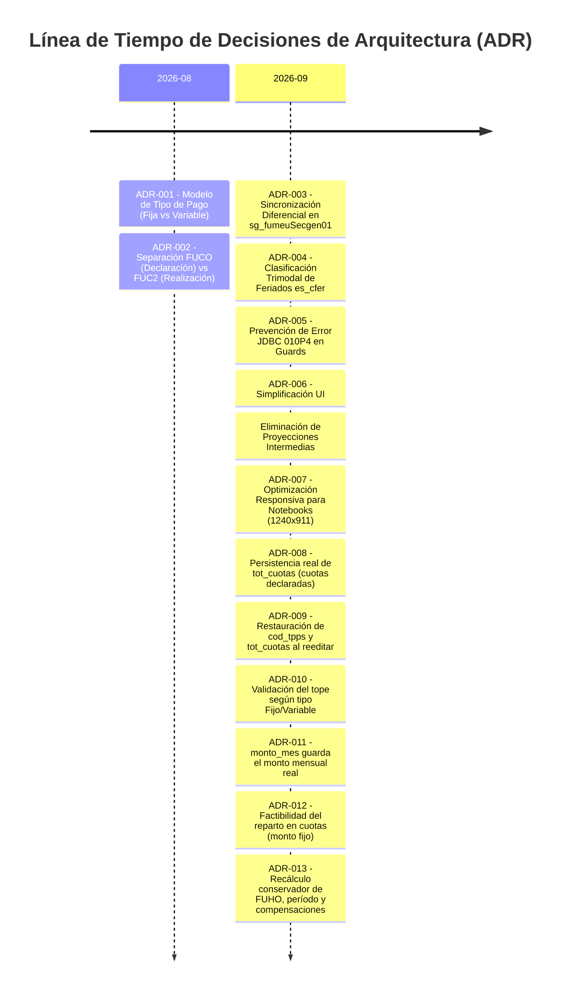

# Contexto, Reglas y Registro de Decisiones de Arquitectura (ADR)
## Ecosistema SG-Solicitudes / Módulo Prestación de Servicios (PDS - DU288 / DU09)

Este directorio constituye la **fuente única de verdad (Single Source of Truth)** para el historial de decisiones técnicas, reglas de negocio, modificaciones de base de datos (Sybase), integraciones backend (LoopBack 4) y diseño frontend (Nuxt.js / Vue) implementadas en el flujo de resoluciones y solicitudes de prestación de servicios.

---

## 1. Índice de Documentación de Decisiones

| Documento | Descripción / Ámbito | Estado |
| :--- | :--- | :---: |
| [01. Cuotas y Tipo de Pago](file:///d:/trabajo_ufro_2026/nuevo_workflow_fase_2/template-du09/cambios_pa_solicitud_wf/contexto_reglas_cambios_agregados/01_DECISIONES_CUOTAS_Y_TIPO_PAGO.md) | Modelo de cuotas (`sg_fume`), tipos de pago (`cod_tpps` Fija/Variable), sincronización diferencial y estabilidad de claves. | `VIGENTE` |
| [02. Calendario Institucional y Feriados](file:///d:/trabajo_ufro_2026/nuevo_workflow_fase_2/template-du09/cambios_pa_solicitud_wf/contexto_reglas_cambios_agregados/02_DECISIONES_CALENDARIO_INSTITUCIONAL_Y_FERIADOS.md) | Integración `es_cfer`, categorización de feriados (Nacionales vs Universitarios vs Suspensión) y reglas de bloqueo. | `VIGENTE` |
| [03. Horario de Ejecución y Compensaciones](file:///d:/trabajo_ufro_2026/nuevo_workflow_fase_2/template-du09/cambios_pa_solicitud_wf/contexto_reglas_cambios_agregados/03_DECISIONES_HORARIO_EJECUCION_Y_COMPENSACIONES.md) | Horario semanal recurrente (`sg_fuho`), topes semanales (56h), traslapes multi-PDS y compensaciones (`sg_fuco`/`sg_fuc2`). | `VIGENTE` |
| [04. UI/UX y Responsividad](file:///d:/trabajo_ufro_2026/nuevo_workflow_fase_2/template-du09/cambios_pa_solicitud_wf/contexto_reglas_cambios_agregados/04_DECISIONES_UI_UX_Y_RESPONSIVIDAD.md) | Principios de diseño limpio, eliminación de proyecciones intermedias confusas, adaptación responsive (1240x911 y móvil). | `VIGENTE` |
| [05. Estándares Sybase y Seguridad OWASP](file:///d:/trabajo_ufro_2026/nuevo_workflow_fase_2/template-du09/cambios_pa_solicitud_wf/contexto_reglas_cambios_agregados/05_ESTANDARES_SYBASE_Y_SEGURIDAD_DATOS.md) | Manejo seguro de transacciones (prevención `010P4`), cabeceras `latin1` y ocultamiento estricto de tablas/columnas en mensajes. | `VIGENTE` |
| [06. Validaciones, Topes y Restricciones](file:///d:/trabajo_ufro_2026/nuevo_workflow_fase_2/template-du09/cambios_pa_solicitud_wf/contexto_reglas_cambios_agregados/06_REGLAS_VALIDACIONES_TOPES_Y_RESTRICCIONES.md) | Matriz maestra de validaciones en Frontend, Backend y Sybase: tope 56h, traslapes, feriados, cuotas y estados. | `VIGENTE` |
| [07. Dependencias de Datos y Workflow Dinámico](file:///d:/trabajo_ufro_2026/nuevo_workflow_fase_2/template-du09/cambios_pa_solicitud_wf/contexto_reglas_cambios_agregados/07_DEPENDENCIAS_DATOS_VALIDACIONES_Y_ROLES_WORKFLOW.md) | Árbol de dependencias (Contrato, Jornada, Compensación, Parentesco, Deuda) y dinamismo de roles con saltos y omisiones. | `VIGENTE` |
| [08. Entidades, Concurrencia y Régimen ANID](file:///d:/trabajo_ufro_2026/nuevo_workflow_fase_2/template-du09/cambios_pa_solicitud_wf/contexto_reglas_cambios_agregados/08_ENTIDADES_CENTROS_DE_COSTO_Y_CONCURRENCIA_PRESTACIONES.md) | Entidades (Centro Costo, Responsable), concurrencia multi-PDS, cupo de cuotas por funcionario y excepciones ANID. | `VIGENTE` |
| [09. Especificación Completa sg_fups (Validaciones y Montos)](file:///d:/trabajo_ufro_2026/nuevo_workflow_fase_2/template-du09/cambios_pa_solicitud_wf/contexto_reglas_cambios_agregados/09_ESPECIFICACION_COMPLETA_SOLICITUD_FUPS_VALIDACIONES_Y_MONTOS.md) | Guards, cálculo de montos/cuotas, historización, cardinalidad DU288 y mapa completo de códigos de error. | `VIGENTE` |

---

## 2. Registro Cronológico de Migraciones de Decisiones (ADR Log)

A continuación se mantiene el log de decisiones aplicadas al sistema. Cada cambio de arquitectura o regla de negocio debe registrarse con su código ADR, fecha y justificación.

### Tabla de Decisiones

| ID | Fecha | Título / Decisión | Motivación / Impacto | Estado |
| :--- | :---: | :--- | :--- | :---: |
| **ADR-001** | 2026-08-15 | **Adopción de catálogo `sg_tpps` para tipos de pago** | Soportar pagos con monto fijo mensual vs monto variable por horas efectivas trabajadas. | `APLICADO` |
| **ADR-002** | 2026-08-22 | **Desacople entre `sg_fuco` y `sg_fuc2`** | El solicitante declara intenciones de compensación (`sg_fuco`), mientras que las cuotas de pago (`sg_fuc2`) se generan al tramitar la resolución. | `APLICADO` |
| **ADR-003** | 2026-09-02 | **Sync diferencial de cuotas en `sg_fumeuSecgen01`** | Evitar borrado total (`DELETE + INSERT`) para no romper llaves foráneas (`sg_fuc2`, `sg_fum2`) y preservar IDs de cuotas ya asociadas. | `APLICADO` |
| **ADR-004** | 2026-09-05 | **Tipología de Feriados `es_cfer` (1, 2, 3)** | Solo feriados nacionales (`cod_tipfer=1`) bloquean la ejecución y la compensación. Feriados universitarios y suspensiones son informativos. | `APLICADO` |
| **ADR-005** | 2026-09-07 | **Ejecución de validaciones previas antes de `BEGIN TRAN`** | Prevenir el fallo `010P4: The server is not ready` en el driver JDBC Sybase cuando un guard retorna antes del commit. | `APLICADO` |
| **ADR-006** | 2026-09-08 | **Eliminación de componente proyector intermedio** | El solicitante no requiere ver métricas intermedias confusas ("Horas no ejecutadas: 0 min"). Los efectos se muestran en el día FUHO afectado y en el calendario de compensación. | `APLICADO` |
| **ADR-007** | 2026-09-09 | **Ajuste de Breakpoints de Cuadrícula a 1240x911** | La resolución estándar de laptops institucionales generaba solapamiento de textos y botones. Se reajustaron anchos mínimos a 118px y flex-wrap responsivo. | `APLICADO` |
| **ADR-008** | 2026-09-09 | **Persistencia real de `sg_fups.tot_cuotas`** | Ambos PA (`sg_fupsiSecgen01`, `sg_fupsuSecgen01`) anulaban el valor antes de escribir, así que «Cuotas esperadas» nunca se guardaba. Ahora se persiste, con `1` por defecto. Fija el techo del bruto (tope × cuotas, Q-C01). Ver [01 §6.1](01_DECISIONES_CUOTAS_Y_TIPO_PAGO.md). | `APLICADO` |
| **ADR-009** | 2026-09-09 | **Restauración de `cod_tpps` y `tot_cuotas` al reeditar** | `cod_tpps` se persistía bien, pero la hidratación no lo devolvía al formulario: al reabrir un funcionario guardado como «Variable» aparecía «Fija». Defecto de lectura, no de guardado. Ver [01 §6.2](01_DECISIONES_CUOTAS_Y_TIPO_PAGO.md). | `APLICADO` |
| **ADR-010** | 2026-09-09 | **Validación del tope mensual según tipo Fijo/Variable** | Se adopta la opción **B**: en Variable la contribución mensual es `mto_total ÷ tot_cuotas` (el tope se valida por cuota, T-01/T-06), acotada por `min(cuotas, meses)`; en Fijo sigue siendo el reparto entre meses. Sin `tot_cuotas` (filas previas al fix) cae al promedio. Requirió exponer `cod_tpps` en `sg_fupssSecgen17`. Ver [06 §8](06_REGLAS_VALIDACIONES_TOPES_Y_RESTRICCIONES.md). | `APLICADO` |
| **ADR-012** | 2026-09-09 | **Factibilidad del reparto en cuotas (monto fijo)** | La validación `ceil(total ÷ tope) ≤ cuotas` asume que el monto se corta donde sea, pero en Fijo los meses son indivisibles y la cuota agrupa meses enteros: aprobaba solicitudes **impagables** ($300.000 / 3 meses / tope $150.000 / 2 cuotas). Se mide la **cuota más cargada**: `ceil(meses ÷ cuotas) × monto_mes ≤ tope`. El techo del bruto en Fijo pasa a `tope × meses ÷ ceil(meses ÷ cuotas)`. Variable sin cambios. Ver regla **T-07** en `reglas_pagos/01_...md`. | `APLICADO` |
| **ADR-011** | 2026-09-09 | **`sg_fups.monto_mes` guarda el monto mensual real** | Contenía `mto_total` pese a llamarse «monto mes» y mostrarse como «Monto mensual». Ambos PA lo **recalculan siempre** (`mto_total ÷ meses`), ignorando el valor del cliente, así queda al día ante cambios de fechas o monto. Se lee junto a `cod_tpps`: comprometido en Fijo, estimado en Variable. **No participa del control de tope**, que sigue en `mto_total`/`mto_tope`/`tot_cuotas`. | `APLICADO` |
| **ADR-013** | 2026-09-09 | **Recálculo conservador de FUHO, período y compensaciones** | Cambiar `sg_fuho`, el período o el calendario recalcula las horas efectivas y el balance, pero nunca reubica ni elimina automáticamente filas `sg_fuco`. Las compensaciones inválidas permanecen visibles y bloquean el guardado hasta su corrección o eliminación explícita. El calendario opera cerrado mientras su fuente no esté confirmada. Ver [02 §6](02_DECISIONES_CALENDARIO_INSTITUCIONAL_Y_FERIADOS.md), [03 §5](03_DECISIONES_HORARIO_EJECUCION_Y_COMPENSACIONES.md) y [06 §3.3](06_REGLAS_VALIDACIONES_TOPES_Y_RESTRICCIONES.md). | `APLICADO` |

---

## 3. Guía para Agregar Nuevas Decisiones

Cuando se introduzca un cambio de regla, nuevo procedimiento almacenado o ajuste en el flujo:

1. **Crear o Actualizar el Documento Temático**: Si la decisión corresponde a un tema existente (ej. Cuotas), editar el archivo `.md` respectivo. Si es un tema nuevo, crear el documento numerado correlativamente.
2. **Registrar en la Tabla ADR**: Agregar una fila en la tabla superior con el código `ADR-XXX`, fecha, título, resumen y estado (`PROPUESTO`, `APLICADO`, `DEPRECADO`).
3. **Respetar la Regla de Oro Jerárquica**:
   - Primero se define el SP / Modelo de Datos (Sybase).
   - Luego el Repositorio y Servicio (LoopBack 4).
   - Finalmente el Controlador, Estado Vuex y Componentes UI (Nuxt.js).
