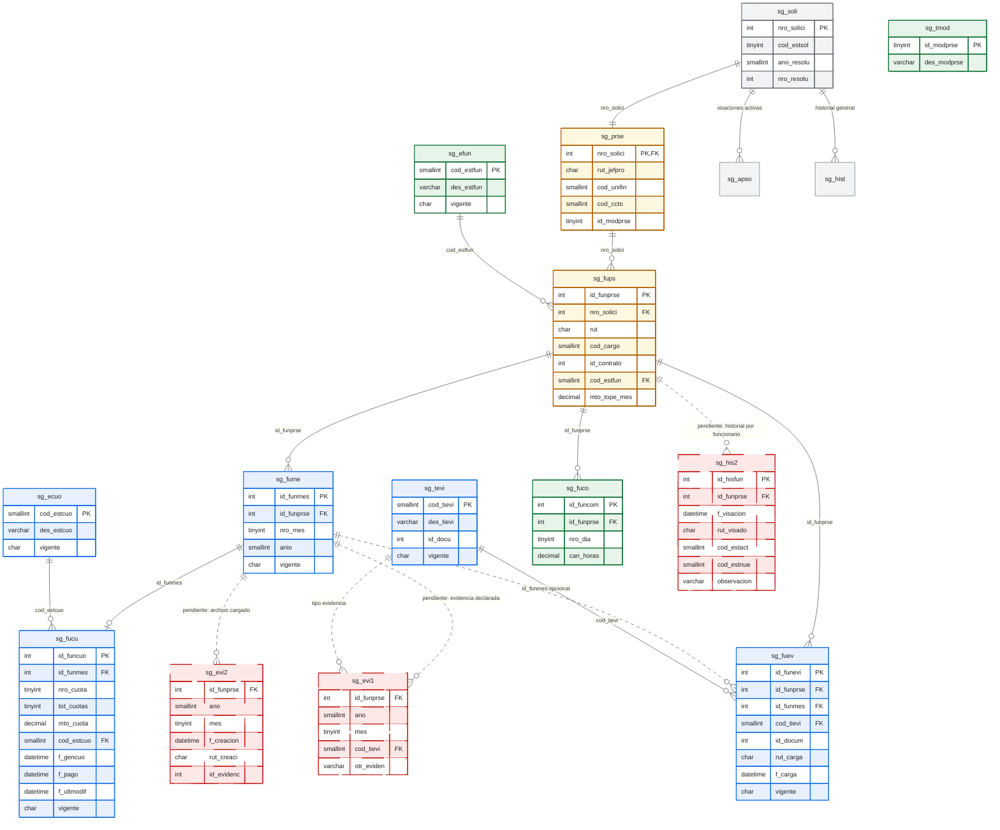
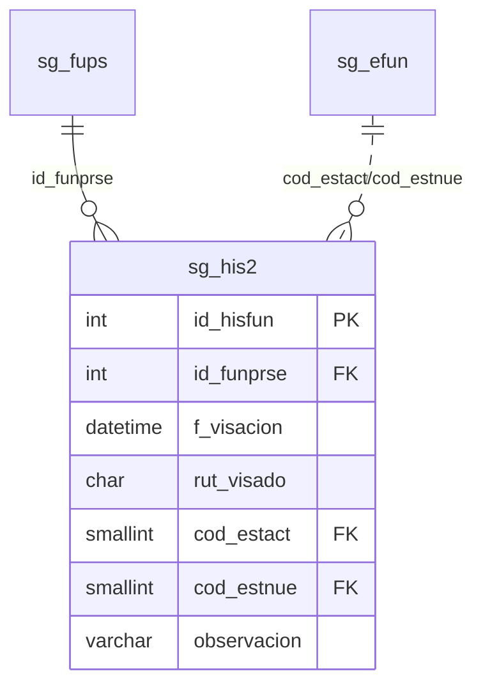

# Analisis de Integracion `secgen_db.jpg` - PDS DU288

Este documento resume las dudas funcionales y tecnicas que deben resolverse antes de integrar las tablas observadas en `secgen_db.jpg` al modelo PDS DU288.

La idea no es integrar tablas por reflejo, sino validar si aportan al flujo real de solicitud, visacion, resolucion y preparacion de cuotas.

---

## 1. Tablas observadas en `secgen_db.jpg`

En la imagen aparecen, para el bloque PDS, las siguientes tablas relevantes:

| Tabla imagen | Uso aparente | Equivalente o decision en modelo actual |
| :--- | :--- | :--- |
| `sg_his2` | Historial de visaciones por funcionario. | Evaluar si realmente complementa `sg_apso`/`sg_hist`. |
| `sg_fume` | Meses por funcionario con `id_funprse`, `ano`, `mes`. | Ya esta modelada como `sg_fume` con `id_funmes`, `id_funprse`, `nro_mes`, `anio`. |
| `sg_fucu` | Cuotas por funcionario/mes. | Ya esta modelada como cuota habilitada por mes, pero normalizada con `id_funcuo` e `id_funmes`. |
| `sg_ecuo` | Estado de cuota. | Ya esta agregada como `sg_ecuo`. |
| `sg_evi1` | Evidencia declarada/definida por funcionario/mes. | Se debe decidir si se integra o si se absorbe con `sg_fuev`. |
| `sg_evi2` | Evidencia cargada/archivo por funcionario/mes. | Se debe decidir si se integra o si `sg_fuev` cubre archivo/documento. |
| `sg_tevi` | Tipo de evidencia. | Ya esta modelada como `sg_tevi`, ajustando nombres/codigos si la tabla fisica difiere. |

---

## 2. Diagrama de analisis recomendado

Este diagrama separa el modelo recomendado de las tablas observadas en `secgen_db.jpg` que requieren confirmacion antes de integrarse.

Estado actual de implementacion:

| Estado | Tablas |
| :--- | :--- |
| Creadas actualmente | `sg_tmod`, `sg_fuco`, `sg_efun` |
| Modificadas actualmente | `sg_prse`, `sg_fups` |
| En revision funcional | `sg_his2`, `sg_evi1`, `sg_evi2` |
| Propuestas/pendientes para completar flujo | `sg_fume`, `sg_fucu`, `sg_ecuo`, `sg_fuev`, `sg_tevi` |

Lectura del diagrama:

1. Gris: tablas existentes reutilizadas.
2. Verde: tablas ya creadas actualmente.
3. Amarillo: tablas ya modificadas actualmente.
4. Azul: tablas propuestas/pendientes para completar el flujo.
5. Rojo punteado: tablas observadas en `secgen_db.jpg` que quedan en revision funcional.
6. El camino recomendado para evidencias es `sg_fups -> sg_fuev`, con `id_funmes` opcional cuando corresponde a un mes.
7. La consulta de evidencia por cuota se resuelve por `sg_fucu -> sg_fume -> sg_fuev`, sin FK directa a cuota.
8. `sg_his2` solo se integra si se confirma historial individual por funcionario.
9. `sg_evi1` y `sg_evi2` quedan como referencia del modelo antiguo; no se recomienda crearlas separadas si `sg_fuev` cubre declaracion y documento.

Leyenda:

| Color | Significado |
| :--- | :--- |
| Gris | Tabla existente/reutilizada. |
| Verde | Tabla creada actualmente. |
| Amarillo | Tabla modificada actualmente. |
| Azul | Tabla propuesta/pendiente para completar el flujo. |
| Rojo punteado | Tabla observada en `secgen_db.jpg` que queda en revision funcional. |

---

## 3. Preguntas para levantar requerimiento

### 3.1 Historial de visaciones

**Pregunta:** `sg_his2` debe usarse como historial oficial de visaciones por funcionario?

#### Preguntas complementarias:

**Pq se pregunta?** Es para determinar si se necesita un registro historico de los usuarios, y ademas se quiere determinar si el usuario al ser eliminado se elimina de la solcitiud y hace una nueva en caso de que se quite o se bloque, y preguntar que pasa en caso de que se quite, volver a hacer una nueva solicitud o que pase de nuevo por el flujo de visaciones.

Campos observados:

| Campo | Interpretacion |
| :--- | :--- |
| `id_funprse` | Funcionario PDS visado. |
| `f_visacion` | Fecha de visacion. |
| `rut_visado` | Persona que visa. |
| `cod_estact` | Estado anterior. |
| `cod_estnue` | Estado nuevo. |

**Respuesta esperada A:** Si se necesita trazabilidad por funcionario, `sg_his2` si aporta.

Impacto:

- Permite saber que rol/persona cambio el estado de un funcionario especifico.
- Complementa `sg_apso` y `sg_hist`, porque esas tablas trazan la solicitud completa, no necesariamente cada funcionario.
- Seria necesaria si un funcionario puede ser aprobado/rechazado/observado de forma independiente dentro de la misma PDS.

**Respuesta esperada B:** Si basta con historial global de solicitud, `sg_his2` no es necesaria.

Impacto:

- Se mantiene `sg_apso` para aprobaciones/visaciones activas.
- Se mantiene `sg_hist` para historial general.
- El estado individual se guarda en `sg_fups.cod_estfun`, pero sin bitacora fina por funcionario.

**Recomendacion inicial:** integrar `sg_his2` solo si negocio exige historial por funcionario. Para DU288 parece recomendable, porque el flujo permite rechazo/observacion parcial sin frenar toda la solicitud.

**Pregunta de cierre:** Cuando un rol observa o rechaza solo a un funcionario, debe quedar visible quien lo hizo, cuando lo hizo y cual era el estado anterior?

---

### 3.2 Evidencia declarada por cuota o por mes

**Pregunta:** La evidencia se declara por funcionario completo o por mes de ejecucion?

#### Preguntas complementarias:

**Pq se pregunta?**, debido a que hay que definir si dicha evidencia va a cambiar por o seran distinta para un mes que otro. ademas se debe aclarar si la evidencia subida sera por cada item registrado o si solo se hara adjunto a un funcioanrio al momento del pago subiendo un solo archivo que contenga todo. 
**Respuesta esperada A:** La evidencia aplica al funcionario completo.

Impacto:

- `sg_fuev.id_funmes` queda `NULL`.
- Sirve para constancias generales, por ejemplo parentesco o autorizacion especial.
- No requiere duplicar la evidencia en cada mes.

**Respuesta esperada B:** La evidencia aplica a un mes especifico.

Impacto:

- `sg_fuev.id_funmes` debe apuntar a `sg_fume.id_funmes`.
- Sirve para justificar pago mensual, licencia, permiso, receso o evidencia de ejecucion de un periodo.
- Permite consultar evidencias por mes/cuota usando `sg_fume -> sg_fucu`.

**Recomendacion inicial:** mantener evidencia asociada a funcionario y opcionalmente a mes. No asociarla directamente a cuota. La cuota se obtiene desde el mes.

**Pregunta de cierre:** Cuando se cargue una evidencia para pago, debe respaldar el mes trabajado o la cuota de pago? Si respalda el mes trabajado, `id_funmes` basta.

---

### 3.3 Consultar evidencia por cuota

**Pregunta:** Se necesita consultar evidencias directamente por cuota (`sg_fucu`)?

#### Preguntas complementarias:

**Pq se pregunta?**, debido a que hay que definir si dicha evidencia va a cambiar por o seran distinta para un mes que otro. ademas se debe aclarar si la evidencia subida sera por cada item registrado o si solo se hara adjunto a un funcioanrio al momento del pago subiendo un solo archivo que contenga todo. 

**Respuesta esperada A:** Si, el pago debe mostrar las evidencias de la cuota.

Impacto:

- No necesariamente se requiere FK directa a `sg_fucu`.
- Se puede consultar por ruta: `sg_fucu.id_funmes -> sg_fume.id_funmes -> sg_fuev.id_funmes`.
- Evita duplicar relacion y mantiene la evidencia ligada al mes de ejecucion.

**Respuesta esperada B:** No, basta consultar evidencias por funcionario/mes.

Impacto:

- La consulta de pagos resuelve evidencias por mes.
- Menos acoplamiento entre PDS y pago.

**Recomendacion inicial:** no agregar `id_funcuo` en evidencias por ahora. Usar `id_funmes`. Solo agregar relacion directa a cuota si aparece un caso donde dos cuotas distintas paguen el mismo mes o una cuota agrupe varios meses.

**Pregunta de cierre:** Puede existir mas de una cuota para el mismo mes de un funcionario o una cuota que cubra mas de un mes?

---

### 3.4 Estado de evidencia

**Pregunta:** La evidencia necesita estado propio?

Ejemplos de estado propio:

- Pendiente.
- Cargada.
- Observada.
- Aprobada.
- Rechazada.

**Respuesta esperada A:** Si, se revisa/visa la evidencia como documento.

Impacto:

- Se requiere una tabla/columna de estado documental, por ejemplo `cod_estevi`.
- Se requiere definir quien puede cambiar el estado.
- Se requiere historial de cambios de estado documental.

**Respuesta esperada B:** No, la evidencia solo se carga/declara y la visacion ocurre sobre la solicitud, funcionario o cuota.

Impacto:

- No se agrega estado propio.
- `sg_fuev.vigente` basta para vigencia logica.
- La revision queda en `sg_soli.cod_estsol`, `sg_fups.cod_estfun` o `sg_fucu.cod_estcuo`.

**Recomendacion inicial:** no agregar estado propio de evidencia en esta etapa. El usuario indico que no se puede visar la evidencia; por lo tanto, no corresponde crear estado documental todavia.

**Pregunta de cierre:** Alguien debe aprobar o rechazar un archivo de evidencia de forma independiente a la solicitud/cuota?

---

### 3.5 Historial de evidencia

**Pregunta:** Se necesita historial de evidencia?

Casos posibles:

- Reemplazo de archivo.
- Eliminacion logica.
- Nueva version del documento.
- Observacion de un respaldo.

**Respuesta esperada A:** Si, se requiere trazabilidad documental.

Impacto:

- No conviene sobrecargar `sg_hist`, porque ese historial es del flujo general.
- Puede resolverse con multiples filas `sg_fuev` marcando `vigente = 'S'/'N'`.
- Si se necesita versionamiento formal, se debe crear tabla de historial documental.

**Respuesta esperada B:** No, basta guardar la evidencia vigente.

Impacto:

- `sg_fuev` guarda un registro vigente por tipo/funcionario/mes.
- El documento anterior se puede invalidar con `vigente = 'N'` si se reemplaza.

**Recomendacion inicial:** no crear historial propio de evidencia ahora. Dejar `vigente` y permitir multiples registros historicos si se reemplaza un documento. Crear historial propio solo si la revision documental se vuelve un flujo formal.

**Pregunta de cierre:** Si un usuario reemplaza una evidencia, debe poder verse el archivo anterior y quien hizo el reemplazo?

---

### 3.6 Definicion de evidencia y persona que la hace

**Pregunta:** Quien define la evidencia esperada?

Opciones:

| Opcion | Descripcion | Implicancia |
| :--- | :--- | :--- |
| Solicitante | La persona que crea la PDS declara evidencias requeridas. | Se registra al guardar la solicitud. |
| Jefe de proyecto | El PM define o confirma evidencias al visar. | Requiere permitir agregar evidencias en etapa posterior. |
| Sistema | Las evidencias nacen desde reglas/tipo de solicitud. | Se requiere catalogo y reglas automaticas. |
| Pago | La evidencia se exige recien al solicitar pago. | No se debe crear evidencia durante solicitud, solo tipos esperados. |

**Recomendacion inicial:** para solicitud PDS, registrar evidencias/constancias declaradas por funcionario. Para documentos de pago, usar el mismo tipo (`sg_tevi`) pero registrar evidencia cuando exista documento real.

**Pregunta de cierre:** La evidencia seleccionada en solicitud es un compromiso futuro o ya es un documento cargado?

---

### 3.7 Meses propuestos vs meses reales de pago

**Pregunta:** Los meses aprobados en PDS pueden ser distintos de los meses reales en que se paga?

**Respuesta esperada A:** Si, el pago puede correrse a otro mes.

Impacto:

- `sg_fume` debe guardar el mes de ejecucion aprobado.
- `sg_fucu` debe poder guardar fecha/mes real de pago o el flujo de pago posterior debe guardarlo.
- Agregar `anio_pago`/`mes_pago` a `sg_fucu` solo si la cuota debe conocer el periodo real de pago antes de crear solicitud de pago.

**Respuesta esperada B:** No, el pago siempre corresponde al mes aprobado.

Impacto:

- `sg_fume.anio/nro_mes` basta.
- `sg_fucu.f_pago` basta para fecha real de pago posterior.

**Recomendacion inicial:** no agregar `anio_pago`/`mes_pago` a `sg_fucu` en solicitud PDS. Mantener `sg_fume` como mes propuesto/aprobado y `sg_fucu.f_pago` como fecha real cuando se pague. Si pago futuro necesita agrupar por periodo contable, ese dato deberia vivir en el detalle de pago posterior, no en la PDS.

**Pregunta de cierre:** El mes real de pago se usa para calcular algo normativo/financiero o solo para informar cuando se pago?

---

## 4. Evaluacion de integracion por tabla

| Tabla | Integrar ahora | Motivo |
| :--- | :--- | :--- |
| `sg_his2` | Pendiente de decision | Aporta solo si se requiere historial por funcionario. |
| `sg_fume` | Si, con modelo normalizado actual | Necesaria para meses aprobados por funcionario. |
| `sg_fucu` | Si, con modelo normalizado actual | Necesaria para dejar cuotas habilitadas al formalizar PDS. |
| `sg_ecuo` | Si | Necesaria para estado de cuota. |
| `sg_evi1` | No como tabla separada por ahora | Su funcion se puede cubrir con `sg_fuev` si la evidencia declarada se guarda como tipo por funcionario/mes. |
| `sg_evi2` | No como tabla separada por ahora | Su funcion se puede cubrir con `sg_fuev.id_docum`, `rut_carga`, `f_carga`. |
| `sg_tevi` | Si | Necesaria como catalogo de tipos de evidencia/constancia. |

---

## 5. Requerimientos que se deben confirmar

### Historial y visaciones

1. El historial oficial de visaciones debe verse por solicitud completa o por funcionario?
2. Un funcionario puede cambiar de estado varias veces durante la misma solicitud?
3. Se debe mostrar estado anterior y nuevo por cada cambio individual?
4. `sg_his2` reemplaza o complementa `sg_hist`/`sg_apso`?
5. La visacion de funcionario se registra en el momento en que cambia `sg_fups.cod_estfun`?

### Evidencias y constancias

6. La evidencia seleccionada en la solicitud es compromiso futuro o documento ya cargado?
7. La evidencia debe asociarse siempre al funcionario?
8. La evidencia puede aplicar a un mes especifico?
9. Existen evidencias globales de solicitud sin funcionario? Si existen, se aceptan o se deben replicar/asociar a cada funcionario?
10. Se debe poder cargar una constancia en etapas posteriores para un funcionario observado?
11. Quien carga la evidencia: solicitante, jefe de proyecto, analista o todos segun etapa?
12. Se necesita saber quien solicita la evidencia y quien la carga?
13. Se requiere estado propio de evidencia o solo vigencia?
14. Se requiere historial/versionamiento de evidencias reemplazadas?

### Cuotas y pagos futuros

15. La cuota se genera al archivar/formalizar la resolucion PDS?
16. Debe existir una cuota por cada mes aprobado?
17. El monto de cuota queda en 0 hasta la solicitud de pago?
18. El mes de ejecucion aprobado puede diferir del mes real de pago?
19. Si difiere, el mes real de pago se usa para calculos o solo para trazabilidad?
20. `f_pago` basta o se requieren `anio_pago` y `mes_pago`?
21. Una cuota puede pagar mas de un mes o dividir un mes en varias cuotas?

---

## 6. Decision tecnica recomendada

Para no sobredimensionar el modelo antes de cerrar requerimientos, la recomendacion es:

1. Mantener `sg_fume` como mes aprobado/propuesto por funcionario.
2. Mantener `sg_fucu` como cuota habilitada desde cada mes aprobado, con `f_pago` para pago real posterior.
3. Mantener `sg_ecuo` como estado de cuota.
4. Mantener `sg_fuev` como tabla unica de evidencias/constancias por funcionario, con `id_funmes` opcional.
5. No crear estado propio de evidencia mientras la evidencia no se vise de forma independiente.
6. No crear historial propio de evidencia mientras no exista versionamiento/revision documental formal.
7. Evaluar `sg_his2` solo si se confirma trazabilidad por funcionario.
8. No crear `sg_evi1` y `sg_evi2` separadas si `sg_fuev` puede cubrir declaracion y documento cargado.

---

## 7. Ajuste sugerido al modelo actual si se confirma trazabilidad por funcionario

Si negocio confirma que se requiere historial individual por funcionario, agregar una tabla equivalente a `sg_his2`:

Notas:

1. Conviene agregar `id_hisfun` como PK identity, porque usar solo `id_funprse + f_visacion` puede ser fragil.
2. `rut_visado` deberia interpretarse como usuario que visa, no como funcionario visado.
3. `observacion` es recomendable si el cambio de estado requiere justificar observacion/rechazo.
4. Esta tabla no reemplaza `sg_hist`; lo complementa a nivel de funcionario.

---

## 8. Ajuste sugerido si se confirma mes real de pago

Si se confirma que el mes real de pago se usa para calculos o control financiero, se puede agregar al flujo de pago posterior:

| Campo | Tabla sugerida | Motivo |
| :--- | :--- | :--- |
| `anio_pago` | detalle de pago futuro | Periodo contable real del pago. |
| `mes_pago` | detalle de pago futuro | Mes contable real del pago. |

No se recomienda agregarlo a `sg_fucu` salvo que la cuota habilitada deba reservar periodo de pago antes de existir solicitud formal de pago.

