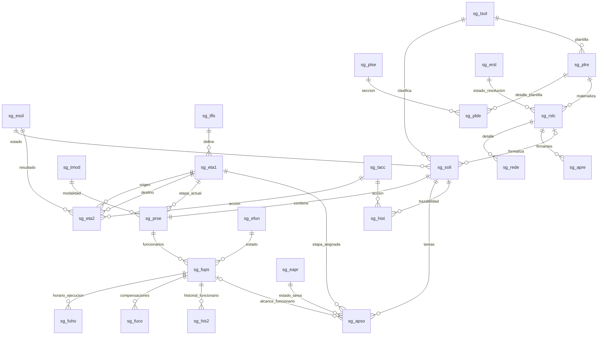

# Catastro de tablas para certificación PDS DU288

## 1. Objetivo y alcance

Este documento identifica las tablas que participan en la implementación vigente de solicitudes PDS DU288, sus dependencias y el orden que debe respetarse al actualizar el ambiente de certificación.

El objetivo práctico es responder: **si se agrega o modifica un dato, qué otros datos relacionados deben existir o actualizarse para que el sistema funcione de extremo a extremo**.

El catastro se construyó contrastando:

- el modelo físico disponible en `diagrama_secgen_actualizado.md`;
- los PA Sybase ASE 12.5 ubicados en `cambios_pa_solicitud_wf/solicitante`;
- las consultas actualmente invocadas por el backend;
- la implementación vigente del workflow DU288.

### Decisión de alcance

Este catastro se refiere al **ambiente de certificación** del módulo PDS DU288. No corresponde al módulo histórico llamado “Cert VRAC”.

La implementación vigente **no utiliza** las tablas propuestas `sg_wflu`, `sg_wfet`, `sg_wfin`, `sg_wfei`, `sg_apsa`, `sg_apsf` ni `sg_hiap`. El flujo implementado usa:

```text
sg_tfls -> sg_eta1 -> sg_eta2 -> sg_prse -> sg_apso
```

Tampoco se consulta `bd_pri2`. Los permisos se resuelven con `sistema_db.dbo.bd_per1`, `bd_prvg` y `bd_pepr`.

## 2. Vista general de relaciones



## 3. Clasificación de tablas

| Grupo | Acción en certificación |
|---|---|
| Maestros y configuración | Comparar y cargar los registros faltantes antes de probar solicitudes. |
| Estructura transaccional | Verificar columnas, PK, FK e índices. No copiar transacciones de desarrollo como carga maestra. |
| Transacciones de prueba | Deben generarse mediante la aplicación o PA, respetando el orden definido en este documento. |
| Fuentes externas | No son propiedad del módulo PDS. Deben contener datos de prueba coherentes o las validaciones fallarán. |
| Compatibilidad/pagos | No se deben poblar al crear una solicitud DU288, salvo que el flujo de pago lo requiera posteriormente. |

## 4. Tablas maestras y de configuración obligatorias

### 4.1 Catálogos base de solicitud

| Tabla | PK | Uso | Depende de | Si se agrega un registro |
|---|---|---|---|---|
| `secgen_db.dbo.sg_tsol` | `cod_tipsol` | Tipo de solicitud PDS. | Ninguna. | Debe existir antes de `sg_soli`, `sg_plre` y `sg_hist`. Validar permisos y plantillas asociados al tipo. |
| `secgen_db.dbo.sg_esol` | `cod_estsol` | Estados generales: borrador, trámite, corrección, rechazo, archivo, etc. | Ninguna. | Revisar las transiciones `sg_eta2` que producirán el nuevo estado y la lógica del backend. |
| `secgen_db.dbo.sg_tmod` | `cod_modprs` | Modalidad de prestación. DU288 normativa utiliza modalidad `2`. | Ninguna. | Debe existir antes de guardar `sg_prse`. Actualizar las reglas/PA que discriminan por modalidad. |
| `secgen_db.dbo.sg_efun` | `cod_estfun` | Estado del funcionario en la PDS. | Ninguna. | Debe existir antes de referenciarlo desde `sg_fups`; revisar cambios de estado y `sg_his2`. |
| `secgen_db.dbo.sg_eapr` | `cod_estapr` | Estado de tareas y firmas. | Ninguna. | Debe existir antes de `sg_apso` y `sg_apre`; actualizar constantes del backend si el código es nuevo. |
| `secgen_db.dbo.sg_tacc` | `id_tipacc` | Acciones de workflow e historial. | Ninguna. | Agregar las transiciones correspondientes en `sg_eta2` y revisar el mapeo de acciones del backend. |
| `secgen_db.dbo.sg_tpps` | `cod_tpps` | Tipo de prestación del funcionario. | Ninguna. | Debe existir antes de registrar `sg_fups`. |

### 4.2 Configuración de workflow

| Tabla | PK | Uso | Depende de | Si se agrega un registro |
|---|---|---|---|---|
| `secgen_db.dbo.sg_tfls` | `cod_flusol` | Define cada rama: Facultad, Investigación, DITT, Instituto, VRAF, VRAC, VIPRE o VRIP. | Ninguna física. | Agregar etapas en `sg_eta1`, transiciones en `sg_eta2` y actualizar la correspondencia del PA únicamente si los datos existentes permiten identificar el flujo. |
| `secgen_db.dbo.sg_eta1` | `cod_flusol + cod_etapa` | Define etapa, perfil, módulo y cargo organizacional. | `sg_tfls`; lógicamente `sistema_db.dbo.bd_per1` y `ufro_db.dbo.es_orga`. | Agregar transiciones de entrada/salida en `sg_eta2`, permiso en `bd_pepr` y confirmar que el actor pueda resolverse en ORCO/ORDE/AUFI. |
| `secgen_db.dbo.sg_eta2` | `cod_flusol + cod_etapa1 + cod_etapa2` | Define acciones permitidas, destino y estado resultante. | `sg_eta1`, `sg_tacc`, `sg_esol`. | Debe existir una transición única por flujo, etapa origen y acción. Validar retorno a corrección y etapa final. |

Relaciones lógicas correctas de `sg_eta2`:

```text
(cod_flusol, cod_etapa1) -> sg_eta1(cod_flusol, cod_etapa)
(cod_flusol, cod_etapa2) -> sg_eta1(cod_flusol, cod_etapa)
id_tipacc                 -> sg_tacc.id_tipacc
cod_estsol                -> sg_esol.cod_estsol
```

La definición extraída del esquema contiene nombres de FK confusos para `sg_eta2`; antes de desplegar se debe validar la restricción real mediante `sp_helpconstraint sg_eta2`.

### 4.3 Reglas normativas

| Tabla | PK | Uso | Depende de | Si se agrega un registro |
|---|---|---|---|---|
| `secgen_db.dbo.sg_toca` | `cod_cargo + cod_unidad + f_inicio` | Tope mensual por cargo/unidad y vigencia. | Lógicamente `sisper_db.dbo.sp_carg` y `ufro_db.dbo.es_unid`. | Confirmar cargo, unidad, rango de vigencia, ausencia de solapamientos y resultado de `sg_tocasSecgen01`. |

`sg_toca` no reemplaza las fuentes laborales. El PA primero obtiene contrato/cargo/unidad desde SISPER y luego busca la regla vigente.

### 4.4 Configuración de resolución

| Tabla | PK | Uso | Depende de | Si se agrega un registro |
|---|---|---|---|---|
| `secgen_db.dbo.sg_plse` | `cod_tipsec` | Catálogo de secciones de resolución. | Ninguna. | Debe existir antes de `sg_plde` y `sg_rede`. |
| `secgen_db.dbo.sg_plre` | `id_planti` | Cabecera de plantilla de resolución. | `sg_tsol`. | Agregar sus detalles en `sg_plde` y confirmar que el backend utiliza el nuevo `id_planti`. |
| `secgen_db.dbo.sg_plde` | `id_pladet` | Textos/variables ordenados de la plantilla. | `sg_plre`, `sg_plse`. | Cargar todos los campos obligatorios; comprobar variables contra el generador de resolución. |
| `secgen_db.dbo.sg_ersl` | `cod_estres` | Estados de resolución. | Ninguna. | Actualizar constantes y transiciones de firma/archivo cuando se incorpore un estado. |

### 4.5 Perfiles y permisos

| Tabla | Uso | Regla de actualización |
|---|---|---|
| `sistema_db.dbo.bd_per1` | Catálogo de perfiles del sistema/módulo. | El `cod_perfil` utilizado por `sg_eta1` debe existir para `SG/SISSOLIC`. |
| `sistema_db.dbo.bd_prvg` | Catálogo de privilegios. | Debe existir `provision-request-approve` y los privilegios documentales correspondientes. |
| `sistema_db.dbo.bd_pepr` | Relación perfil-privilegio. | Cada perfil revisor de `sg_eta1` debe tener el privilegio requerido. Usar el script idempotente de carga. |
| `secgen_db.dbo.sg_perf` | Catálogo legacy/institucional usado en trazabilidad. | Mantener códigos requeridos por historial y consultas antiguas. No determina por sí solo al actor dinámico. |
| `secgen_db.dbo.sg_uspe` | Perfil global por RUT. | Solo usar para roles globales reales. No agregar solicitantes, jefes de proyecto ni jefes directos dinámicos. |

Regla obligatoria:

```text
Rol dinámico = etapa + tarea sg_apso + RUT resuelto
Rol estático  = perfil institucional + privilegio
```

No se deben crear filas personales en `sg_uspe` ni perfiles duplicados solo para que un actor dinámico pueda aprobar una solicitud.

### 4.6 Control de correlativos

| Tabla | PK | Uso |
|---|---|---|
| `secgen_db.dbo.sg_parm` | `nom_tabla` | Conserva el último identificador utilizado por PA legacy. |

Como mínimo deben existir filas coherentes para:

```text
sg_soli
sg_fups
sg_apso
sg_hist
sg_rslc
sg_rede
sg_apre
```

Para cada fila se debe cumplir:

```text
sg_parm.ultimo_id >= max(PK actual de la tabla)
```

No se debe calcular el siguiente ID en la aplicación. Los PA deben bloquear/actualizar `sg_parm` dentro de la misma transacción.

## 5. Tablas transaccionales PDS

### 5.1 Solicitud y prestación

| Tabla | Cardinalidad | FK/dependencia | Qué registra | Operación normal |
|---|---:|---|---|---|
| `sg_soli` | 1 por solicitud | `sg_tsol`, `sg_esol`; después puede apuntar a `sg_rslc`. | Solicitante, estado, tipo y resolución. | Insertar primero. |
| `sg_prse` | 1:1 con `sg_soli` | `nro_solici -> sg_soli`; `cod_modprs -> sg_tmod`; etapa -> `sg_eta1`. | Actividad, período general, jefe de proyecto, centro de costo y posición actual del flujo. | Insertar después de `sg_soli`. |
| `sg_fups` | 1:N con `sg_prse` | `nro_solici -> sg_prse`; estado -> `sg_efun`; tipo -> `sg_tpps`. | Funcionarios, contrato, período individual, monto y tope. | Insertar después de `sg_prse`. |

Al crear un funcionario no basta con `sg_fups`: deben revisarse horarios y compensaciones según modalidad/estamento.

### 5.2 Horario y compensación

| Tabla | Cardinalidad | FK/dependencia | Regla vigente |
|---|---:|---|---|
| `sg_fuho` | 0:N por funcionario | `id_funprse -> sg_fups`. | Guarda distribución semanal de ejecución. PK: funcionario + día + correlativo. Días permitidos por la aplicación: lunes a viernes. |
| `sg_fuco` | 0:N por funcionario | `id_funprse -> sg_fups`. | Guarda tramos reales de compensación. `fec_compro` contiene fecha y hora de inicio para permitir varios tramos el mismo día sin cambiar la PK. |

Para DU288:

- se exige al menos un tramo en `sg_fuho` para un funcionario incorporado;
- `sg_fuco` solo se crea cuando la prestación requiere compensación;
- un tramo nocturno puede terminar al día siguiente cuando `hora_ter < hora_ini`;
- no se permiten duplicados ni superposiciones;
- el inicio y término deben pertenecer al período autorizado;
- la eliminación de un funcionario debe limpiar primero `sg_fuho` y `sg_fuco`.

### 5.3 Workflow, decisiones e historial

| Tabla | Cardinalidad | FK/dependencia | Qué registra |
|---|---:|---|---|
| `sg_apso` | 0:N por solicitud | `sg_soli`, `sg_eapr`, `sg_eta1`; opcionalmente `sg_fups`. | Tarea concreta asignada a un RUT, etapa, actor efectivo, comentario y estado. |
| `sg_hist` | 0:N por solicitud/resolución | `sg_soli`, `sg_tsol`, `sg_tacc`; opcionalmente `sg_rslc`. | Trazabilidad general de envío, aprobación, devolución, rechazo y archivo. |
| `sg_his2` | 0:N por funcionario | `sg_fups`. | Cambio de estado individual del funcionario. No reemplaza `sg_hist`. |

Cada decisión de workflow debe tratarse como una unidad:

1. actualizar la tarea exacta en `sg_apso`;
2. actualizar `sg_prse.cod_etapa` cuando se completa la etapa;
3. actualizar `sg_soli.cod_estsol` según `sg_eta2`;
4. insertar la trazabilidad en `sg_hist`;
5. si la decisión afecta a un funcionario, actualizar `sg_fups.cod_estfun` e insertar `sg_his2`;
6. crear las nuevas tareas `sg_apso` para la etapa de destino.

No se deben eliminar tareas resueltas o canceladas: su estado y comentario constituyen trazabilidad.

## 6. Resolución y documentos

| Tabla | Cardinalidad | Depende de | Qué registra |
|---|---:|---|---|
| `sg_rslc` | 1 por resolución | `sg_plre`, `sg_ersl`. | Cabecera, estado, plantilla e identificador documental. |
| `sg_rede` | 1:N por resolución | `sg_rslc`, `sg_plse`. | Copia materializada de los textos de la plantilla. |
| `sg_apre` | 0:N por resolución | `sg_rslc`, `sg_eapr`; perfil lógico en `bd_per1`. | Firmantes, estado y observación/alcance. |
| `archivo_db..ar_doc1` | 1 por documento institucional | Parámetros de Archivo. | Metadata y número externo generado por `ar_doc1iSecgen10`. |
| `archivo_db..ar_doc6` | Según implementación documental | `ar_doc1`. | Información complementaria del documento. |
| `MySecGen.sg_rslc_<año>` | 0:N archivos por resolución | Año, número y correlativo de resolución. | Binario de borrador/documento firmado. La tabla física cambia por año. |

Tablas auxiliares de Archivo consultadas o actualizadas por la generación de número:

```text
archivo_db..ar_adm1
archivo_db..ar_parm
archivo_db..ar_prm2
archivo_db..ar_prm3
```

Orden de creación de una resolución:

1. generar metadata/número documental en Archivo cuando corresponda;
2. insertar `sg_rslc`;
3. actualizar `sg_soli.ano_resolu + nro_resolu`;
4. copiar `sg_plde` a `sg_rede` y resolver variables;
5. crear firmantes en `sg_apre` cuando el flujo alcance las etapas de firma;
6. guardar/reemplazar el binario en `MySecGen.sg_rslc_<año>`;
7. insertar evento en `sg_hist`.

Cuando una solicitud vuelve a corrección después de generar resolución, se conserva `sg_rslc` y la trazabilidad; el documento firmado inválido debe eliminarse o reemplazarse en `MySecGen.sg_rslc_<año>` para evitar documentos fantasma.

## 7. Tablas de compatibilidad y pagos

| Tabla | Uso actual | Regla para certificación |
|---|---|---|
| `sg_fume` | Meses/cuotas del modelo anterior y futuro flujo de pagos. | **No crear filas al registrar o enviar una solicitud DU288.** Solo usar cuando el proceso de pago formalmente lo requiera. |
| `sg_ecuo` | Catálogo de estados de cuota. | Solo es dependencia cuando existen filas en `sg_fume` o se habilita el flujo de pagos. |

El backend mantiene métodos de lectura/borrado de `sg_fume` por compatibilidad, pero `updateInstallmentStatusesByRequest` está desactivado para DU288. Por lo tanto, `sg_fume` no debe utilizarse como requisito para agregar un funcionario ni para validar `MESES_NO_SELECCIONADOS`.

## 8. Fuentes externas de solo lectura

Estas tablas no deben replicarse como tablas PDS. Sin datos coherentes en certificación, los PA devolverán “no encontrado”, topes incorrectos o actores sin resolver.

### 8.1 Finanzas (`fin21_db`)

| Tabla | Uso |
|---|---|
| `es_ccto` | Centro de costo, responsable, unidad financiera y datos de proyecto. |
| `es_ufin` | Unidad financiera. |
| `es_ecct` | Estado del centro de costo. |
| `es_tfin` | Tipo de financiamiento. |
| `sf_deaf` | Decreto/afectación asociado al centro. |
| `pt_item`, `pt_sitm` | Ítems y subítems presupuestarios. |
| `pt_depr`, `sf_docf`, `sf_pfoc` | Movimientos y documentos usados para determinar saldo. |

### 8.2 Personas y contratos (`sisper_db`)

| Tabla | Uso |
|---|---|
| `sp_pers` | Identidad y nombre de persona. |
| `sp_cont` | Contratos vigentes, cargo, unidad, jornada y jerarquía. |
| `sp_carg` | Catálogo de cargos y tipo de cargo. |
| `sp_sede`, `sp_jpfu`, `sp_nigr`, `sp_cali`, `sp_estm`, `sp_jorn`, `sp_vigc` | Perfil laboral, planta, nivel, calidad, estamento, jornada y vigencia. |
| `sp_orde`, `sp_desg` | Funciones/designaciones vigentes usadas para inhabilidades y actores. |
| `sp_orco` | Ocupantes de cargos organizacionales. |
| `sp_aufi` | Autoridades y subrogancias. |
| `sp_par1`, `sp_par2` | Validación de parentesco. |
| `sp_asng`, `ss_habe`, `ss_hrem`, `sp_para` | Asignaciones, haberes y parámetros usados en carga/tope. |
| `sp_jpfu` y `sp_nigr` | Jerarquía/planta y nivel de grado. |
| `wf_sol2`, `wf_tra1` | Movimientos laborales considerados por consultas de saldo/carga. |

### 8.3 Organización (`ufro_db`)

| Tabla | Uso |
|---|---|
| `es_unid` | Catálogo de unidades institucionales. |
| `es_orga` | Árbol organizacional y `cod_orgjef` para escalar la búsqueda de jefatura. |

Resolución de jefe directo:

```text
contrato -> unidad -> es_orga.cod_organi
         -> ORCO por cod_organi
         -> si no existe, ORDE por cod_organi
         -> si no existe, subir por es_orga.cod_orgjef
         -> detener según límite organizacional definido
```

## 9. Matriz “si agrego X, qué más debo agregar”

| Cambio solicitado | Registros/objetos relacionados obligatorios | Validación final |
|---|---|---|
| Nuevo tipo de solicitud | `sg_tsol`; perfil/permisos; plantilla `sg_plre/sg_plde`; estados y PA que lo filtran. | Crear borrador y consultar bandeja. |
| Nueva modalidad PDS | `sg_tmod`; reglas de PA por modalidad; frontend/backend constants. | Crear solicitud y comprobar reglas específicas. |
| Nuevo flujo | `sg_tfls` -> `sg_eta1` -> `sg_eta2` -> `bd_pepr`; utilizar `es_ccto/es_ufin` para identificarlo y ORCO/ORDE/AUFI para resolver actores. | Resolver centro, actores, política de omisión, mostrar etapas y ejecutar cada acción. |
| Nueva etapa | `sg_eta1`; transiciones entrantes/salientes `sg_eta2`; perfil `bd_per1`; permiso `bd_pepr`; cargo/actor ORCO-ORDE-AUFI. | El PA de actores devuelve exactamente el responsable esperado. |
| Nueva acción | `sg_tacc`; una transición `sg_eta2` por etapa; mapeo de backend. | Acción visible, estado resultante correcto e historial creado. |
| Nuevo estado de solicitud | `sg_esol`; `sg_eta2`; constantes y filtros de bandeja. | La solicitud aparece únicamente en la bandeja correspondiente. |
| Nuevo estado de aprobación | `sg_eapr`; lógica de actualización/consulta de `sg_apso` y `sg_apre`. | Tareas y firmantes no quedan pendientes por un código desconocido. |
| Nuevo perfil estático | `bd_per1`; privilegio en `bd_pepr`; eventualmente `sg_perf/sg_uspe`. | El JWT entrega permiso y la etapa reconoce el perfil. |
| Nuevo actor dinámico | No crear perfil personal. Resolver RUT desde solicitud/organización y crear `sg_apso`. | La tarea aparece solo para el RUT resuelto. |
| Nuevo centro de costo de prueba | `fin21.es_ccto` y maestros financieros relacionados; responsable/persona/unidad existentes. Debe poseer una unidad cuya codificación permita determinar un flujo vigente. | Centro recuperado con nombre, proyecto, jefe y flujo correctos. |
| Nuevo cargo/tope | Cargo en `sp_carg`, unidad en `es_unid`, regla vigente en `sg_toca`. | `sg_tocasSecgen01` devuelve tope y condición correcta. |
| Nuevo funcionario en solicitud | `sg_fups`; `sg_fuho`; `sg_fuco` solo si compensa. Fuentes de persona/contrato deben existir. | Detalle y edición recargan horarios y compensaciones. |
| Nueva plantilla de resolución | `sg_plse` si falta sección; `sg_plre`; todos los `sg_plde`; configurar ID usado por backend. | Previsualización sin variables pendientes y resolución reproducible. |
| Nueva resolución | `sg_rslc`; vínculo en `sg_soli`; `sg_rede`; `sg_apre`; metadata Archivo; binario MySecGen; `sg_hist`. | No existe número/documento fantasma y todos los firmantes tienen tarea. |

## 10. Orden recomendado de despliegue en certificación

1. Respaldar datos y consultar códigos vigentes; no asumir IDs libres.
2. Verificar estructura de `sg_prse`, `sg_fups`, `sg_fuho`, `sg_fuco` y `sg_apso`.
3. Sincronizar catálogos: `sg_tsol`, `sg_esol`, `sg_tmod`, `sg_efun`, `sg_eapr`, `sg_tacc`, `sg_tpps`, `sg_ersl`, `sg_plse`.
4. Sincronizar perfiles y privilegios: `bd_per1`, `bd_prvg`, `bd_pepr`. No usar `bd_pri2`.
5. Sincronizar workflow: `sg_tfls`, luego `sg_eta1`, luego `sg_eta2`.
6. Sincronizar reglas normativas `sg_toca`.
7. Sincronizar plantilla `sg_plre` y después `sg_plde`.
8. Verificar filas de control en `sg_parm` contra máximos reales.
9. Instalar PA Sybase ASE 12.5 y otorgar `GRANT EXECUTE` al usuario de aplicación.
10. Verificar datos externos de prueba en Finanzas, SISPER, UFRO, Sistema y Archivo.
11. Generar una solicitud nueva desde la aplicación; no copiar una solicitud transaccional de desarrollo como prueba principal.
12. Ejecutar el flujo completo hasta resolución, firma, corrección y archivo.

## 11. Orden transaccional de inserción

### 11.1 Borrador DU288

```text
sg_soli
  -> sg_prse
    -> sg_fups (uno por funcionario)
      -> sg_fuho (uno o más tramos semanales)
      -> sg_fuco (cero o más, solo si corresponde compensar)
```

### 11.2 Envío y aprobación

```text
actualizar sg_prse.cod_flusol/cod_etapa
actualizar sg_soli.cod_estsol
insertar sg_apso para actores de la etapa
insertar sg_hist
```

En cada avance:

```text
actualizar/cerrar sg_apso actual
actualizar sg_prse.cod_etapa
actualizar sg_soli.cod_estsol
insertar sg_hist
insertar nuevas tareas sg_apso
```

### 11.3 Eliminación de un funcionario en borrador

Orden inverso obligatorio:

```text
sg_fuco
sg_fuho
sg_fume, solo si existen datos legacy
sg_his2, si existen eventos eliminables según política
sg_fups
```

Si existen tareas `sg_apso` asociadas al funcionario, no corresponde una eliminación física simple: se debe cancelar la tarea o aplicar la política de corrección.

## 12. Controles previos y posteriores

### Antes de insertar configuración

- comprobar la PK y buscar el mismo significado con otro código;
- comprobar vigencias y fechas solapadas;
- validar que todos los padres existan;
- confirmar que `sg_parm` no quede por debajo del máximo real;
- comprobar que los perfiles de `sg_eta1` existan en `bd_per1`;
- comprobar que el cargo `cod_organi` pueda resolverse por ORCO, ORDE o AUFI;
- ejecutar scripts idempotentes con `NOT EXISTS`.

### Después del despliegue

- `sg_flusSecgen01` resuelve los ocho tipos de flujo esperados;
- todas las etapas vigentes poseen transiciones válidas;
- no existe más de una transición por flujo, etapa origen y acción;
- `sg_etasSecgen01` resuelve actores sin usar `bd_pri2`;
- una solicitud guarda `sg_soli`, `sg_prse`, `sg_fups`, `sg_fuho` y `sg_fuco` correctamente;
- detalle y edición recuperan los mismos horarios;
- `sg_apso` no genera tareas duplicadas;
- `sg_hist` distingue aprobación, alcance y corrección;
- la resolución usa la plantilla DU288 y no aparece antes de su creación real;
- volver a corrección invalida el documento firmado anterior;
- el ambiente no contiene filas DU288 nuevas en `sg_fume` por el solo hecho de crear la solicitud.

## 13. Objetos que no deben tratarse como tablas maestras PDS

- `sg_fume` y `sg_ecuo`: solo pagos/compatibilidad.
- tablas temporales `#...` de PA financieros: no se despliegan manualmente.
- tablas propuestas `sg_wflu`, `sg_wfet`, `sg_wfin`, `sg_wfei`, `sg_apsa`, `sg_apsf`, `sg_hiap`: no forman parte del runtime vigente.
- `bd_pri2`: no debe consultarse ni cargarse para esta implementación.
- filas transaccionales de `sg_soli`, `sg_prse`, `sg_fups`, `sg_apso`, `sg_hist`, `sg_rslc`, `sg_rede` y `sg_apre`: se generan por pruebas funcionales, no como carga maestra.

## 14. Riesgos detectados

1. `sg_flusSecgen01` usa la unidad institucional existente. Investigación y DITT requieren un atributo actual, estable y diferenciador; no deben inferirse por nombre o RUT.
2. `sg_etasSecgen01` usa `sg_eta1.cod_perfil` y `sg_eta1.cod_organi`. Cuando `cod_organi` está vacío para una etapa institucional, el PA utiliza el código existente de `es_orga` según flujo y unidad.
3. `sg_fuco` permite varios tramos diarios porque `fec_compro` guarda fecha y hora de inicio; normalizarlo a medianoche volvería a producir colisiones de PK.
4. El backend conserva consultas legacy a `sg_fume`; una validación antigua puede reactivar erróneamente `MESES_NO_SELECCIONADOS`.
5. Los roles dinámicos dependen de datos externos vigentes. Una etapa bien configurada puede quedar sin actor si ORCO, ORDE, AUFI u ORGA no tienen correspondencia.
6. Los documentos firmados se guardan en una tabla MySQL anual. Al cambiar de año debe existir `MySecGen.sg_rslc_<año>` con la misma estructura y permisos.
7. Los PA legacy usan `sg_parm`; una carga manual que no actualice el correlativo puede provocar claves duplicadas.
8. La definición documental de algunas FK de `sg_eta2` es inconsistente; se debe validar el esquema real de certificación antes de aplicar DDL.
