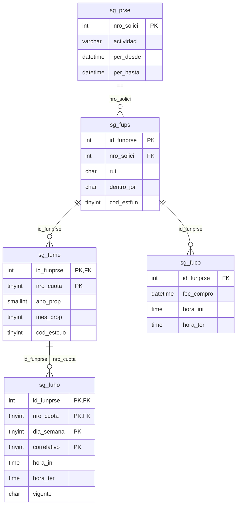

# Diagrama: horario mensual de prestación de servicios

## Relación con el modelo PDS



## Lectura del modelo

```text
Solicitud PDS
    │
    └── Funcionario PDS
          │
          ├── Mes/cuota de ejecución
          │     └── Horarios planificados del mes
          │           ├── Martes 09:00 - 13:00
          │           ├── Martes 14:00 - 17:00
          │           ├── Jueves 09:00 - 13:00
          │           └── Jueves 17:00 - 19:00
          │
          └── Compensaciones por fecha real
```

## Regla principal

`sg_fuho` debe depender de `sg_fume`, porque el horario puede variar entre meses. No se agregan columnas repetidas en `sg_fume`; cada tramo horario se almacena como una fila independiente.

## Ejemplo de claves

```text
sg_fume
id_funprse = 125
nro_cuota  = 1
mes_prop   = 8
ano_prop   = 2026

sg_fuho
id_funprse = 125
nro_cuota  = 1
dia_semana = 2
correlativo = 1
hora_ini = 09:00
hora_ter = 13:00
```

Un segundo tramo del martes usa el mismo funcionario, cuota y día, pero un `correlativo` distinto.

