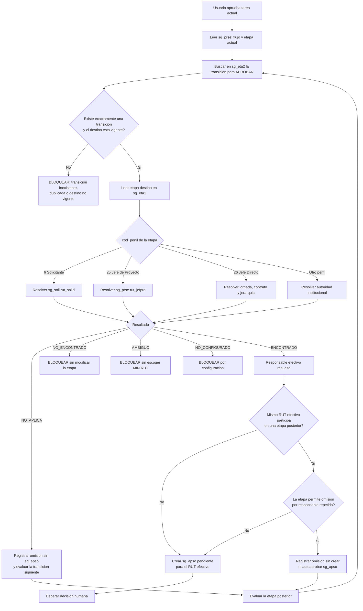
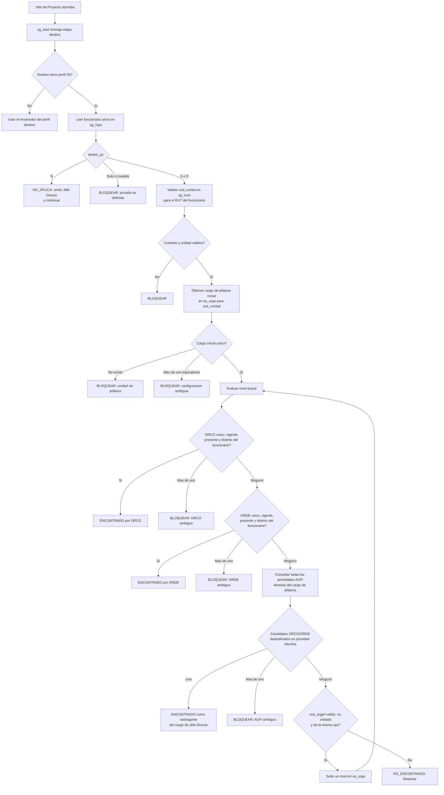
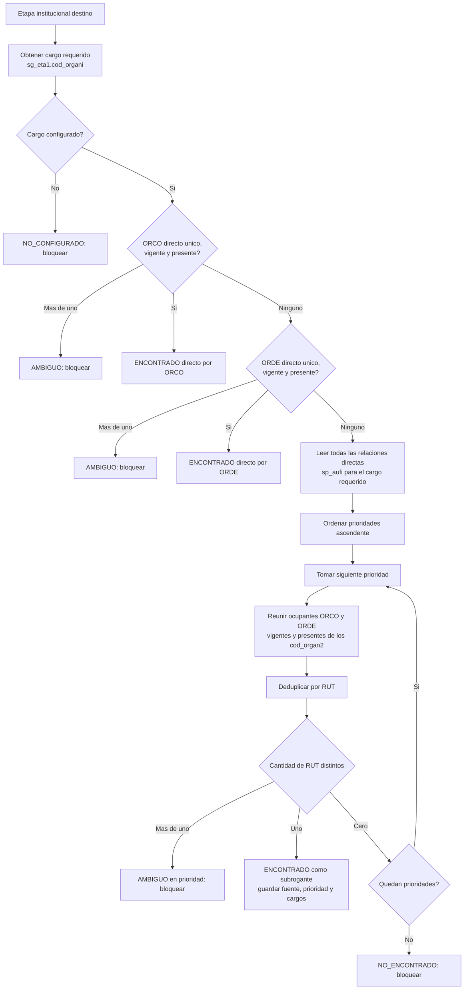
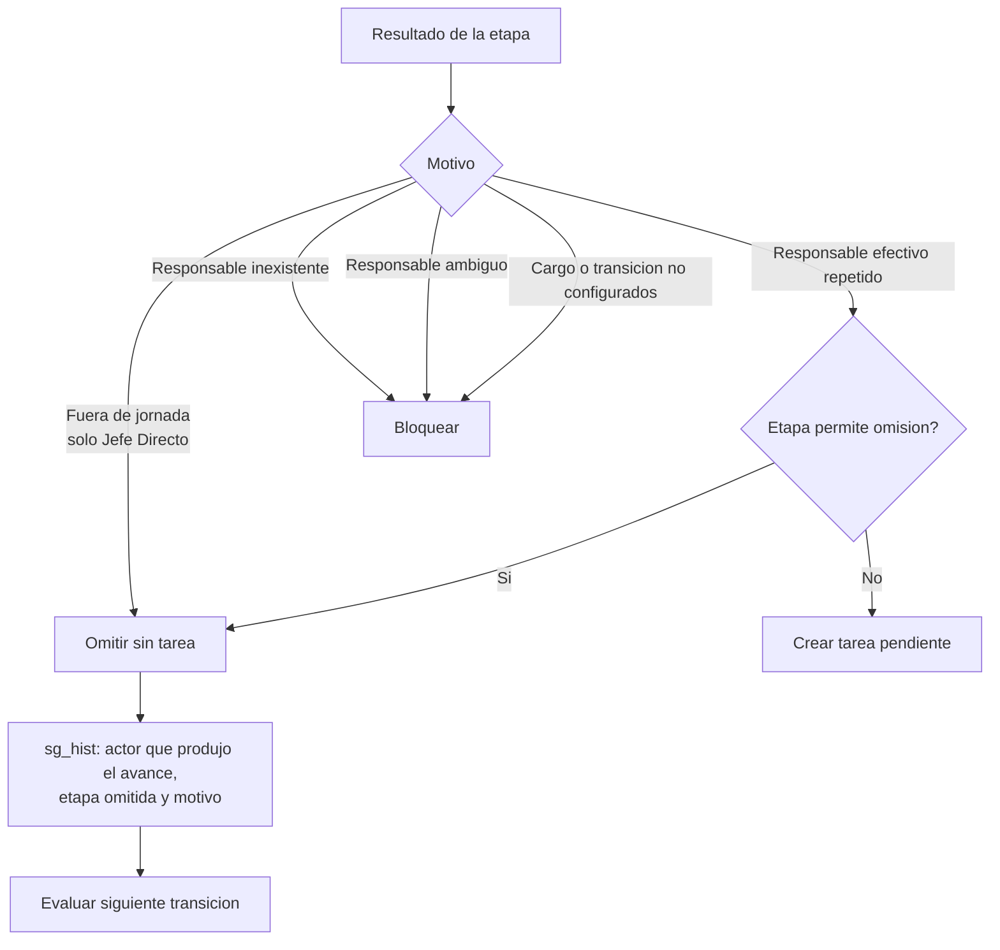

# Flujo de decision de responsables y omision de etapas DU288

## 1. Objetivo

Este documento define como se determina la siguiente etapa, quien recibe su
tarea y cuando una etapa puede omitirse. La resolucion de subrogancia ocurre al
calcular el destinatario de una tarea; no concede representacion al iniciar
sesion ni permite crear solicitudes por otra persona.

## 2. Fuentes y responsabilidades

| Fuente | Decision |
|---|---|
| `sg_prse.cod_flusol`, `sg_prse.cod_etapa` | Flujo y etapa actual de la solicitud. |
| `sg_eta2` | Transicion por flujo, etapa actual y accion. |
| `sg_eta1` | Nombre, perfil, cargo institucional y politica de la etapa destino. |
| `sg_soli.rut_solici` | Solicitante. |
| `sg_prse.rut_jefpro` | Jefe de Proyecto. |
| `sg_fups` | Funcionario, contrato y condicion de jornada. |
| `sp_cont` | Unidad contractual del funcionario. |
| `es_orga` | Cargo de jefatura, `cod_orgjef`, cargo institucional y unidad. |
| `sp_orco` | Ocupante por contrato. |
| `sp_orde` | Ocupante por designacion. |
| `sp_aufi` | Cargos autorizados para subrogar un cargo institucional. |
| `sg_apso` | Tarea creada para el responsable efectivo. |
| `sg_hist` | Accion humana u omision efectuada por el motor. |

## 3. Motor general de avance



### Reglas del motor

1. La transicion se obtiene desde `sg_eta2`; nunca se infiere por el numero de
   etapa.
2. `NO_APLICA` es distinto de `NO_ENCONTRADO`. Solo `NO_APLICA` permite avanzar
   automaticamente.
3. Una etapa repetida se compara por el RUT efectivo despues de resolver ORCO,
   ORDE o AUFI.
4. Omitir no equivale a aprobar: no se crea una tarea aprobada ni se atribuye
   una decision al responsable omitido.
5. Si existen tareas paralelas en la etapa, el flujo espera hasta que no quede
   ninguna pendiente.
6. Rechazar o devolver sigue su propia transicion `sg_eta2`, cierra las tareas
   pendientes de la etapa y no ejecuta la busqueda de aprobadores posteriores.

## 4. Matriz por tipo de etapa

| Tipo de etapa | Fuente primaria | Alternativas | Puede usar `cod_orgjef` | AUFI | Resultado sin responsable |
|---|---|---|---:|---:|---|
| Solicitante, perfil 6 | `sg_soli.rut_solici` | Ninguna | No | No | Bloquear. |
| Jefe de Proyecto, perfil 25 | `sg_prse.rut_jefpro` | Ninguna | No | No | Bloquear. |
| Jefe Directo, perfil 26 | `sg_fups` + `sp_cont` + `es_orga` | ORCO, ORDE, AUFI y cargo superior de la misma raiz | Si | Si | Bloquear, salvo `NO_APLICA` por fuera de jornada. |
| Autoridad institucional | `sg_eta1.cod_organi` | ORCO, ORDE y todas las prioridades AUFI directas | No | Si | Bloquear. |
| Decretacion, perfil 12 | Cargo configurado en `sg_eta1` | Resolver institucional | No | Si | Bloquear. |
| Secretario General, perfil 14 | Cargo configurado en `sg_eta1` | Resolver institucional | No | Si | Bloquear. |
| VRAF, perfil 23 | Cargo configurado en `sg_eta1` | Resolver institucional | No | Si | Bloquear. |
| Legalidad, Contraloria, Rector o Archivo | Cargo configurado en `sg_eta1` | Resolver institucional | No | Si | Bloquear. |

## 5. Paso de Jefe de Proyecto a Jefe Directo

La aprobacion del Jefe de Proyecto no determina por si misma a la jefatura. La
transicion `sg_eta2` conduce a la etapa con perfil 26 y se resuelve al unico
funcionario de la solicitud.



### Condiciones exactas para subir a un cargo superior

Se utiliza `es_orga.cod_orgjef` solamente cuando:

1. la etapa Jefe Directo aplica (`dentro_jor IN ('S', 'D')`);
2. existe un cargo inicial de jefatura asociado a la unidad contractual;
3. ORCO, ORDE y todas las prioridades AUFI directas del nivel actual tienen cero
   candidatos disponibles;
4. no existe ambiguedad en el nivel actual;
5. el superior no es el mismo cargo y no fue visitado;
6. el superior conserva el prefijo institucional de la unidad contractual.

No se sube por responsable repetido, ausencia de una autoridad institucional,
ambiguedad ni prestacion fuera de jornada.

### Jefe Directo resuelto como subrogante

AUFI no decide cual es la jefatura del funcionario. `sp_cont` y `es_orga`
determinan primero el cargo de Jefe Directo requerido. AUFI solo determina quien
puede ejercer efectivamente ese cargo cuando sus ocupantes directos no estan
disponibles.

El resultado debe conservar simultaneamente:

- cargo requerido de Jefe Directo;
- titular ausente, cuando sea identificable;
- RUT y cargo real del subrogante;
- fuente AUFI y prioridad utilizada.

Despues de resolver esos datos, el motor compara el RUT efectivo con las etapas
posteriores. Si coincide y Jefe Directo permite omision, registra por ejemplo:

`Se omitio Jefe Directo. <persona> era el responsable efectivo como subrogante de <cargo> y revisara posteriormente en <etapa>.`

No se crea ni se autoaprueba una tarea para la etapa omitida.

## 6. Resolucion de una autoridad institucional y subrogancia

Este resolvedor se utiliza para Decanatura, Direcciones, Vicerrectorias,
Decretacion, Secretario General, Rector, Legalidad, Contraloria y Archivo cuando
la etapa los identifica mediante `sg_eta1.cod_organi`.



### Reglas AUFI

1. `sp_aufi.cod_organi` siempre es el cargo requerido por la etapa.
2. `sp_aufi.cod_organ2` es el cargo real autorizado para subrogar.
3. Se recorren todas las prioridades directas, aunque existan 12 o mas.
4. No se consulta el AUFI del cargo candidato.
5. No se utiliza `es_orga.cod_orgjef`.
6. El campo `ausente` vacio se interpreta como `N`.
7. ORDE del mismo cargo es una designacion directa; solo una seleccion obtenida
   mediante AUFI se etiqueta automaticamente como subrogancia.

## 7. Decision de omision



### Politica actual que debe revisarse antes de implementar

El PA actual marca como no omitibles los perfiles `6`, `25`, `12`, `13`, `14`,
`16`, `17`, `18` y `23`; para los demas permite omision por repeticion. Esta
lista esta codificada en el PA y no en `sg_eta1`. Debe validarse expresamente,
en especial para Finanzas, Decanatura, Rector y otros perfiles formales que no
aparecen en la lista.

La omision por fuera de jornada es independiente de esa lista y solo aplica a
Jefe Directo.

## 8. Datos que debe devolver cada resolucion

| Campo | Uso |
|---|---|
| `estado_resolucion` | `ENCONTRADO`, `NO_APLICA`, `NO_ENCONTRADO`, `AMBIGUO` o `NO_CONFIGURADO`. |
| `rut_responsable` | Destinatario efectivo de `sg_apso`. |
| `fuente_resolucion` | Solicitante, Jefe de Proyecto, ORCO, ORDE, AUFI_ORCO o AUFI_ORDE. |
| `cod_organi_requerido` | Cargo exigido por la etapa. |
| `cod_organi_actor` | Cargo real del responsable efectivo. |
| `es_subrogante` | `S` solamente cuando la seleccion proviene de AUFI. |
| `prioridad_aufi` | Prioridad usada; nula para asignaciones directas. |
| `rut_titular` y `nombre_titular` | Titular ausente cuando sea identificable. |
| `permite_omision` | Politica de repeticion de la etapa. |
| `mensaje` | Motivo concreto de bloqueo u omision. |

## 9. Consultas de verificacion del ambiente

### Etapas y transiciones de aprobacion

```sql
SELECT
    eta.cod_flusol,
    flujo.des_flusol,
    eta.cod_etapa,
    eta.des_etapa,
    eta.cod_perfil,
    eta.cod_organi,
    eta.est_final,
    trans.cod_etapa2 AS etapa_destino_aprobar,
    destino.des_etapa AS nombre_destino_aprobar,
    trans.cod_estsol
FROM secgen_db.dbo.sg_eta1 eta
LEFT JOIN secgen_db.dbo.sg_tfls flujo
    ON flujo.cod_flusol = eta.cod_flusol
LEFT JOIN secgen_db.dbo.sg_eta2 trans
    ON trans.cod_flusol = eta.cod_flusol
   AND trans.cod_etapa1 = eta.cod_etapa
   AND trans.id_tipacc = 2
LEFT JOIN secgen_db.dbo.sg_eta1 destino
    ON destino.cod_flusol = trans.cod_flusol
   AND destino.cod_etapa = trans.cod_etapa2
WHERE ISNULL(eta.vigente, 'S') = 'S'
ORDER BY eta.cod_flusol, eta.cod_etapa
```

### Diagnostico de una solicitud

```sql
EXECUTE secgen_db.Analisis2.sg_eta1sSecgen02
    @nro_solici = 278

EXECUTE secgen_db.Analisis2.sg_eta2sSecgen01
    @nro_solici = 278,
    @id_tipacc = 2

/* Reemplazar 30 por la etapa destino informada por la consulta anterior. */
EXECUTE secgen_db.Analisis2.sg_etasSecgen01
    @nro_solici = 278,
    @cod_etapa = 30,
    @cod_flusol = NULL
```

### Diagnostico de Jefe Directo

```sql
EXECUTE secgen_db.Analisis2.sg_fupssSecgen16
    @rut_person = '125349641',
    @cod_contra = 100078
```

Estas consultas son de solo lectura. Sus resultados deben conservarse como
evidencia antes de desplegar los cambios.
