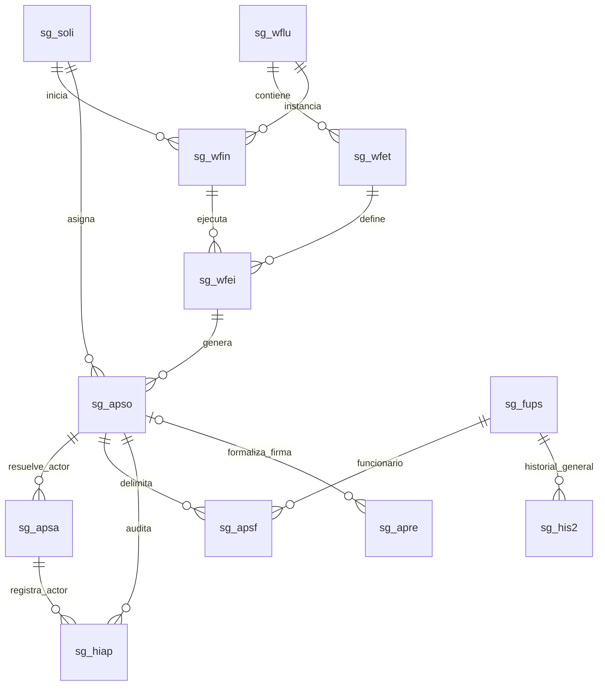

# Modelo de roles contextuales y workflow PDS DU288

## 1. Objetivo

Este documento contiene solamente el delta de base de datos necesario para implementar roles contextuales, asignaciones dinámicas y ramas de workflow en PDS DU288.

La referencia del esquema vigente es `diagrama_secgen_actualizado.md`. Ese archivo se conserva como fotografía de las tablas actualmente disponibles y no se reemplaza con este documento.

La solución separa cuatro conceptos:

| Concepto | Fuente |
|---|---|
| Identidad de la persona conectada | RUT autenticado/JWT |
| Perfil global y permisos generales | `sg_perf`, `sg_uspe` y esquema de permisos institucional |
| Rol que la persona ejerce en una solicitud | Etapa y tarea de workflow |
| Persona concreta que debe actuar | `sg_apso.rut_usua` y contexto de `sg_apsa` |

Una persona puede ser solicitante en una solicitud, Jefe de Proyecto en otra y autoridad subrogante en una tercera. Por eso no se asignará un único rol global durante el inicio de sesión.

## 2. Alcance de tablas

### 2.1 Tablas existentes a modificar

| Tabla | Tipo de cambio | Objetivo |
|---|---|---|
| `sg_apso` | Estructural | Convertir la asignación actual en una tarea vinculada a una etapa concreta. |
| `sg_apre` | Estructural y compatible | Vincular una firma de resolución con la tarea de workflow que la originó. |
| `sg_eapr` | Datos de catálogo | Incorporar estados operacionales faltantes para cancelación, reasignación y aprobación automática, sin reutilizar códigos existentes. |
| `sg_esol` | Datos de catálogo, si faltan | Representar solicitud devuelta a corrección y solicitud sin funcionarios habilitados. |

### 2.2 Tablas nuevas

| Tabla | Nombre lógico | Objetivo |
|---|---|---|
| `sg_wflu` | Workflow | Definir una rama y versión del flujo. |
| `sg_wfet` | Etapa de workflow | Definir la secuencia, resolutor y políticas de cada etapa. |
| `sg_wfin` | Instancia de workflow | Congelar el flujo aplicado a una solicitud. |
| `sg_wfei` | Instancia de etapa | Registrar cada ejecución de una etapa, incluidos reintentos por corrección. |
| `sg_apsa` | Actor de aprobación | Guardar la fotografía del titular, subrogante, delegado o asignación manual. |
| `sg_apsf` | Funcionarios de la tarea | Relacionar una tarea con los funcionarios que ese actor debe resolver. |
| `sg_hiap` | Historial de aprobación | Auditar asignaciones, decisiones, devoluciones, cancelaciones y autoaprobaciones. |

### 2.3 Tablas existentes reutilizadas sin cambio estructural

| Tabla | Uso en la solución |
|---|---|
| `sg_soli` | `rut_solici` identifica al solicitante y `cod_estsol` mantiene el estado general. |
| `sg_prse` | `rut_jefpro` resuelve al Jefe de Proyecto de la solicitud. |
| `sg_fups` | `id_funprse` identifica cada funcionario y `cod_estfun` mantiene su estado general. |
| `sg_his2` | Conserva el historial general de cambios de estado del funcionario. |
| `sg_efun` | Catálogo de estados del funcionario: pendiente, observado, aprobado, rechazado y excluido. |
| `sg_perf` | Mantiene perfiles institucionales; no determina por sí solo quién actúa en una solicitud. |
| `sg_uspe` | Mantiene perfiles globales por RUT; no se poblará con todos los solicitantes ni con roles temporales. |

## 3. Diagrama entidad-relación objetivo



## 4. Tablas existentes modificadas

### 4.1 `sg_apso`: tarea contextual de aprobación

#### Campos existentes conservados

| Campo | Tipo actual | Uso objetivo |
|---|---|---|
| `nro_aproba` | `int` | Identificador único de la tarea. Todas las acciones se ejecutarán por este campo. |
| `nro_solici` | `int` | Solicitud a la que pertenece la tarea. |
| `rut_usua` | `char(9)` | RUT del actor efectivo actualmente asignado. |
| `cod_estapr` | `tinyint` | Estado operacional de la tarea. |
| `comentario` | `text` | Comentario general de la decisión. |
| `f_aprobac` | `datetime` | Fecha de decisión. |
| `f_creacion` | `datetime` | Fecha de creación. |
| `f_ultmodif` | `datetime` | Fecha de última modificación. |

#### Campos nuevos

| Campo | Tipo propuesto | Nulo | Descripción |
|---|---|---:|---|
| `id_etains` | `int` | Sí para datos legacy | FK a `sg_wfei`. Identifica la ejecución exacta de la etapa. |
| `cod_alcdec` | `char(1)` | Sí para datos legacy | Alcance permitido: `S` solicitud completa, `F` funcionario, `A` ambos. |
| `ind_obliga` | `char(1)` | No | Indica si la tarea debe resolverse para cerrar la etapa. Valor inicial `S`. |

#### Llaves e índices nuevos

| Tipo | Campos |
|---|---|
| FK | `id_etains -> sg_wfei.id_etains` |
| Índice de bandeja | `(rut_usua, cod_estapr, f_creacion)` |
| Índice de cierre de etapa | `(id_etains, cod_estapr, ind_obliga)` |

#### Cambio respecto del modelo actual

Antes, `sg_apso` solo permitía saber que un RUT tenía una aprobación pendiente para una solicitud. Después permitirá saber en qué etapa, ejecución y alcance actúa.

Las actualizaciones dejarán de usar solamente `nro_solici + rut_usua`. El backend deberá validar y actualizar exactamente una tarea mediante:

```text
nro_aproba + RUT autenticado + estado pendiente
```

### 4.2 `sg_apre`: firma asociada al workflow

#### Campo nuevo

| Campo | Tipo propuesto | Nulo | Descripción |
|---|---|---:|---|
| `nro_aproba` | `int` | Sí | FK a la tarea `sg_apso` que produjo la firma de la resolución. |

#### Llave e índice

| Tipo | Campos |
|---|---|
| FK | `nro_aproba -> sg_apso.nro_aproba` |
| Índice | `(nro_aproba)` |

`rut_aprob` continúa siendo la persona que firma realmente. El cargo representado, la titularidad o subrogancia y la fuente de asignación se obtienen desde `sg_apsa`.

Las filas históricas de `sg_apre` permanecen válidas con `nro_aproba = NULL`.

### 4.3 `sg_eapr`: estados de tarea

No requiere cambio estructural. Se deben revisar los códigos existentes antes de insertar nuevos registros.

Estados adicionales requeridos conceptualmente:

| Clave lógica | Uso |
|---|---|
| `CANCELADA` | Tarea cerrada porque la solicitud volvió a corrección o cambió el actor. |
| `REASIGNADA` | Tarea reemplazada por una nueva asignación auditable. |
| `AUTO_APROBADA` | Etapa completada por política de mismo actor, manteniendo un evento separado. |

No se deben asumir números de estado hasta consultar los datos actuales de `sg_eapr`.

### 4.4 `sg_esol`: estados generales de solicitud

No requiere cambio estructural. Solo se agregan datos si los estados equivalentes no existen:

| Clave lógica | Uso |
|---|---|
| `EN_CORRECCION` | Solicitud devuelta al solicitante. |
| `SIN_FUNCIONARIOS_HABILITADOS` | Todas las personas fueron rechazadas o excluidas. |

## 5. Tablas nuevas

### 5.1 `sg_wflu`: definición y versión del workflow

| Campo | Tipo propuesto | Nulo | Descripción |
|---|---|---:|---|
| `id_workflow` | `int` | No | PK. |
| `cod_tipsol` | `tinyint` | No | FK a `sg_tsol`. Tipo de solicitud PDS. |
| `cod_modprs` | `tinyint` | Sí | FK a `sg_tmod`. Modalidad, por ejemplo DU288. |
| `cod_rama` | `varchar(20)` | No | `FACULTAD`, `INVESTIGACION`, `DITT`, `INSTITUTO` o `VICERRECTORIA`. |
| `version` | `smallint` | No | Versión de la rama. |
| `nom_workflow` | `varchar(100)` | No | Nombre descriptivo. |
| `f_desde` | `datetime` | No | Inicio de vigencia. |
| `f_hasta` | `datetime` | Sí | Fin de vigencia. |
| `vigente` | `char(1)` | No | `S` o `N`. |
| `f_creacion` | `datetime` | No | Auditoría. |

Restricción única propuesta:

```text
(cod_tipsol, cod_modprs, cod_rama, version)
```

### 5.2 `sg_wfet`: definición de etapa

| Campo | Tipo propuesto | Nulo | Descripción |
|---|---|---:|---|
| `id_etapa` | `int` | No | PK. |
| `id_workflow` | `int` | No | FK a `sg_wflu`. |
| `num_orden` | `smallint` | No | Orden dentro de la rama. Se recomienda usar 10, 20, 30. |
| `cla_etapa` | `varchar(40)` | No | Clave estable: `JEFE_PROYECTO`, `JEFE_DIRECTO`, `DGDP`, etc. |
| `nom_etapa` | `varchar(100)` | No | Etiqueta para interfaz y auditoría. |
| `tip_resolv` | `varchar(30)` | No | Estrategia utilizada para buscar al actor. |
| `cod_organi` | `int` | Sí | Cargo organizacional requerido cuando se resuelve por ORCO/ORDE/AUFI. |
| `id_perfil` | `tinyint` | Sí | Perfil global requerido cuando la estrategia sea `PERFIL_GLOBAL`. |
| `pol_aproba` | `varchar(20)` | No | `TODOS`, `UNO`, `POR_FUNCIONARIO`. |
| `pol_rechazo` | `varchar(30)` | No | `RECHAZA_FUNCIONARIO`, `RECHAZA_SOLICITUD`, `CONFIGURABLE`. |
| `pol_correc` | `varchar(30)` | No | `DEVUELVE_SOLICITUD`, `DEVUELVE_FUNCIONARIO`, `NO_PERMITE`. |
| `pol_misact` | `varchar(30)` | No | Política cuando la etapa actual y la siguiente tienen el mismo actor. |
| `ind_obliga` | `char(1)` | No | Define si la etapa es obligatoria. |
| `vigente` | `char(1)` | No | `S` o `N`. |

Valores de `tip_resolv`:

```text
SOLICITANTE
JEFE_PROYECTO
JEFATURA_POR_FUNCIONARIO
AUTORIDAD_POR_UNIDAD
AUTORIDAD_INSTITUCIONAL
FIRMANTE_VIGENTE
PERFIL_GLOBAL
MANUAL_AUTORIZADO
```

Valores de `pol_misact`:

```text
NUEVA_ACCION
UNA_CONFIRMACION
AUTO_APROBAR_SIGUIENTE
USAR_SUBROGANTE
PROHIBIDO
```

Restricción única propuesta:

```text
(id_workflow, num_orden)
```

### 5.3 `sg_wfin`: instancia congelada del workflow

| Campo | Tipo propuesto | Nulo | Descripción |
|---|---|---:|---|
| `id_wfinst` | `int` | No | PK. |
| `nro_solici` | `int` | No | FK a `sg_soli`. |
| `id_workflow` | `int` | No | FK a la versión seleccionada en `sg_wflu`. |
| `nro_revisi` | `smallint` | No | Revisión de la solicitud, inicia en 1. |
| `id_etaact` | `int` | Sí | FK a la definición de la etapa actual. |
| `cod_estwfi` | `varchar(20)` | No | `PENDIENTE`, `EN_CURSO`, `EN_CORRECCION`, `COMPLETADO`, `CANCELADO`. |
| `f_inicio` | `datetime` | No | Inicio del flujo. |
| `f_termino` | `datetime` | Sí | Cierre del flujo. |
| `f_ultmodif` | `datetime` | No | Auditoría. |

Restricción única propuesta:

```text
(nro_solici, nro_revisi)
```

La versión del flujo queda congelada al enviar la solicitud. Cambiar `sg_wflu` no altera solicitudes ya iniciadas.

### 5.4 `sg_wfei`: instancia de una etapa

| Campo | Tipo propuesto | Nulo | Descripción |
|---|---|---:|---|
| `id_etains` | `int` | No | PK. |
| `id_wfinst` | `int` | No | FK a `sg_wfin`. |
| `id_etapa` | `int` | No | FK a `sg_wfet`. |
| `nro_ciclo` | `smallint` | No | Número de ejecución de la etapa por correcciones o reaperturas. |
| `cod_esteta` | `varchar(20)` | No | `PENDIENTE`, `PARCIAL`, `COMPLETADA`, `DEVUELTA`, `CANCELADA`. |
| `f_inicio` | `datetime` | No | Inicio de la etapa. |
| `f_termino` | `datetime` | Sí | Cierre de la etapa. |
| `f_ultmodif` | `datetime` | No | Auditoría. |

Restricción única propuesta:

```text
(id_wfinst, id_etapa, nro_ciclo)
```

La etapa permanece `PARCIAL` cuando algunos jefes directos ya decidieron y otros continúan pendientes.

### 5.5 `sg_apsa`: fotografía y reasignaciones del actor

| Campo | Tipo propuesto | Nulo | Descripción |
|---|---|---:|---|
| `id_apsact` | `int` | No | PK. |
| `nro_aproba` | `int` | No | FK a `sg_apso`. |
| `rut_actor` | `char(9)` | No | Persona concreta asignada. Debe coincidir con `sg_apso.rut_usua` cuando la fila está vigente. |
| `rut_titula` | `char(9)` | Sí | Titular del cargo que está siendo subrogado o delegado. |
| `tip_asigna` | `varchar(20)` | No | `TITULAR`, `SUBROGANTE`, `DELEGADO`, `PERFIL`, `MANUAL`. |
| `cod_organi` | `int` | Sí | Cargo que debe actuar o firmar. |
| `cod_organ2` | `int` | Sí | Cargo real de la persona que actúa. |
| `id_perfil` | `tinyint` | Sí | Perfil utilizado si la fuente es perfil global. |
| `prioridad` | `tinyint` | Sí | Prioridad entregada por el resolver institucional. |
| `fuente` | `varchar(30)` | No | `ORCO`, `ORDE`, `AUFI`, `PERFIL`, `JEFATURA`, `MANUAL`. |
| `doc_respal` | `varchar(255)` | Sí | Referencia a resolución o acto de subrogancia, si está disponible. |
| `f_resoluci` | `datetime` | No | Momento en que el sistema resolvió la asignación. |
| `f_desde` | `datetime` | No | Inicio de uso de esta asignación en la tarea. |
| `f_hasta` | `datetime` | Sí | Cierre por decisión o reasignación. |
| `vigente` | `char(1)` | No | Solo una asignación vigente por tarea. |
| `motivo` | `varchar(255)` | Sí | Motivo de reasignación manual o automática. |

Índices propuestos:

```text
(nro_aproba, vigente)
(rut_actor, vigente)
```

Esta tabla no reemplaza ORCO, ORDE, ORGA ni AUFI. Conserva la fotografía utilizada por la solicitud para mantener trazabilidad aunque la autoridad cambie después.

### 5.6 `sg_apsf`: funcionarios asignados a una tarea

| Campo | Tipo propuesto | Nulo | Descripción |
|---|---|---:|---|
| `nro_aproba` | `int` | No | FK a `sg_apso`. Parte de la PK. |
| `id_funprse` | `int` | No | FK a `sg_fups`. Parte de la PK. |
| `cod_estapr` | `tinyint` | No | Estado de la evaluación de este funcionario en esta tarea. |
| `comentario` | `text` | Sí | Observación o fundamento individual. |
| `rut_decide` | `char(9)` | Sí | RUT que ejecutó la decisión. |
| `f_decision` | `datetime` | Sí | Fecha de decisión individual. |

PK propuesta:

```text
(nro_aproba, id_funprse)
```

Ejemplo: si una solicitud tiene cuatro funcionarios con tres jefaturas distintas, se crean tres filas en `sg_apso` y cuatro relaciones en `sg_apsf`.

Un funcionario rechazado queda registrado, no se elimina. Los funcionarios aprobados continúan cuando todas las tareas obligatorias de la etapa están resueltas.

### 5.7 `sg_hiap`: historial inmutable de tareas

| Campo | Tipo propuesto | Nulo | Descripción |
|---|---|---:|---|
| `id_hisapro` | `int` | No | PK. |
| `nro_aproba` | `int` | No | FK a `sg_apso`. |
| `id_apsact` | `int` | Sí | FK al actor que originó el evento. |
| `id_funprse` | `int` | Sí | FK al funcionario cuando el alcance sea individual. |
| `rut_actor` | `char(9)` | No | RUT que ejecutó o provocó el evento. |
| `tip_accion` | `varchar(30)` | No | Tipo de evento. |
| `cod_estant` | `tinyint` | Sí | Estado de aprobación anterior. |
| `cod_estnue` | `tinyint` | Sí | Estado de aprobación nuevo. |
| `cod_alcdec` | `char(1)` | No | `S` solicitud o `F` funcionario. |
| `comentario` | `text` | Sí | Fundamento. |
| `f_evento` | `datetime` | No | Fecha del evento. |

Valores principales de `tip_accion`:

```text
ASIGNACION
REASIGNACION
APROBACION
RECHAZO_FUNCIONARIO
RECHAZO_SOLICITUD
DEVOLUCION_FUNCIONARIO
DEVOLUCION_SOLICITUD
CANCELACION
AUTO_APROBACION
```

`sg_hiap` audita la tarea. `sg_his2` continúa auditando el cambio de estado general del funcionario. No cumplen la misma función.

## 6. Resolución de los roles

| Etapa o actor | Fuente primaria | Persistencia |
|---|---|---|
| Solicitante | `sg_soli.rut_solici` | Autoría de solicitud; no requiere fila permanente en `sg_uspe`. |
| Jefe de Proyecto | `sg_prse.rut_jefpro` | `sg_apso.rut_usua` y `sg_apsa`. |
| Jefe Directo | PA de jefatura por cada `sg_fups.rut` | Una tarea por RUT de jefe y alcance en `sg_apsf`. |
| Autoridad de unidad/facultad | Resolver por dependencia y cargo | `sg_apso.rut_usua` y fotografía en `sg_apsa`. |
| DGDP/Finanzas/Decretación | Perfil o autoridad institucional vigente | `sg_apso` y `sg_apsa`. |
| Secretario/Vicerrector/Director/Contralor | ORCO/ORDE + ORGA + AUFI | `sg_apso`, `sg_apsa` y, cuando firma, `sg_apre`. |
| Asignación excepcional | Usuario autorizado con fundamento | `sg_apsa.tip_asigna = MANUAL` y evento en `sg_hiap`. |

El PA `es_orgasSecgen01` actual se mantiene para resoluciones porque filtra cargos específicos y retorna una lista ordenada. Para el workflow se propone un PA parametrizado nuevo, por ejemplo `Analisis2.es_orgasSecgen02`, que reciba el cargo requerido y devuelva el actor seleccionado junto con titularidad, cargo real, prioridad y fuente.

## 7. Comportamiento de decisiones

### 7.1 Rechazo individual

1. Se actualiza `sg_apsf.cod_estapr` para el funcionario.
2. Se actualiza `sg_fups.cod_estfun` con el estado general correspondiente.
3. Se registra el cambio general en `sg_his2`.
4. Se registra la decisión de tarea en `sg_hiap`.
5. Los demás funcionarios continúan cuando se cierre la etapa.

### 7.2 Devolución global a corrección

1. `sg_wfin.cod_estwfi` cambia a `EN_CORRECCION`.
2. `sg_soli.cod_estsol` cambia al estado de corrección correspondiente.
3. Las tareas pendientes de `sg_apso` se cancelan, no se eliminan.
4. Se cierran sus asignaciones vigentes en `sg_apsa`.
5. El solicitante corrige y se incrementa `sg_wfin.nro_revisi` mediante una nueva instancia/revisión.
6. Se crean nuevas instancias de etapa y tareas; el historial anterior permanece intacto.

### 7.3 Múltiples jefes directos

La etapa queda:

| Estado | Condición |
|---|---|
| `PENDIENTE` | Ninguna tarea obligatoria ha sido resuelta. |
| `PARCIAL` | Algunas tareas terminaron y otras siguen pendientes. |
| `COMPLETADA` | Todas las tareas obligatorias terminaron y queda al menos un funcionario aprobado. |
| `DEVUELTA` | Se solicitó una corrección global. |
| `SIN_FUNCIONARIOS` | Todos los funcionarios fueron rechazados o excluidos. |

### 7.4 Mismo actor en etapas consecutivas

Aunque la política permita un solo clic, se crean dos instancias de etapa y dos eventos de aprobación. La segunda se registra como `AUTO_APROBADA` o `UNA_CONFIRMACION`, según `sg_wfet.pol_misact`.

## 8. Comparación antes y después

| Aspecto | Antes | Después |
|---|---|---|
| Identificación del rol | Perfil global o `roleName` enviado desde frontend | Etapa y tarea obtenidas desde BDD por `nro_aproba`. |
| Solicitante | Requería interpretar un perfil | Se identifica por `sg_soli.rut_solici`. |
| Jefe de Proyecto | Parcialmente dinámico | Se resuelve desde `sg_prse.rut_jefpro` al activar la etapa. |
| Jefes directos | Un rol/perfil general | Varias tareas paralelas agrupadas por RUT y funcionarios. |
| Rechazo | Principalmente a nivel solicitud | Puede afectar solicitud o funcionario según la etapa. |
| Subrogancia | Se consulta para firmantes | Se resuelve al activar la etapa y se guarda una fotografía auditable. |
| Cambio de autoridad | Podía alterar el resultado de nuevas consultas | Las tareas existentes conservan su actor; una reasignación genera historial. |
| Secuencia | Constante fija en backend | Definición por rama y versión en `sg_wflu`/`sg_wfet`. |
| Bandeja | Filtrada por rol solicitado desde frontend | Filtrada por `sg_apso.rut_usua = RUT JWT`. |
| Aprobación | Por solicitud, RUT y rol | Por `nro_aproba`, RUT JWT y estado pendiente. |
| Solicitudes históricas | Sin versión de flujo | Conservan la versión y ciclos de cada etapa. |

## 9. Orden de implementación recomendado

1. Crear `sg_wflu`, `sg_wfet`, `sg_wfin` y `sg_wfei`.
2. Agregar `id_etains`, `cod_alcdec` e `ind_obliga` a `sg_apso` como columnas compatibles con datos legacy.
3. Crear `sg_apsa`, `sg_apsf` y `sg_hiap`.
4. Agregar `nro_aproba` nullable a `sg_apre`.
5. Revisar y completar catálogos `sg_eapr` y `sg_esol` sin reutilizar códigos.
6. Implementar el PA parametrizado de autoridades y subrogantes.
7. Cambiar las operaciones de aprobación para usar `nro_aproba` y el RUT del JWT.
8. Crear la bandeja `my-tasks` basada exclusivamente en el actor asignado.
9. Migrar solicitudes nuevas al flujo versionado y mantener compatibilidad de lectura para solicitudes legacy.

## 10. Decisiones pendientes antes del DDL definitivo

1. Confirmar los códigos actuales de `sg_eapr`, `sg_esol` y `sg_efun` para no duplicar significados.
2. Confirmar los `cod_organi` de DGDP, Finanzas, Decretación, Secretario General, Vicerrectorías, DITT, Instituto, Legalidad, Contralor y Archivo.
3. Confirmar si VRAF, VRAC y VIPRE comparten exactamente la misma secuencia o requieren ramas separadas.
4. Confirmar en qué etapas se permite rechazo individual y en cuáles solamente devolución global.
5. Confirmar qué etapas permiten `UNA_CONFIRMACION` cuando el actor coincide con la siguiente etapa.
6. Confirmar si una tarea pendiente conserva al actor original o debe reasignarse automáticamente cuando cambia una subrogancia.
