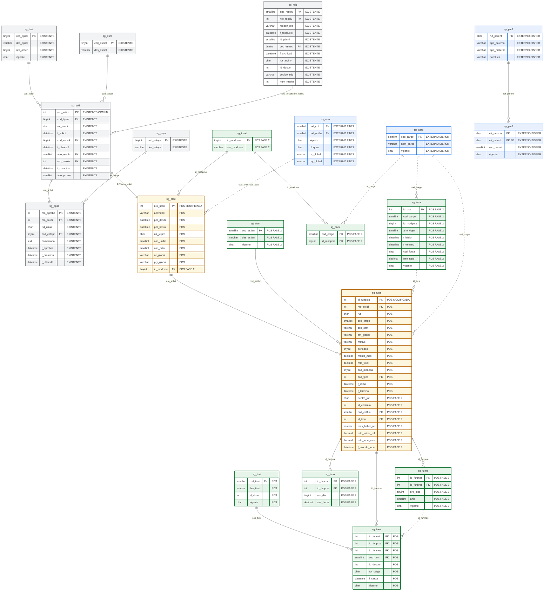

# Plan de Cambios BDD - Solicitud PDS Fase 2

Este documento contiene solo el alcance de base de datos para la **solicitud PDS**: diagrama vigente, cambios estructurales y descripcion de tablas. No incluye perfilamiento, roles ni etapa de pagos.

El modelo se alinea con `bdd_maestros.md`, tomando solo las tablas que corresponden al flujo de solicitud PDS.

---

## 2. Modificaciones Estructurales

### 2.1 Diagrama vigente del flujo de solicitud PDS

> [!IMPORTANT]
> Este diagrama no incluye la etapa de pagos ni las tablas `sg_paso`, `sg_fucu` o `sg_pade`.

---

## 3. Cambios y Descripcion de Tablas

### 3.1 `sg_prse` - Prestacion de servicios

**Accion:** modificar tabla existente.

**Objetivo:** representar la cabecera especifica de una PDS, usando `sg_soli` como cabecera comun.

| Campo | Tipo sugerido | Cambio | Uso |
| :--- | :--- | :--- | :--- |
| `id_modprse` | `tinyint null` | Agregar | Modalidad de prestacion para separar DU288-D09/2026 del flujo legacy. |

Reglas:

1. `sg_prse.nro_solici` sigue siendo PK/FK hacia `sg_soli`.
2. `sg_prse` no debe guardar datos de pago.
3. La PDS queda habilitada para pagos solo despues de formalizarse.

### 3.2 `sg_fups` - Funcionario asociado a PDS

**Accion:** modificar tabla existente.

**Objetivo:** mantener los funcionarios asociados a la PDS y agregar datos requeridos para Fase 2, incluyendo la captura minima del tope aplicado al momento de registrar el funcionario.

| Campo | Tipo sugerido | Cambio | Uso |
| :--- | :--- | :--- | :--- |
| `dentro_jor` | `char(1) null` | Agregar | Indica si la prestacion se ejecuta dentro de jornada. |
| `id_contrato` | `int null` | Agregar | Contrato SISPER asociado a la prestacion. |
| `cod_estfun` | `smallint null` | Agregar FK | Codigo de estado del funcionario dentro de la solicitud PDS. La descripcion se obtiene desde `sg_efun`. |
| `id_trca` | `int null` | Agregar FK | Registro de regla/tope aplicado desde `sg_trca`, cuando exista regla parametrizada. |
| `mes_haber_ref` | `varchar(10) null` | Agregar | Mes de haberes usado como referencia para calcular el tope cuando aplica remuneracion efectiva. |
| `mto_haber_ref` | `decimal(12,0) null` | Agregar | Total de haberes/remuneracion efectiva usado como base de calculo del tope. |
| `mto_tope_mes` | `decimal(12,0) null` | Agregar | Tope mensual final aplicado al funcionario al momento de registrar la solicitud. |
| `f_calculo_tope` | `datetime null` | Agregar | Fecha en que se calculo y congelo el tope mensual aplicado. |

Campos existentes que se reutilizan:

| Campo | Uso |
| :--- | :--- |
| `monto_mes` | Monto mensual aprobado PDS. |
| `mto_total` | Monto total aprobado PDS. |
| `cod_sitm` | Item/subitem presupuestario asociado. |
| `itm_global` | Item global presupuestario. |
| `cod_cargo` | Cargo para validaciones de tope e inhabilidad. |
| `cod_tpps` | Tipo/periodicidad existente del modelo actual. |

Reglas:

1. El estado del funcionario se controla con `cod_estfun`, no con un indicador `S/N`.
2. `cod_estfun` debe apuntar a la tabla maestra `sg_efun`; no se guarda la descripcion del estado directamente en `sg_fups`.
3. Si el funcionario queda en estado rechazado, excluido o no incorporable, no debe generar meses en `sg_fume`.
4. Solo funcionarios en estado habilitado/aprobado deben continuar a formalizacion PDS.
5. El registro no se elimina; queda como trazabilidad de la solicitud.
6. `mto_tope_mes` congela el tope mensual usado al momento de registrar el funcionario, para evitar que cambios futuros en `sg_trca` alteren la validacion historica.
7. `mes_haber_ref` y `mto_haber_ref` solo se informan cuando el calculo requiere remuneracion efectiva; para topes fijos pueden quedar `NULL`.
8. Validaciones como SEA, compensacion requerida, cargo habilitado, asignacion bloqueante y deuda se recalculan dinamicamente desde contrato, `sg_fuco`, `sg_caex`, PA09 y PA10.
9. Los datos de parentesco se validan contra SISPER (`sp_par1` / `sp_par2`); no se copian como atributos nuevos en `sg_fups` en esta etapa.

### 3.3 `sg_fume` - Meses de ejecucion PDS

**Accion:** crear/confirmar tabla PDS.

**Objetivo:** normalizar los meses de ejecucion aprobados por funcionario.

| Campo | Tipo sugerido | Cambio | Uso |
| :--- | :--- | :--- | :--- |
| `id_funmes` | `int identity` | Crear PK | Identificador del mes aprobado. |
| `id_funprse` | `int` | Crear FK | Funcionario de la PDS. |
| `nro_mes` | `tinyint` | Crear | Numero del mes calendario de ejecucion. |
| `anio` | `smallint` | Crear | Anio del mes de ejecucion. |
| `vigente` | `char(1)` | Crear | Vigencia del periodo. |

Reglas:

1. Cada mes seleccionado para el funcionario genera un registro independiente en `sg_fume`.
2. `sg_fume` no guarda montos. El monto aprobado permanece en `sg_fups`.
3. `sg_fume` no guarda evidencias ni constancias; estas se registran en `sg_fuev`.
4. Si una evidencia o constancia corresponde a un mes especifico, `sg_fuev.id_funmes` apunta a `sg_fume.id_funmes`.
5. Si una evidencia aplica al funcionario completo, `sg_fuev.id_funmes` queda `NULL`.

### 3.4 `sg_fuco` - Compensacion horaria

**Accion:** crear tabla PDS.

**Objetivo:** registrar compensacion horaria para prestaciones ejecutadas dentro de jornada.

| Campo | Tipo sugerido | Cambio | Uso |
| :--- | :--- | :--- | :--- |
| `id_funcom` | `int identity` | Crear PK | Identificador de compensacion. |
| `id_funprse` | `int` | Crear FK | Funcionario de la PDS. |
| `nro_dia` | `tinyint` | Crear | Dia registrado. |
| `can_horas` | `decimal(4,2)` | Crear | Cantidad de horas compensadas. |

### 3.5 `sg_fuev` - Evidencia y constancia por funcionario

**Accion:** crear/normalizar tabla PDS para evidencias y constancias comprometidas por funcionario.

**Objetivo:** guardar evidencias y constancias tipificadas, siempre asociadas a un funcionario de la prestacion.

| Campo | Tipo sugerido | Cambio | Uso |
| :--- | :--- | :--- | :--- |
| `id_funevi` | `int identity` | Crear PK | Identificador de evidencia o constancia. |
| `id_funprse` | `int` | Crear FK | Funcionario de la prestacion. Obligatorio. |
| `id_funmes` | `int null` | Agregar FK | Mes de ejecucion asociado, si aplica. |
| `cod_tievi` | `smallint` | Agregar FK | Tipo de evidencia o constancia. |
| `id_docum` | `int null` | Crear | Documento en repositorio documental. |
| `rut_carga` | `char(9)` | Crear | Usuario que carga el documento. |
| `f_carga` | `datetime` | Crear | Fecha de carga. |
| `vigente` | `char(1)` | Agregar | Vigencia del respaldo. |

Reglas:

1. Toda evidencia debe estar asociada a `id_funprse`.
2. Si la evidencia corresponde a un mes especifico, debe informar `id_funmes`.
3. Si la evidencia aplica al funcionario completo, `id_funmes` queda `NULL`.
4. La evidencia nunca debe quedar solo a nivel de solicitud; siempre debe apuntar a `id_funprse`.
5. No se crea estado propio de evidencia en esta etapa.
6. La revision de la evidencia se controla por el estado de la solicitud o del funcionario, segun el punto del flujo PDS.

Campos descartados respecto a versiones previas:

| Campo | Motivo |
| :--- | :--- |
| `cod_estevi` | No se requiere estado documental independiente. |
| `des_evid` | El tipo se normaliza en `sg_tevi.des_tievi`. |
| `rut_funcio` | El funcionario se obtiene desde `sg_fuev.id_funprse -> sg_fups.rut`. |

### 3.6 `sg_tevi` - Tipo de evidencia

**Accion:** crear catalogo PDS.

**Objetivo:** clasificar evidencias y constancias.

| Campo | Tipo sugerido | Cambio | Uso |
| :--- | :--- | :--- | :--- |
| `cod_tievi` | `smallint` | Crear PK | Tipo de evidencia/constancia. |
| `des_tievi` | `varchar(100)` | Crear | Descripcion del tipo. |
| `id_docu` | `int null` | Crear | Documento, plantilla o requisito documental asociado al tipo, si aplica. |
| `vigente` | `char(1)` | Crear | Vigencia del tipo. |

Datos iniciales esperados:

| `cod_tievi` | `des_tievi` | Uso esperado |
| :--- | :--- | :--- |
| `1` | Acta firmada | Documento firmado que respalda aprobacion, compromiso o conformidad. |
| `2` | Informe con evidencias | Informe de ejecucion con evidencias del trabajo realizado. |
| `3` | Base de datos entregada | Archivo, planilla o base de datos comprometida como entregable. |
| `10` | Constancia por licencia medica | Constancia firmada cuando existe licencia medica en el periodo. |
| `11` | Constancia por permiso | Constancia por permiso sin goce u otra condicion similar. |
| `12` | Constancia por receso | Constancia de trabajo efectivo durante receso universitario. |
| `13` | Constancia por ausencia | Constancia por ausencia u otra situacion especial. |
| `14` | Constancia/autorizacion por parentesco | Documento que permite continuar el flujo cuando existe parentesco validado/autorizado. |

### 3.7 `sg_tmod` - Modalidad de prestacion

**Accion:** crear tabla maestra PDS.

**Objetivo:** parametrizar modalidades de prestacion.

| Campo | Tipo sugerido | Cambio | Uso |
| :--- | :--- | :--- | :--- |
| `id_modprse` | `tinyint` | Crear PK | Modalidad de prestacion. |
| `des_modprse` | `varchar(50)` | Crear | Descripcion de modalidad. |

Datos iniciales:

| id | Descripcion |
| :--- | :--- |
| `1` | Docentes Especiales |
| `2` | DU288-D09/2026 |

### 3.8 `sg_caex` - Cargos excluidos por modalidad

**Accion:** crear tabla de configuracion PDS.

**Objetivo:** parametrizar cargos no habilitados por modalidad de prestacion.

| Campo | Tipo sugerido | Cambio | Uso |
| :--- | :--- | :--- | :--- |
| `cod_cargo` | `smallint` | Crear PK | Cargo excluido. |
| `id_modprse` | `tinyint` | Crear PK | Modalidad a la que aplica la exclusion. |

### 3.9 `sg_trca` - Reglas de tope por cargo

**Accion:** crear tabla maestra PDS.

**Objetivo:** definir la regla de tope mensual aplicable a cada cargo SISPER por modalidad, anio y rango de vigencia. La tabla permite versionar reajustes dentro del mismo anio y distinguir topes fijos, topes calculados, cargos excluidos y reglas especiales.

La carga inicial debe construirse cruzando:

1. `sisper_db.dbo.sp_carg`: identifica `cod_cargo`, `nom_cargo`, `cod_tipcar`, `cod_jerpla` y vigencia del cargo.
2. Escala de Remuneraciones vigente para el anio: entrega la remuneracion base de jornada completa por planta/grado.
3. Reglas DU288-D09/2026: define si el tope es fijo, porcentaje de remuneracion efectiva, exclusion o regla especial.

| Campo | Tipo sugerido | Cambio | Uso |
| :--- | :--- | :--- | :--- |
| `id_trca` | `int identity` | Crear PK | Identificador unico de la regla/tope. |
| `cod_cargo` | `smallint` | Crear | Cargo SISPER al que aplica la regla. |
| `id_modprse` | `tinyint` | Crear | Modalidad de prestacion. Para DU288-D09/2026 usar `2`. |
| `ano_vigen` | `smallint` | Crear | Anio de referencia normativa o presupuestaria. |
| `f_inicio` | `datetime` | Crear | Fecha desde la cual aplica la regla/tope. |
| `f_termino` | `datetime null` | Crear | Fecha hasta la cual aplica la regla/tope. Si queda `NULL`, se considera vigencia abierta. |
| `cod_forcal` | `char(1)` | Crear | Forma de calculo: `F` fijo, `C` calculo por remuneracion efectiva, `E` excluido, `S` especial. |
| `mto_tope` | `decimal(12,0) null` | Crear | Monto tope mensual cuando la regla es fija. Para reglas calculadas, excluidas o especiales puede quedar `0` o `NULL`. |
| `vigente` | `char(1)` | Crear | Vigencia del registro. |

Valores esperados para `cod_forcal`:

| Codigo | Uso | Como se valida |
| :--- | :--- | :--- |
| `F` | Tope fijo configurado por planta/cargo. | Comparar monto mensual solicitado contra `mto_tope`. |
| `C` | Tope calculado con remuneracion efectiva. | Obtener remuneracion efectiva PA11 y aplicar la regla DU288 vigente. |
| `E` | Cargo excluido/no habilitado. | Bloquear o advertir segun regla de la modalidad. |
| `S` | Regla especial no resuelta solo con tabla. | Exigir PA/regla complementaria antes de aprobar. |

Reglas de carga inicial para DU288-D09/2026:

| Caso | Regla `sg_trca` | Campos clave |
| :--- | :--- | :--- |
| Academicos o cargos cuyo tope se calcula contra remuneracion efectiva | `cod_forcal = 'C'` | `mto_tope = 0` o `NULL`; el monto final se calcula con PA11 y se congela en `sg_fups.mto_tope_mes`. |
| Planta tecnica | `cod_forcal = 'F'` | `mto_tope = 621634` segun escala vigente para el rango `f_inicio`/`f_termino`. |
| Planta administrativa/profesional | `cod_forcal = 'F'` | `mto_tope = 553079` segun escala vigente para el rango `f_inicio`/`f_termino`. |
| Planta auxiliar | `cod_forcal = 'F'` | `mto_tope = 382519` segun escala vigente para el rango `f_inicio`/`f_termino`. |
| Honorarios (`cod_cargo = 0` o calidad honorarios) | `cod_forcal = 'E'` | No habilitado para DU288. |
| Rector, vicerrectores, contralor, decanos y otros cargos excluidos | `cod_forcal = 'E'` | Mantener ademas en `sg_caex` si se requiere bloqueo por modalidad. |
| Director instituto independiente u otra excepcion normativa | `cod_forcal = 'S'` | Requiere PA/regla complementaria anual. |

Notas de implementacion:

1. Debe existir una fila por `cod_cargo`, modalidad y rango de vigencia aplicable.
2. Un mismo cargo puede tener mas de una fila dentro del mismo anio si existe reajuste o cambio normativo durante el periodo.
3. Para topes fijos, `mto_tope` guarda el monto mensual aplicable.
4. Para topes calculados, `cod_forcal = 'C'` identifica que el monto se obtiene con PA11; el resultado final se guarda en `sg_fups.mto_tope_mes`.
5. La regla aplicable se busca por `cod_cargo`, `id_modprse`, fecha de solicitud/registro dentro de `f_inicio` y `f_termino`, y `vigente = 'S'`.
6. `sg_fups.id_trca` debe guardar el registro exacto de `sg_trca` usado para calcular/congelar el tope.
7. `sp_carg` debe seguir siendo la fuente del nombre/codigo del cargo; `sg_trca` solo parametriza la regla de tope aplicable.

### 3.10 `sg_efun` - Estado de funcionario PDS

**Accion:** crear tabla maestra PDS.

**Objetivo:** parametrizar en una tabla separada los estados individuales que puede tomar cada funcionario dentro de una solicitud PDS, permitiendo rechazo parcial sin afectar al resto de funcionarios.

| Campo | Tipo sugerido | Cambio | Uso |
| :--- | :--- | :--- | :--- |
| `cod_estfun` | `smallint` | Crear PK | Codigo de estado del funcionario en la PDS. |
| `des_estfun` | `varchar(100)` | Crear | Descripcion del estado. |
| `vigente` | `char(1)` | Crear | Vigencia del estado. |

Datos iniciales esperados:

| `cod_estfun` | `des_estfun` | Uso esperado |
| :--- | :--- | :--- |
| `1` | Pendiente de revision | Funcionario ingresado, pendiente de validacion. |
| `2` | Observado | Funcionario requiere correccion o antecedente adicional. |
| `3` | Aprobado | Funcionario cumple validaciones y puede continuar a formalizacion PDS. |
| `4` | Rechazado | Funcionario no puede continuar en esta PDS. |
| `5` | Excluido | Funcionario se retira de esta PDS sin eliminar el registro. |

Regla: si un funcionario queda `RECHAZADO` o `EXCLUIDO`, los demas funcionarios de la PDS pueden continuar su proceso.

---

## 4. Referencias Externas

| Tabla | Origen | Uso |
| :--- | :--- | :--- |
| `es_ccto` | FIN21 | Centro de costo, unidad financiera, vigencia, bloqueo, CC global y proyecto global. |
| `sp_carg` | SISPER | Cargo del funcionario, validacion de vigencia, cargos excluidos y topes. |
| `sp_par1` | SISPER | Persona relacionada para validacion de parentesco. |
| `sp_par2` | SISPER | Relacion de parentesco vigente entre funcionario y persona relacionada. |

---

## 5. Reglas Generales del Modelo PDS

1. `sg_soli` sigue siendo la cabecera comun de la solicitud.
2. `sg_prse` es la tabla hija especifica de PDS.
3. `sg_fups` mantiene los funcionarios de la PDS.
4. `sg_efun` controla el estado individual del funcionario dentro de la PDS.
5. `sg_fume` normaliza los meses por funcionario.
6. `sg_fuco` registra compensacion horaria cuando corresponde.
7. `sg_fuev` registra evidencias y constancias siempre por funcionario.
8. `sg_tevi` tipifica evidencias y constancias.
9. `sg_tmod`, `sg_caex` y `sg_trca` parametrizan reglas propias de Fase 2.
10. Las tablas externas se consultan como referencia logica y no se modifican.
11. El flujo de pagos queda fuera de este documento.
