# Plan de Cambios BDD - Solicitud PDS Fase 2

Este documento contiene solo el alcance de base de datos para la **solicitud PDS**: diagrama vigente, cambios estructurales y descripcion de tablas. No incluye perfilamiento, roles ni etapa de pagos.

El modelo se alinea con `bdd_maestros.md`, tomando solo las tablas que corresponden al flujo de solicitud PDS.

El alcance de solicitud llega hasta la generacion de cuotas habilitadas por mes (`sg_fucu`) al momento de formalizar/archivar la PDS con resolucion. La solicitud formal de pago y su detalle (`sg_paso`, `sg_pade`) quedan fuera de este documento.

---

## 2. Modificaciones Estructurales

### 2.1 Diagrama vigente del flujo de solicitud PDS

> [!IMPORTANT]
> Este diagrama no incluye la etapa de pagos ni las tablas `sg_paso` o `sg_pade`. Si incluye `sg_fucu` como cuota habilitada generada desde los meses aprobados al formalizar/archivar la PDS.

```mermaid
erDiagram
    %% =====================================================
    %% 1. Cabecera comun y trazabilidad existente
    %% =====================================================
    sg_tsol ||--o{ sg_soli : "cod_tipsol"
    sg_esol ||--o{ sg_soli : "cod_estsol"
    sg_rslc ||--o{ sg_soli : "ano_resolu/nro_resolu"
    sg_soli ||--o{ sg_apso : "nro_solici"
    sg_eapr ||--o{ sg_apso : "cod_estapr"

    %% =====================================================
    %% 2. Solicitud PDS: cabecera especifica
    %% =====================================================
    sg_soli ||--|| sg_prse : "PDS nro_solici"
    sg_tmod ||--o{ sg_prse : "id_modprse"

    %% =====================================================
    %% 3. Funcionarios, estado individual y periodos
    %% =====================================================
    sg_prse ||--o{ sg_fups : "nro_solici"
    sg_efun ||--o{ sg_fups : "cod_estfun"
    sg_fups ||--o{ sg_fume : "id_funprse"
    sg_fups ||--o{ sg_fuco : "id_funprse"
    sg_fume ||--o| sg_fucu : "id_funmes"
    sg_ecuo ||--o{ sg_fucu : "cod_estcuo"

    %% =====================================================
    %% 4. Maestros y reglas propias de PDS
    %% =====================================================
    sg_tmod ||--o{ sg_caex : "id_modprse"
    sg_trca ||..o{ sg_fups : "id_trca"

    %% =====================================================
    %% 5. Evidencias PDS por funcionario
    %% =====================================================
    sg_tevi ||--o{ sg_fuev : "cod_tievi"
    sg_fups ||--o{ sg_fuev : "id_funprse"
    sg_fume ||..o{ sg_fuev : "id_funmes"

    %% =====================================================
    %% 6. Referencias externas logicas
    %% =====================================================
    es_ccto ||..o{ sg_prse : "cod_unifin/cod_ccto"
    sp_carg ||..o{ sg_fups : "cod_cargo"
    sp_carg ||..o{ sg_caex : "cod_cargo"
    sp_jpfu ||..o{ sp_carg : "cod_jerpla externo"
    sp_jpfu ||..o{ sg_trca : "cod_jerpln grupo"
    sp_par1 ||--o{ sp_par2 : "rut_parent"

    %% =====================================================
    %% Colores por tipo de tabla
    %% =====================================================
    classDef existing fill:#f1f3f4,stroke:#5f6368,stroke-width:1px
    classDef modified fill:#fef7e0,stroke:#b06000,stroke-width:2px
    classDef pds fill:#e6f4ea,stroke:#137333,stroke-width:2px
    classDef shared fill:#e0f2f1,stroke:#00796b,stroke-width:2px
    classDef external fill:#e8f0fe,stroke:#1a73e8,stroke-width:1px

    class sg_soli,sg_esol,sg_tsol,sg_rslc,sg_apso,sg_eapr existing
    class sg_prse,sg_fups modified
    class sg_fume,sg_fucu,sg_ecuo,sg_fuco,sg_tmod,sg_caex,sg_trca,sg_efun pds
    class sg_fuev,sg_tevi pds
    class es_ccto,sp_carg,sp_jpfu,sp_par1,sp_par2 external

    %% =====================================================
    %% Entidades existentes reutilizadas
    %% =====================================================
    sg_soli {
        int nro_solici PK "EXISTENTE/COMUN"
        tinyint cod_tipsol FK "EXISTENTE"
        char rut_solici "EXISTENTE"
        datetime f_solicit "EXISTENTE"
        tinyint cod_estsol FK "EXISTENTE"
        datetime f_ultmodif "EXISTENTE"
        smallint ano_resolu FK "EXISTENTE"
        int nro_resolu FK "EXISTENTE"
        datetime f_creacion "EXISTENTE"
        smallint ano_proces "EXISTENTE"
    }

    sg_esol {
        tinyint cod_estsol PK "EXISTENTE"
        varchar des_estsol "EXISTENTE"
    }

    sg_tsol {
        tinyint cod_tipsol PK "EXISTENTE"
        varchar des_tipsol "EXISTENTE"
        tinyint nro_orden "EXISTENTE"
        char vigente "EXISTENTE"
    }

    sg_rslc {
        smallint ano_resolu PK "EXISTENTE"
        int nro_resolu PK "EXISTENTE"
        varchar respon_res "EXISTENTE"
        datetime f_resolucio "EXISTENTE"
        smallint id_planti "EXISTENTE"
        tinyint cod_estres FK "EXISTENTE"
        datetime f_archivad "EXISTENTE"
        char rut_archiv "EXISTENTE"
        int id_docum "EXISTENTE"
        varchar codigo_sdg "EXISTENTE"
        int num_resolu "EXISTENTE"
    }

    sg_apso {
        int nro_aproba PK "EXISTENTE"
        int nro_solici FK "EXISTENTE"
        char rut_usua "EXISTENTE"
        tinyint cod_estapr FK "EXISTENTE"
        text comentario "EXISTENTE"
        datetime f_aprobac "EXISTENTE"
        datetime f_creacion "EXISTENTE"
        datetime f_ultmodif "EXISTENTE"
    }

    sg_eapr {
        tinyint cod_estapr PK "EXISTENTE"
        varchar des_estapr "EXISTENTE"
    }

    %% =====================================================
    %% Entidades PDS modificadas
    %% =====================================================
    sg_prse {
        int nro_solici PK "PDS MODIFICADA"
        varchar actividad "PDS"
        datetime per_desde "PDS"
        datetime per_hasta "PDS"
        char rut_jefpro "PDS"
        smallint cod_unifin "PDS"
        smallint cod_ccto "PDS"
        varchar cc_global "PDS"
        varchar pry_global "PDS"
        tinyint id_modprse FK "PDS FASE 2"
    }

    sg_fups {
        int id_funprse PK "PDS MODIFICADA"
        int nro_solici FK "PDS"
        char rut "PDS"
        smallint cod_cargo "PDS"
        varchar cod_sitm "PDS"
        varchar itm_global "PDS"
        varchar motivo "PDS"
        tinyint periodos "PDS"
        decimal monto_mes "PDS"
        decimal mto_total "PDS"
        tinyint cod_moneda "PDS"
        int cod_tpps FK "PDS"
        datetime f_inicio "PDS"
        datetime f_termino "PDS"
        char dentro_jor "PDS FASE 2"
        int id_contrato "PDS FASE 2"
        smallint cod_estfun FK "PDS FASE 2"
        int id_trca FK "PDS FASE 2"
        varchar mes_haber_ref "PDS FASE 2"
        decimal mto_haber_ref "PDS FASE 2"
        decimal mto_tope_mes "PDS FASE 2"
        datetime f_calculo_tope "PDS FASE 2"
    }

    %% =====================================================
    %% Entidades PDS nuevas o confirmadas
    %% =====================================================
    sg_fume {
        int id_funmes PK "PDS FASE 2"
        int id_funprse FK "PDS FASE 2"
        tinyint nro_mes "PDS FASE 2"
        smallint anio "PDS FASE 2"
        char vigente "PDS FASE 2"
    }

    sg_fucu {
        int id_funcuo PK "PDS FASE 2"
        int id_funmes FK "PDS FASE 2"
        tinyint nro_cuota "PDS FASE 2"
        tinyint tot_cuotas "PDS FASE 2"
        decimal mto_cuota "PDS FASE 2"
        smallint cod_estcuo "PDS FASE 2"
        datetime f_gencuo "PDS FASE 2"
        datetime f_pago "PDS FASE 2"
        datetime f_ultmodif "PDS FASE 2"
        char vigente "PDS FASE 2"
    }

    sg_ecuo {
        smallint cod_estcuo PK "PDS FASE 2"
        varchar des_estcuo "PDS FASE 2"
        char vigente "PDS FASE 2"
    }

    sg_fuco {
        int id_funcom PK "PDS FASE 2"
        int id_funprse FK "PDS FASE 2"
        tinyint nro_dia "PDS FASE 2"
        decimal can_horas "PDS FASE 2"
    }

    %% =====================================================
    %% Evidencias PDS por funcionario
    %% =====================================================
    sg_fuev {
        int id_funevi PK "PDS"
        int id_funprse FK "PDS"
        int id_funmes FK "PDS"
        smallint cod_tievi FK "PDS"
        int id_docum "PDS"
        char rut_carga "PDS"
        datetime f_carga "PDS"
        char vigente "PDS"
    }

    sg_tevi {
        smallint cod_tievi PK "PDS"
        varchar des_tievi "PDS"
        int id_docu "PDS"
        char vigente "PDS"
    }

    %% =====================================================
    %% Maestros PDS
    %% =====================================================
    sg_tmod {
        tinyint id_modprse PK "PDS FASE 2"
        varchar des_modprse "PDS FASE 2"
    }

    sg_caex {
        smallint cod_cargo PK "PDS FASE 2"
        tinyint id_modprse PK "PDS FASE 2"
    }

    sg_trca {
        int id_trca PK "PDS FASE 2"
        smallint cod_jerpln "PDS FASE 2"
        tinyint id_modprse "PDS FASE 2"
        smallint ano_vigen "PDS FASE 2"
        datetime f_inicio "PDS FASE 2"
        datetime f_termino "PDS FASE 2"
        char cod_forcal "PDS FASE 2"
        decimal mto_tope "PDS FASE 2"
        char vigente "PDS FASE 2"
    }

    sg_efun {
        smallint cod_estfun PK "PDS FASE 2"
        varchar des_estfun "PDS FASE 2"
        char vigente "PDS FASE 2"
    }

    %% =====================================================
    %% Referencias externas logicas
    %% =====================================================
    es_ccto {
        smallint cod_ccto PK "EXTERNO FIN21"
        smallint cod_unifin PK "EXTERNO FIN21"
        char vigente "EXTERNO FIN21"
        char bloqueo "EXTERNO FIN21"
        varchar cc_global "EXTERNO FIN21"
        varchar pry_global "EXTERNO FIN21"
    }

    sp_carg {
        smallint cod_cargo PK "EXTERNO SISPER"
        varchar nom_cargo "EXTERNO SISPER"
        smallint cod_tipcar "EXTERNO SISPER"
        smallint cod_jerpla "EXTERNO SISPER"
        char vigente "EXTERNO SISPER"
    }

    sp_jpfu {
        smallint cod_jerpla PK "EXTERNO SISPER"
        smallint cod_jerpln "EXTERNO SISPER"
        varchar des_jerpla "EXTERNO SISPER"
        smallint nu_niv_gra "EXTERNO SISPER"
        varchar jer_global "EXTERNO SISPER"
    }

    sp_par1 {
        char rut_parent PK "EXTERNO SISPER"
        varchar ape_paterno "EXTERNO SISPER"
        varchar ape_materno "EXTERNO SISPER"
        varchar nombres "EXTERNO SISPER"
    }

    sp_par2 {
        char rut_person PK "EXTERNO SISPER"
        char rut_parent PK, FK "EXTERNO SISPER"
        smallint cod_parent "EXTERNO SISPER"
        char vigente "EXTERNO SISPER"
    }
```



---

## 3. Cambios y Descripcion de Tablas

### 3.1 `sg_prse` - Prestacion de servicios

**Accion:** modificar tabla existente.

**Objetivo:** representar la cabecera especifica de una PDS, usando `sg_soli` como cabecera comun.

| Campo | Tipo sugerido | Cambio | Uso |
| :--- | :--- | :--- | :--- |
| `id_modprse` | `tinyint null` | Agregar | Modalidad de prestacion para separar DU288-D09/2026 del flujo legacy. |

Reglas:

1. `sg_prse.nro_solici` sigue siendo PK/FK hacia `sg_soli`.
2. `sg_prse` no debe guardar datos de pago.
3. La PDS queda habilitada para pagos solo despues de formalizarse.
4. Al formalizar/archivar la PDS con resolucion, se generan las cuotas habilitadas (`sg_fucu`) desde los meses aprobados (`sg_fume`).

### 3.2 `sg_fups` - Funcionario asociado a PDS

**Accion:** modificar tabla existente.

**Objetivo:** mantener los funcionarios asociados a la PDS y agregar datos requeridos para Fase 2, incluyendo la captura minima del tope aplicado al momento de registrar el funcionario.

| Campo | Tipo sugerido | Cambio | Uso |
| :--- | :--- | :--- | :--- |
| `dentro_jor` | `char(1) null` | Agregar | Indica si la prestacion se ejecuta dentro de jornada. |
| `id_contrato` | `int null` | Agregar | Contrato SISPER asociado a la prestacion. |
| `cod_estfun` | `smallint null` | Agregar FK | Codigo de estado del funcionario dentro de la solicitud PDS. La descripcion se obtiene desde `sg_efun`. |
| `id_trca` | `int null` | Agregar FK | Registro de regla/tope aplicado desde `sg_trca`, cuando exista regla parametrizada. |
| `mes_haber_ref` | `varchar(10) null` | Agregar | Mes de haberes usado como referencia para calcular el tope cuando aplica remuneracion efectiva. |
| `mto_haber_ref` | `decimal(12,0) null` | Agregar | Total de haberes/remuneracion efectiva usado como base de calculo del tope. |
| `mto_tope_mes` | `decimal(12,0) null` | Agregar | Tope mensual final aplicado al funcionario al momento de registrar la solicitud. |
| `f_calculo_tope` | `datetime null` | Agregar | Fecha en que se calculo y congelo el tope mensual aplicado. |

Campos existentes que se reutilizan:

| Campo | Uso |
| :--- | :--- |
| `monto_mes` | Monto mensual aprobado PDS. |
| `mto_total` | Monto total aprobado PDS. |
| `cod_sitm` | Item/subitem presupuestario asociado. |
| `itm_global` | Item global presupuestario. |
| `cod_cargo` | Cargo para validaciones de tope e inhabilidad. |
| `cod_tpps` | Tipo/periodicidad existente del modelo actual. |

Reglas:

1. El estado del funcionario se controla con `cod_estfun`, no con un indicador `S/N`.
2. `cod_estfun` debe apuntar a la tabla maestra `sg_efun`; no se guarda la descripcion del estado directamente en `sg_fups`.
3. Si el funcionario queda en estado rechazado, excluido o no incorporable, no debe generar meses en `sg_fume`.
4. Solo funcionarios en estado habilitado/aprobado deben continuar a formalizacion PDS.
5. El registro no se elimina; queda como trazabilidad de la solicitud.
6. `mto_tope_mes` congela el tope mensual usado al momento de registrar el funcionario, para evitar que cambios futuros en `sg_trca` alteren la validacion historica.
7. `mes_haber_ref` y `mto_haber_ref` solo se informan cuando el calculo requiere remuneracion efectiva; para topes fijos pueden quedar `NULL`.
8. Validaciones como SEA, compensacion requerida, cargo habilitado, asignacion bloqueante y deuda se recalculan dinamicamente desde contrato, `sg_fuco`, `sg_caex`, PA09 y PA10.
9. Los datos de parentesco se validan contra SISPER (`sp_par1` / `sp_par2`); no se copian como atributos nuevos en `sg_fups` en esta etapa.

### 3.3 `sg_fume` - Meses de ejecucion PDS

**Accion:** crear/confirmar tabla PDS.

**Objetivo:** normalizar los meses de ejecucion aprobados por funcionario.

| Campo | Tipo sugerido | Cambio | Uso |
| :--- | :--- | :--- | :--- |
| `id_funmes` | `int identity` | Crear PK | Identificador del mes aprobado. |
| `id_funprse` | `int` | Crear FK | Funcionario de la PDS. |
| `nro_mes` | `tinyint` | Crear | Numero del mes calendario de ejecucion. |
| `anio` | `smallint` | Crear | Anio del mes de ejecucion. |
| `vigente` | `char(1)` | Crear | Vigencia del periodo. |

Reglas:

1. Cada mes seleccionado para el funcionario genera un registro independiente en `sg_fume`.
2. `sg_fume` no guarda montos. El monto aprobado permanece en `sg_fups`.
3. `sg_fume` es la base para generar una cuota en `sg_fucu` cuando la PDS queda formalizada/archivada con resolucion.
4. `sg_fume` no guarda evidencias ni constancias; estas se registran en `sg_fuev`.
5. Si una evidencia o constancia corresponde a un mes especifico, `sg_fuev.id_funmes` apunta a `sg_fume.id_funmes`.
6. Si una evidencia aplica al funcionario completo, `sg_fuev.id_funmes` queda `NULL`.

### 3.4 `sg_fucu` - Cuota habilitada por mes PDS

**Accion:** crear tabla PDS Fase 2.

**Objetivo:** registrar la cuota habilitada para cada mes aprobado de un funcionario una vez que la PDS se formaliza y queda archivada con resolucion. Esta tabla deja preparado el registro que despues sera consultado por el flujo de pagos, sin crear aun la solicitud de pago ni su detalle.

| Campo | Tipo sugerido | Cambio | Uso |
| :--- | :--- | :--- | :--- |
| `id_funcuo` | `int identity` | Crear PK | Identificador de la cuota habilitada del funcionario. |
| `id_funmes` | `int` | Crear FK | Mes aprobado desde `sg_fume`. |
| `nro_cuota` | `tinyint` | Crear | Numero de cuota del funcionario dentro de la PDS. |
| `tot_cuotas` | `tinyint` | Crear | Total de cuotas generadas para el funcionario dentro de la PDS. |
| `mto_cuota` | `decimal(19,2)` | Crear | Monto de la cuota mensual. En la etapa de resolucion se registra en 0; el monto real se asigna despues en la solicitud de pago del mes. |
| `cod_estcuo` | `smallint` | Crear FK | Estado propio de la cuota. Referencia `sg_ecuo.cod_estcuo`. |
| `f_gencuo` | `datetime` | Crear | Fecha y hora de generacion de la cuota al formalizar/archivar la PDS. |
| `f_pago` | `datetime null` | Crear | Fecha y hora en que la cuota queda pagada, si aplica. |
| `f_ultmodif` | `datetime` | Crear | Fecha y hora de la ultima actualizacion de la cuota. |
| `vigente` | `char(1)` | Crear | Vigencia logica de la cuota. |

Reglas:

1. `sg_fucu` se genera al formalizar/archivar la PDS con resolucion, no al guardar borrador ni al ingresar meses en `sg_fume`.
2. Cada `sg_fume.id_funmes` vigente debe tener a lo mas una cuota habilitada vigente en `sg_fucu`.
3. `nro_cuota` se asigna por funcionario/PDS segun el orden de `anio` y `nro_mes`.
4. `tot_cuotas` congela el total de cuotas generadas para ese funcionario/PDS.
5. `mto_cuota` queda en 0 al formalizar/archivar la PDS. El monto de pago se asigna posteriormente para cada mes, al crear la solicitud de pago correspondiente.
6. El monto mensual posterior puede ser distinto entre cuotas, siempre que no supere el tope mensual congelado en `sg_fups.mto_tope_mes` para ese funcionario.
7. El estado inicial esperado de `cod_estcuo` es generada.
8. `f_gencuo` debe guardar fecha y hora exacta de generacion de la cuota.
9. `f_pago` queda `NULL` hasta que el flujo posterior marque la cuota como pagada.
10. `f_ultmodif` se actualiza cada vez que cambia el estado, monto o vigencia de la cuota.
11. `sg_fucu` no representa una solicitud de pago; solo representa la cuota habilitada por la resolucion PDS.
12. La solicitud de pago y sus detalles se modelan despues con tablas fuera de este documento (`sg_paso`, `sg_pade`).

### 3.5 `sg_ecuo` - Estado de cuota PDS

**Accion:** crear tabla maestra PDS.

**Objetivo:** parametrizar los estados que puede tomar una cuota habilitada en `sg_fucu`, permitiendo controlar si esta generada, disponible, solicitada, autorizada, pagada, rechazada o bloqueada.

| Campo | Tipo sugerido | Cambio | Uso |
| :--- | :--- | :--- | :--- |
| `cod_estcuo` | `smallint` | Crear PK | Codigo de estado de cuota. |
| `des_estcuo` | `varchar(100)` | Crear | Descripcion del estado de cuota. |
| `vigente` | `char(1)` | Crear | Vigencia del estado. |

Datos iniciales esperados:

| cod_estcuo | Estado cuota | Uso esperado |
| :--- | :--- | :--- |
| `1` | Generada | Cuota creada desde el mes aprobado al formalizar/archivar la PDS, aun sin monto de pago asignado. |
| `2` | Disponible | Cuota disponible para ser incluida en una solicitud de pago. |
| `3` | Solicitada | Cuota incluida en una solicitud de pago vigente. |
| `4` | Autorizada | Cuota autorizada para pago. |
| `5` | Pagada | Cuota ya pagada; no debe volver a seleccionarse. |
| `6` | Rechazada | Cuota rechazada en el proceso de pago. |
| `7` | Bloqueada | Cuota bloqueada por validacion pendiente o condicion especial. |

Reglas:

1. `sg_fucu.cod_estcuo` debe apuntar a `sg_ecuo.cod_estcuo`.
2. La descripcion del estado no se guarda en `sg_fucu`; se obtiene desde esta tabla maestra.
3. Los estados pueden reutilizarse posteriormente por el flujo de pago, sin crear otra tabla de estados para cuota.

### 3.6 `sg_fuco` - Compensacion horaria

**Accion:** crear tabla PDS.

**Objetivo:** registrar compensacion horaria para prestaciones ejecutadas dentro de jornada.

| Campo | Tipo sugerido | Cambio | Uso |
| :--- | :--- | :--- | :--- |
| `id_funcom` | `int identity` | Crear PK | Identificador de compensacion. |
| `id_funprse` | `int` | Crear FK | Funcionario de la PDS. |
| `nro_dia` | `tinyint` | Crear | Dia registrado. |
| `can_horas` | `decimal(4,2)` | Crear | Cantidad de horas compensadas. |

### 3.7 `sg_fuev` - Evidencia y constancia por funcionario

**Accion:** crear/normalizar tabla PDS para evidencias y constancias comprometidas por funcionario.

**Objetivo:** guardar evidencias y constancias tipificadas, siempre asociadas a un funcionario de la prestacion.

| Campo | Tipo sugerido | Cambio | Uso |
| :--- | :--- | :--- | :--- |
| `id_funevi` | `int identity` | Crear PK | Identificador de evidencia o constancia. |
| `id_funprse` | `int` | Crear FK | Funcionario de la prestacion. Obligatorio. |
| `id_funmes` | `int null` | Agregar FK | Mes de ejecucion asociado, si aplica. |
| `cod_tievi` | `smallint` | Agregar FK | Tipo de evidencia o constancia. |
| `id_docum` | `int null` | Crear | Documento en repositorio documental. |
| `rut_carga` | `char(9)` | Crear | Usuario que carga el documento. |
| `f_carga` | `datetime` | Crear | Fecha de carga. |
| `vigente` | `char(1)` | Agregar | Vigencia del respaldo. |

Reglas:

1. Toda evidencia debe estar asociada a `id_funprse`.
2. Si la evidencia corresponde a un mes especifico, debe informar `id_funmes`.
3. Si la evidencia aplica al funcionario completo, `id_funmes` queda `NULL`.
4. La evidencia nunca debe quedar solo a nivel de solicitud; siempre debe apuntar a `id_funprse`.
5. No se crea estado propio de evidencia en esta etapa.
6. La revision de la evidencia se controla por el estado de la solicitud o del funcionario, segun el punto del flujo PDS.

Campos descartados respecto a versiones previas:

| Campo | Motivo |
| :--- | :--- |
| `cod_estevi` | No se requiere estado documental independiente. |
| `des_evid` | El tipo se normaliza en `sg_tevi.des_tievi`. |
| `rut_funcio` | El funcionario se obtiene desde `sg_fuev.id_funprse -> sg_fups.rut`. |

### 3.8 `sg_tevi` - Tipo de evidencia

**Accion:** crear catalogo PDS.

**Objetivo:** clasificar evidencias y constancias.

| Campo | Tipo sugerido | Cambio | Uso |
| :--- | :--- | :--- | :--- |
| `cod_tievi` | `smallint` | Crear PK | Tipo de evidencia/constancia. |
| `des_tievi` | `varchar(100)` | Crear | Descripcion del tipo. |
| `id_docu` | `int null` | Crear | Documento, plantilla o requisito documental asociado al tipo, si aplica. |
| `vigente` | `char(1)` | Crear | Vigencia del tipo. |

Datos iniciales esperados:

| `cod_tievi` | `des_tievi` | Uso esperado |
| :--- | :--- | :--- |
| `1` | Acta firmada | Documento firmado que respalda aprobacion, compromiso o conformidad. |
| `2` | Informe con evidencias | Informe de ejecucion con evidencias del trabajo realizado. |
| `3` | Base de datos entregada | Archivo, planilla o base de datos comprometida como entregable. |
| `10` | Constancia por licencia medica | Constancia firmada cuando existe licencia medica en el periodo. |
| `11` | Constancia por permiso | Constancia por permiso sin goce u otra condicion similar. |
| `12` | Constancia por receso | Constancia de trabajo efectivo durante receso universitario. |
| `13` | Constancia por ausencia | Constancia por ausencia u otra situacion especial. |
| `14` | Constancia/autorizacion por parentesco | Documento que permite continuar el flujo cuando existe parentesco validado/autorizado. |

Nota: no se incorpora `Otro entregable PDS` como tipo generico. Si aparece una evidencia distinta, debe normalizarse primero en `sg_tevi` con un tipo explicito y trazable.

### 3.9 `sg_tmod` - Modalidad de prestacion

**Accion:** crear tabla maestra PDS.

**Objetivo:** parametrizar modalidades de prestacion.

| Campo | Tipo sugerido | Cambio | Uso |
| :--- | :--- | :--- | :--- |
| `id_modprse` | `tinyint` | Crear PK | Modalidad de prestacion. |
| `des_modprse` | `varchar(50)` | Crear | Descripcion de modalidad. |

Datos iniciales:

| id | Descripcion |
| :--- | :--- |
| `1` | Docentes Especiales |
| `2` | DU288-D09/2026 |

### 3.10 `sg_caex` - Cargos excluidos por modalidad

**Accion:** crear tabla de configuracion PDS.

**Objetivo:** parametrizar cargos no habilitados por modalidad de prestacion.

| Campo | Tipo sugerido | Cambio | Uso |
| :--- | :--- | :--- | :--- |
| `cod_cargo` | `smallint` | Crear PK | Cargo excluido. |
| `id_modprse` | `tinyint` | Crear PK | Modalidad a la que aplica la exclusion. |

### 3.11 `sg_trca` - Reglas de tope por grupo/planta

**Accion:** crear tabla maestra PDS.

**Objetivo:** definir la regla de tope mensual aplicable por grupo/planta SISPER, modalidad, anio y rango de vigencia. La tabla permite versionar reajustes dentro del mismo anio y distinguir topes fijos, topes calculados y reglas especiales sin repetir el mismo monto por cada cargo individual.

La carga inicial debe construirse cruzando:

1. `sisper_db.dbo.sp_carg`: identifica `cod_cargo`, `nom_cargo`, `cod_tipcar`, `cod_jerpla`, vigencia del cargo y otros atributos descriptivos necesarios para visualizacion y validacion.
2. `sisper_db.dbo.sp_jpfu`: traduce `cod_jerpla` a `cod_jerpln`, descripcion de jerarquia/planta y nivel global.
3. Escala de Remuneraciones vigente para el anio: entrega la remuneracion base de jornada completa por planta/grado.
4. Reglas DU288-D09/2026: define si el tope es fijo, porcentaje de remuneracion efectiva o regla especial.

| Campo | Tipo sugerido | Cambio | Uso |
| :--- | :--- | :--- | :--- |
| `id_trca` | `int identity` | Crear PK | Identificador unico de la regla/tope. |
| `id_modprse` | `tinyint` | Crear | Modalidad de prestacion. Para DU288-D09/2026 usar `2`. |
| `cod_jerpln` | `smallint` | Crear | Grupo/planta normalizada desde `sp_jpfu.cod_jerpln`. Permite definir topes por academico, tecnico, administrativo/profesional o auxiliar. |
| `ano_vigen` | `smallint` | Crear | Anio de referencia normativa o presupuestaria. |
| `f_inicio` | `datetime` | Crear | Fecha desde la cual aplica la regla/tope. |
| `f_termino` | `datetime null` | Crear | Fecha hasta la cual aplica la regla/tope. Si queda `NULL`, se considera vigencia abierta. |
| `cod_forcal` | `char(1)` | Crear | Forma de calculo: `F` fijo, `C` calculo por remuneracion efectiva, `S` especial. |
| `mto_tope` | `decimal(12,0) null` | Crear | Monto tope mensual cuando la regla es fija. Para reglas calculadas o especiales puede quedar `0` o `NULL`. |
| `vigente` | `char(1)` | Crear | Vigencia del registro. |

Normalizacion de `cod_jerpln` para DU288-D09/2026:

| `cod_jerpln` | Grupo normalizado DU288 | Origen esperado desde `sp_jpfu` | Regla esperada |
| :--- | :--- | :--- | :--- |
| `7` | Academico | Profesor titular, asociado, asistente, instructor, asistente, medico Ley 15076 | Tope calculado por remuneracion efectiva (`cod_forcal = 'C'`). |
| `3` | Tecnico | Tecnico A, Tecnico B, Tecnico C | Tope fijo tecnico (`cod_forcal = 'F'`). |
| `2` | Profesional/Administrativo | Profesional | Tope fijo administrativo/profesional (`cod_forcal = 'F'`). |
| `4` | Administrativo | Administrativo | Tope fijo administrativo/profesional (`cod_forcal = 'F'`). |
| `5` | Auxiliar | Mayordomo, chofer, auxiliar, guardia, estafeta | Tope fijo auxiliar (`cod_forcal = 'F'`). |
| `1` | Directivo | Directivo superior, director, jefaturas | No se usa como tope general; los cargos se validan principalmente con `sg_caex` o regla especial. |
| `0` / `8` / sin cruce | No clasificado | No tiene, planta antigua o datos incompletos | Regla especial o validacion pendiente (`cod_forcal = 'S'`). |

Regla de normalizacion:

1. `sg_trca` guarda solo `cod_jerpln`, porque representa el grupo funcional usado por la regla de tope.
2. `cod_jerpla` se obtiene desde `sp_carg/sp_jpfu` para mostrar el nombre especifico de la jerarquia/planta del cargo, pero no se duplica en `sg_trca`.
3. Si una jerarquia especifica requiere una excepcion futura, se debe resolver con una regla complementaria o una tabla de excepciones; no se debe sobrecargar `sg_trca` mientras el tope sea por grupo.
4. Los cargos excluidos siguen en `sg_caex`, porque la exclusion es por cargo especifico y no por grupo completo.

Valores esperados para `cod_forcal`:

| Codigo | Uso | Como se valida |
| :--- | :--- | :--- |
| `F` | Tope fijo configurado por planta/cargo. | Comparar monto mensual solicitado contra `mto_tope`. |
| `C` | Tope calculado con remuneracion efectiva. | Obtener remuneracion efectiva PA11 y aplicar la regla DU288 vigente. |
| `S` | Regla especial no resuelta solo con tabla. | Exigir PA/regla complementaria antes de aprobar. |

Reglas de carga inicial para DU288-D09/2026:

| Caso | Regla `sg_trca` | Campos clave |
| :--- | :--- | :--- |
| Academicos o cargos cuyo tope se calcula contra remuneracion efectiva | `cod_forcal = 'C'` | `cod_jerpln = 7`; `mto_tope = 0` o `NULL`; el monto final se calcula con PA11 y se congela en `sg_fups.mto_tope_mes`. |
| Planta tecnica | `cod_forcal = 'F'` | `cod_jerpln = 3`; `mto_tope = 621634` segun escala vigente para el rango `f_inicio`/`f_termino`. |
| Planta administrativa/profesional | `cod_forcal = 'F'` | `cod_jerpln IN (2, 4)` o filas separadas segun definicion institucional; `mto_tope = 553079` segun escala vigente. |
| Planta auxiliar | `cod_forcal = 'F'` | `cod_jerpln = 5`; `mto_tope = 382519` segun escala vigente para el rango `f_inicio`/`f_termino`. |
| Jerarquia/planta no clasificada (`cod_jerpla = 0`, `100`, nula o sin cruce) | `cod_forcal = 'S'` | Requiere PA/regla complementaria antes de aprobar automaticamente. |
| Honorarios, rector, vicerrectores, contralor, decanos y otros cargos excluidos | No se parametrizan como tope | Mantener en `sg_caex` cuando corresponda bloqueo por modalidad/cargo especifico. |
| Director instituto independiente u otra excepcion normativa | `cod_forcal = 'S'` | Requiere PA/regla complementaria anual. |

Notas de implementacion:

1. Debe existir una fila por `cod_jerpln`, modalidad y rango de vigencia aplicable. `cod_jerpla` no se guarda en `sg_trca`; se obtiene desde `sp_carg/sp_jpfu` solo para descripcion y trazabilidad visual.
2. Un mismo grupo/planta puede tener mas de una fila dentro del mismo anio si existe reajuste o cambio normativo durante el periodo.
3. Para topes fijos, `mto_tope` guarda el monto mensual aplicable.
4. Para topes calculados, `cod_forcal = 'C'` identifica que el monto se obtiene con PA11; el resultado final se guarda en `sg_fups.mto_tope_mes`.
5. La regla aplicable se busca cruzando `sg_fups.cod_cargo -> sp_carg.cod_jerpla -> sp_jpfu.cod_jerpln`, mas `id_modprse`, fecha de solicitud/registro dentro de `f_inicio` y `f_termino`, y `vigente = 'S'`.
6. `sg_fups.id_trca` debe guardar el registro exacto de `sg_trca` usado para calcular/congelar el tope.
7. `sp_carg` debe seguir siendo la fuente del nombre/codigo del cargo; `sp_jpfu` debe ser la fuente de planta/jerarquia; `sg_trca` solo parametriza la regla de tope aplicable.

### 3.12 `sg_efun` - Estado de funcionario PDS

**Accion:** crear tabla maestra PDS.

**Objetivo:** parametrizar en una tabla separada los estados individuales que puede tomar cada funcionario dentro de una solicitud PDS, permitiendo rechazo parcial sin afectar al resto de funcionarios.

| Campo | Tipo sugerido | Cambio | Uso |
| :--- | :--- | :--- | :--- |
| `cod_estfun` | `smallint` | Crear PK | Codigo de estado del funcionario en la PDS. |
| `des_estfun` | `varchar(100)` | Crear | Descripcion del estado. |
| `vigente` | `char(1)` | Crear | Vigencia del estado. |

Datos iniciales esperados:

| `cod_estfun` | `des_estfun` | Uso esperado |
| :--- | :--- | :--- |
| `1` | Pendiente de revision | Funcionario ingresado, pendiente de validacion. |
| `2` | Observado | Funcionario requiere correccion o antecedente adicional. |
| `3` | Aprobado | Funcionario cumple validaciones y puede continuar a formalizacion PDS. |
| `4` | Rechazado | Funcionario no puede continuar en esta PDS. |
| `5` | Excluido | Funcionario se retira de esta PDS sin eliminar el registro. |

Regla: si un funcionario queda `RECHAZADO` o `EXCLUIDO`, los demas funcionarios de la PDS pueden continuar su proceso.

---

## 4. Referencias Externas

| Tabla | Origen | Uso |
| :--- | :--- | :--- |
| `es_ccto` | FIN21 | Centro de costo, unidad financiera, vigencia, bloqueo, CC global y proyecto global. |
| `sp_carg` | SISPER | Cargo del funcionario, validacion de vigencia y cargos excluidos. |
| `sp_jpfu` | SISPER | Jerarquia/planta del cargo, usada para resolver reglas de tope por grupo/planta. |
| `sp_par1` | SISPER | Persona relacionada para validacion de parentesco. |
| `sp_par2` | SISPER | Relacion de parentesco vigente entre funcionario y persona relacionada. |

---

## 5. Reglas Generales del Modelo PDS

1. `sg_soli` sigue siendo la cabecera comun de la solicitud.
2. `sg_prse` es la tabla hija especifica de PDS.
3. `sg_fups` mantiene los funcionarios de la PDS.
4. `sg_efun` controla el estado individual del funcionario dentro de la PDS.
5. `sg_fume` normaliza los meses por funcionario.
6. `sg_fucu` registra las cuotas habilitadas por mes al formalizar/archivar la PDS con resolucion.
7. `sg_ecuo` parametriza los estados de las cuotas habilitadas.
8. `sg_fuco` registra compensacion horaria cuando corresponde.
9. `sg_fuev` registra evidencias y constancias siempre por funcionario.
10. `sg_tevi` tipifica evidencias y constancias.
11. `sg_tmod`, `sg_caex` y `sg_trca` parametrizan reglas propias de Fase 2.
12. Las tablas externas se consultan como referencia logica y no se modifican.
13. El flujo de pagos queda fuera de este documento desde la solicitud formal de pago en adelante; no se incluyen `sg_paso` ni `sg_pade`.

---

## 6. Plan de Integracion Back/Front DU288

Esta seccion define como llevar el modelo maestro al flujo actual sin depender aun de procedimientos definitivos de base de datos. La regla es mantener estable el contrato de datos para que luego solo se reemplace la emulacion por PA/SP real.

### 6.1 Backend - Catalogos y reglas emuladas

1. Mantener endpoints DU288 separados del flujo legacy de PDS:
   - `GET /requests/service-provision/du288/position-caps`
   - `GET /requests/service-provision/du288/excluded-positions`
   - `GET /requests/service-provision/evidence-types`
2. `position-caps` debe emular el cruce futuro entre `sg_trca`, `sp_jpfu` y `sp_carg`.
3. La respuesta debe incluir datos de regla y datos descriptivos:

| Campo API | Origen futuro | Uso Front |
| :--- | :--- | :--- |
| `idTrca` | `sg_trca.id_trca` | Guardar en payload del funcionario como regla exacta aplicada. |
| `codCargo` | `sp_carg.cod_cargo` | Cruzar contrato seleccionado contra su cargo descriptivo. |
| `idModprse` | `sg_trca.id_modprse` | Asegurar que aplica a DU288. |
| `codJerpln` | `sg_trca.cod_jerpln` / `sp_jpfu.cod_jerpln` | Resolver grupo/planta usado por la regla. |
| `codJerpla` | `sp_carg.cod_jerpla` / `sp_jpfu.cod_jerpla` | Mostrar jerarquia especifica del cargo seleccionado. No se guarda en `sg_trca`. |
| `year` | `sg_trca.ano_vigen` | Mostrar vigencia normativa. |
| `startDate` | `sg_trca.f_inicio` | Resolver reajustes dentro del anio. |
| `endDate` | `sg_trca.f_termino` | Resolver vigencia abierta o cerrada. |
| `codForcal` | `sg_trca.cod_forcal` | Distinguir fijo, calculado o especial. |
| `mtoTope` | `sg_trca.mto_tope` | Tope fijo cuando `codForcal = F`. |
| `vigente` | `sg_trca.vigente` | Filtrar reglas activas. |
| `nomCargo` | `sp_carg.nom_cargo` | Mostrar nombre de cargo. |
| `codTipcar` | `sp_carg.cod_tipcar` | Identificar academico/no academico. |
| `planta` | derivado de `sp_jpfu.des_jerpla` / `cod_jerpln` | Agrupar visualmente y calcular tope fijo. |
| `nivelJerarquico` | derivado de `sp_jpfu` | Mostrar dato legible en catalogo. |

4. Para reglas fijas (`codForcal = F`), `mtoTope` debe venir informado.
5. Para reglas calculadas (`codForcal = C`), `mtoTope` puede venir `0` o `NULL`; el backend/front calcula con PA11 o con la emulacion vigente.
6. Para cargos excluidos, el front debe bloquear usando `excluded-positions` (`sg_caex + sp_carg`), no `sg_trca`.
7. Para reglas especiales (`codForcal = S`), el front debe advertir o bloquear segun la regla complementaria definida.
8. Cuando exista el PA real, debe mantener la misma forma de respuesta para no modificar el front.

### 6.2 Frontend - Vista y validacion

1. La tabla de catalogo de topes debe consumir solo `position-caps`; no debe tener topes hardcodeados.
2. La tabla debe mostrar solo datos utiles:
   - codigo de cargo,
   - nombre de cargo,
   - planta/nivel,
   - tipo de regla,
   - tope mensual cuando exista,
   - vigencia.
3. La lista de contratos debe calcular dinamicamente el tope aplicable segun el contrato seleccionado.
4. Si el contrato cambia, deben recalcularse:
   - cargo habilitado,
   - regla de tope,
   - tope mensual aplicable,
   - referencia de remuneracion efectiva si corresponde,
   - mensajes visuales y badges.
5. El valor del tope debe mostrarse como dato informativo; solo se usa color de error cuando el monto solicitado excede el tope o falta un dato obligatorio para calcular.
6. La seleccion de evidencias debe usar el catalogo de `evidence-types`; el fallback local debe mantener los mismos codigos de `sg_tevi` y no incluir tipos genericos no definidos.

### 6.3 Payload DU288 mientras no exista BDD Fase 2

El payload debe seguir enviando datos actuales y agregar campos planos en cada funcionario para dejar preparado el mapeo futuro a `sg_fups`.

| Campo payload funcionario | Campo futuro | Regla |
| :--- | :--- | :--- |
| `idTrca` / `id_trca` | `sg_fups.id_trca` | Se toma desde la regla `position-caps` aplicada. |
| `mesHaberRef` / `mes_haber_ref` | `sg_fups.mes_haber_ref` | Solo se informa cuando `codForcal = C`. |
| `mtoHaberRef` / `mto_haber_ref` | `sg_fups.mto_haber_ref` | Total de remuneracion efectiva usado para calcular. |
| `mtoTopeMes` / `mto_tope_mes` | `sg_fups.mto_tope_mes` | Tope mensual final congelado al agregar/guardar funcionario. |
| `fCalculoTope` / `f_calculo_tope` | `sg_fups.f_calculo_tope` | Fecha/hora del calculo congelado. |

Los campos `topRule`, `topValidation` y `remuneration` pueden mantenerse temporalmente como metadata de pantalla, pero no deben ser la unica fuente del dato congelado que luego se guardara en `sg_fups`.

### 6.4 Backend - Guardado actual sin procedimiento nuevo

1. No modificar SP/PA de guardado hasta que existan las columnas reales.
2. Permitir que el request reciba metadata DU288 sin romper el schema.
3. No enviar estos datos a `sg_hist`; el historial debe registrar acciones del flujo, no snapshots completos del formulario.
4. Cuando se agreguen columnas a BDD, actualizar:
   - modelo `RequestStaff`,
   - transformacion `toProcedure`,
   - queries/procedimientos de insert/update de funcionario PDS,
   - lectura de detalle para reconstruir el borrador.

### 6.5 Orden de implementacion recomendado

1. Actualizar modelo `Du288PositionCap` con `idTrca`, `idModprse`, `startDate`, `endDate` y `codForcal`.
2. Actualizar emulacion backend de `sg_trca` con esos campos.
3. Actualizar fallback de evidencias en front: quitar tipo generico y agregar tipos faltantes.
4. Agregar campos planos de tope congelado al `buildStaffPayload`.
5. Ajustar helpers visuales para leer `codForcal` y mostrar regla fija/calculada/especial.
6. Validar flujo: buscar funcionario, seleccionar contrato, agregar funcionario, guardar borrador, recargar y reconstruir vista.

---

## 7. Plan Operativo de Implementacion

Este plan permite aplicar los cambios en backend y frontend sin tocar aun los procedimientos definitivos de BDD. Todo lo implementado debe quedar preparado para reemplazar la emulacion por PA/SP real sin cambiar la vista ni el payload.

### 7.1 Backend

**Objetivo:** entregar al frontend los catalogos DU288 con la misma forma que tendra el PA real.

1. Actualizar `Du288PositionCap`.
   - Agregar `idTrca`.
   - Agregar `idModprse`.
   - Agregar `startDate`.
   - Agregar `endDate`.
   - Agregar `codForcal`.
   - Mantener compatibilidad con campos actuales (`codCargo`, `nomCargo`, `codTipcar`, `codJerpla`, `codJerpln`, `mtoTope`, `capAmount`, `calculationType`, `year`, `vigente`).

2. Actualizar emulacion de `getDu288PositionCaps`.
   - `emulatedSgTrca` debe representar la futura `sg_trca`.
   - Cada fila debe tener `idTrca`, `codJerpln`, `idModprse`, `year`, `startDate`, `endDate`, `codForcal`, `mtoTope`, `vigente`.
   - `emulatedSpCarg` debe representar los datos descriptivos de cargo desde `sp_carg`.
   - `emulatedSpJpfu` debe representar la clasificacion de jerarquia/planta desde `sp_jpfu`.
   - El cruce debe devolver una respuesta unificada por cargo/regla, resolviendo `cod_jerpln` desde `sp_carg.cod_jerpla -> sp_jpfu.cod_jerpln`.

3. Actualizar emulacion de cargos excluidos.
   - Mantener endpoint `excluded-positions`.
   - La fuente futura sera `sg_caex + sp_carg`.
   - En front solo debe usarse como validacion de bloqueo.

4. Actualizar catalogo de evidencias.
   - Quitar `Otro entregable PDS`.
   - Agregar `Constancia por ausencia`.
   - Agregar `Constancia/autorizacion por parentesco`.
   - Mantener endpoint `evidence-types` como fuente principal.

5. Preparar modelos de request sin persistencia nueva.
   - No modificar SP de insert/update hasta que existan columnas.
   - Permitir que el request transporte metadata DU288.
   - No guardar snapshots DU288 en `sg_hist`.

### 7.2 Frontend

**Objetivo:** consumir catalogos DU288 desde backend, mostrar datos consistentes y enviar payload preparado para BDD futura.

1. Catalogo de topes.
   - Consumir solo `getDu288PositionCaps`.
   - Quitar topes hardcodeados del componente.
   - Mostrar columnas utiles: cargo, nombre, planta/nivel, tipo de regla, tope mensual, vigencia.
   - Hacer tabla responsive y evitar textos extensos innecesarios.

2. Validacion del contrato seleccionado.
   - Buscar regla por `codJerpln`, `idModprse`, vigencia y `codForcal`.
   - Si `codForcal = F`, usar `mtoTope`.
   - Si `codForcal = C`, calcular con remuneracion efectiva y regla DU288.
   - Si `codForcal = S`, mostrar advertencia/bloqueo segun regla complementaria.
   - Si el cargo existe en `excluded-positions`, bloquear funcionario por `sg_caex`.

3. Payload del funcionario.
   - Agregar campos planos:
     - `idTrca` / `id_trca`.
     - `mesHaberRef` / `mes_haber_ref`.
     - `mtoHaberRef` / `mto_haber_ref`.
     - `mtoTopeMes` / `mto_tope_mes`.
     - `fCalculoTope` / `f_calculo_tope`.
   - Mantener `topRule`, `topValidation` y `remuneration` solo como metadata temporal de UI.
   - Congelar el tope cuando el funcionario se agrega o guarda, no recalcularlo silenciosamente al recargar.

4. Evidencias.
   - Usar endpoint `evidence-types`.
   - Actualizar fallback local con los mismos codigos de `sg_tevi`.
   - No incluir `Otro entregable PDS`.
   - Mantener seleccion global actual y copiarla al funcionario mientras no exista gestion documental real.

5. Vista de solicitud.
   - Mantener badges y colores homologados.
   - Mostrar tope como dato informativo.
   - Usar rojo solo si bloquea o excede.
   - Recalcular visualmente cuando cambia el contrato seleccionado.

### 7.3 Guardado y reconstruccion de borrador

1. Al guardar borrador:
   - Enviar `provision` actualizado.
   - Enviar `staffList` completa.
   - Si `staffList` viene vacia, backend debe eliminar/desvincular funcionarios de la solicitud.
   - No crear registros vacios.

2. Al recargar solicitud:
   - Reconstruir `staffSummary` desde `staffList`.
   - Si vienen campos nuevos planos, usarlos como fuente prioritaria.
   - Si no vienen, reconstruir desde metadata temporal cuando exista.
   - Si no hay detalle DU288 completo, mostrar advertencia solo si realmente faltan datos no recuperables.

### 7.4 Pruebas manuales minimas

1. Buscar funcionario academico con regla calculada.
2. Buscar funcionario administrativo/auxiliar con tope fijo.
3. Buscar cargo excluido y confirmar bloqueo.
4. Cambiar contrato seleccionado y confirmar recalculo de tope.
5. Agregar funcionario, guardar borrador y recargar.
6. Editar funcionario, guardar cambios y recargar.
7. Eliminar funcionario, guardar borrador y recargar.
8. Validar que `position-caps`, `excluded-positions` y `evidence-types` no respondan 404.
9. Validar que el flujo legacy de PDS Docentes Especiales no cambie.

---

## 8. Estado de Implementacion Actual en BDD

Esta seccion registra solo lo que ya aparece integrado en `diagrama_secgen_actualizado.md`.

> [!IMPORTANT]
> El analisis y modelo objetivo de las secciones anteriores no se modifica. Esta seccion funciona como bitacora del estado real integrado en la BDD y debe actualizarse a medida que se agreguen nuevas tablas o columnas.

### 8.1 Resumen de cambios integrados

| Estado | Tablas |
| :--- | :--- |
| Creadas | `sg_tmod`, `sg_efun`, `sg_fuco` |
| Modificadas | `sg_prse`, `sg_fups` |
| Aun no integradas | `sg_fume`, `sg_fucu`, `sg_ecuo`, `sg_fuev`, `sg_tevi`, `sg_trca`, `sg_caex` |
| En revision funcional | `sg_his2`, `sg_evi1`, `sg_evi2` |

### 8.2 Tablas creadas actualmente

#### `sg_tmod` - Modalidad de prestacion

**Estado:** creada.

| Campo | Tipo BDD | Null | Uso |
| :--- | :--- | :--- | :--- |
| `cod_modprs` | `tinyint` | `NOT NULL` | Codigo de modalidad de prestacion. PK. |
| `des_modprs` | `varchar(60)` | `NOT NULL` | Descripcion de la modalidad. |

Definicion observada:

```sql
CREATE TABLE secgen_db.dbo.sg_tmod (
    cod_modprs tinyint NOT NULL,
    des_modprs varchar(60) NOT NULL,
    CONSTRAINT SG_TMOD_PK PRIMARY KEY (cod_modprs)
);
```

Nota de alineacion:

- En el modelo objetivo se venia usando `id_modprse` / `des_modprse`.
- En la BDD integrada quedo como `cod_modprs` / `des_modprs`.
- Se debe usar el nombre real integrado o definir una normalizacion antes de actualizar procedimientos/backend.

#### `sg_efun` - Estado de funcionario PDS

**Estado:** creada.

| Campo | Tipo BDD | Null | Uso |
| :--- | :--- | :--- | :--- |
| `cod_estfun` | `tinyint` | `NOT NULL` | Codigo de estado individual del funcionario. PK. |
| `des_estfun` | `varchar(60)` | `NOT NULL` | Descripcion del estado. |

Definicion observada:

```sql
CREATE TABLE secgen_db.dbo.sg_efun (
    cod_estfun tinyint NOT NULL,
    des_estfun varchar(60) NOT NULL,
    CONSTRAINT SG_EFUN_PK PRIMARY KEY (cod_estfun)
);
```

Nota de alineacion:

- En el modelo objetivo se consideraba `vigente`.
- La BDD integrada no trae `vigente`.
- Si los estados seran estables y no administrables, puede quedar asi. Si se requiere parametrizacion futura, conviene evaluar agregar `vigente`.

#### `sg_fuco` - Compensacion horaria

**Estado:** creada.

| Campo | Tipo BDD | Null | Uso |
| :--- | :--- | :--- | :--- |
| `id_funprse` | `int` | `NOT NULL` | Funcionario PDS asociado. FK a `sg_fups`. |
| `dia_semana` | `tinyint` | `NOT NULL` | Dia de la semana compensado. |
| `cant_horas` | `tinyint` | `NOT NULL` | Cantidad de horas compensadas. |

Definicion observada:

```sql
CREATE TABLE secgen_db.dbo.sg_fuco (
    id_funprse int NOT NULL,
    dia_semana tinyint NOT NULL,
    cant_horas tinyint NOT NULL,
    CONSTRAINT SG_FUCO_PK PRIMARY KEY (id_funprse,dia_semana),
    CONSTRAINT FK_sg_fuco_sg_fups FOREIGN KEY (id_funprse)
        REFERENCES secgen_db.dbo.sg_fups(id_funprse)
        ON DELETE RESTRICT ON UPDATE RESTRICT
);
```

Nota de alineacion:

- En el modelo objetivo se proponia `id_funcom identity`, `nro_dia`, `can_horas decimal(4,2)`.
- En la BDD integrada quedo con PK compuesta `id_funprse + dia_semana`.
- Este diseno evita duplicar un mismo dia por funcionario, pero no permite mas de un tramo por dia.
- `cant_horas tinyint` no permite fracciones. Si se requieren medias horas u horas decimales, habria que cambiar el tipo.

### 8.3 Tablas modificadas actualmente

#### `sg_prse` - Prestacion de servicios

**Estado:** modificada.

Campo agregado:

| Campo | Tipo BDD | Null | Uso |
| :--- | :--- | :--- | :--- |
| `cod_modprs` | `tinyint` | `NULL` | Modalidad de prestacion. FK a `sg_tmod.cod_modprs`. |

Definicion relevante observada:

```sql
CREATE TABLE secgen_db.dbo.sg_prse (
    nro_solici int NOT NULL,
    actividad varchar(255) NOT NULL,
    per_desde datetime NOT NULL,
    per_hasta datetime NOT NULL,
    rut_jefpro char(9) NOT NULL,
    cod_unifin smallint NULL,
    cod_ccto smallint NULL,
    cc_global varchar(9) NULL,
    pry_global varchar(12) NULL,
    cod_modprs tinyint NULL,
    CONSTRAINT SG_PRSE_PK PRIMARY KEY (nro_solici),
    CONSTRAINT FK_sg_prse_sg_soli FOREIGN KEY (nro_solici)
        REFERENCES secgen_db.dbo.sg_soli(nro_solici)
        ON DELETE RESTRICT ON UPDATE RESTRICT,
    CONSTRAINT FK_sg_prse_sg_tmod_2 FOREIGN KEY (cod_modprs)
        REFERENCES secgen_db.dbo.sg_tmod(cod_modprs)
        ON DELETE RESTRICT ON UPDATE RESTRICT
);
```

Nota de alineacion:

- Este cambio ya cubre la separacion entre modalidad legacy y DU288.
- El backend/frontend deben usar `cod_modprs` si se respeta el nombre integrado.

#### `sg_fups` - Funcionario asociado a PDS

**Estado:** modificada.

Campos agregados observados:

| Campo | Tipo BDD | Null | Uso |
| :--- | :--- | :--- | :--- |
| `cod_estfun` | `tinyint` | `NULL` | Estado individual del funcionario. FK a `sg_efun`. |
| `dentro_jor` | `char(1)` | `NULL` | Indica si la prestacion se ejecuta dentro de jornada. |
| `cod_contra` | `int` | `NULL` | Contrato SISPER asociado. |
| `mes_haber` | `tinyint` | `NULL` | Mes de haberes usado como referencia para calculo de tope. |
| `ano_haber` | `smallint` | `NULL` | Anio de haberes usado como referencia para calculo de tope. |
| `mto_haber` | `int` | `NULL` | Monto de haberes/remuneracion efectiva usado como base de calculo. |
| `mto_tope` | `int` | `NULL` | Tope aplicado/congelado para el funcionario. |
| `f_cal_tope` | `datetime` | `NULL` | Fecha de calculo del tope aplicado. |
| `tot_cuotas` | `tinyint` | `NULL` | Total de cuotas previstas para el funcionario/PDS. |

Definicion relevante observada:

```sql
CREATE TABLE secgen_db.dbo.sg_fups (
    id_funprse int NOT NULL,
    nro_solici int NOT NULL,
    rut char(9) NOT NULL,
    cod_cargo smallint NULL,
    cod_sitm varchar(5) NULL,
    itm_global varchar(15) NULL,
    motivo varchar(255) NULL,
    periodos tinyint NOT NULL,
    monto_mes decimal(19,2) NOT NULL,
    mto_total decimal(19,2) NOT NULL,
    cod_moneda tinyint NULL,
    cod_tpps int NULL,
    f_inicio datetime NULL,
    f_termino datetime NULL,
    cod_estfun tinyint NULL,
    dentro_jor char(1) NULL,
    cod_contra int NULL,
    mes_haber tinyint NULL,
    ano_haber smallint NULL,
    mto_haber int NULL,
    mto_tope int NULL,
    f_cal_tope datetime NULL,
    tot_cuotas tinyint NULL,
    CONSTRAINT SG_FUPS_PK PRIMARY KEY (id_funprse),
    CONSTRAINT FK_sg_fups_sg_efun FOREIGN KEY (cod_estfun)
        REFERENCES secgen_db.dbo.sg_efun(cod_estfun)
        ON DELETE RESTRICT ON UPDATE RESTRICT,
    CONSTRAINT FK_sg_fups_sg_prse_2 FOREIGN KEY (nro_solici)
        REFERENCES secgen_db.dbo.sg_prse(nro_solici)
        ON DELETE RESTRICT ON UPDATE RESTRICT,
    CONSTRAINT FK_sg_fups_sg_tpps_3 FOREIGN KEY (cod_tpps)
        REFERENCES secgen_db.dbo.sg_tpps(cod_tpps)
        ON DELETE RESTRICT ON UPDATE RESTRICT
);
```

Notas de alineacion:

1. `cod_contra` cumple el rol que en el modelo objetivo se llamaba `id_contrato`.
2. `mes_haber` + `ano_haber` reemplazan mejor a `mes_haber_ref`, porque quedan consultables por separado.
3. `mto_haber` cumple el rol de `mto_haber_ref`.
4. `mto_tope` cumple el rol de `mto_tope_mes`, pero conviene documentar que corresponde al tope mensual aplicado.
5. `f_cal_tope` cumple el rol de `f_calculo_tope`.
6. `tot_cuotas` queda en `sg_fups`; puede servir para congelar el total esperado por funcionario, aunque `sg_fucu` tambien deberia guardar `nro_cuota` y estado por cuota cuando se integre.
7. Falta `id_trca`, que permitiria saber que regla/tope exacto de `sg_trca` se uso para calcular `mto_tope`.

### 8.4 Pendientes respecto al modelo objetivo

| Tabla/cambio | Estado | Motivo |
| :--- | :--- | :--- |
| `sg_fume` | Pendiente | Necesaria para normalizar meses aprobados por funcionario. |
| `sg_fucu` | Pendiente | Necesaria para generar cuotas habilitadas por mes al formalizar/archivar la PDS. |
| `sg_ecuo` | Pendiente | Necesaria para parametrizar estados de cuota. |
| `sg_fuev` | Pendiente | Necesaria para evidencias/constancias por funcionario y opcionalmente por mes. |
| `sg_tevi` | Pendiente | Necesaria para catalogar tipos de evidencia/constancia. |
| `sg_trca` | Pendiente | Necesaria para parametrizar topes/reglas por grupo, modalidad y vigencia. |
| `sg_caex` | Pendiente | Necesaria para cargos excluidos por modalidad. |
| `id_trca` en `sg_fups` | Pendiente | Necesaria si se quiere congelar la regla exacta aplicada al tope. |
| `vigente` en `sg_efun` | Por evaluar | Util si los estados seran administrables o historizables. |
| Tipo decimal en `sg_fuco.cant_horas` | Por evaluar | Necesario si se permiten horas fraccionadas. |
| `sg_his2` | En revision funcional | Solo aporta si se confirma historial individual de visaciones por funcionario. |
| `sg_evi1` / `sg_evi2` | En revision funcional | No conviene integrarlas separadas si `sg_fuev` cubre evidencia declarada y documento cargado. |

### 8.5 Recomendacion de uso para backend/frontend

1. Consumir y persistir `cod_modprs` como modalidad real de `sg_prse`.
2. Mapear `cod_contra` como contrato seleccionado del funcionario.
3. Mapear `mes_haber`, `ano_haber`, `mto_haber`, `mto_tope` y `f_cal_tope` desde el calculo DU288 actual.
4. Usar `cod_estfun` para estado individual del funcionario, no un indicador `S/N`.
5. Mientras no existan `sg_fume` y `sg_fucu`, no se puede cerrar completamente la generacion de cuotas por mes.
6. Mientras no exista `sg_trca`, el tope se puede guardar en `sg_fups.mto_tope`, pero no queda trazada la regla exacta usada salvo por metadata externa.
