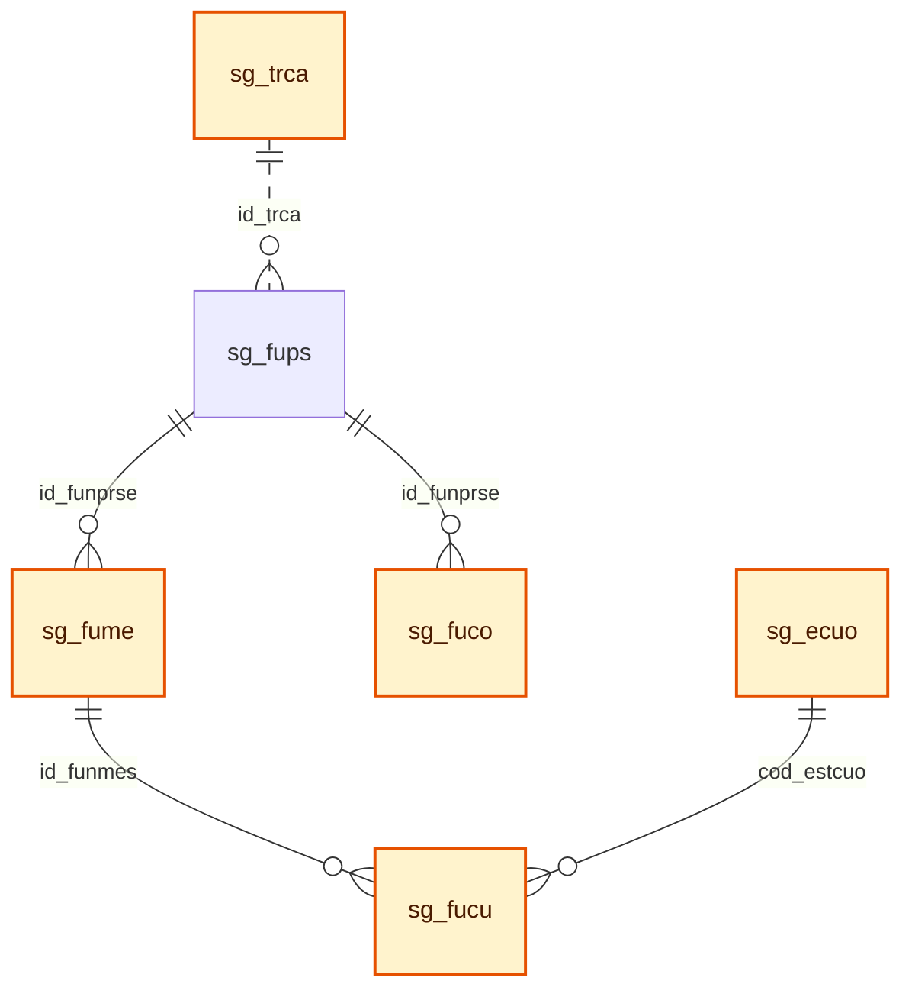

# Plan de Cambios BDD - Solicitud PDS Fase 2

> [!WARNING]
> Este documento conserva el diseño histórico basado en `sg_fume`/`sg_fucu`. Para la implementación vigente queda reemplazado por `template-du09/separacion_solcitud_pago_mes.md`: la solicitud y la resolución registran rango de ejecución y monto total; los meses, cuotas y evidencias nacen exclusivamente en el sistema de pagos.

Este documento contiene solo el alcance de base de datos para la **solicitud PDS**: diagrama vigente, cambios estructurales y descripcion de tablas. No incluye perfilamiento, roles ni etapa formal de pagos.

El modelo se alinea con `bdd_maestros.md`, tomando solo las tablas que corresponden al flujo de solicitud PDS.

El alcance de solicitud llega hasta la generacion de cuotas habilitadas por mes (`sg_fucu`) al momento de formalizar/archivar la PDS con resolucion. La solicitud formal de pago y su detalle quedan fuera de este documento.

> [!IMPORTANT]
> La solicitud PDS no registra evidencias documentales de ejecucion. La evidencia se entiende como documento cargado en la etapa de pago para justificar la realizacion de la actividad de un mes/cuota. Por lo tanto, no se crean tablas de evidencias en este alcance.

---

## 2. Modificaciones Estructurales

### 2.1 Diagrama vigente del flujo de solicitud PDS

> [!IMPORTANT]
> Este diagrama no incluye la etapa formal de pagos. Si incluye `sg_fucu` como cuota habilitada generada desde los meses aprobados al formalizar/archivar la PDS.



> [!NOTE]
> Las tablas resaltadas en amarillo son las nuevas a crear. `sg_fups` aparece como contexto de conexion (tabla existente modificada).

---

## 3. Cambios y Descripcion de Tablas

### 3.1 `sg_prse` - Prestacion de servicios

**Accion:** modificar tabla existente.

**Objetivo:** representar la cabecera especifica de una PDS, usando `sg_soli` como cabecera comun.

| Campo | Tipo sugerido | Cambio | Uso |
| :--- | :--- | :--- | :--- |
| `cod_modprs` | `tinyint null` | Agregado BDD | Modalidad de prestacion para separar DU288-D09/2026 del flujo legacy. FK a `sg_tmod.cod_modprs`. |

Reglas:

1. `sg_prse.nro_solici` sigue siendo PK/FK hacia `sg_soli`.
2. `sg_prse` no debe guardar datos de pago.
3. La PDS queda habilitada para pagos solo despues de formalizarse.
4. Al formalizar/archivar la PDS con resolucion, se generan las cuotas habilitadas (`sg_fucu`) desde los meses aprobados (`sg_fume`).

### 3.2 `sg_fups` - Funcionario asociado a PDS

**Accion:** modificar tabla existente.

**Objetivo:** mantener los funcionarios asociados a la PDS y agregar datos requeridos para Fase 2, incluyendo la captura minima del tope aplicado al momento de registrar el funcionario.

| Campo | Tipo sugerido | Cambio | Uso |
| :--- | :--- | :--- | :--- |
| `dentro_jor` | `char(1) null` | Agregado BDD | Indica si la prestacion se ejecuta dentro de jornada. |
| `cod_contra` | `int null` | Agregado BDD | Contrato SISPER asociado a la prestacion. |
| `cod_estfun` | `tinyint null` | Agregado BDD | Codigo de estado del funcionario dentro de la solicitud PDS. La descripcion se obtiene desde `sg_efun`. |
| `mes_haber` | `tinyint null` | Agregado BDD | Mes de haberes usado como referencia para calcular el tope cuando aplica remuneracion efectiva. |
| `ano_haber` | `smallint null` | Agregado BDD | Anio de haberes usado como referencia para calcular el tope. |
| `mto_haber` | `int null` | Agregado BDD | Total de haberes/remuneracion efectiva usado como base de calculo del tope. |
| `mto_tope` | `int null` | Agregado BDD | Tope mensual final aplicado/congelado al funcionario al momento de registrar la solicitud. |
| `f_cal_tope` | `datetime null` | Agregado BDD | Fecha en que se calculo y congelo el tope mensual aplicado. |
| `tot_cuotas` | `tinyint null` | Agregado BDD | Total de cuotas previstas para el funcionario. |
| `id_trca` | `int null` | Pendiente | Registro de regla/tope aplicado desde `sg_trca`, cuando exista regla parametrizada. |

Campos existentes que se reutilizan:

| Campo | Uso |
| :--- | :--- |
| `monto_mes` | Monto mensual aprobado PDS. |
| `mto_total` | Monto total aprobado PDS. |
| `cod_sitm` | Item/subitem presupuestario asociado. |
| `itm_global` | Item global presupuestario. |
| `cod_cargo` | Cargo para validaciones de tope e inhabilidad. |
| `cod_tpps` | Tipo/periodicidad existente del modelo actual. |

Reglas:

1. El estado del funcionario se controla con `cod_estfun`, no con un indicador `S/N`.
2. `cod_estfun` debe apuntar a la tabla maestra `sg_efun`; no se guarda la descripcion del estado directamente en `sg_fups`.
3. Si el funcionario queda en estado rechazado, excluido o no incorporable, no debe generar meses en `sg_fume`.
4. Solo funcionarios en estado habilitado/aprobado deben continuar a formalizacion PDS.
5. El registro no se elimina; queda como trazabilidad de la solicitud.
6. `mto_tope` congela el tope mensual usado al momento de registrar el funcionario, para evitar que cambios futuros en `sg_trca` alteren la validacion historica.
7. `mes_haber`, `ano_haber` y `mto_haber` solo se informan cuando el calculo requiere remuneracion efectiva; para topes fijos pueden quedar `NULL`.
8. Validaciones como SEA, compensacion requerida, cargo habilitado, asignacion bloqueante y deuda se recalculan dinamicamente desde contrato, `sg_fuco`, PA09, PA10 y PA de inhabilidad por cargo.
9. Los datos de parentesco se validan contra SISPER (`sp_par1` / `sp_par2`); no se copian como atributos nuevos en `sg_fups` en esta etapa.

### 3.3 `sg_fume` - Meses de ejecucion PDS

**Accion:** crear/confirmar tabla PDS.

**Objetivo:** normalizar los meses de ejecucion aprobados por funcionario.

| Campo | Tipo sugerido | Cambio | Uso |
| :--- | :--- | :--- | :--- |
| `id_funmes` | `int identity` | Crear PK | Identificador del mes aprobado. |
| `id_funprse` | `int` | Crear FK | Funcionario de la PDS. |
| `nro_mes` | `tinyint` | Crear | Numero del mes calendario de ejecucion. |
| `anio` | `smallint` | Crear | Anio del mes de ejecucion. |
| `vigente` | `char(1)` | Crear | Vigencia del periodo. |

Reglas:

1. Cada mes seleccionado para el funcionario genera un registro independiente en `sg_fume`.
2. `sg_fume` no guarda montos. El monto aprobado permanece en `sg_fups`.
3. `sg_fume` es la base para generar una cuota en `sg_fucu` cuando la PDS queda formalizada/archivada con resolucion.
4. `sg_fume` no es dependencia directa de `sg_fuco`; la compensacion horaria se registra con fecha propia en `sg_fuco`.
5. `sg_fume` no guarda evidencias ni constancias; la evidencia de ejecucion pertenece al flujo de pago.

### 3.4 `sg_fucu` - Cuota habilitada por mes PDS

**Accion:** crear tabla PDS Fase 2.

**Objetivo:** registrar la cuota habilitada para cada mes aprobado de un funcionario una vez que la PDS se formaliza y queda archivada con resolucion. Esta tabla deja preparado el registro que despues sera consultado por el flujo de pagos, sin crear aun la solicitud de pago ni su detalle.

| Campo | Tipo sugerido | Cambio | Uso |
| :--- | :--- | :--- | :--- |
| `id_funcuo` | `int identity` | Crear PK | Identificador de la cuota habilitada del funcionario. |
| `id_funmes` | `int` | Crear FK | Mes aprobado desde `sg_fume`. |
| `nro_cuota` | `tinyint` | Crear | Numero de cuota del funcionario dentro de la PDS. |
| `tot_cuotas` | `tinyint` | Crear | Total de cuotas generadas para el funcionario dentro de la PDS. |
| `mto_cuota` | `decimal(19,2)` | Crear | Monto de la cuota mensual. En la etapa de resolucion se registra en 0; el monto real se asigna despues en la solicitud de pago del mes. |
| `cod_estcuo` | `smallint` | Crear FK | Estado propio de la cuota. Referencia `sg_ecuo.cod_estcuo`. |
| `id_docum` | `int null` | Crear | ID del documento de evidencia justificativo del trabajo realizado en el mes. Se asocia en la etapa de pago. |
| `f_gencuo` | `datetime` | Crear | Fecha y hora de generacion de la cuota al formalizar/archivar la PDS. |
| `f_pago` | `datetime null` | Crear | Fecha y hora en que la cuota queda pagada, si aplica. |
| `f_ultmodif` | `datetime` | Crear | Fecha y hora de la ultima actualizacion de la cuota. |
| `vigente` | `char(1)` | Crear | Vigencia logica de la cuota. |

Reglas:

1. `sg_fucu` se genera al formalizar/archivar la PDS con resolucion, no al guardar borrador ni al ingresar meses en `sg_fume`.
2. Cada `sg_fume.id_funmes` vigente debe tener a lo mas una cuota habilitada vigente en `sg_fucu`.
3. `nro_cuota` se asigna por funcionario/PDS segun el orden de `anio` y `nro_mes`.
4. `tot_cuotas` congela el total de cuotas generadas para ese funcionario/PDS.
5. `mto_cuota` queda en 0 al formalizar/archivar la PDS. El monto de pago se asigna posteriormente para cada mes, al crear la solicitud de pago correspondiente.
6. El monto mensual posterior puede ser distinto entre cuotas, siempre que no supere el tope mensual congelado en `sg_fups.mto_tope` para ese funcionario.
7. El estado inicial esperado de `cod_estcuo` es generada.
8. `f_gencuo` debe guardar fecha y hora exacta de generacion de la cuota.
9. `f_pago` queda `NULL` hasta que el flujo posterior marque la cuota como pagada.
10. `f_ultmodif` se actualiza cada vez que cambia el estado, monto o vigencia de la cuota.
11. `sg_fucu` no representa una solicitud de pago; solo representa la cuota habilitada por la resolucion PDS.
12. La solicitud de pago y sus detalles se modelan despues con tablas fuera de este documento.

### 3.5 `sg_ecuo` - Estado de cuota PDS

**Accion:** crear tabla maestra PDS.

**Objetivo:** parametrizar los estados que puede tomar una cuota habilitada en `sg_fucu`, permitiendo controlar si esta generada, disponible, solicitada, autorizada, pagada, rechazada o bloqueada.

| Campo | Tipo sugerido | Cambio | Uso |
| :--- | :--- | :--- | :--- |
| `cod_estcuo` | `smallint` | Crear PK | Codigo de estado de cuota. |
| `des_estcuo` | `varchar(100)` | Crear | Descripcion del estado de cuota. |
| `vigente` | `char(1)` | Crear | Vigencia del estado. |

Datos iniciales esperados:

| cod_estcuo | Estado cuota | Uso esperado |
| :--- | :--- | :--- |
| `1` | Generada | Cuota creada desde el mes aprobado al formalizar/archivar la PDS, aun sin monto de pago asignado. |
| `2` | Disponible | Cuota disponible para ser incluida en una solicitud de pago. |
| `3` | Solicitada | Cuota incluida en una solicitud de pago vigente. |
| `4` | Autorizada | Cuota autorizada para pago. |
| `5` | Pagada | Cuota ya pagada; no debe volver a seleccionarse. |
| `6` | Rechazada | Cuota rechazada en el proceso de pago. |
| `7` | Bloqueada | Cuota bloqueada por validacion pendiente o condicion especial. |

Reglas:

1. `sg_fucu.cod_estcuo` debe apuntar a `sg_ecuo.cod_estcuo`.
2. La descripcion del estado no se guarda en `sg_fucu`; se obtiene desde esta tabla maestra.
3. Los estados pueden reutilizarse posteriormente por el flujo de pago, sin crear otra tabla de estados para cuota.

### 3.6 `sg_fuco` - Compensacion horaria por fecha

**Accion:** reemplazar/evolucionar la tabla creada en BDD.

**Objetivo:** registrar cada tramo de compensacion horaria asociado al funcionario PDS, guardando directamente anio, mes, dia y rango horario de la compensacion. La fecha compensada no debe depender de `sg_fume`, porque puede corresponder a un mes distinto al mes de ejecucion aprobado.

La tabla actualmente integrada en BDD no queda alineada con esta definicion, porque conserva compensacion por funcionario, dia de semana y cantidad de horas. El modelo final debe reemplazar esa estructura por compensacion asociada a funcionario, anio, mes, dia calendario y rango horario.

| Campo | Tipo sugerido | Cambio | Uso |
| :--- | :--- | :--- | :--- |
| `id_funcom` | `int identity` | Crear PK | Identificador del tramo de compensacion. |
| `id_funprse` | `int` | Pendiente | Funcionario de la PDS. FK a `sg_fups.id_funprse`. |
| `anio` | `smallint` | Pendiente | Anio calendario en que se realizara la compensacion. |
| `nro_mes` | `tinyint` | Pendiente | Mes calendario en que se realizara la compensacion. |
| `nro_dia` | `tinyint` | Pendiente | Dia calendario de compensacion dentro de `anio` y `nro_mes`. |
| `hora_inicio` | `datetime` | Pendiente | Hora de inicio del tramo compensado. En Sybase 12 se usa `datetime` guardando la porcion horaria. |
| `hora_termino` | `datetime` | Pendiente | Hora de termino del tramo compensado. En Sybase 12 se usa `datetime` guardando la porcion horaria. |
| `vigente` | `char(1)` | Pendiente | Vigencia logica del tramo de compensacion. |

Reglas:

1. La compensacion se registra por funcionario (`id_funprse`) y fecha calendario (`anio`, `nro_mes`, `nro_dia`), no por `sg_fume.id_funmes`.
2. Puede existir mas de un tramo de compensacion para una misma fecha; en ese caso se registran varias filas con el mismo `id_funprse`, `anio`, `nro_mes` y `nro_dia`.
3. `hora_termino` debe ser mayor que `hora_inicio`.
4. La duracion no se guarda como atributo persistente; se calcula desde `hora_inicio` y `hora_termino`.
5. Los tramos de una misma fecha no deben solaparse para el mismo funcionario.
6. Si la prestacion es dentro de jornada y requiere compensacion, debe existir al menos un tramo vigente asociado al funcionario.
7. Si la compensacion se define en un mes distinto al mes de ejecucion, por ejemplo ejecucion en diciembre y compensacion en enero, `sg_fuco` debe registrar el anio/mes/dia real de compensacion sin depender de `sg_fume`.
8. Para validar cobertura por mes de ejecucion, el sistema puede cruzar por rango de fechas de la PDS y reglas de negocio, pero no debe inferir la fecha compensada solo desde `sg_fume`.

### 3.7 Evidencias y documentos de respaldo

**Accion:** no crear tablas de evidencia en el alcance de solicitud PDS.

**Objetivo:** dejar explicitado que la solicitud PDS no registra evidencia de ejecucion. La evidencia se cargara en la etapa de pago como documento que justifica la actividad realizada.

Reglas:

1. La solicitud PDS no crea ni mantiene tablas propias de evidencia.
2. La evidencia de ejecucion corresponde al flujo de pago, no a la solicitud PDS.
3. Si en el pago se requiere solo un documento por cuota/detalle, debe bastar con un `id_docum` en el detalle de pago futuro.
4. Solo se debe crear una tabla de evidencias de pago si se confirma necesidad de multiples documentos por cuota, historial documental, reemplazo documental o revision documental independiente.
5. Las constancias por parentesco, receso, licencia, permiso u otra condicion especial deben tratarse como documentos de respaldo del flujo correspondiente, no como evidencia de ejecucion de solicitud PDS.

### 3.8 `sg_tmod` - Modalidad de prestacion

**Accion:** crear tabla maestra PDS.

**Objetivo:** parametrizar modalidades de prestacion.

| Campo | Tipo sugerido | Cambio | Uso |
| :--- | :--- | :--- | :--- |
| `cod_modprs` | `tinyint` | Agregado BDD PK | Modalidad de prestacion. |
| `des_modprs` | `varchar(50)` | Agregado BDD | Descripcion de modalidad. |

Datos iniciales:

| id | Descripcion |
| :--- | :--- |
| `1` | Docentes Especiales |
| `2` | DU288-D09/2026 |

### 3.9 Inhabilidad por cargo resuelta por PA

**Accion:** no crear tabla de cargos excluidos.

**Objetivo:** determinar la habilitacion del cargo desde el PA que cruza la informacion del contrato/cargo SISPER con la modalidad PDS y la condicion del Centro de Costo.

Reglas:

1. No se crea tabla local de cargos excluidos.
2. El PA debe marcar como no habilitados los cargos cuyo `sp_carg.cod_tipcar = 5`, correspondiente a cargos directivos.
3. La excepcion asociada a CCTO ANID o condicion institucional definida no se resuelve con una tabla local; debe venir determinada por el PA.
4. Cuando el CCTO cumpla la condicion ANID/definida, la excepcion permitida debe limitarse al cargo `cod_cargo = 3120`, segun regla institucional confirmada.
5. El front solo consume el resultado del PA: cargo habilitado, motivo de inhabilidad y, si aplica, excepcion permitida.
6. La regla no debe inferirse desde texto libre del cargo ni desde una lista hardcodeada en frontend.

### 3.10 `sg_trca` - Reglas y topes DU288

**Accion:** crear tabla maestra PDS.

**Objetivo:** definir la regla de tope mensual aplicable por modalidad, cargo, grupo/planta, jerarquia, nivel, unidad/instituto, anio y rango de vigencia. La tabla debe permitir topes fijos, calculos por remuneracion efectiva y topes especificos por resolucion, sin perder la trazabilidad de la regla usada al guardar el funcionario.

La carga inicial debe construirse cruzando:

1. `sisper_db.dbo.sp_carg`: identifica `cod_cargo`, `nom_cargo`, `cod_tipcar`, `cod_jerpla` y vigencia del cargo.
2. `sisper_db.dbo.sp_jpfu`: traduce `cod_jerpla` a `cod_jerpln` y descripcion de jerarquia/planta.
3. Contrato SISPER: aporta `cod_niv_gr` y `cod_unidad` cuando se necesita una regla mas fina.
4. Escala de Remuneraciones vigente: entrega `mto_base_haber` para topes fijos.
5. Resoluciones DU288-D09/2026: entregan topes especiales, como Directoras y Directores de Institutos Independientes.

| Campo | Tipo sugerido | Cambio | Uso |
| :--- | :--- | :--- | :--- |
| `id_trca` | `int identity` | Crear PK | Identificador unico de la regla/tope. |
| `cod_modprs` | `tinyint` | Crear | Modalidad de prestacion. Para DU288-D09/2026 usar `2`. |
| `cod_cargo` | `smallint null` | Crear | Cargo SISPER cuando la regla aplica a un cargo especifico, por ejemplo `3120` Director Instituto Independiente. |
| `cod_jerpln` | `smallint null` | Crear | Grupo/planta normalizada desde `sp_jpfu.cod_jerpln`. |
| `cod_jerpla` | `varchar(3) null` | Crear | Jerarquia/planta especifica desde `sp_jpfu.cod_jerpla`, cuando la regla requiere mayor precision. |
| `cod_niv_gr` | `varchar(3) null` | Crear | Nivel/grado del contrato, cuando la regla se amarra a un nivel especifico de escala. |
| `cod_unidad` | `char(8) null` | Crear | Unidad SISPER cuando el tope depende de un instituto o unidad especifica. |
| `grado_ref` | `varchar(100) null` | Crear | Nombre operativo de la referencia usada para el calculo o resolucion. |
| `mto_base_haber` | `decimal(12,0) null` | Crear | Total haber/base de calculo usada como referencia. |
| `pct_aplicado` | `decimal(5,2) null` | Crear | Porcentaje aplicado sobre la base, cuando corresponde. |
| `cod_forcal` | `char(1)` | Crear | Forma de calculo: `F` fijo, `C` calculado por remuneracion efectiva, `S` especial pendiente de regla complementaria. |
| `mto_tope` | `decimal(12,0) null` | Crear | Tope mensual final. Obligatorio para reglas `F`; `NULL` para reglas `C`. |
| `ano_vigen` | `smallint` | Crear | Anio de vigencia normativa o presupuestaria. |
| `f_inicio` | `datetime` | Crear | Fecha desde la cual aplica la regla. |
| `f_termino` | `datetime null` | Crear | Fecha hasta la cual aplica la regla. `NULL` indica vigencia abierta. |
| `vigente` | `char(1)` | Crear | Vigencia del registro. |

Valores esperados para `cod_forcal`:

| Codigo | Uso | Como se valida |
| :--- | :--- | :--- |
| `F` | Tope fijo configurado por escala o resolucion. | Comparar el monto mensual solicitado contra `mto_tope`. |
| `C` | Tope calculado con remuneracion efectiva. | Obtener haberes del PA correspondiente, aplicar porcentaje y congelar el resultado en `sg_fups.mto_tope`. |
| `S` | Regla especial no resuelta solo con esta tabla. | Exigir PA/regla complementaria antes de aprobar automaticamente. |

Reglas de busqueda de tope:

1. Primero buscar reglas especificas por `cod_cargo + cod_unidad`, para Directoras y Directores de Institutos Independientes.
2. Luego buscar reglas especificas por `cod_jerpln + cod_jerpla + cod_niv_gr`, para homologacion academica o niveles de escala.
3. Luego buscar reglas generales por `cod_jerpln`, para tecnico, administrativo y auxiliar.
4. Filtrar siempre por `cod_modprs`, fecha dentro de `f_inicio` / `f_termino` y `vigente = 'S'`.
5. Si hay cambio de tope a mitad de anio, se cierra el registro anterior con `f_termino` y se crea uno nuevo con nueva `f_inicio`.
6. `sg_fups.id_trca` debe guardar el registro exacto usado; `sg_fups.mto_tope` congela el tope mensual resultante.

Carga inicial base para DU288-D09/2026:

| id_trca | cod_modprs | cod_cargo | cod_jerpln | cod_jerpla | cod_niv_gr | cod_unidad | grado_ref | mto_base_haber | pct_aplicado | cod_forcal | mto_tope | ano_vigen | f_inicio | f_termino | vigente |
| ---: | ---: | :--- | ---: | :--- | :--- | :--- | :--- | :--- | ---: | :--- | :--- | ---: | :--- | :--- | :--- |
| 1 | 2 | null | 7 | null | null | null | Remuneracion efectiva academico | null | 50.00 | C | null | 2026 | 2026-01-01 | null | S |
| 2 | 2 | null | 7 | 01 | 1 | null | TITULAR A | 4720149 | 50.00 | F | 2360075 | 2026 | 2026-01-01 | null | S |
| 3 | 2 | null | 7 | 02 | 4 | null | ASOCIADO A | 3508060 | 50.00 | F | 1754030 | 2026 | 2026-01-01 | null | S |
| 4 | 2 | null | 7 | 03 | 7 | null | ASISTENTE A | 2653174 | 50.00 | F | 1326587 | 2026 | 2026-01-01 | null | S |
| 5 | 2 | null | 7 | 04 | 11 | null | INSTRUCTOR A | 1723206 | 50.00 | F | 861603 | 2026 | 2026-01-01 | null | S |
| 6 | 2 | null | 3 | null | null | null | TECNICO GRADO MAYOR | 1243268 | 50.00 | F | 621634 | 2026 | 2026-01-01 | null | S |
| 7 | 2 | null | 4 | null | null | null | ADMINISTRATIVO GRADO MAYOR | 1106158 | 50.00 | F | 553079 | 2026 | 2026-01-01 | null | S |
| 8 | 2 | null | 5 | null | null | null | AUXILIAR GRADO MAYOR | 765038 | 50.00 | F | 382519 | 2026 | 2026-01-01 | null | S |
| 9 | 2 | 3120 | 1 | 11 | 156 | 16150000 | DIRECTOR INST. INNOVACION Y EMPRENDIMIENTO | 5291266 | 35.00 | F | 1851943 | 2026 | 2026-01-01 | null | S |
| 10 | 2 | 3120 | 1 | 11 | 156 | pendiente | DIRECTOR INST. INFORMATICA EDUCATIVA | 5291266 | 50.00 | F | 2645633 | 2026 | 2026-01-01 | null | S |
| 11 | 2 | 3120 | 1 | 11 | 156 | pendiente | DIRECTOR INST. AGROINDUSTRIAS | 5291266 | 48.50 | F | 2566751 | 2026 | 2026-01-01 | null | S |
| 12 | 2 | 3120 | 1 | 11 | 156 | pendiente | DIRECTOR INST. DESARROLLO LOCAL Y REGIONAL | 5291266 | 48.30 | F | 2554357 | 2026 | 2026-01-01 | null | S |
| 13 | 2 | 3120 | 1 | 11 | 156 | pendiente | DIRECTOR INST. ESTUDIOS INDIGENAS E INTERCULTURALES | 5291266 | 46.70 | F | 2471469 | 2026 | 2026-01-01 | null | S |
| 14 | 2 | 3120 | 1 | 11 | 156 | pendiente | DIRECTOR INST. MEDIO AMBIENTE | 5291266 | 45.30 | F | 2397930 | 2026 | 2026-01-01 | null | S |

Notas de implementacion:

1. Los `cod_unidad = pendiente` deben reemplazarse por el codigo real de unidad/instituto antes de cargar en produccion.
2. Los cargos directivos generales no se habilitan por `sg_trca`; se validan por PA como inhabilidad. La excepcion parametrizada aqui es el cargo `3120` cuando corresponde a instituto independiente.
3. Para reglas `F`, `mto_tope` queda directo porque el valor ya viene definido por escala o resolucion.
4. Para reglas `C`, `mto_tope` queda `NULL` porque el monto se calcula con los haberes de referencia del funcionario y se congela en `sg_fups`.
5. `cod_jerpla` y `cod_niv_gr` se guardan solo cuando son necesarios para distinguir jerarquias academicas o reglas especificas; para topes generales por planta basta `cod_jerpln`.
### 3.11 `sg_efun` - Estado de funcionario PDS

**Accion:** crear tabla maestra PDS.

**Objetivo:** parametrizar en una tabla separada los estados individuales que puede tomar cada funcionario dentro de una solicitud PDS, permitiendo rechazo parcial sin afectar al resto de funcionarios.

| Campo | Tipo sugerido | Cambio | Uso |
| :--- | :--- | :--- | :--- |
| `cod_estfun` | `smallint` | Crear PK | Codigo de estado del funcionario en la PDS. |
| `des_estfun` | `varchar(100)` | Crear | Descripcion del estado. |
| `vigente` | `char(1)` | Crear | Vigencia del estado. |

Datos iniciales esperados:

| `cod_estfun` | `des_estfun` | Uso esperado |
| :--- | :--- | :--- |
| `1` | Pendiente de revision | Funcionario ingresado, pendiente de validacion. |
| `2` | Observado | Funcionario requiere correccion o antecedente adicional. |
| `3` | Aprobado | Funcionario cumple validaciones y puede continuar a formalizacion PDS. |
| `4` | Rechazado | Funcionario no puede continuar en esta PDS. |
| `5` | Excluido | Funcionario se retira de esta PDS sin eliminar el registro. |

Regla: si un funcionario queda `RECHAZADO` o `EXCLUIDO`, los demas funcionarios de la PDS pueden continuar su proceso.

---

## 4. Referencias Externas

| Tabla | Origen | Uso |
| :--- | :--- | :--- |
| `es_ccto` | FIN21 | Centro de costo, unidad financiera, vigencia, bloqueo, CC global y proyecto global. |
| `sp_carg` | SISPER | Cargo del funcionario, validacion de vigencia y tipo de cargo (`cod_tipcar`) para inhabilidades resueltas por PA. |
| `sp_jpfu` | SISPER | Jerarquia/planta del cargo, usada para resolver reglas de tope por grupo/planta. |
| `sp_par1` | SISPER | Persona relacionada para validacion de parentesco. |
| `sp_par2` | SISPER | Relacion de parentesco vigente entre funcionario y persona relacionada. |

---

## 5. Reglas Generales del Modelo PDS

1. `sg_soli` sigue siendo la cabecera comun de la solicitud.
2. `sg_prse` es la tabla hija especifica de PDS.
3. `sg_fups` mantiene los funcionarios de la PDS.
4. `sg_efun` controla el estado individual del funcionario dentro de la PDS.
5. `sg_fume` normaliza los meses por funcionario.
6. `sg_fucu` registra las cuotas habilitadas por mes al formalizar/archivar la PDS con resolucion.
7. `sg_ecuo` parametriza los estados de las cuotas habilitadas.
8. `sg_fuco` registra la compensacion horaria por funcionario, anio, mes, dia y rango horario.
9. La solicitud PDS no registra evidencia de ejecucion; el documento de evidencia pertenece al flujo de pago.
10. `sg_tmod` y `sg_trca` parametrizan reglas propias de Fase 2; la inhabilidad por cargo se resuelve por PA.
11. Las tablas externas se consultan como referencia logica y no se modifican.
12. El flujo de pagos queda fuera de este documento desde la solicitud formal de pago en adelante.

### 5.1 Criterios definidos para el flujo futuro de pagos

Estos criterios se documentan para no contaminar el modelo de solicitud PDS con tablas o campos que corresponden al pago formal.

1. La solicitud de pago se realiza por funcionario (`id_funprse`), no por la PDS completa.
2. El mes de ejecucion aprobado vive en `sg_fume` y puede ser distinto del mes real de pago.
3. El detalle de pago futuro debe registrar mes/anio de pago cuando sea necesario para trazabilidad o calculo financiero.
4. La evidencia de ejecucion es un documento subido en la etapa de pago para justificar la actividad realizada.
5. Mientras se requiera solo un documento por cuota/detalle, no se necesita una tabla propia de evidencias; el documento se asocia directamente a la cuota habilitada (`sg_fucu.id_docum`) en la etapa de pago.
6. Solo se debe crear una tabla de evidencias de pago si se confirma necesidad de multiples documentos por cuota, historial documental, reemplazo documental o revision independiente del documento.
7. El monto no se calcula automáticamente de manera directa. Al abrir el formulario de pago, el sistema valida condiciones como licencias médicas (totales o parciales), días efectivamente trabajados y labores registradas para reducir dinámicamente el tope máximo al cual el funcionario puede optar, restringiendo el formulario para ingresar únicamente un monto menor o igual a este tope ajustado.
8. Si el registro final en Finanzas genera un rechazo externo (por ejemplo, debido a falta de fondos, falta de pago o datos erróneos en su sistema), la respuesta debe ser capturada por nuestro sistema para permitir al usuario reactivar y reenviar la solicitud una vez solucionado el problema.
9. El flujo de pagos en SG-Solicitudes finaliza cuando se guardan/registran correctamente los datos solicitados en las tablas del sistema de Finanzas. Si Finanzas confirma el pago real posterior, esa confirmación puede actualizar `sg_fucu.f_pago` y su estado.

---

## 6. Plan de Integracion Back/Front DU288

Esta seccion define como llevar el modelo maestro al flujo actual sin depender aun de procedimientos definitivos de base de datos. La regla es mantener estable el contrato de datos para que luego solo se reemplace la emulacion por PA/SP real.

### 6.1 Backend - Catalogos y reglas emuladas

1. Mantener endpoints DU288 separados del flujo legacy de PDS:
   - `GET /requests/service-provision/du288/position-caps`
   - Endpoint/PA de validacion de cargo habilitado por funcionario/contrato.
2. `position-caps` debe emular el cruce futuro entre `sg_trca`, `sp_jpfu` y `sp_carg`.
3. La respuesta debe incluir datos de regla y datos descriptivos:

| Campo API | Origen futuro | Uso Front |
| :--- | :--- | :--- |
| `idTrca` | `sg_trca.id_trca` | Guardar en payload del funcionario como regla exacta aplicada. |
| `codCargo` | `sp_carg.cod_cargo` | Cruzar contrato seleccionado contra su cargo descriptivo. |
| `codModprs` | `sg_trca.cod_modprs` | Asegurar que aplica a DU288. |
| `codJerpln` | `sg_trca.cod_jerpln` / `sp_jpfu.cod_jerpln` | Resolver grupo/planta usado por la regla. |
| `codJerpla` | `sg_trca.cod_jerpla` / `sp_carg.cod_jerpla` / `sp_jpfu.cod_jerpla` | Resolver jerarquia especifica cuando la regla lo requiere. |
| `codNivGr` | `sg_trca.cod_niv_gr` / contrato SISPER | Resolver nivel/grado cuando la regla se amarra a escala especifica. |
| `codUnidad` | `sg_trca.cod_unidad` / contrato SISPER | Resolver topes especificos por instituto o unidad. |
| `year` | `sg_trca.ano_vigen` | Mostrar vigencia normativa. |
| `startDate` | `sg_trca.f_inicio` | Resolver reajustes dentro del anio. |
| `endDate` | `sg_trca.f_termino` | Resolver vigencia abierta o cerrada. |
| `codForcal` | `sg_trca.cod_forcal` | Distinguir fijo, calculado o especial. |
| `mtoTope` | `sg_trca.mto_tope` | Tope fijo cuando `codForcal = F`. |
| `vigente` | `sg_trca.vigente` | Filtrar reglas activas. |
| `nomCargo` | `sp_carg.nom_cargo` | Mostrar nombre de cargo. |
| `codTipcar` | `sp_carg.cod_tipcar` | Identificar academico/no academico. |
| `planta` | derivado de `sp_jpfu.des_jerpla` / `cod_jerpln` | Agrupar visualmente y calcular tope fijo. |
| `nivelJerarquico` | derivado de `sp_jpfu` | Mostrar dato legible en catalogo. |

4. Para reglas fijas (`codForcal = F`), `mtoTope` debe venir informado.
5. Para reglas calculadas (`codForcal = C`), `mtoTope` puede venir `0` o `NULL`; el backend/front calcula con PA11 o con la emulacion vigente.
6. Para cargos no habilitados, el front debe bloquear usando el resultado del PA de inhabilidad por cargo, no `sg_trca` ni una tabla local de excluidos.
7. Para reglas especiales (`codForcal = S`), el front debe advertir o bloquear segun la regla complementaria definida.
8. Cuando exista el PA real, debe mantener la misma forma de respuesta para no modificar el front.

### 6.2 Frontend - Vista y validacion

1. La tabla de catalogo de topes debe consumir solo `position-caps`; no debe tener topes hardcodeados.
2. La tabla debe mostrar solo datos utiles:
   - codigo de cargo,
   - nombre de cargo,
   - planta/nivel,
   - tipo de regla,
   - tope mensual cuando exista,
   - vigencia.
3. La lista de contratos debe calcular dinamicamente el tope aplicable segun el contrato seleccionado.
4. Si el contrato cambia, deben recalcularse:
   - cargo habilitado,
   - regla de tope,
   - tope mensual aplicable,
   - referencia de remuneracion efectiva si corresponde,
   - mensajes visuales y badges.
5. El valor del tope debe mostrarse como dato informativo; solo se usa color de error cuando el monto solicitado excede el tope o falta un dato obligatorio para calcular.
6. La vista de solicitud no debe exigir evidencia documental de ejecucion. Cualquier documento de respaldo debe quedar como definicion del flujo correspondiente y no como tabla de evidencia dentro de la solicitud PDS.

### 6.3 Payload DU288 mientras no exista BDD Fase 2

El payload debe seguir enviando datos actuales y agregar campos planos en cada funcionario para dejar preparado el mapeo futuro a `sg_fups`.

| Campo payload funcionario | Campo futuro | Regla |
| :--- | :--- | :--- |
| `idTrca` / `id_trca` | `sg_fups.id_trca` | Se toma desde la regla `position-caps` aplicada. |
| `mesHaber` / `mes_haber` | `sg_fups.mes_haber` | Solo se informa cuando `codForcal = C`. |
| `anoHaber` / `ano_haber` | `sg_fups.ano_haber` | Anio de haberes usado como referencia. |
| `mtoHaber` / `mto_haber` | `sg_fups.mto_haber` | Total de remuneracion efectiva usado para calcular. |
| `mtoTope` / `mto_tope` | `sg_fups.mto_tope` | Tope mensual final congelado al agregar/guardar funcionario. |
| `fCalTope` / `f_cal_tope` | `sg_fups.f_cal_tope` | Fecha/hora del calculo congelado. |

Los campos `topRule`, `topValidation` y `remuneration` pueden mantenerse temporalmente como metadata de pantalla, pero no deben ser la unica fuente del dato congelado que luego se guardara en `sg_fups`.

### 6.4 Backend - Guardado actual sin procedimiento nuevo

1. No modificar SP/PA de guardado hasta que existan las columnas reales.
2. Permitir que el request reciba metadata DU288 sin romper el schema.
3. No enviar estos datos a `sg_hist`; el historial debe registrar acciones del flujo, no snapshots completos del formulario.
4. Cuando se agreguen columnas a BDD, actualizar:
   - modelo `RequestStaff`,
   - transformacion `toProcedure`,
   - queries/procedimientos de insert/update de funcionario PDS,
   - lectura de detalle para reconstruir el borrador.

### 6.5 Orden de implementacion recomendado

1. Actualizar modelo `Du288PositionCap` con `idTrca`, `codModprs`, `startDate`, `endDate` y `codForcal`.
2. Actualizar emulacion backend de `sg_trca` con esos campos.
3. Ajustar compensacion horaria para enviarse por funcionario, anio, mes, dia y rango horario cuando exista la tabla definitiva.
4. Agregar campos planos de tope congelado al `buildStaffPayload`.
5. Ajustar helpers visuales para leer `codForcal` y mostrar regla fija/calculada/especial.
6. Validar flujo: buscar funcionario, seleccionar contrato, agregar funcionario, guardar borrador, recargar y reconstruir vista.

---

## 7. Plan Operativo de Implementacion

Este plan permite aplicar los cambios en backend y frontend sin tocar aun los procedimientos definitivos de BDD. Todo lo implementado debe quedar preparado para reemplazar la emulacion por PA/SP real sin cambiar la vista ni el payload.

### 7.1 Backend

**Objetivo:** entregar al frontend los catalogos DU288 con la misma forma que tendra el PA real.

1. Actualizar `Du288PositionCap`.
   - Agregar `idTrca`.
   - Agregar `codModprs`.
   - Agregar `startDate`.
   - Agregar `endDate`.
   - Agregar `codForcal`.
   - Mantener compatibilidad con campos actuales (`codCargo`, `nomCargo`, `codTipcar`, `codJerpla`, `codJerpln`, `mtoTope`, `capAmount`, `calculationType`, `year`, `vigente`).

2. Actualizar emulacion de `getDu288PositionCaps`.
   - `emulatedSgTrca` debe representar la futura `sg_trca`.
   - Cada fila debe tener `idTrca`, `codJerpln`, `codModprs`, `year`, `startDate`, `endDate`, `codForcal`, `mtoTope`, `vigente`.
   - `emulatedSpCarg` debe representar los datos descriptivos de cargo desde `sp_carg`.
   - `emulatedSpJpfu` debe representar la clasificacion de jerarquia/planta desde `sp_jpfu`.
   - El cruce debe devolver una respuesta unificada por cargo/regla, resolviendo `cod_jerpln` desde `sp_carg.cod_jerpla -> sp_jpfu.cod_jerpln`.

3. Actualizar validacion de cargo habilitado.
   - Reemplazar la emulacion/listado de cargos excluidos por una validacion basada en PA.
   - El PA debe usar `sp_carg.cod_tipcar = 5` para identificar cargos directivos no habilitados.
   - Si el CCTO cumple condicion ANID/definida, el PA debe permitir solo la excepcion `cod_cargo = 3120`.
   - En front solo debe usarse como validacion de bloqueo o excepcion informada.

4. Preparar modelos de request sin persistencia nueva.
   - No modificar SP de insert/update hasta que existan columnas.
   - Permitir que el request transporte metadata DU288.
   - No guardar snapshots DU288 en `sg_hist`.

### 7.2 Frontend

**Objetivo:** consumir catalogos DU288 desde backend, mostrar datos consistentes y enviar payload preparado para BDD futura.

1. Catalogo de topes.
   - Consumir solo `getDu288PositionCaps`.
   - Quitar topes hardcodeados del componente.
   - Mostrar columnas utiles: cargo, nombre, planta/nivel, tipo de regla, tope mensual, vigencia.
   - Hacer tabla responsive y evitar textos extensos innecesarios.

2. Validacion del contrato seleccionado.
   - Buscar regla por `codJerpln`, `codModprs`, vigencia y `codForcal`.
   - Si `codForcal = F`, usar `mtoTope`.
   - Si `codForcal = C`, calcular con remuneracion efectiva y regla DU288.
   - Si `codForcal = S`, mostrar advertencia/bloqueo segun regla complementaria.
   - Si el PA indica cargo no habilitado, bloquear funcionario e informar motivo.

3. Payload del funcionario.
   - Agregar campos planos:
     - `idTrca` / `id_trca`.
     - `mesHaber` / `mes_haber`.
     - `anoHaber` / `ano_haber`.
     - `mtoHaber` / `mto_haber`.
     - `mtoTope` / `mto_tope`.
     - `fCalTope` / `f_cal_tope`.
   - Mantener `topRule`, `topValidation` y `remuneration` solo como metadata temporal de UI.
   - Congelar el tope cuando el funcionario se agrega o guarda, no recalcularlo silenciosamente al recargar.

4. Evidencias y documentos.
   - No exigir evidencia de ejecucion en la vista de solicitud.
   - Quitar dependencias de catalogos de evidencia para el guardado de solicitud PDS.
   - Si se requiere un documento de respaldo normativo, tratarlo como definicion de la etapa correspondiente y no como evidencia de ejecucion.

5. Vista de solicitud.
   - Mantener badges y colores homologados.
   - Mostrar tope como dato informativo.
   - Usar rojo solo si bloquea o excede.
   - Recalcular visualmente cuando cambia el contrato seleccionado.

### 7.3 Guardado y reconstruccion de borrador

1. Al guardar borrador:
   - Enviar `provision` actualizado.
   - Enviar `staffList` completa.
   - Si `staffList` viene vacia, backend debe eliminar/desvincular funcionarios de la solicitud.
   - No crear registros vacios.

2. Al recargar solicitud:
   - Reconstruir `staffSummary` desde `staffList`.
   - Si vienen campos nuevos planos, usarlos como fuente prioritaria.
   - Si no vienen, reconstruir desde metadata temporal cuando exista.
   - Si no hay detalle DU288 completo, mostrar advertencia solo si realmente faltan datos no recuperables.

### 7.4 Pruebas manuales minimas

1. Buscar funcionario academico con regla calculada.
2. Buscar funcionario administrativo/auxiliar con tope fijo.
3. Buscar cargo directivo (`cod_tipcar = 5`) y confirmar bloqueo desde PA.
4. Cambiar contrato seleccionado y confirmar recalculo de tope.
5. Agregar funcionario, guardar borrador y recargar.
6. Editar funcionario, guardar cambios y recargar.
7. Eliminar funcionario, guardar borrador y recargar.
8. Validar que `position-caps` y el PA/endpoint de cargo habilitado no respondan 404.
9. Validar que el flujo legacy de PDS Docentes Especiales no cambie.

---

## 8. Estado de Implementacion Actual en BDD

Esta seccion registra solo lo que ya aparece integrado en `diagrama_secgen_actualizado.md`.

> [!IMPORTANT]
> El analisis y modelo objetivo de las secciones anteriores no se modifica. Esta seccion funciona como bitacora del estado real integrado en la BDD y debe actualizarse a medida que se agreguen nuevas tablas o columnas.

### 8.1 Resumen de cambios integrados

| Estado | Tablas |
| :--- | :--- |
| Creadas | `sg_tmod`, `sg_efun`, `sg_fuco` |
| Modificadas | `sg_prse`, `sg_fups` |
| Aun no integradas | `sg_fume`, `sg_fucu`, `sg_ecuo`, `sg_trca` |
| Requiere evolucion | `sg_fuco` |
| Fuera del alcance de solicitud | Evidencia documental de pago y tablas documentales asociadas |

### 8.2 Tablas creadas actualmente

#### `sg_tmod` - Modalidad de prestacion

**Estado:** creada.

| Campo | Tipo BDD | Null | Uso |
| :--- | :--- | :--- | :--- |
| `cod_modprs` | `tinyint` | `NOT NULL` | Codigo de modalidad de prestacion. PK. |
| `des_modprs` | `varchar(60)` | `NOT NULL` | Descripcion de la modalidad. |

Definicion observada:

```sql
CREATE TABLE secgen_db.dbo.sg_tmod (
    cod_modprs tinyint NOT NULL,
    des_modprs varchar(60) NOT NULL,
    CONSTRAINT SG_TMOD_PK PRIMARY KEY (cod_modprs)
);
```

Nota de alineacion:

- En el modelo objetivo se venia usando `id_modprse` / `des_modprse`.
- En la BDD integrada quedo como `cod_modprs` / `des_modprs`.
- Se debe usar el nombre real integrado o definir una normalizacion antes de actualizar procedimientos/backend.

#### `sg_efun` - Estado de funcionario PDS

**Estado:** creada.

| Campo | Tipo BDD | Null | Uso |
| :--- | :--- | :--- | :--- |
| `cod_estfun` | `tinyint` | `NOT NULL` | Codigo de estado individual del funcionario. PK. |
| `des_estfun` | `varchar(60)` | `NOT NULL` | Descripcion del estado. |

Definicion observada:

```sql
CREATE TABLE secgen_db.dbo.sg_efun (
    cod_estfun tinyint NOT NULL,
    des_estfun varchar(60) NOT NULL,
    CONSTRAINT SG_EFUN_PK PRIMARY KEY (cod_estfun)
);
```

Nota de alineacion:

- En el modelo objetivo se consideraba `vigente`.
- La BDD integrada no trae `vigente`.
- Si los estados seran estables y no administrables, puede quedar asi. Si se requiere parametrizacion futura, conviene evaluar agregar `vigente`.

#### `sg_fuco` - Compensacion horaria

**Estado:** creada.

| Campo | Tipo BDD | Null | Uso |
| :--- | :--- | :--- | :--- |
| `id_funprse` | `int` | `NOT NULL` | Funcionario PDS asociado. FK a `sg_fups`. |
| `dia_semana` | `tinyint` | `NOT NULL` | Dia de la semana compensado. |
| `cant_horas` | `tinyint` | `NOT NULL` | Campo existente. No queda alineado al modelo final porque la compensacion se definira por dia y rango horario. |

Definicion observada:

```sql
CREATE TABLE secgen_db.dbo.sg_fuco (
    id_funprse int NOT NULL,
    dia_semana tinyint NOT NULL,
    cant_horas tinyint NOT NULL,
    CONSTRAINT SG_FUCO_PK PRIMARY KEY (id_funprse,dia_semana),
    CONSTRAINT FK_sg_fuco_sg_fups FOREIGN KEY (id_funprse)
        REFERENCES secgen_db.dbo.sg_fups(id_funprse)
        ON DELETE RESTRICT ON UPDATE RESTRICT
);
```

Nota de alineacion:

- En el modelo objetivo inicial se proponia cantidad de horas, pero la definicion funcional actual cambia a compensacion por dia y rango horario.
- En la BDD integrada quedo con PK compuesta `id_funprse + dia_semana`.
- Este diseno evita duplicar un mismo dia por funcionario, pero no permite mas de un tramo por fecha ni asociar la compensacion a un mes especifico.
- `cant_horas` no debe usarse como dato principal del modelo final.
- La definicion funcional actual requiere compensacion por fecha calendario y rango horario. Por lo tanto, se recomienda evolucionar `sg_fuco` para usar `id_funprse`, `anio`, `nro_mes`, `nro_dia`, `hora_inicio`, `hora_termino` y `vigente`.

### 8.3 Tablas modificadas actualmente

#### `sg_prse` - Prestacion de servicios

**Estado:** modificada.

Campo agregado:

| Campo | Tipo BDD | Null | Uso |
| :--- | :--- | :--- | :--- |
| `cod_modprs` | `tinyint` | `NULL` | Modalidad de prestacion. FK a `sg_tmod.cod_modprs`. |

Definicion relevante observada:

```sql
CREATE TABLE secgen_db.dbo.sg_prse (
    nro_solici int NOT NULL,
    actividad varchar(255) NOT NULL,
    per_desde datetime NOT NULL,
    per_hasta datetime NOT NULL,
    rut_jefpro char(9) NOT NULL,
    cod_unifin smallint NULL,
    cod_ccto smallint NULL,
    cc_global varchar(9) NULL,
    pry_global varchar(12) NULL,
    cod_modprs tinyint NULL,
    CONSTRAINT SG_PRSE_PK PRIMARY KEY (nro_solici),
    CONSTRAINT FK_sg_prse_sg_soli FOREIGN KEY (nro_solici)
        REFERENCES secgen_db.dbo.sg_soli(nro_solici)
        ON DELETE RESTRICT ON UPDATE RESTRICT,
    CONSTRAINT FK_sg_prse_sg_tmod_2 FOREIGN KEY (cod_modprs)
        REFERENCES secgen_db.dbo.sg_tmod(cod_modprs)
        ON DELETE RESTRICT ON UPDATE RESTRICT
);
```

Nota de alineacion:

- Este cambio ya cubre la separacion entre modalidad legacy y DU288.
- El backend/frontend deben usar `cod_modprs` si se respeta el nombre integrado.

#### `sg_fups` - Funcionario asociado a PDS

**Estado:** modificada.

Campos agregados observados:

| Campo | Tipo BDD | Null | Uso |
| :--- | :--- | :--- | :--- |
| `cod_estfun` | `tinyint` | `NULL` | Estado individual del funcionario. FK a `sg_efun`. |
| `dentro_jor` | `char(1)` | `NULL` | Indica si la prestacion se ejecuta dentro de jornada. |
| `cod_contra` | `int` | `NULL` | Contrato SISPER asociado. |
| `mes_haber` | `tinyint` | `NULL` | Mes de haberes usado como referencia para calculo de tope. |
| `ano_haber` | `smallint` | `NULL` | Anio de haberes usado como referencia para calculo de tope. |
| `mto_haber` | `int` | `NULL` | Monto de haberes/remuneracion efectiva usado como base de calculo. |
| `mto_tope` | `int` | `NULL` | Tope aplicado/congelado para el funcionario. |
| `f_cal_tope` | `datetime` | `NULL` | Fecha de calculo del tope aplicado. |
| `tot_cuotas` | `tinyint` | `NULL` | Total de cuotas previstas para el funcionario/PDS. |

Definicion relevante observada:

```sql
CREATE TABLE secgen_db.dbo.sg_fups (
    id_funprse int NOT NULL,
    nro_solici int NOT NULL,
    rut char(9) NOT NULL,
    cod_cargo smallint NULL,
    cod_sitm varchar(5) NULL,
    itm_global varchar(15) NULL,
    motivo varchar(255) NULL,
    periodos tinyint NOT NULL,
    monto_mes decimal(19,2) NOT NULL,
    mto_total decimal(19,2) NOT NULL,
    cod_moneda tinyint NULL,
    cod_tpps int NULL,
    f_inicio datetime NULL,
    f_termino datetime NULL,
    cod_estfun tinyint NULL,
    dentro_jor char(1) NULL,
    cod_contra int NULL,
    mes_haber tinyint NULL,
    ano_haber smallint NULL,
    mto_haber int NULL,
    mto_tope int NULL,
    f_cal_tope datetime NULL,
    tot_cuotas tinyint NULL,
    CONSTRAINT SG_FUPS_PK PRIMARY KEY (id_funprse),
    CONSTRAINT FK_sg_fups_sg_efun FOREIGN KEY (cod_estfun)
        REFERENCES secgen_db.dbo.sg_efun(cod_estfun)
        ON DELETE RESTRICT ON UPDATE RESTRICT,
    CONSTRAINT FK_sg_fups_sg_prse_2 FOREIGN KEY (nro_solici)
        REFERENCES secgen_db.dbo.sg_prse(nro_solici)
        ON DELETE RESTRICT ON UPDATE RESTRICT,
    CONSTRAINT FK_sg_fups_sg_tpps_3 FOREIGN KEY (cod_tpps)
        REFERENCES secgen_db.dbo.sg_tpps(cod_tpps)
        ON DELETE RESTRICT ON UPDATE RESTRICT
);
```

Notas de alineacion:

1. `cod_contra` cumple el rol que en el modelo objetivo se llamaba `id_contrato`.
2. `mes_haber` + `ano_haber` reemplazan mejor a `mes_haber_ref`, porque quedan consultables por separado.
3. `mto_haber` cumple el rol de `mto_haber_ref`.
4. `mto_tope` cumple el rol de `mto_tope_mes`, pero conviene documentar que corresponde al tope mensual aplicado.
5. `f_cal_tope` cumple el rol de `f_calculo_tope`.
6. `tot_cuotas` queda en `sg_fups`; puede servir para congelar el total esperado por funcionario, aunque `sg_fucu` tambien deberia guardar `nro_cuota` y estado por cuota cuando se integre.
7. Falta `id_trca`, que permitiria saber que regla/tope exacto de `sg_trca` se uso para calcular `mto_tope`.

### 8.4 Pendientes respecto al modelo objetivo

| Tabla/cambio | Estado | Motivo |
| :--- | :--- | :--- |
| `sg_fume` | Pendiente | Necesaria para normalizar meses aprobados por funcionario. |
| `sg_fucu` | Pendiente | Necesaria para generar cuotas habilitadas por mes al formalizar/archivar la PDS. |
| `sg_ecuo` | Pendiente | Necesaria para parametrizar estados de cuota. |
| `sg_trca` | Pendiente | Necesaria para parametrizar topes/reglas por grupo, modalidad y vigencia. |
| PA cargo habilitado | Pendiente | Necesario para resolver inhabilidad por `cod_tipcar = 5` y excepcion `cod_cargo = 3120` segun CCTO ANID/definido. |
| `id_trca` en `sg_fups` | Pendiente | Necesaria si se quiere congelar la regla exacta aplicada al tope. |
| `vigente` en `sg_efun` | Por evaluar | Util si los estados seran administrables o historizables. |
| Evolucion de `sg_fuco` | Pendiente | Necesaria para que `sg_fuco` represente compensacion por `id_funprse`, `anio`, `nro_mes`, `nro_dia`, `hora_inicio` y `hora_termino`, sin cantidad de horas. |

### 8.5 Recomendacion de uso para backend/frontend

1. Consumir y persistir `cod_modprs` como modalidad real de `sg_prse`.
2. Mapear `cod_contra` como contrato seleccionado del funcionario.
3. Mapear `mes_haber`, `ano_haber`, `mto_haber`, `mto_tope` y `f_cal_tope` desde el calculo DU288 actual.
4. Usar `cod_estfun` para estado individual del funcionario, no un indicador `S/N`.
5. Mientras no existan `sg_fume` y `sg_fucu`, no se puede cerrar completamente la generacion de cuotas por mes.
6. Mientras no exista `sg_trca`, el tope se puede guardar en `sg_fups.mto_tope`, pero no queda trazada la regla exacta usada salvo por metadata externa.
7. Para compensacion horaria, el frontend/backend deben enviar anio, mes, dia y rango horario; la duracion debe calcularse desde `sg_fuco.hora_inicio` y `sg_fuco.hora_termino`.
