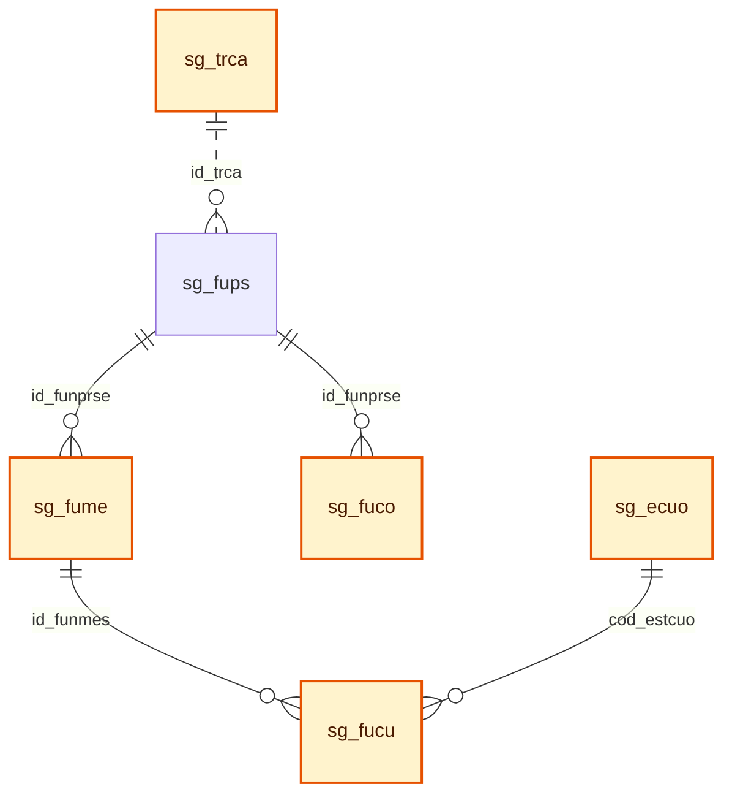

# Plan de Cambios BDD - Solicitud PDS Fase 2

> [!WARNING]
> Este documento conserva el diseño histórico basado en `sg_fume`/`sg_fucu`. Para la implementación vigente queda reemplazado por `template-du09/separacion_solcitud_pago_mes.md`: la solicitud y la resolución registran rango de ejecución y monto total; los meses, cuotas y evidencias nacen exclusivamente en el sistema de pagos.

Este documento contiene solo el alcance de base de datos para la **solicitud PDS**: diagrama vigente, cambios estructurales y descripcion de tablas. No incluye perfilamiento, roles ni etapa formal de pagos.

El modelo se alinea con `bdd_maestros.md`, tomando solo las tablas que corresponden al flujo de solicitud PDS.

El alcance de solicitud llega hasta la generacion de cuotas habilitadas por mes (`sg_fucu`) al momento de formalizar/archivar la PDS con resolucion. La solicitud formal de pago y su detalle quedan fuera de este documento.

> [!IMPORTANT]
> La solicitud PDS no registra evidencias documentales de ejecucion. La evidencia se entiende como documento cargado en la etapa de pago para justificar la realizacion de la actividad de un mes/cuota. Por lo tanto, no se crean tablas de evidencias en este alcance.

> [!IMPORTANT]
> Decision funcional vigente para DU288: cada solicitud persistida debe contener exactamente un funcionario. La actividad ingresada para ese funcionario (`sg_fups.motivo`) es la fuente de verdad y la actividad de la prestacion (`sg_prse.actividad`) se completa y sincroniza automaticamente con el mismo valor. Esta decision reemplaza para DU288 cualquier regla anterior de este documento que permita cero o varios funcionarios, o actividades general e individual editables por separado. El flujo legacy conserva su comportamiento actual.

---

## 2. Modificaciones Estructurales

### 2.1 Diagrama vigente del flujo de solicitud PDS

> [!IMPORTANT]
> Este diagrama no incluye la etapa formal de pagos. Si incluye `sg_fucu` como cuota habilitada generada desde los meses aprobados al formalizar/archivar la PDS.



> [!NOTE]
> Las tablas resaltadas en amarillo son las nuevas a crear. `sg_fups` aparece como contexto de conexion (tabla existente modificada).

---

## 3. Cambios y Descripcion de Tablas

### 3.1 `sg_prse` - Prestacion de servicios

**Accion:** modificar tabla existente.

**Objetivo:** representar la cabecera especifica de una PDS, usando `sg_soli` como cabecera comun.

| Campo | Tipo sugerido | Cambio | Uso |
| :--- | :--- | :--- | :--- |
| `cod_modprs` | `tinyint null` | Agregado BDD | Modalidad de prestacion para separar DU288-D09/2026 del flujo legacy. FK a `sg_tmod.cod_modprs`. |

Reglas:

1. `sg_prse.nro_solici` sigue siendo PK/FK hacia `sg_soli`.
2. `sg_prse` no debe guardar datos de pago.
3. La PDS queda habilitada para pagos solo despues de formalizarse.
4. Al formalizar/archivar la PDS con resolucion, se generan las cuotas habilitadas (`sg_fucu`) desde los meses aprobados (`sg_fume`).

### 3.2 `sg_fups` - Funcionario asociado a PDS

**Accion:** modificar tabla existente.

**Objetivo:** mantener los funcionarios asociados a PDS legacy y, para DU288, representar al unico funcionario de la solicitud junto con los datos requeridos para Fase 2, incluyendo la actividad canonica y la captura minima del tope aplicado.

| Campo | Tipo sugerido | Cambio | Uso |
| :--- | :--- | :--- | :--- |
| `dentro_jor` | `char(1) null` | Agregado BDD | Indica si la prestacion se ejecuta dentro de jornada. |
| `cod_contra` | `int null` | Agregado BDD | Contrato SISPER asociado a la prestacion. |
| `cod_estfun` | `tinyint null` | Agregado BDD | Codigo de estado del funcionario dentro de la solicitud PDS. La descripcion se obtiene desde `sg_efun`. |
| `mes_haber` | `tinyint null` | Agregado BDD | Mes de haberes usado como referencia para calcular el tope cuando aplica remuneracion efectiva. |
| `ano_haber` | `smallint null` | Agregado BDD | Anio de haberes usado como referencia para calcular el tope. |
| `mto_haber` | `int null` | Agregado BDD | Total de haberes/remuneracion efectiva usado como base de calculo del tope. |
| `mto_tope` | `int null` | Agregado BDD | Tope mensual final aplicado/congelado al funcionario al momento de registrar la solicitud. |
| `f_cal_tope` | `datetime null` | Agregado BDD | Fecha en que se calculo y congelo el tope mensual aplicado. |
| `tot_cuotas` | `tinyint null` | Agregado BDD | Total de cuotas previstas para el funcionario. |
| `id_trca` | `int null` | Pendiente | Registro de regla/tope aplicado desde `sg_trca`, cuando exista regla parametrizada. |

Campos existentes que se reutilizan:

| Campo | Uso |
| :--- | :--- |
| `monto_mes` | Monto mensual aprobado PDS. |
| `mto_total` | Monto total aprobado PDS. |
| `cod_sitm` | Item/subitem presupuestario asociado. |
| `itm_global` | Item global presupuestario. |
| `cod_cargo` | Cargo para validaciones de tope e inhabilidad. |
| `cod_tpps` | Tipo/periodicidad existente del modelo actual. |

Reglas:

1. El estado del funcionario se controla con `cod_estfun`, no con un indicador `S/N`.
2. `cod_estfun` debe apuntar a la tabla maestra `sg_efun`; no se guarda la descripcion del estado directamente en `sg_fups`.
3. Si el funcionario queda en estado rechazado, excluido o no incorporable, no debe generar meses en `sg_fume`.
4. Solo funcionarios en estado habilitado/aprobado deben continuar a formalizacion PDS.
5. El registro no se elimina; queda como trazabilidad de la solicitud.
6. `mto_tope` congela el tope mensual usado al momento de registrar el funcionario, para evitar que cambios futuros en `sg_trca` alteren la validacion historica.
7. `mes_haber`, `ano_haber` y `mto_haber` solo se informan cuando el calculo requiere remuneracion efectiva; para topes fijos pueden quedar `NULL`.
8. Validaciones como SEA, compensacion requerida, cargo habilitado, asignacion bloqueante y deuda se recalculan dinamicamente desde contrato, `sg_fuco`, PA09, PA10 y PA de inhabilidad por cargo.
9. Los datos de parentesco se validan contra SISPER (`sp_par1` / `sp_par2`); no se copian como atributos nuevos en `sg_fups` en esta etapa.

### 3.3 `sg_fume` - Meses de ejecucion PDS

**Accion:** crear/confirmar tabla PDS.

**Objetivo:** normalizar los meses de ejecucion aprobados por funcionario.

| Campo | Tipo sugerido | Cambio | Uso |
| :--- | :--- | :--- | :--- |
| `id_funmes` | `int identity` | Crear PK | Identificador del mes aprobado. |
| `id_funprse` | `int` | Crear FK | Funcionario de la PDS. |
| `nro_mes` | `tinyint` | Crear | Numero del mes calendario de ejecucion. |
| `anio` | `smallint` | Crear | Anio del mes de ejecucion. |
| `vigente` | `char(1)` | Crear | Vigencia del periodo. |

Reglas:

1. Cada mes seleccionado para el funcionario genera un registro independiente en `sg_fume`.
2. `sg_fume` no guarda montos. El monto aprobado permanece en `sg_fups`.
3. `sg_fume` es la base para generar una cuota en `sg_fucu` cuando la PDS queda formalizada/archivada con resolucion.
4. `sg_fume` no es dependencia directa de `sg_fuco`; la compensacion horaria se registra con fecha propia en `sg_fuco`.
5. `sg_fume` no guarda evidencias ni constancias; la evidencia de ejecucion pertenece al flujo de pago.

### 3.4 `sg_fucu` - Cuota habilitada por mes PDS

**Accion:** crear tabla PDS Fase 2.

**Objetivo:** registrar la cuota habilitada para cada mes aprobado de un funcionario una vez que la PDS se formaliza y queda archivada con resolucion. Esta tabla deja preparado el registro que despues sera consultado por el flujo de pagos, sin crear aun la solicitud de pago ni su detalle.

| Campo | Tipo sugerido | Cambio | Uso |
| :--- | :--- | :--- | :--- |
| `id_funcuo` | `int identity` | Crear PK | Identificador de la cuota habilitada del funcionario. |
| `id_funmes` | `int` | Crear FK | Mes aprobado desde `sg_fume`. |
| `nro_cuota` | `tinyint` | Crear | Numero de cuota del funcionario dentro de la PDS. |
| `tot_cuotas` | `tinyint` | Crear | Total de cuotas generadas para el funcionario dentro de la PDS. |
| `mto_cuota` | `decimal(19,2)` | Crear | Monto de la cuota mensual. En la etapa de resolucion se registra en 0; el monto real se asigna despues en la solicitud de pago del mes. |
| `cod_estcuo` | `smallint` | Crear FK | Estado propio de la cuota. Referencia `sg_ecuo.cod_estcuo`. |
| `id_docum` | `int null` | Crear | ID del documento de evidencia justificativo del trabajo realizado en el mes. Se asocia en la etapa de pago. |
| `f_gencuo` | `datetime` | Crear | Fecha y hora de generacion de la cuota al formalizar/archivar la PDS. |
| `f_pago` | `datetime null` | Crear | Fecha y hora en que la cuota queda pagada, si aplica. |
| `f_ultmodif` | `datetime` | Crear | Fecha y hora de la ultima actualizacion de la cuota. |
| `vigente` | `char(1)` | Crear | Vigencia logica de la cuota. |

Reglas:

1. `sg_fucu` se genera al formalizar/archivar la PDS con resolucion, no al guardar borrador ni al ingresar meses en `sg_fume`.
2. Cada `sg_fume.id_funmes` vigente debe tener a lo mas una cuota habilitada vigente en `sg_fucu`.
3. `nro_cuota` se asigna por funcionario/PDS segun el orden de `anio` y `nro_mes`.
4. `tot_cuotas` congela el total de cuotas generadas para ese funcionario/PDS.
5. `mto_cuota` queda en 0 al formalizar/archivar la PDS. El monto de pago se asigna posteriormente para cada mes, al crear la solicitud de pago correspondiente.
6. El monto mensual posterior puede ser distinto entre cuotas, siempre que no supere el tope mensual congelado en `sg_fups.mto_tope` para ese funcionario.
7. El estado inicial esperado de `cod_estcuo` es generada.
8. `f_gencuo` debe guardar fecha y hora exacta de generacion de la cuota.
9. `f_pago` queda `NULL` hasta que el flujo posterior marque la cuota como pagada.
10. `f_ultmodif` se actualiza cada vez que cambia el estado, monto o vigencia de la cuota.
11. `sg_fucu` no representa una solicitud de pago; solo representa la cuota habilitada por la resolucion PDS.
12. La solicitud de pago y sus detalles se modelan despues con tablas fuera de este documento.

### 3.5 `sg_ecuo` - Estado de cuota PDS

**Accion:** crear tabla maestra PDS.

**Objetivo:** parametrizar los estados que puede tomar una cuota habilitada en `sg_fucu`, permitiendo controlar si esta generada, disponible, solicitada, autorizada, pagada, rechazada o bloqueada.

| Campo | Tipo sugerido | Cambio | Uso |
| :--- | :--- | :--- | :--- |
| `cod_estcuo` | `smallint` | Crear PK | Codigo de estado de cuota. |
| `des_estcuo` | `varchar(100)` | Crear | Descripcion del estado de cuota. |
| `vigente` | `char(1)` | Crear | Vigencia del estado. |

Datos iniciales esperados:

| cod_estcuo | Estado cuota | Uso esperado |
| :--- | :--- | :--- |
| `1` | Generada | Cuota creada desde el mes aprobado al formalizar/archivar la PDS, aun sin monto de pago asignado. |
| `2` | Disponible | Cuota disponible para ser incluida en una solicitud de pago. |
| `3` | Solicitada | Cuota incluida en una solicitud de pago vigente. |
| `4` | Autorizada | Cuota autorizada para pago. |
| `5` | Pagada | Cuota ya pagada; no debe volver a seleccionarse. |
| `6` | Rechazada | Cuota rechazada en el proceso de pago. |
| `7` | Bloqueada | Cuota bloqueada por validacion pendiente o condicion especial. |

Reglas:

1. `sg_fucu.cod_estcuo` debe apuntar a `sg_ecuo.cod_estcuo`.
2. La descripcion del estado no se guarda en `sg_fucu`; se obtiene desde esta tabla maestra.
3. Los estados pueden reutilizarse posteriormente por el flujo de pago, sin crear otra tabla de estados para cuota.

### 3.6 `sg_fuco` - Compensacion horaria por fecha

**Accion:** reemplazar/evolucionar la tabla creada en BDD.

**Objetivo:** registrar cada tramo de compensacion horaria asociado al funcionario PDS, guardando directamente anio, mes, dia y rango horario de la compensacion. La fecha compensada no debe depender de `sg_fume`, porque puede corresponder a un mes distinto al mes de ejecucion aprobado.

La tabla actualmente integrada en BDD no queda alineada con esta definicion, porque conserva compensacion por funcionario, dia de semana y cantidad de horas. El modelo final debe reemplazar esa estructura por compensacion asociada a funcionario, anio, mes, dia calendario y rango horario.

| Campo | Tipo sugerido | Cambio | Uso |
| :--- | :--- | :--- | :--- |
| `id_funcom` | `int identity` | Crear PK | Identificador del tramo de compensacion. |
| `id_funprse` | `int` | Pendiente | Funcionario de la PDS. FK a `sg_fups.id_funprse`. |
| `anio` | `smallint` | Pendiente | Anio calendario en que se realizara la compensacion. |
| `nro_mes` | `tinyint` | Pendiente | Mes calendario en que se realizara la compensacion. |
| `nro_dia` | `tinyint` | Pendiente | Dia calendario de compensacion dentro de `anio` y `nro_mes`. |
| `hora_inicio` | `datetime` | Pendiente | Hora de inicio del tramo compensado. En Sybase 12 se usa `datetime` guardando la porcion horaria. |
| `hora_termino` | `datetime` | Pendiente | Hora de termino del tramo compensado. En Sybase 12 se usa `datetime` guardando la porcion horaria. |
| `vigente` | `char(1)` | Pendiente | Vigencia logica del tramo de compensacion. |

Reglas:

1. La compensacion se registra por funcionario (`id_funprse`) y fecha calendario (`anio`, `nro_mes`, `nro_dia`), no por `sg_fume.id_funmes`.
2. Puede existir mas de un tramo de compensacion para una misma fecha; en ese caso se registran varias filas con el mismo `id_funprse`, `anio`, `nro_mes` y `nro_dia`.
3. `hora_termino` debe ser mayor que `hora_inicio`.
4. La duracion no se guarda como atributo persistente; se calcula desde `hora_inicio` y `hora_termino`.
5. Los tramos de una misma fecha no deben solaparse para el mismo funcionario.
6. Si la prestacion es dentro de jornada y requiere compensacion, debe existir al menos un tramo vigente asociado al funcionario.
7. Si la compensacion se define en un mes distinto al mes de ejecucion, por ejemplo ejecucion en diciembre y compensacion en enero, `sg_fuco` debe registrar el anio/mes/dia real de compensacion sin depender de `sg_fume`.
8. Para validar cobertura por mes de ejecucion, el sistema puede cruzar por rango de fechas de la PDS y reglas de negocio, pero no debe inferir la fecha compensada solo desde `sg_fume`.

### 3.7 Evidencias y documentos de respaldo

**Accion:** no crear tablas de evidencia en el alcance de solicitud PDS.

**Objetivo:** dejar explicitado que la solicitud PDS no registra evidencia de ejecucion. La evidencia se cargara en la etapa de pago como documento que justifica la actividad realizada.

Reglas:

1. La solicitud PDS no crea ni mantiene tablas propias de evidencia.
2. La evidencia de ejecucion corresponde al flujo de pago, no a la solicitud PDS.
3. Si en el pago se requiere solo un documento por cuota/detalle, debe bastar con un `id_docum` en el detalle de pago futuro.
4. Solo se debe crear una tabla de evidencias de pago si se confirma necesidad de multiples documentos por cuota, historial documental, reemplazo documental o revision documental independiente.
5. Las constancias por parentesco, receso, licencia, permiso u otra condicion especial deben tratarse como documentos de respaldo del flujo correspondiente, no como evidencia de ejecucion de solicitud PDS.

### 3.8 `sg_tmod` - Modalidad de prestacion

**Accion:** crear tabla maestra PDS.

**Objetivo:** parametrizar modalidades de prestacion.

| Campo | Tipo sugerido | Cambio | Uso |
| :--- | :--- | :--- | :--- |
| `cod_modprs` | `tinyint` | Agregado BDD PK | Modalidad de prestacion. |
| `des_modprs` | `varchar(50)` | Agregado BDD | Descripcion de modalidad. |

Datos iniciales:

| id | Descripcion |
| :--- | :--- |
| `1` | Docentes Especiales |
| `2` | DU288-D09/2026 |

### 3.9 Inhabilidad por cargo resuelta por PA

**Accion:** no crear tabla de cargos excluidos.

**Objetivo:** determinar la habilitacion del cargo desde el PA que cruza la informacion del contrato/cargo SISPER con la modalidad PDS y la condicion del Centro de Costo.

Reglas:

1. No se crea tabla local de cargos excluidos.
2. El PA debe marcar como no habilitados los cargos cuyo `sp_carg.cod_tipcar = 5`, correspondiente a cargos directivos.
3. La excepcion asociada a CCTO ANID o condicion institucional definida no se resuelve con una tabla local; debe venir determinada por el PA.
4. Cuando el CCTO cumpla la condicion ANID/definida, la excepcion permitida debe limitarse al cargo `cod_cargo = 3120`, segun regla institucional confirmada.
5. El front solo consume el resultado del PA: cargo habilitado, motivo de inhabilidad y, si aplica, excepcion permitida.
6. La regla no debe inferirse desde texto libre del cargo ni desde una lista hardcodeada en frontend.

### 3.10 `sg_trca` - Reglas y topes DU288

**Accion:** crear tabla maestra PDS.

**Objetivo:** definir la regla de tope mensual aplicable por modalidad, cargo, grupo/planta, jerarquia, nivel, unidad/instituto, anio y rango de vigencia. La tabla debe permitir topes fijos, calculos por remuneracion efectiva y topes especificos por resolucion, sin perder la trazabilidad de la regla usada al guardar el funcionario.

La carga inicial debe construirse cruzando:

1. `sisper_db.dbo.sp_carg`: identifica `cod_cargo`, `nom_cargo`, `cod_tipcar`, `cod_jerpla` y vigencia del cargo.
2. `sisper_db.dbo.sp_jpfu`: traduce `cod_jerpla` a `cod_jerpln` y descripcion de jerarquia/planta.
3. Contrato SISPER: aporta `cod_niv_gr` y `cod_unidad` cuando se necesita una regla mas fina.
4. Escala de Remuneraciones vigente: entrega `mto_base_haber` para topes fijos.
5. Resoluciones DU288-D09/2026: entregan topes especiales, como Directoras y Directores de Institutos Independientes.

| Campo | Tipo sugerido | Cambio | Uso |
| :--- | :--- | :--- | :--- |
| `id_trca` | `int identity` | Crear PK | Identificador unico de la regla/tope. |
| `cod_modprs` | `tinyint` | Crear | Modalidad de prestacion. Para DU288-D09/2026 usar `2`. |
| `cod_cargo` | `smallint null` | Crear | Cargo SISPER cuando la regla aplica a un cargo especifico, por ejemplo `3120` Director Instituto Independiente. |
| `cod_jerpln` | `smallint null` | Crear | Grupo/planta normalizada desde `sp_jpfu.cod_jerpln`. |
| `cod_jerpla` | `varchar(3) null` | Crear | Jerarquia/planta especifica desde `sp_jpfu.cod_jerpla`, cuando la regla requiere mayor precision. |
| `cod_niv_gr` | `varchar(3) null` | Crear | Nivel/grado del contrato, cuando la regla se amarra a un nivel especifico de escala. |
| `cod_unidad` | `char(8) null` | Crear | Unidad SISPER cuando el tope depende de un instituto o unidad especifica. |
| `grado_ref` | `varchar(100) null` | Crear | Nombre operativo de la referencia usada para el calculo o resolucion. |
| `mto_base_haber` | `decimal(12,0) null` | Crear | Total haber/base de calculo usada como referencia. |
| `pct_aplicado` | `decimal(5,2) null` | Crear | Porcentaje aplicado sobre la base, cuando corresponde. |
| `cod_forcal` | `char(1)` | Crear | Forma de calculo: `F` fijo, `C` calculado por remuneracion efectiva, `S` especial pendiente de regla complementaria. |
| `mto_tope` | `decimal(12,0) null` | Crear | Tope mensual final. Obligatorio para reglas `F`; `NULL` para reglas `C`. |
| `ano_vigen` | `smallint` | Crear | Anio de vigencia normativa o presupuestaria. |
| `f_inicio` | `datetime` | Crear | Fecha desde la cual aplica la regla. |
| `f_termino` | `datetime null` | Crear | Fecha hasta la cual aplica la regla. `NULL` indica vigencia abierta. |
| `vigente` | `char(1)` | Crear | Vigencia del registro. |

Valores esperados para `cod_forcal`:

| Codigo | Uso | Como se valida |
| :--- | :--- | :--- |
| `F` | Tope fijo configurado por escala o resolucion. | Comparar el monto mensual solicitado contra `mto_tope`. |
| `C` | Tope calculado con remuneracion efectiva. | Obtener haberes del PA correspondiente, aplicar porcentaje y congelar el resultado en `sg_fups.mto_tope`. |
| `S` | Regla especial no resuelta solo con esta tabla. | Exigir PA/regla complementaria antes de aprobar automaticamente. |

Reglas de busqueda de tope:

1. Primero buscar reglas especificas por `cod_cargo + cod_unidad`, para Directoras y Directores de Institutos Independientes.
2. Luego buscar reglas especificas por `cod_jerpln + cod_jerpla + cod_niv_gr`, para homologacion academica o niveles de escala.
3. Luego buscar reglas generales por `cod_jerpln`, para tecnico, administrativo y auxiliar.
4. Filtrar siempre por `cod_modprs`, fecha dentro de `f_inicio` / `f_termino` y `vigente = 'S'`.
5. Si hay cambio de tope a mitad de anio, se cierra el registro anterior con `f_termino` y se crea uno nuevo con nueva `f_inicio`.
6. `sg_fups.id_trca` debe guardar el registro exacto usado; `sg_fups.mto_tope` congela el tope mensual resultante.

Carga inicial base para DU288-D09/2026:

| id_trca | cod_modprs | cod_cargo | cod_jerpln | cod_jerpla | cod_niv_gr | cod_unidad | grado_ref | mto_base_haber | pct_aplicado | cod_forcal | mto_tope | ano_vigen | f_inicio | f_termino | vigente |
| ---: | ---: | :--- | ---: | :--- | :--- | :--- | :--- | :--- | ---: | :--- | :--- | ---: | :--- | :--- | :--- |
| 1 | 2 | null | 7 | null | null | null | Remuneracion efectiva academico | null | 50.00 | C | null | 2026 | 2026-01-01 | null | S |
| 2 | 2 | null | 7 | 01 | 1 | null | TITULAR A | 4720149 | 50.00 | F | 2360075 | 2026 | 2026-01-01 | null | S |
| 3 | 2 | null | 7 | 02 | 4 | null | ASOCIADO A | 3508060 | 50.00 | F | 1754030 | 2026 | 2026-01-01 | null | S |
| 4 | 2 | null | 7 | 03 | 7 | null | ASISTENTE A | 2653174 | 50.00 | F | 1326587 | 2026 | 2026-01-01 | null | S |
| 5 | 2 | null | 7 | 04 | 11 | null | INSTRUCTOR A | 1723206 | 50.00 | F | 861603 | 2026 | 2026-01-01 | null | S |
| 6 | 2 | null | 3 | null | null | null | TECNICO GRADO MAYOR | 1243268 | 50.00 | F | 621634 | 2026 | 2026-01-01 | null | S |
| 7 | 2 | null | 4 | null | null | null | ADMINISTRATIVO GRADO MAYOR | 1106158 | 50.00 | F | 553079 | 2026 | 2026-01-01 | null | S |
| 8 | 2 | null | 5 | null | null | null | AUXILIAR GRADO MAYOR | 765038 | 50.00 | F | 382519 | 2026 | 2026-01-01 | null | S |
| 9 | 2 | 3120 | 1 | 11 | 156 | 16150000 | DIRECTOR INST. INNOVACION Y EMPRENDIMIENTO | 5291266 | 35.00 | F | 1851943 | 2026 | 2026-01-01 | null | S |
| 10 | 2 | 3120 | 1 | 11 | 156 | pendiente | DIRECTOR INST. INFORMATICA EDUCATIVA | 5291266 | 50.00 | F | 2645633 | 2026 | 2026-01-01 | null | S |
| 11 | 2 | 3120 | 1 | 11 | 156 | pendiente | DIRECTOR INST. AGROINDUSTRIAS | 5291266 | 48.50 | F | 2566751 | 2026 | 2026-01-01 | null | S |
| 12 | 2 | 3120 | 1 | 11 | 156 | pendiente | DIRECTOR INST. DESARROLLO LOCAL Y REGIONAL | 5291266 | 48.30 | F | 2554357 | 2026 | 2026-01-01 | null | S |
| 13 | 2 | 3120 | 1 | 11 | 156 | pendiente | DIRECTOR INST. ESTUDIOS INDIGENAS E INTERCULTURALES | 5291266 | 46.70 | F | 2471469 | 2026 | 2026-01-01 | null | S |
| 14 | 2 | 3120 | 1 | 11 | 156 | pendiente | DIRECTOR INST. MEDIO AMBIENTE | 5291266 | 45.30 | F | 2397930 | 2026 | 2026-01-01 | null | S |

Notas de implementacion:

1. Los `cod_unidad = pendiente` deben reemplazarse por el codigo real de unidad/instituto antes de cargar en produccion.
2. Los cargos directivos generales no se habilitan por `sg_trca`; se validan por PA como inhabilidad. La excepcion parametrizada aqui es el cargo `3120` cuando corresponde a instituto independiente.
3. Para reglas `F`, `mto_tope` queda directo porque el valor ya viene definido por escala o resolucion.
4. Para reglas `C`, `mto_tope` queda `NULL` porque el monto se calcula con los haberes de referencia del funcionario y se congela en `sg_fups`.
5. `cod_jerpla` y `cod_niv_gr` se guardan solo cuando son necesarios para distinguir jerarquias academicas o reglas especificas; para topes generales por planta basta `cod_jerpln`.
### 3.11 `sg_efun` - Estado de funcionario PDS

**Accion:** crear tabla maestra PDS.

**Objetivo:** parametrizar en una tabla separada los estados individuales que puede tomar cada funcionario dentro de una solicitud PDS, permitiendo rechazo parcial sin afectar al resto de funcionarios.

| Campo | Tipo sugerido | Cambio | Uso |
| :--- | :--- | :--- | :--- |
| `cod_estfun` | `smallint` | Crear PK | Codigo de estado del funcionario en la PDS. |
| `des_estfun` | `varchar(100)` | Crear | Descripcion del estado. |
| `vigente` | `char(1)` | Crear | Vigencia del estado. |

Datos iniciales esperados:

| `cod_estfun` | `des_estfun` | Uso esperado |
| :--- | :--- | :--- |
| `1` | Pendiente de revision | Funcionario ingresado, pendiente de validacion. |
| `2` | Observado | Funcionario requiere correccion o antecedente adicional. |
| `3` | Aprobado | Funcionario cumple validaciones y puede continuar a formalizacion PDS. |
| `4` | Rechazado | Funcionario no puede continuar en esta PDS. |
| `5` | Excluido | Funcionario se retira de esta PDS sin eliminar el registro. |

Regla: si un funcionario queda `RECHAZADO` o `EXCLUIDO`, los demas funcionarios de la PDS pueden continuar su proceso.

---

## 4. Referencias Externas

| Tabla | Origen | Uso |
| :--- | :--- | :--- |
| `es_ccto` | FIN21 | Centro de costo, unidad financiera, vigencia, bloqueo, CC global y proyecto global. |
| `sp_carg` | SISPER | Cargo del funcionario, validacion de vigencia y tipo de cargo (`cod_tipcar`) para inhabilidades resueltas por PA. |
| `sp_jpfu` | SISPER | Jerarquia/planta del cargo, usada para resolver reglas de tope por grupo/planta. |
| `sp_par1` | SISPER | Persona relacionada para validacion de parentesco. |
| `sp_par2` | SISPER | Relacion de parentesco vigente entre funcionario y persona relacionada. |

---

## 5. Reglas Generales del Modelo PDS

1. `sg_soli` sigue siendo la cabecera comun de la solicitud.
2. `sg_prse` es la tabla hija especifica de PDS.
3. `sg_fups` mantiene los funcionarios de PDS legacy. Para DU288 debe existir exactamente una fila `sg_fups` por `nro_solici`.
4. `sg_efun` controla el estado individual del funcionario dentro de la PDS.
5. `sg_fume` normaliza los meses por funcionario.
6. `sg_fucu` registra las cuotas habilitadas por mes al formalizar/archivar la PDS con resolucion.
7. `sg_ecuo` parametriza los estados de las cuotas habilitadas.
8. `sg_fuco` registra la compensacion horaria por funcionario, anio, mes, dia y rango horario.
9. La solicitud PDS no registra evidencia de ejecucion; el documento de evidencia pertenece al flujo de pago.
10. `sg_tmod` y `sg_trca` parametrizan reglas propias de Fase 2; la inhabilidad por cargo se resuelve por PA.
11. Las tablas externas se consultan como referencia logica y no se modifican.
12. El flujo de pagos queda fuera de este documento desde la solicitud formal de pago en adelante.

### 5.1 Criterios definidos para el flujo futuro de pagos

Estos criterios se documentan para no contaminar el modelo de solicitud PDS con tablas o campos que corresponden al pago formal.

1. La solicitud de pago se realiza por funcionario (`id_funprse`), no por la PDS completa.
2. El mes de ejecucion aprobado vive en `sg_fume` y puede ser distinto del mes real de pago.
3. El detalle de pago futuro debe registrar mes/anio de pago cuando sea necesario para trazabilidad o calculo financiero.
4. La evidencia de ejecucion es un documento subido en la etapa de pago para justificar la actividad realizada.
5. Mientras se requiera solo un documento por cuota/detalle, no se necesita una tabla propia de evidencias; el documento se asocia directamente a la cuota habilitada (`sg_fucu.id_docum`) en la etapa de pago.
6. Solo se debe crear una tabla de evidencias de pago si se confirma necesidad de multiples documentos por cuota, historial documental, reemplazo documental o revision independiente del documento.
7. El monto no se calcula automáticamente de manera directa. Al abrir el formulario de pago, el sistema valida condiciones como licencias médicas (totales o parciales), días efectivamente trabajados y labores registradas para reducir dinámicamente el tope máximo al cual el funcionario puede optar, restringiendo el formulario para ingresar únicamente un monto menor o igual a este tope ajustado.
8. Si el registro final en Finanzas genera un rechazo externo (por ejemplo, debido a falta de fondos, falta de pago o datos erróneos en su sistema), la respuesta debe ser capturada por nuestro sistema para permitir al usuario reactivar y reenviar la solicitud una vez solucionado el problema.
9. El flujo de pagos en SG-Solicitudes finaliza cuando se guardan/registran correctamente los datos solicitados en las tablas del sistema de Finanzas. Si Finanzas confirma el pago real posterior, esa confirmación puede actualizar `sg_fucu.f_pago` y su estado.

---

## 6. Plan de Integracion Back/Front DU288

Esta seccion define como llevar el modelo maestro al flujo actual sin depender aun de procedimientos definitivos de base de datos. La regla es mantener estable el contrato de datos para que luego solo se reemplace la emulacion por PA/SP real.

### 6.1 Backend - Catalogos y reglas emuladas

1. Mantener endpoints DU288 separados del flujo legacy de PDS:
   - `GET /requests/service-provision/du288/position-caps`
   - Endpoint/PA de validacion de cargo habilitado por funcionario/contrato.
2. `position-caps` debe emular el cruce futuro entre `sg_trca`, `sp_jpfu` y `sp_carg`.
3. La respuesta debe incluir datos de regla y datos descriptivos:

| Campo API | Origen futuro | Uso Front |
| :--- | :--- | :--- |
| `idTrca` | `sg_trca.id_trca` | Guardar en payload del funcionario como regla exacta aplicada. |
| `codCargo` | `sp_carg.cod_cargo` | Cruzar contrato seleccionado contra su cargo descriptivo. |
| `codModprs` | `sg_trca.cod_modprs` | Asegurar que aplica a DU288. |
| `codJerpln` | `sg_trca.cod_jerpln` / `sp_jpfu.cod_jerpln` | Resolver grupo/planta usado por la regla. |
| `codJerpla` | `sg_trca.cod_jerpla` / `sp_carg.cod_jerpla` / `sp_jpfu.cod_jerpla` | Resolver jerarquia especifica cuando la regla lo requiere. |
| `codNivGr` | `sg_trca.cod_niv_gr` / contrato SISPER | Resolver nivel/grado cuando la regla se amarra a escala especifica. |
| `codUnidad` | `sg_trca.cod_unidad` / contrato SISPER | Resolver topes especificos por instituto o unidad. |
| `year` | `sg_trca.ano_vigen` | Mostrar vigencia normativa. |
| `startDate` | `sg_trca.f_inicio` | Resolver reajustes dentro del anio. |
| `endDate` | `sg_trca.f_termino` | Resolver vigencia abierta o cerrada. |
| `codForcal` | `sg_trca.cod_forcal` | Distinguir fijo, calculado o especial. |
| `mtoTope` | `sg_trca.mto_tope` | Tope fijo cuando `codForcal = F`. |
| `vigente` | `sg_trca.vigente` | Filtrar reglas activas. |
| `nomCargo` | `sp_carg.nom_cargo` | Mostrar nombre de cargo. |
| `codTipcar` | `sp_carg.cod_tipcar` | Identificar academico/no academico. |
| `planta` | derivado de `sp_jpfu.des_jerpla` / `cod_jerpln` | Agrupar visualmente y calcular tope fijo. |
| `nivelJerarquico` | derivado de `sp_jpfu` | Mostrar dato legible en catalogo. |

4. Para reglas fijas (`codForcal = F`), `mtoTope` debe venir informado.
5. Para reglas calculadas (`codForcal = C`), `mtoTope` puede venir `0` o `NULL`; el backend/front calcula con PA11 o con la emulacion vigente.
6. Para cargos no habilitados, el front debe bloquear usando el resultado del PA de inhabilidad por cargo, no `sg_trca` ni una tabla local de excluidos.
7. Para reglas especiales (`codForcal = S`), el front debe advertir o bloquear segun la regla complementaria definida.
8. Cuando exista el PA real, debe mantener la misma forma de respuesta para no modificar el front.

### 6.2 Frontend - Vista y validacion

1. La tabla de catalogo de topes debe consumir solo `position-caps`; no debe tener topes hardcodeados.
2. La tabla debe mostrar solo datos utiles:
   - codigo de cargo,
   - nombre de cargo,
   - planta/nivel,
   - tipo de regla,
   - tope mensual cuando exista,
   - vigencia.
3. La lista de contratos debe calcular dinamicamente el tope aplicable segun el contrato seleccionado.
4. Si el contrato cambia, deben recalcularse:
   - cargo habilitado,
   - regla de tope,
   - tope mensual aplicable,
   - referencia de remuneracion efectiva si corresponde,
   - mensajes visuales y badges.
5. El valor del tope debe mostrarse como dato informativo; solo se usa color de error cuando el monto solicitado excede el tope o falta un dato obligatorio para calcular.
6. La vista de solicitud no debe exigir evidencia documental de ejecucion. Cualquier documento de respaldo debe quedar como definicion del flujo correspondiente y no como tabla de evidencia dentro de la solicitud PDS.

### 6.3 Payload DU288 mientras no exista BDD Fase 2

El payload debe seguir enviando datos actuales y agregar campos planos en cada funcionario para dejar preparado el mapeo futuro a `sg_fups`.

| Campo payload funcionario | Campo futuro | Regla |
| :--- | :--- | :--- |
| `idTrca` / `id_trca` | `sg_fups.id_trca` | Se toma desde la regla `position-caps` aplicada. |
| `mesHaber` / `mes_haber` | `sg_fups.mes_haber` | Solo se informa cuando `codForcal = C`. |
| `anoHaber` / `ano_haber` | `sg_fups.ano_haber` | Anio de haberes usado como referencia. |
| `mtoHaber` / `mto_haber` | `sg_fups.mto_haber` | Total de remuneracion efectiva usado para calcular. |
| `mtoTope` / `mto_tope` | `sg_fups.mto_tope` | Tope mensual final congelado al agregar/guardar funcionario. |
| `fCalTope` / `f_cal_tope` | `sg_fups.f_cal_tope` | Fecha/hora del calculo congelado. |

Los campos `topRule`, `topValidation` y `remuneration` pueden mantenerse temporalmente como metadata de pantalla, pero no deben ser la unica fuente del dato congelado que luego se guardara en `sg_fups`.

### 6.4 Backend - Guardado actual sin procedimiento nuevo

1. No modificar SP/PA de guardado hasta que existan las columnas reales.
2. Permitir que el request reciba metadata DU288 sin romper el schema.
3. No enviar estos datos a `sg_hist`; el historial debe registrar acciones del flujo, no snapshots completos del formulario.
4. Cuando se agreguen columnas a BDD, actualizar:
   - modelo `RequestStaff`,
   - transformacion `toProcedure`,
   - queries/procedimientos de insert/update de funcionario PDS,
   - lectura de detalle para reconstruir el borrador.

### 6.5 Orden de implementacion recomendado

1. Actualizar modelo `Du288PositionCap` con `idTrca`, `codModprs`, `startDate`, `endDate` y `codForcal`.
2. Actualizar emulacion backend de `sg_trca` con esos campos.
3. Ajustar compensacion horaria para enviarse por funcionario, anio, mes, dia y rango horario cuando exista la tabla definitiva.
4. Agregar campos planos de tope congelado al `buildStaffPayload`.
5. Ajustar helpers visuales para leer `codForcal` y mostrar regla fija/calculada/especial.
6. Validar flujo: buscar funcionario, seleccionar contrato, agregar funcionario, guardar borrador, recargar y reconstruir vista.

---

## 7. Plan Operativo de Implementacion

Este plan permite aplicar los cambios en backend y frontend sin tocar aun los procedimientos definitivos de BDD. Todo lo implementado debe quedar preparado para reemplazar la emulacion por PA/SP real sin cambiar la vista ni el payload.

### 7.1 Backend

**Objetivo:** entregar al frontend los catalogos DU288 con la misma forma que tendra el PA real.

1. Actualizar `Du288PositionCap`.
   - Agregar `idTrca`.
   - Agregar `codModprs`.
   - Agregar `startDate`.
   - Agregar `endDate`.
   - Agregar `codForcal`.
   - Mantener compatibilidad con campos actuales (`codCargo`, `nomCargo`, `codTipcar`, `codJerpla`, `codJerpln`, `mtoTope`, `capAmount`, `calculationType`, `year`, `vigente`).

2. Actualizar emulacion de `getDu288PositionCaps`.
   - `emulatedSgTrca` debe representar la futura `sg_trca`.
   - Cada fila debe tener `idTrca`, `codJerpln`, `codModprs`, `year`, `startDate`, `endDate`, `codForcal`, `mtoTope`, `vigente`.
   - `emulatedSpCarg` debe representar los datos descriptivos de cargo desde `sp_carg`.
   - `emulatedSpJpfu` debe representar la clasificacion de jerarquia/planta desde `sp_jpfu`.
   - El cruce debe devolver una respuesta unificada por cargo/regla, resolviendo `cod_jerpln` desde `sp_carg.cod_jerpla -> sp_jpfu.cod_jerpln`.

3. Actualizar validacion de cargo habilitado.
   - Reemplazar la emulacion/listado de cargos excluidos por una validacion basada en PA.
   - El PA debe usar `sp_carg.cod_tipcar = 5` para identificar cargos directivos no habilitados.
   - Si el CCTO cumple condicion ANID/definida, el PA debe permitir solo la excepcion `cod_cargo = 3120`.
   - En front solo debe usarse como validacion de bloqueo o excepcion informada.

4. Preparar modelos de request sin persistencia nueva.
   - No modificar SP de insert/update hasta que existan columnas.
   - Permitir que el request transporte metadata DU288.
   - No guardar snapshots DU288 en `sg_hist`.

### 7.2 Frontend

**Objetivo:** consumir catalogos DU288 desde backend, mostrar datos consistentes y enviar payload preparado para BDD futura.

1. Catalogo de topes.
   - Consumir solo `getDu288PositionCaps`.
   - Quitar topes hardcodeados del componente.
   - Mostrar columnas utiles: cargo, nombre, planta/nivel, tipo de regla, tope mensual, vigencia.
   - Hacer tabla responsive y evitar textos extensos innecesarios.

2. Validacion del contrato seleccionado.
   - Buscar regla por `codJerpln`, `codModprs`, vigencia y `codForcal`.
   - Si `codForcal = F`, usar `mtoTope`.
   - Si `codForcal = C`, calcular con remuneracion efectiva y regla DU288.
   - Si `codForcal = S`, mostrar advertencia/bloqueo segun regla complementaria.
   - Si el PA indica cargo no habilitado, bloquear funcionario e informar motivo.

3. Payload del funcionario.
   - Agregar campos planos:
     - `idTrca` / `id_trca`.
     - `mesHaber` / `mes_haber`.
     - `anoHaber` / `ano_haber`.
     - `mtoHaber` / `mto_haber`.
     - `mtoTope` / `mto_tope`.
     - `fCalTope` / `f_cal_tope`.
   - Mantener `topRule`, `topValidation` y `remuneration` solo como metadata temporal de UI.
   - Congelar el tope cuando el funcionario se agrega o guarda, no recalcularlo silenciosamente al recargar.

4. Evidencias y documentos.
   - No exigir evidencia de ejecucion en la vista de solicitud.
   - Quitar dependencias de catalogos de evidencia para el guardado de solicitud PDS.
   - Si se requiere un documento de respaldo normativo, tratarlo como definicion de la etapa correspondiente y no como evidencia de ejecucion.

5. Vista de solicitud.
   - Mantener badges y colores homologados.
   - Mostrar tope como dato informativo.
   - Usar rojo solo si bloquea o excede.
   - Recalcular visualmente cuando cambia el contrato seleccionado.

### 7.3 Guardado y reconstruccion de borrador

1. Al guardar borrador:
   - Enviar `provision` actualizado.
   - Para DU288, enviar `staffList` con exactamente un funcionario.
   - Para DU288, derivar `provision.activity` desde `staffList[0].reason` antes de persistir.
   - Para legacy, mantener el contrato actual de `staffList` completa.
   - No permitir que una solicitud DU288 quede persistida sin funcionario.
   - No crear registros vacios.

2. Al recargar solicitud:
   - Reconstruir `staffSummary` desde `staffList`.
   - Si vienen campos nuevos planos, usarlos como fuente prioritaria.
   - Si no vienen, reconstruir desde metadata temporal cuando exista.
   - Si no hay detalle DU288 completo, mostrar advertencia solo si realmente faltan datos no recuperables.

### 7.4 Pruebas manuales minimas

1. Buscar funcionario academico con regla calculada.
2. Buscar funcionario administrativo/auxiliar con tope fijo.
3. Buscar cargo directivo (`cod_tipcar = 5`) y confirmar bloqueo desde PA.
4. Cambiar contrato seleccionado y confirmar recalculo de tope.
5. Agregar funcionario, guardar borrador y recargar.
6. Editar funcionario, guardar cambios y recargar.
7. Reemplazar el funcionario conservando la cardinalidad uno a uno, guardar borrador y recargar.
8. Validar que `position-caps` y el PA/endpoint de cargo habilitado no respondan 404.
9. Validar que el flujo legacy de PDS Docentes Especiales no cambie.

---

## 8. Estado de Implementacion Actual en BDD

Esta seccion registra solo lo que ya aparece integrado en `diagrama_secgen_actualizado.md`.

> [!IMPORTANT]
> El analisis y modelo objetivo de las secciones anteriores no se modifica. Esta seccion funciona como bitacora del estado real integrado en la BDD y debe actualizarse a medida que se agreguen nuevas tablas o columnas.

### 8.1 Resumen de cambios integrados

| Estado | Tablas |
| :--- | :--- |
| Creadas | `sg_tmod`, `sg_efun`, `sg_fuco` |
| Modificadas | `sg_prse`, `sg_fups` |
| Aun no integradas | `sg_fume`, `sg_fucu`, `sg_ecuo`, `sg_trca` |
| Requiere evolucion | `sg_fuco` |
| Fuera del alcance de solicitud | Evidencia documental de pago y tablas documentales asociadas |

### 8.2 Tablas creadas actualmente

#### `sg_tmod` - Modalidad de prestacion

**Estado:** creada.

| Campo | Tipo BDD | Null | Uso |
| :--- | :--- | :--- | :--- |
| `cod_modprs` | `tinyint` | `NOT NULL` | Codigo de modalidad de prestacion. PK. |
| `des_modprs` | `varchar(60)` | `NOT NULL` | Descripcion de la modalidad. |

Definicion observada:

```sql
CREATE TABLE secgen_db.dbo.sg_tmod (
    cod_modprs tinyint NOT NULL,
    des_modprs varchar(60) NOT NULL,
    CONSTRAINT SG_TMOD_PK PRIMARY KEY (cod_modprs)
);
```

Nota de alineacion:

- En el modelo objetivo se venia usando `id_modprse` / `des_modprse`.
- En la BDD integrada quedo como `cod_modprs` / `des_modprs`.
- Se debe usar el nombre real integrado o definir una normalizacion antes de actualizar procedimientos/backend.

#### `sg_efun` - Estado de funcionario PDS

**Estado:** creada.

| Campo | Tipo BDD | Null | Uso |
| :--- | :--- | :--- | :--- |
| `cod_estfun` | `tinyint` | `NOT NULL` | Codigo de estado individual del funcionario. PK. |
| `des_estfun` | `varchar(60)` | `NOT NULL` | Descripcion del estado. |

Definicion observada:

```sql
CREATE TABLE secgen_db.dbo.sg_efun (
    cod_estfun tinyint NOT NULL,
    des_estfun varchar(60) NOT NULL,
    CONSTRAINT SG_EFUN_PK PRIMARY KEY (cod_estfun)
);
```

Nota de alineacion:

- En el modelo objetivo se consideraba `vigente`.
- La BDD integrada no trae `vigente`.
- Si los estados seran estables y no administrables, puede quedar asi. Si se requiere parametrizacion futura, conviene evaluar agregar `vigente`.

#### `sg_fuco` - Compensacion horaria

**Estado:** creada.

| Campo | Tipo BDD | Null | Uso |
| :--- | :--- | :--- | :--- |
| `id_funprse` | `int` | `NOT NULL` | Funcionario PDS asociado. FK a `sg_fups`. |
| `dia_semana` | `tinyint` | `NOT NULL` | Dia de la semana compensado. |
| `cant_horas` | `tinyint` | `NOT NULL` | Campo existente. No queda alineado al modelo final porque la compensacion se definira por dia y rango horario. |

Definicion observada:

```sql
CREATE TABLE secgen_db.dbo.sg_fuco (
    id_funprse int NOT NULL,
    dia_semana tinyint NOT NULL,
    cant_horas tinyint NOT NULL,
    CONSTRAINT SG_FUCO_PK PRIMARY KEY (id_funprse,dia_semana),
    CONSTRAINT FK_sg_fuco_sg_fups FOREIGN KEY (id_funprse)
        REFERENCES secgen_db.dbo.sg_fups(id_funprse)
        ON DELETE RESTRICT ON UPDATE RESTRICT
);
```

Nota de alineacion:

- En el modelo objetivo inicial se proponia cantidad de horas, pero la definicion funcional actual cambia a compensacion por dia y rango horario.
- En la BDD integrada quedo con PK compuesta `id_funprse + dia_semana`.
- Como no se permite modificar la tabla, la clave se mantiene en `id_funprse + fec_compro`. `fec_compro` utiliza su componente horario para guardar el inicio real y distinguir varios tramos del mismo dia; `hora_ini` y `hora_ter` conservan el rango informado. Si `hora_ter` es menor que `hora_ini`, el fin se interpreta en el dia siguiente.
- `cant_horas` no debe usarse como dato principal del modelo final.
- La definicion funcional actual requiere compensacion por fecha calendario y rango horario. Por lo tanto, se recomienda evolucionar `sg_fuco` para usar `id_funprse`, `anio`, `nro_mes`, `nro_dia`, `hora_inicio`, `hora_termino` y `vigente`.

### 8.3 Tablas modificadas actualmente

#### `sg_prse` - Prestacion de servicios

**Estado:** modificada.

Campo agregado:

| Campo | Tipo BDD | Null | Uso |
| :--- | :--- | :--- | :--- |
| `cod_modprs` | `tinyint` | `NULL` | Modalidad de prestacion. FK a `sg_tmod.cod_modprs`. |

Definicion relevante observada:

```sql
CREATE TABLE secgen_db.dbo.sg_prse (
    nro_solici int NOT NULL,
    actividad varchar(255) NOT NULL,
    per_desde datetime NOT NULL,
    per_hasta datetime NOT NULL,
    rut_jefpro char(9) NOT NULL,
    cod_unifin smallint NULL,
    cod_ccto smallint NULL,
    cc_global varchar(9) NULL,
    pry_global varchar(12) NULL,
    cod_modprs tinyint NULL,
    CONSTRAINT SG_PRSE_PK PRIMARY KEY (nro_solici),
    CONSTRAINT FK_sg_prse_sg_soli FOREIGN KEY (nro_solici)
        REFERENCES secgen_db.dbo.sg_soli(nro_solici)
        ON DELETE RESTRICT ON UPDATE RESTRICT,
    CONSTRAINT FK_sg_prse_sg_tmod_2 FOREIGN KEY (cod_modprs)
        REFERENCES secgen_db.dbo.sg_tmod(cod_modprs)
        ON DELETE RESTRICT ON UPDATE RESTRICT
);
```

Nota de alineacion:

- Este cambio ya cubre la separacion entre modalidad legacy y DU288.
- El backend/frontend deben usar `cod_modprs` si se respeta el nombre integrado.

#### `sg_fups` - Funcionario asociado a PDS

**Estado:** modificada.

Campos agregados observados:

| Campo | Tipo BDD | Null | Uso |
| :--- | :--- | :--- | :--- |
| `cod_estfun` | `tinyint` | `NULL` | Estado individual del funcionario. FK a `sg_efun`. |
| `dentro_jor` | `char(1)` | `NULL` | Indica si la prestacion se ejecuta dentro de jornada. |
| `cod_contra` | `int` | `NULL` | Contrato SISPER asociado. |
| `mes_haber` | `tinyint` | `NULL` | Mes de haberes usado como referencia para calculo de tope. |
| `ano_haber` | `smallint` | `NULL` | Anio de haberes usado como referencia para calculo de tope. |
| `mto_haber` | `int` | `NULL` | Monto de haberes/remuneracion efectiva usado como base de calculo. |
| `mto_tope` | `int` | `NULL` | Tope aplicado/congelado para el funcionario. |
| `f_cal_tope` | `datetime` | `NULL` | Fecha de calculo del tope aplicado. |
| `tot_cuotas` | `tinyint` | `NULL` | Total de cuotas previstas para el funcionario/PDS. |

Definicion relevante observada:

```sql
CREATE TABLE secgen_db.dbo.sg_fups (
    id_funprse int NOT NULL,
    nro_solici int NOT NULL,
    rut char(9) NOT NULL,
    cod_cargo smallint NULL,
    cod_sitm varchar(5) NULL,
    itm_global varchar(15) NULL,
    motivo varchar(255) NULL,
    periodos tinyint NOT NULL,
    monto_mes decimal(19,2) NOT NULL,
    mto_total decimal(19,2) NOT NULL,
    cod_moneda tinyint NULL,
    cod_tpps int NULL,
    f_inicio datetime NULL,
    f_termino datetime NULL,
    cod_estfun tinyint NULL,
    dentro_jor char(1) NULL,
    cod_contra int NULL,
    mes_haber tinyint NULL,
    ano_haber smallint NULL,
    mto_haber int NULL,
    mto_tope int NULL,
    f_cal_tope datetime NULL,
    tot_cuotas tinyint NULL,
    CONSTRAINT SG_FUPS_PK PRIMARY KEY (id_funprse),
    CONSTRAINT FK_sg_fups_sg_efun FOREIGN KEY (cod_estfun)
        REFERENCES secgen_db.dbo.sg_efun(cod_estfun)
        ON DELETE RESTRICT ON UPDATE RESTRICT,
    CONSTRAINT FK_sg_fups_sg_prse_2 FOREIGN KEY (nro_solici)
        REFERENCES secgen_db.dbo.sg_prse(nro_solici)
        ON DELETE RESTRICT ON UPDATE RESTRICT,
    CONSTRAINT FK_sg_fups_sg_tpps_3 FOREIGN KEY (cod_tpps)
        REFERENCES secgen_db.dbo.sg_tpps(cod_tpps)
        ON DELETE RESTRICT ON UPDATE RESTRICT
);
```

Notas de alineacion:

1. `cod_contra` cumple el rol que en el modelo objetivo se llamaba `id_contrato`.
2. `mes_haber` + `ano_haber` reemplazan mejor a `mes_haber_ref`, porque quedan consultables por separado.
3. `mto_haber` cumple el rol de `mto_haber_ref`.
4. `mto_tope` cumple el rol de `mto_tope_mes`, pero conviene documentar que corresponde al tope mensual aplicado.
5. `f_cal_tope` cumple el rol de `f_calculo_tope`.
6. `tot_cuotas` queda en `sg_fups`; puede servir para congelar el total esperado por funcionario, aunque `sg_fucu` tambien deberia guardar `nro_cuota` y estado por cuota cuando se integre.
7. Falta `id_trca`, que permitiria saber que regla/tope exacto de `sg_trca` se uso para calcular `mto_tope`.

### 8.4 Pendientes respecto al modelo objetivo

| Tabla/cambio | Estado | Motivo |
| :--- | :--- | :--- |
| `sg_fume` | Pendiente | Necesaria para normalizar meses aprobados por funcionario. |
| `sg_fucu` | Pendiente | Necesaria para generar cuotas habilitadas por mes al formalizar/archivar la PDS. |
| `sg_ecuo` | Pendiente | Necesaria para parametrizar estados de cuota. |
| `sg_trca` | Pendiente | Necesaria para parametrizar topes/reglas por grupo, modalidad y vigencia. |
| PA cargo habilitado | Pendiente | Necesario para resolver inhabilidad por `cod_tipcar = 5` y excepcion `cod_cargo = 3120` segun CCTO ANID/definido. |
| `id_trca` en `sg_fups` | Pendiente | Necesaria si se quiere congelar la regla exacta aplicada al tope. |
| `vigente` en `sg_efun` | Por evaluar | Util si los estados seran administrables o historizables. |
| Evolucion de `sg_fuco` | Pendiente | Necesaria para que `sg_fuco` represente compensacion por `id_funprse`, `anio`, `nro_mes`, `nro_dia`, `hora_inicio` y `hora_termino`, sin cantidad de horas. |

### 8.5 Recomendacion de uso para backend/frontend

1. Consumir y persistir `cod_modprs` como modalidad real de `sg_prse`.
2. Mapear `cod_contra` como contrato seleccionado del funcionario.
3. Mapear `mes_haber`, `ano_haber`, `mto_haber`, `mto_tope` y `f_cal_tope` desde el calculo DU288 actual.
4. Usar `cod_estfun` para estado individual del funcionario, no un indicador `S/N`.
5. Mientras no existan `sg_fume` y `sg_fucu`, no se puede cerrar completamente la generacion de cuotas por mes.
6. Mientras no exista `sg_trca`, el tope se puede guardar en `sg_fups.mto_tope`, pero no queda trazada la regla exacta usada salvo por metadata externa.
7. Para compensacion horaria, el frontend/backend deben enviar anio, mes, dia y rango horario; la duracion debe calcularse desde `sg_fuco.hora_inicio` y `sg_fuco.hora_termino`.

---

## 9. Cambio E2E - Solicitud DU288 con un funcionario y una actividad

### 9.1 Decision funcional

1. La regla aplica solo a solicitudes con `sg_prse.cod_modprs = 2`.
2. Toda solicitud DU288 persistida debe contener exactamente un funcionario.
3. Una solicitud DU288 no puede guardarse ni enviarse con cero funcionarios.
4. Una solicitud DU288 no puede guardarse ni enviarse con mas de un funcionario.
5. La actividad se ingresa una sola vez, en el bloque del funcionario.
6. `sg_fups.motivo` es la fuente de verdad de la actividad DU288.
7. `sg_prse.actividad` es una copia automatica para compatibilidad con consultas, cabeceras, workflow y resoluciones.
8. Para una solicitud DU288 debe cumplirse siempre:

```text
COUNT(sg_fups WHERE nro_solici = solicitud) = 1
sg_prse.actividad = sg_fups.motivo
```

9. El flujo legacy conserva multiples funcionarios y actividades diferenciadas.
10. Las solicitudes historicas no se migran ni se sobrescriben por este cambio. Se mantienen consultables con su informacion original.

### 9.2 Procedimientos almacenados

#### `sg_fupsiSecgen01`

1. Resolver la modalidad real desde `sg_prse.cod_modprs`.
2. Si la modalidad es DU288 y ya existe una fila en `sg_fups` para `nro_solici`, rechazar la insercion antes de consumir el correlativo.
3. Retornar un contrato explicito:
   - exito: `status = 1`, `id_funprse` y `msg`;
   - rechazo: `status = 0`, `code` y `msg`.
4. En DU288, insertar `sg_fups.motivo` con la actividad recibida y actualizar `sg_prse.actividad` con el mismo valor dentro de la misma transaccion.
5. En legacy, mantener el comportamiento actual.

#### `sg_fupsuSecgen01`

1. Identificar la solicitud y modalidad asociadas a `id_funprse`.
2. En DU288, actualizar `sg_fups.motivo` y `sg_prse.actividad` de forma atomica.
3. Retornar `status`, `code` y `msg` verificables por backend.
4. En legacy, no sincronizar ambos campos automaticamente.

#### Reemplazo del funcionario

1. No implementar el reemplazo DU288 como `DELETE` seguido de `INSERT`.
2. Reutilizar el `id_funprse` existente y actualizar la fila mediante `sg_fupsuSecgen01`.
3. Reemplazar horarios y compensaciones dependientes dentro de la misma transaccion backend.
4. Esto evita estados intermedios sin funcionario, conserva la cardinalidad y mantiene estables las referencias al registro.
5. La eliminacion aislada del unico funcionario DU288 no debe formar parte del flujo normal de guardado.

### 9.3 Backend

1. Centralizar la regla en la validacion normativa compartida por crear y actualizar.
2. Antes de abrir una transaccion, validar para DU288:
   - `staffList` existe;
   - `staffList.length === 1`;
   - `staffList[0].reason` tiene contenido valido;
   - no existen identificadores de funcionario duplicados o ajenos a la solicitud.
3. Normalizar siempre:

```text
request.provision.activity = request.staffList[0].reason
```

4. No confiar en `provision.activity` enviado por el cliente para DU288.
5. En creacion, normalizar la actividad antes de ejecutar el PA de `sg_prse`.
6. En actualizacion, reutilizar el `id_funprse` persistido cuando se cambie el funcionario.
7. Validar que los PA de funcionario retornen `status = 1`; cualquier otro resultado debe lanzar una excepcion y provocar rollback.
8. Responder:
   - `422 Unprocessable Entity` para payload con cardinalidad o actividad invalida;
   - `409 Conflict` cuando el PA detecte un segundo funcionario o una inconsistencia concurrente.
9. Mantener la validacion en backend aunque el frontend bloquee la accion.

### 9.4 Frontend

1. Mantener un solo campo editable: `Actividad del funcionario`.
2. Retirar la edicion independiente de `Descripcion general de la actividad` en el formulario DU288.
3. Construir el payload con el mismo valor en:
   - `staffList[0].reason` como dato principal;
   - `provision.activity` como copia de transporte compatible.
4. Deshabilitar la busqueda/agregado cuando ya existe un funcionario.
5. Mantener disponibles las acciones de editar y reemplazar el funcionario existente.
6. Bloquear guardado y envio si `staffSummary.length !== 1`.
7. Bloquear guardado y envio si la actividad del funcionario esta vacia o no cumple el largo minimo.
8. Mostrar la misma actividad en:
   - resumen del funcionario;
   - resumen previo al envio;
   - detalle de la solicitud;
   - resumen del workflow;
   - resolucion.
9. Ajustar textos de creacion a singular: `Funcionario de la solicitud`, `Actividad del funcionario` y mensajes equivalentes.
10. En vistas historicas capaces de recibir varias filas, conservar presentacion compatible y no ocultar informacion existente.
11. Permitir quitar el funcionario de la tabla durante la edicion local. La solicitud no puede guardarse ni enviarse hasta incorporar nuevamente exactamente uno.

### 9.5 Matriz de validaciones

| Capa | Caso | Resultado esperado |
| :--- | :--- | :--- |
| Frontend | Intentar guardar sin funcionario | Bloqueo local con mensaje claro. |
| Frontend | Intentar agregar un segundo funcionario | Accion deshabilitada y guarda defensiva sin modificar el resumen. |
| Frontend | Actividad vacia o menor al minimo | Bloqueo antes de guardar o enviar. |
| Backend | `staffList` vacia | `422`, sin abrir transaccion de escritura. |
| Backend | `staffList` con dos o mas filas | `422`, sin abrir transaccion de escritura. |
| Backend | `provision.activity` distinto de `staffList[0].reason` | Backend usa la actividad del funcionario y reemplaza la copia de prestacion. |
| PA | Segunda insercion DU288 para el mismo `nro_solici` | `status = 0`, sin consumir correlativo ni insertar. |
| PA | Actualizacion de actividad DU288 | `sg_fups.motivo` y `sg_prse.actividad` quedan iguales. |
| Transaccion | Falla horario o compensacion | Rollback de todos los cambios de funcionario y actividad. |
| Legacy | Solicitud con multiples funcionarios | Mantiene el comportamiento actual. |
| Historico | Consulta DU288 con multiples funcionarios previos | Se visualiza sin migracion destructiva. |

### 9.6 Pruebas y criterios de aceptacion

1. Crear una solicitud DU288 con un funcionario y confirmar persistencia exitosa.
2. Confirmar en BDD que existe una sola fila `sg_fups` para la solicitud.
3. Confirmar que `sg_prse.actividad` y `sg_fups.motivo` son iguales.
4. Editar la actividad del funcionario y verificar que ambos campos cambian en la misma transaccion.
5. Reemplazar el funcionario y comprobar que se reutiliza la relacion uno a uno sin crear una segunda fila.
6. Intentar guardar payloads con cero y dos funcionarios y confirmar `422`.
7. Ejecutar directamente el PA intentando una segunda insercion y confirmar `status = 0`.
8. Simular dos inserciones concurrentes y confirmar que solo una puede persistir.
9. Provocar una falla al sincronizar horarios o compensaciones y confirmar rollback completo.
10. Generar resumen y resolucion y verificar que muestran la actividad del funcionario como actividad de la prestacion.
11. Abrir solicitudes historicas y confirmar que siguen siendo consultables.
12. Crear/editar una solicitud legacy con multiples funcionarios y confirmar ausencia de regresiones.

### 9.7 Orden de implementacion y despliegue

1. Actualizar y probar PA en ambiente de desarrollo.
2. Implementar normalizacion, validaciones y manejo de respuesta PA en backend.
3. Agregar pruebas unitarias de backend y pruebas de transaccion.
4. Actualizar formulario, resumen, detalle y mensajes del frontend.
5. Ejecutar `npm run build` y `npm run test:unit` en backend.
6. Ejecutar lint, `lint:du288-ui` y build en frontend.
7. Ejecutar la matriz E2E contra BDD de desarrollo.

### 9.8 Regla de jornada y Jefatura Directa

1. La solicitud DU288 siempre se envia primero al Jefe de Proyecto. La condicion de jornada no altera esta etapa.
2. Despues de la aprobacion del Jefe de Proyecto:
   - `dentro_jor IN ('S', 'D')`: se resuelve y asigna la Jefatura Directa vigente;
   - `dentro_jor = 'N'`: la etapa Jefe Directo Funcionario no aplica y se omite.
3. La omision por jornada no debe crear una tarea pendiente ni una aprobacion automatica atribuida al jefe directo.
4. La omision debe quedar registrada en el historial con el motivo funcional y con el usuario cuya aprobacion produjo el avance.
5. La previsualizacion debe informar:
   - la etapa que no aplica;
   - el motivo: prestacion fuera de jornada;
   - la siguiente etapa efectiva y su responsable vigente.
6. `sg_etasSecgen01` debe retornar `OMITIR_FUERA_JORNADA` para la estrategia `JEFE_DIRECTO` cuando `sg_fups.dentro_jor = 'N'`.
7. Si la condicion de jornada es nula o distinta de `S`, `D` o `N`, backend debe bloquear el avance por dato inconsistente.
8. Esta regla es distinta de la omision por actor repetido: fuera de jornada significa que la revision no aplica; actor repetido significa que la misma persona revisara posteriormente en otra etapa.

| Condicion | Jefe de Proyecto | Jefe Directo | Resultado |
| :--- | :--- | :--- | :--- |
| Dentro de jornada (`S`/`D`) | Revisa | Revisa | Continuan ambas visaciones configuradas. |
| Fuera de jornada (`N`) | Revisa | No aplica | Se registra la omision y se continua a la siguiente etapa organizacional. |
| No informada/invalida | No se altera la revision ya realizada | No se resuelve | Se bloquea el avance hasta corregir el dato. |

### 9.9 Archivos principales afectados

| Capa | Archivo | Cambio esperado |
| :--- | :--- | :--- |
| PA | `solicitante/sg_fupsiSecgen01.sql` | Limite de una fila, respuesta estructurada y sincronizacion de actividad. |
| PA | `solicitante/sg_fupsuSecgen01.sql` | Actualizacion atomica de actividad de funcionario y prestacion. |
| PA | `solicitante/sg_fupsdSecgen01.sql` | Impedir la eliminacion aislada del unico funcionario DU288 y permitir solo limpieza de excedentes historicos. |
| Backend | `service-provision-workflow.service.ts` | Validacion previa a transaccion para crear y actualizar. |
| Backend | `service-provision-request-procedures.repository.ts` | Normalizacion, reemplazo uno a uno y validacion de respuestas PA. |
| Backend | `service-provision-request.ts` | Contrato de ejecucion de PA, si requiere nuevos parametros o retorno. |
| Frontend | `PdsDu288RequestForm.vue` | Cardinalidad, payload, actividad canonica y guardas de persistencia. |
| Frontend | `Du288StaffRequestSection.vue` | Unico campo editable de actividad. |
| Frontend | `Du288StaffSummarySection.vue` | Presentacion singular y actividad unificada. |
| Frontend | `PdsWorkflowRequestSummary.vue` | Resumen consistente para roles posteriores. |
| Frontend | `lang/es/pds.js` y mensajes normativos | Textos singulares y errores de cardinalidad. |

### 9.10 Fuera de alcance

1. No eliminar columnas existentes de `sg_prse` ni `sg_fups`.
2. No crear una migracion destructiva para solicitudes historicas.
3. No modificar la cardinalidad del flujo legacy.
4. No modificar el modelo de pagos por este cambio.
5. No eliminar soporte de lectura para listas historicas de funcionarios.

---

## 10. Evaluacion E2E de subrogancia y representacion (sustituida)

> **NO IMPLEMENTAR ESTA SECCION.** Esta evaluacion incluia creacion, edicion y
> acceso dinamico por cuenta del titular. La alternativa completa fue descartada
> por la decision final de la seccion 11 y se conserva solamente como antecedente
> de arquitectura. Ninguna regla de las subsecciones 10.1 a 10.12 prevalece sobre
> la seccion 11.

### 10.1 Alternativa de arquitectura descartada

1. El RUT autenticado/JWT siempre identifica a la persona que ejecuta la accion. Nunca debe reemplazarse por el RUT del titular.
2. La subrogancia agrega un alcance contextual sobre un cargo o una tarea; no convierte al usuario en el titular ni le copia todos sus perfiles globales.
3. No se deben unir indiscriminadamente todas las solicitudes del titular y del subrogante. El alcance depende de la operacion:
   - aprobacion o firma institucional;
   - visualizacion del expediente;
   - creacion por cuenta de otra persona;
   - edicion de borradores o solicitudes devueltas.
4. La subrogancia institucional vigente habilita crear, consultar y editar por cuenta del titular solo cuando el usuario selecciona explicitamente ese contexto y el backend lo revalida. Nunca se obtiene este alcance por enviar solamente el RUT del titular.
5. `sg_apso.rut_usua` conserva el destinatario original de la tarea y `sg_apso.rut_autori` debe registrar al subrogante que efectivamente decidio.
6. Consultar la bandeja no debe reasignar ni modificar tareas. La autorizacion efectiva debe comprobarse nuevamente dentro de la transaccion de aprobacion.

### 10.2 PA de representaciones descartado

Esta propuesta no se implementa. `Analisis2.sp_ordesSecgen01` queda solamente
como consulta personal compatible y no resuelve representaciones ni autoriza
operaciones.

```text
entrada:
  @rut_actor char(9)
  @fecha_eval datetime = getdate()

salida por representacion vigente:
  rut_actor
  rut_titular
  cod_organi_representado
  cod_organi_actor
  tipo_representacion       -- SUBROGANCIA
  fuente                    -- AUFI_ORCO o AUFI_ORDE
  prioridad
  titular_ausente
  estado_resolucion         -- VIGENTE, NO_VIGENTE o AMBIGUA
  mensaje
```

Fuentes minimas:

1. `sisper_db.dbo.sp_aufi`: cargo representado, cargo que puede subrogarlo y prioridad.
2. `sisper_db.dbo.sp_orco`: ocupantes vigentes por contrato, tanto del cargo representado como del cargo actor.
3. `sisper_db.dbo.sp_orde`: ocupantes vigentes por designacion, tanto del cargo representado como del cargo actor.
4. `ufro_db.dbo.es_orga`: descripcion del cargo representado y del cargo real.
5. `sisper_db.dbo.sp_pers`: identidad y nombre del titular y del subrogante.

`sp_desg` puede complementar antecedentes documentales de una designacion, pero
su campo `vigencia` no autoriza ni invalida la subrogancia operativa. La fuente
de vigencia es `sp_orco.vigente` o `sp_orde.vigente` y la relacion funcional se
obtiene desde `sp_aufi`.

El PA debe rechazar resultados ambiguos. No debe escoger un RUT mediante `MIN()` cuando exista mas de una representacion aplicable con igual prioridad.

### 10.3 Matriz de alcance evaluada y descartada

| Operacion | Alcance inicial recomendado | Regla |
| :--- | :--- | :--- |
| Ver solicitudes propias | Si | `sg_soli.rut_solici = RUT JWT`. |
| Ver tarea institucional subrogada | Si | La tarea corresponde al cargo representado y la subrogancia esta vigente. |
| Aprobar/rechazar/devolver como subrogante | Si | Validacion transaccional; `rut_autori = RUT JWT`; conservar titular/cargo representado. |
| Firmar resolucion como subrogante | Si | Registrar firmante real, cargo representado, fuente y vigencia. |
| Crear una solicitud propia | Si | El creador sigue siendo el RUT JWT. |
| Crear por cuenta del titular | No | Alternativa descartada; el solicitante siempre es el RUT JWT. |
| Editar borrador del titular | No | Alternativa descartada; solo edita el solicitante persistido. |
| Ver todo el historial personal del titular | No | Mostrar solo expedientes vinculados al cargo/tarea representada. |

### 10.4 PA y endpoints de la alternativa descartada

1. `sg_prsesSecgen13`: bandeja pendiente. Debe devolver tareas directas y tareas institucionales que el RUT puede resolver como subrogante, con `tipo_acceso`, `rut_titular`, cargo representado y fuente.
2. `sg_prsesSecgen18`: acceso contextual. Debe distinguir acceso directo, subrogado y solo lectura; `puede_editar` no debe derivarse automaticamente de una subrogancia institucional.
3. `sg_usacsSecgen01`: permisos contextuales. Debe incorporar el perfil de la etapa cuando existe una tarea subrogada efectivamente autorizada.
4. `sg_apsosSecgen03` o un PA nuevo por `nro_aproba`: debe obtener la tarea efectiva para el RUT JWT, aunque el destinatario original sea el titular.
5. `sg_apsouSecgen03`: debe volver a validar la representacion vigente dentro de la misma transaccion y guardar `rut_autori = RUT JWT`.
6. `sg_prsesSecgen08` incorpora solicitudes activas del titular mientras la representacion esta vigente. `sg_prsesSecgen17` conserva historicos solo cuando el actor participo en historial o decisiones.
7. `sg_etasSecgen01` conserva la tarea asignada al titular institucional. No debe reasignarla al subrogante ni duplicarla al crear la etapa.
8. La representacion y su metadata se resuelven dinamicamente al listar, consultar y decidir la tarea mediante `sp_ordesSecgen01`, `sg_prsesSecgen13`, `sg_apsosSecgen03` y `sg_apsouSecgen03`. Asi, una designacion que comienza o vence no exige reescribir `sg_apso`.

### 10.5 Cambios backend descartados

1. Crear un servicio central `ServiceProvisionRepresentationService` que resuelva el contexto desde el PA y nunca desde datos enviados por frontend.
2. Reemplazar la busqueda estricta `solicitud + estado + rut_usua = JWT` por una autorizacion de tarea efectiva basada en `nro_aproba + RUT JWT`.
3. Mantener `request.rutApproval = RUT JWT` como ejecutor real.
4. Separar los permisos `canView`, `canDecide`, `canSign`, `canCreateOnBehalf` y `canEditOnBehalf`.
5. No sobrescribir `request.applicantDni` al editar una solicitud representada; debe conservarse el solicitante persistido y registrar por separado al editor real en historial.
6. Revalidar vigencia y estado pendiente inmediatamente antes de actualizar `sg_apso`, evitando decisiones posteriores al termino de la subrogancia.
7. Deduplicar una tarea que pudiera aparecer simultaneamente como directa y subrogada usando `nro_aproba`.

### 10.6 Cambios frontend descartados

1. La sesion sigue mostrando la identidad real del usuario conectado.
2. La bandeja puede combinar tareas directas y subrogadas, pero cada fila debe indicar `Asignacion directa` o `En subrogancia de <titular>`.
3. El modal de decision debe informar el cargo representado y el titular antes de confirmar.
4. No enviar `rut_titular`, `rut_actor` ni permisos efectivos como fuente de autorizacion; son datos informativos resueltos por backend.
5. Solo si se aprueba la creacion por cuenta de otro usuario, agregar un selector explicito `Actuar por cuenta de`, nunca una seleccion automatica al iniciar sesion.

### 10.7 Casos de prueba historicos de la alternativa descartada

1. Usuario sin subrogancia ve y decide solo sus tareas.
2. Subrogante vigente ve sus tareas directas y las tareas institucionales del cargo representado.
3. La misma tarea directa/subrogada aparece una sola vez.
4. La decision conserva el destinatario/titular y registra al RUT JWT en `rut_autori` e historial.
5. Subrogancia vencida entre la carga del modal y la confirmacion produce `403/409` y no modifica la tarea.
6. Dos subrogantes con igual prioridad bloquean la decision como asignacion ambigua.
7. El subrogante no puede editar borradores del titular sin delegacion expresa de edicion.
8. El subrogante no obtiene todo el historial personal del titular.
9. Al finalizar la subrogancia desaparecen las tareas no autorizadas sin alterar decisiones ya registradas.
10. Legacy conserva su comportamiento hasta definir una estrategia de compatibilidad separada.

### 10.8 Supuestos descartados de esa alternativa

1. La vigencia operativa de un ocupante se determina por `sp_orco.vigente = 'S'` o `sp_orde.vigente = 'S'`.
2. La subrogancia entre cargos se obtiene desde `sp_aufi.cod_organi -> sp_aufi.cod_organ2`, respetando su prioridad. Un cruce ORCO/ORDE dentro del mismo cargo no acredita por si solo una subrogancia.
3. Se habilita crear, consultar y editar por cuenta del titular mediante contexto explicito y revalidacion servidor.
4. En una solicitud representada, `sg_soli.rut_solici` conserva al titular y `sg_hist.rut_accion` registra al subrogante que creo, edito o envio.
5. Una representacion iniciada despues de crear la tarea habilita acceso dinamico; no reasigna ni duplica `sg_apso`.
6. Al decidir, `sg_apso.rut_usua` conserva al destinatario original y `sg_apso.rut_autori` registra al subrogante que ejecuto la accion.
7. Al finalizar la representacion desaparece el acceso operativo. El historico permanece visible cuando el actor participo en `sg_hist` o `sg_apso`.
8. Cuando una organizacion o una prioridad AUFI resuelve mas de una persona distinta, las capacidades quedan bloqueadas como asignacion ambigua.
9. Sin una columna que vincule cada solicitud con el cargo representado, la bandeja activa por representacion se delimita por titular durante la vigencia. La trazabilidad queda determinada por principal en `sg_soli` y actor en `sg_hist`/`sg_apso`.

### 10.9 Opciones sin cambios estructurales de BDD

| Opcion | Descripcion | Ventajas | Riesgos | Decision |
| :--- | :--- | :--- | :--- | :--- |
| A. Union simple de RUT | Consultar las solicitudes del JWT y del titular, y permitir operar usando cualquiera de los RUT. | Implementacion inicialmente corta. | Confunde identidad, permite escalamiento horizontal, rompe `rut_autori` y no delimita cargo ni vigencia. | Descartada. |
| B. Reasignar tareas al ingresar | Cambiar `sg_apso.rut_usua` desde titular a subrogante durante el inicio de sesion. | Reutiliza consultas actuales. | Un login produce escrituras, pierde el destinatario original, genera carreras y exige revertir tareas al terminar la subrogancia. | Descartada. |
| C. Duplicar tareas | Crear una tarea para titular y otra para subrogante. | Ambos ven la solicitud. | Permite dos decisiones para una etapa y complica el cierre de flujo. | Descartada. |
| D. Ambito de gestion contextual | Mantener el JWT real, resolver representaciones por PA y autorizar cada lectura/escritura segun contexto vigente. | Conserva identidad, titular, cargo y auditoria; no requiere columnas nuevas. | Requiere modificar PAs de bandeja/acceso y guards backend. | Recomendada. |

### 10.10 Flujo de ambito de gestion descartado

#### Ingreso a la aplicacion

1. El usuario se autentica siempre con su RUT real.
2. Backend ejecuta `sp_ordesSecgen01` y construye los ambitos vigentes:

```text
PERSONAL
REPRESENTACION: titular + cargo + organizacion + tipo + vigencia
```

3. `GET /users/me/management-contexts` retorna ambitos informativos con capacidades calculadas:

```text
canView
canCreate
canEdit
canDecide
canSign
```

4. El frontend no cambia la identidad ni el JWT. Muestra una bandeja consolidada y permite filtrar por `Todos`, `Personal` o cada representacion.
5. Cada fila informa el origen: `Propia`, `Asignacion directa` o `En subrogancia de <titular> - <cargo>`.

#### Creacion de solicitud

1. Antes de abrir el formulario se debe seleccionar explicitamente:
   - `Crear solicitud personal`;
   - `Crear por cuenta de <titular/cargo>`.
2. El frontend envia un identificador de contexto, `rut_titular` y `cod_organi` solo como referencia. Backend obtiene el RUT JWT y vuelve a validar la representacion.
3. Persistencia propuesta usando campos existentes:
   - creacion personal: `sg_soli.rut_solici = RUT JWT`;
   - creacion representada: `sg_soli.rut_solici = RUT titular`;
   - en ambos casos: `sg_hist.rut_accion = RUT JWT` para los eventos `DRAFT`, `SUBMISSION` y `REQUEST_EDIT`;
   - `sg_prse.rut_jefpro` mantiene al Jefe de Proyecto real del centro de costo y no se usa como campo generico de subrogancia.
4. La solicitud pertenece funcionalmente al principal (`sg_soli.rut_solici`), mientras el historial conserva quien la creo y modifico realmente.
5. Los borradores tambien deben generar un evento `DRAFT`; actualmente la creacion en borrador retorna antes de insertar historial y no permite distinguir al ejecutor representado.
6. Al editar nunca se debe reemplazar `sg_soli.rut_solici` por el RUT JWT. Se conserva el principal persistido y se registra el editor en `sg_hist.rut_accion`.

#### Bandejas

1. `Mis solicitudes` combina:
   - solicitudes cuyo principal es el RUT JWT;
   - solicitudes cuyo principal esta representado por el JWT y para las cuales el contexto concede lectura/edicion.
2. `Solicitudes en espera` combina:
   - tareas asignadas directamente al JWT;
   - tareas cuyo cargo puede ejercer el JWT como subrogante vigente.
3. Las filas se deduplican por:
   - `nro_solici` en solicitudes propias/representadas;
   - `nro_aproba` en tareas de decision.
4. Las solicitudes historicas no se incorporan automaticamente por ser del titular. Se muestran cuando el JWT fue ejecutor (`sg_hist.rut_accion`), destinatario/autoridad (`sg_apso`) o la politica confirma acceso historico por representacion.

#### Aprobacion y firma

1. La tarea conserva `sg_apso.rut_usua` como destinatario/titular original.
2. El PA transaccional autoriza al RUT JWT por asignacion directa o representacion vigente del cargo.
3. La decision registra `sg_apso.rut_autori = RUT JWT` y `sg_hist.rut_accion = RUT JWT`.
4. El modal informa: `Actua como subrogante de <titular>, en el cargo <cargo>`.
5. El servidor vuelve a validar vigencia, etapa, tarea pendiente y cargo al confirmar; el contexto seleccionado en frontend nunca es autorizacion suficiente.

### 10.11 Regla de segregacion de funciones

La posibilidad de crear y aprobar bajo la misma representacion debe controlarse expresamente:

1. Si el RUT JWT creo o edito la solicitud por representacion, no debe aprobar la misma solicitud en la etapa correspondiente al titular sin una politica institucional explicita.
2. Alternativas de negocio:
   - asignar la revision al titular si esta disponible;
   - derivar a la autoridad superior vigente;
   - bloquear el envio mientras no exista un revisor diferente;
   - permitirlo excepcionalmente dejando una doble traza, solo si la normativa lo autoriza.
3. Recomendacion: aplicar separacion de funciones y exigir un revisor distinto al ejecutor que creo la solicitud.
4. El PA de autorizacion debe comparar el RUT JWT con los eventos iniciales `DRAFT`/`SUBMISSION` de `sg_hist` antes de habilitar la decision.

### 10.12 Impacto propuesto y descartado

1. `serviceProvisionPost` hoy fuerza `request.applicantDni = RUT JWT`; debe aceptar un principal representado solo despues de validar el contexto.
2. `serviceProvisionUpdate` hoy vuelve a forzar `request.applicantDni = RUT JWT`; debe recuperar y conservar `sg_soli.rut_solici`.
3. `ServiceProvisionWorkflowService.updateRequest` usa `request.applicantDni` como autor del reenvio; debe recibir por separado `principalDni` y `actorDni`.
4. `sg_prsesSecgen08` y `sg_prsesSecgen17` filtran exclusivamente por `sg_soli.rut_solici`; deben recibir `@rut_actor` y resolver internamente los principales accesibles.
5. `sg_prsesSecgen13`, `sg_apsosSecgen03`, `sg_prsesSecgen18`, `sg_usacsSecgen01` y `sg_apsouSecgen03` deben usar la misma funcion/PA de representacion para evitar reglas divergentes.
6. El frontend requiere un store de ambitos de gestion, filtro de bandeja, selector obligatorio al crear y etiquetas de representacion en detalle/modales.
7. No se requiere agregar columnas ni tablas. Se reutilizan `sg_soli.rut_solici`, `sg_apso.rut_usua`, `sg_apso.rut_autori` y `sg_hist.rut_accion`.
8. Desplegar en orden PA, backend y frontend.
9. Realizar prueba de humo posterior al despliegue.

### 10.13 Resultado descartado

La implementacion de contextos representados descrita en esta seccion fue
retirada. No existe selector de titular, endpoint de ambitos ni acceso dinamico
a solicitudes personales del titular. La implementacion vigente es la de la
seccion 11: el resolver asigna cada tarea al responsable efectivo y conserva la
identidad JWT del ejecutor.

---

## 11. Decision final: subrogancia solo para aprobacion

### 11.1 Alcance

1. La subrogancia no habilita crear solicitudes a nombre del titular.
2. La subrogancia no habilita editar borradores ni consultar todas las solicitudes personales del titular.
3. Se aplica exclusivamente al resolver, mostrar y ejecutar tareas institucionales de aprobacion, revision o firma.
4. El solicitante y el funcionario de una DU288 no cambian por esta regla.
5. El usuario autenticado conserva siempre su identidad JWT.

### 11.2 Resolucion del responsable efectivo

Para una etapa institucional, `sg_eta1.cod_organi` identifica el cargo que debe
aprobar. El PA debe aplicar el siguiente orden:

1. ORCO directo: una persona unica con `vigente = 'S'` y `ausente <> 'S'`.
2. ORDE directo: si no existe ORCO disponible, una persona unica del mismo cargo con `vigente = 'S'`.
3. AUFI: si el cargo sigue sin ocupante disponible, recorrer exclusivamente todas las relaciones directas `sp_aufi.cod_organi = cargo requerido`, en orden ascendente de `prioridad`, sin un tope fijo.
4. En cada prioridad se deben reunir y deduplicar todos los ocupantes ORCO/ORDE disponibles de los `cod_organ2` configurados en ese nivel.
5. Si un nivel no posee ocupantes, continuar con el siguiente. Si posee una persona unica, seleccionarla y detener la busqueda. Si posee mas de una persona distinta, bloquear como `AMBIGUO`; no escoger mediante `MIN(rut_person)`.
6. No encadenar el AUFI del cargo candidato ni recorrer `es_orga.cod_orgjef`. La busqueda permanece anclada al cargo original de la etapa.
7. Sin responsable despues de agotar todas las prioridades AUFI configuradas para el cargo requerido: retornar `NO_ENCONTRADO`; la jerarquia organizacional no acredita autorizacion para aprobar.

El campo `ausente` vacio se interpreta como `N`. `sp_desg.vigencia` no participa
en esta resolucion. `sp_desg` puede aportar antecedentes documentales, pero la
vigencia operativa proviene de ORCO/ORDE.

En este alcance, "nivel" significa `sp_aufi.prioridad`, no profundidad del
organigrama. Se recorren todas las prioridades configuradas, aunque existan 12
o mas. La prioridad no autoriza a saltar a `es_orga.cod_orgjef`: cada candidato
debe provenir directamente de `sp_aufi.cod_organi = cargo requerido`.

### 11.2.1 Diferencia con la busqueda de jefe directo

La disponibilidad del ocupante se comparte, pero el recorrido no:

1. Ambos resolutores exigen `vigente = 'S'`. Para ORCO tambien exigen
   `ausente <> 'S'`; `sp_orde` no posee ese indicador.
2. Jefe directo (`sg_fupssSecgen16`) parte desde la unidad contractual del
   funcionario. En cada cargo de jefatura resuelve ORCO, ORDE y AUFI; solo si
   ese cargo no posee ningun responsable efectivo avanza por
   `es_orga.cod_orgjef`, sin cambiar la raiz institucional.
3. Etapa institucional (`sg_etasSecgen01`) parte desde `sg_eta1.cod_organi` y
   recorre todo el AUFI directo en orden de prioridad.
4. Jefe Directo y las autoridades institucionales pueden reutilizar el mismo
   resolvedor de ocupante efectivo de un cargo. La diferencia es que solo Jefe
   Directo puede intentar otro cargo mediante `cod_orgjef`.
5. `sg_fupssSecgen16` excluye ORCO ausentes, cuenta RUT distintos y retorna
   `AMBIGUO` cuando corresponde.
6. Las variables de candidato y cargo siguiente se reinician en cada nivel y
   el recorrido mantiene control de ciclos.
7. La eleccion inicial de jefatura bloquea cuando existen varios cargos
   equivalentes configurados en la unidad.

### 11.3 Diferencia entre ORDE y AUFI

1. ORDE en el mismo `cod_organi` es un ocupante por designacion del cargo requerido.
2. AUFI relaciona el cargo requerido con otro cargo autorizado para subrogarlo.
3. Un cruce ORCO/ORDE de dos personas en el mismo cargo no basta para afirmar que una subroga a la otra.
4. Para AUFI se conserva tanto `cod_organi` representado como `cod_organ2` del cargo real del subrogante.

### 11.4 Registro usando las tablas existentes

Al crear la tarea:

1. `sg_apso.rut_usua` guarda el RUT efectivo que debe revisar. Si el resolver eligio AUFI, corresponde al subrogante.
2. `sg_apso.cod_flusol` y `sg_apso.cod_etapa` conservan la etapa y permiten identificar el cargo requerido en `sg_eta1`.
3. La bandeja y el modal reciben desde el resolver: `es_subrogante`, titular, cargo representado, cargo real, fuente y prioridad.

Al decidir:

1. `sg_apso.rut_usua` permanece como destinatario de la tarea.
2. `sg_apso.rut_autori` guarda el RUT JWT que ejecuto la aprobacion, rechazo o devolucion.
3. `sg_hist.rut_accion` guarda el mismo RUT JWT.
4. `sg_hist.observaci` deja constancia explicita: `Actuo como subrogante de <titular/cargo>; fuente=<AUFI_ORCO|AUFI_ORDE>; prioridad=<n>`.

Sin modificar la BDD, `sg_apso` no posee una columna que conserve una fotografia
estructurada de la subrogancia. `rut_usua`, flujo y etapa entregan la traza
operativa; `sg_hist.observaci` entrega la constancia historica legible. Si se
requiere consultar historicamente por tipo de asignacion sin interpretar texto,
seria necesaria una columna o tabla adicional, fuera del alcance acordado.

### 11.5 Ejemplo VRAF

Si el Vicerrector `13158007K` esta marcado como ausente:

1. Se descarta como responsable efectivo, aunque ORCO permanezca vigente.
2. AUFI para el cargo 39 indica cargo 41 con prioridad 1 y cargo 50 con prioridad 2; no existen mas prioridades configuradas para VRAF.
3. Se intenta primero el ocupante vigente y no ausente del cargo 41.
4. Con los datos actuales se resuelve `14220231K`, Miguel Sandoval, mediante `AUFI_ORDE`.
5. Solo si el cargo 41 no tiene ocupante disponible se intenta el cargo 50.
6. Si tampoco existe, se comprueban las restantes prioridades configuradas; al no existir otras para VRAF, la etapa queda sin responsable.
7. No se consulta el AUFI propio de los cargos 41 o 50 ni se escala por `es_orga.cod_orgjef`.

### 11.5.1 Momento en que se aplica

1. La regla se ejecuta cada vez que el motor determina el responsable de la
   proxima etapa institucional: aprobacion, revision, decretacion o firma.
2. No se ejecuta para ampliar permisos al iniciar sesion y no crea un contexto
   para actuar en nombre de otra persona.
3. Si el resultado es directo (`ORCO` u `ORDE` del mismo cargo), la tarea se
   asigna a ese ocupante sin marcarlo automaticamente como subrogante.
4. Si el resultado proviene de AUFI, `sg_apso.rut_usua` recibe al subrogante y
   la respuesta debe indicar el cargo requerido, el cargo real, el titular
   ausente, la fuente y la prioridad.
5. La condicion de subrogancia se muestra al previsualizar el avance, en la
   bandeja y en el modal de decision, y se conserva en el historial al decidir.
6. Antes de aprobar, rechazar o devolver, el modal identifica al titular
   subrogado, su RUT, el cargo y la prioridad AUFI. La misma informacion se
   muestra en la linea de tiempo y en las pantallas de firmantes. Como no se
   agregan columnas, `sg_apso.comentario` conserva una fotografia estructurada
   de esos datos y `rut_autori` registra al actor efectivo que tomo la decision.

### 11.6 Componentes que deben corregirse

1. `sg_etasSecgen01`: considerar ausencia, recorrer todas las prioridades AUFI,
   deduplicar conjuntamente ORCO/ORDE por prioridad y devolver metadata de
   subrogancia. La metadata minima es `es_subrogante`, `prioridad`, cargo
   requerido, cargo real, RUT/nombre del titular disponible y fuente.
2. `sg_fupssSecgen16`: conservar el ascenso por `cod_orgjef`, agregar ausencia,
   ambiguedad real y control correcto de las variables de cada nivel. En cada
   cargo debe resolver ORCO, ORDE y AUFI antes de intentar el cargo superior.
   AUFI determina al ocupante efectivo; no reemplaza ni encadena la jerarquia.
3. `sg_apsoiSecgen01`: conservar su contrato e insertar en `rut_usua` el RUT
   efectivo entregado por el resolver; no guardar primero al titular para luego
   habilitar acceso dinamico al subrogante.
4. `sg_prsesSecgen13`: listar tareas cuyo `sg_apso.rut_usua` coincide con el JWT;
   no unir solicitudes personales ni tareas de un titular representado.
5. `sg_apsosSecgen03` y `sg_apsouSecgen03`: eliminar la autorizacion por cruce
   ORCO/ORDE/SP_DESG. La tarea pendiente pertenece al RUT efectivo almacenado;
   al decidir se conserva `rut_usua`, se registra `rut_autori = JWT` y se genera
   la observacion de subrogancia cuando la asignacion provino de AUFI.
6. `sg_usacsSecgen01`: derivar perfiles desde tareas efectivamente asignadas,
   sin copiar perfiles globales del titular.
7. Backend: retirar los contextos representados de creacion, edicion y acceso a
   tareas. Propagar la metadata de `sg_etasSecgen01` en la previsualizacion y en
   la decision. La conversion de `es_subrogante` debe reconocer explicitamente
   `S`; no utilizar `Boolean('N')`, porque en JavaScript tambien resulta `true`.
8. Frontend: retirar el selector `Crear por cuenta de`; mostrar en bandeja,
   previsualizacion y modal `Actua como subrogante de <cargo/titular>` solo para
   asignaciones AUFI. No presentar la subrogancia como visacion automatica.
9. La bandeja pendiente obtiene la marca desde `sg_apso.comentario`, muestra
   `Subrogante`, el titular, su RUT y el cargo subrogado antes de abrir la tarea.
   Una asignacion ordinaria se presenta como `Directa`. El detalle, el modal de
   decision, la linea de tiempo y la firma reutilizan el mismo snapshot.
   La interfaz separa el cargo y unidad efectivos del subrogante del cargo que
   ejerce por subrogancia. Si no existe titular identificable, informa esa
   condicion sin reemplazarla por el texto generico `autoridad titular`.
10. En el flujo Facultad, la etapa Decano deriva el cargo desde la unidad
   financiera de la solicitud (`<prefijo>010000`) y `es_orga`; no utiliza un
   RUT, un `cod_organi` unico ni una tabla CASE estatica para todas las
   facultades. Debe existir exactamente un cargo Decano/Decana vigente.
11. Ningun ocupante ORCO, ORDE o AUFI cuyo RUT corresponda al funcionario de
   la prestacion puede revisar esa solicitud. Para Decano funcionario se busca
   el siguiente responsable valido por ORDE/AUFI; sin reemplazo la etapa queda
   bloqueada y nunca se omite ni se autoaprueba.
12. Etapas de decretacion, firma u otra autoridad configurada: deben utilizar el
   mismo resolver por `sg_eta1.cod_organi`. Cualquier rama legacy que resuelva
   firmantes por otra consulta debe adaptarse al resolver antes de crear su
   tarea, sin cambiar el comportamiento del flujo legacy no DU288.

### 11.7 Pruebas obligatorias

1. Titular vigente y presente recibe la tarea.
2. Titular vigente pero ausente no recibe la tarea.
3. ORDE directo disponible recibe la tarea antes de AUFI.
4. AUFI selecciona la menor prioridad disponible.
5. Si prioridad 1 no tiene ocupante, se selecciona prioridad 2.
6. La busqueda continua por todas las prioridades AUFI configuradas hasta encontrar la primera prioridad efectiva.
7. Dos personas distintas en la prioridad efectiva, considerando conjuntamente ORCO y ORDE, bloquean la asignacion como ambigua.
8. No se encadena AUFI ni se utiliza `es_orga.cod_orgjef` para encontrar otro cargo.
9. Cada Facultad resuelve su propio cargo Decano desde la unidad financiera.
10. Si el Decano titular es el funcionario, se asigna un reemplazo ORDE/AUFI.
11. Si el Decano funcionario no tiene reemplazo, no se crea tarea ni autoaprobacion.
9. Sin ORCO, ORDE ni AUFI disponible despues de agotar las prioridades configuradas, la etapa queda `NO_ENCONTRADO`.
10. El subrogante ve solo la tarea asignada, no las solicitudes personales del titular.
11. La decision conserva `rut_usua`, registra `rut_autori` y genera historial indicando subrogancia.
12. El flujo legacy mantiene su comportamiento.

### 11.8 Ajuste previo del avance y omision de etapas

Antes de incorporar AUFI se debe corregir el motor base que determina la
siguiente tarea. La secuencia definitiva es:

El flujo de decisiones, las fuentes por tipo de etapa y los diagramas de
resolucion se detallan en `flujo_decision_responsables_etapas_du288.md`.

1. Obtener una transicion unica y vigente desde `sg_eta2`.
2. Resolver al responsable efectivo de la etapa destino.
3. Clasificar el resultado antes de modificar `sg_prse`:
   - `ENCONTRADO`: evaluar repeticion y crear la tarea si corresponde;
   - `OMITIR_NO_APLICA`: registrar la omision y continuar;
   - `NO_ENCONTRADO`, `AMBIGUO` o `NO_CONFIGURADO`: bloquear sin avanzar.
4. Si el RUT efectivo participa posteriormente y la etapa permite omision,
   registrar la omision y continuar. No crear una tarea `sg_apso`, no marcarla
   aprobada y no atribuir una aprobacion al responsable que no actuo.
5. Si la etapa no permite omision, conservar la tarea aunque el RUT se repita.
6. Utilizar el mismo destino posterior en previsualizacion, ejecucion e
   historial. Si se omiten varias apariciones consecutivas, informar la etapa
   que finalmente conservara la revision.
7. Una ausencia o falta de ocupante no significa `NO_APLICA`: primero se agotan
   las alternativas validas del resolver y, si ninguna existe, se bloquea.
8. La comparacion de responsables repetidos se ejecuta despues de resolver
   ORCO, ORDE o AUFI, usando siempre el RUT efectivo.

#### Ajustes por componente

1. `sg_eta2sSecgen01` y `sg_prseuSecgen03`: conservar la validacion de una
   transicion unica, destino vigente y actualizacion condicional de etapa. No
   deben inferir un destino por el numero de etapa ni saltar una configuracion
   ausente.
2. `sg_fupssSecgen16`: subir por `cod_orgjef` solo para Jefe Directo y solamente
   cuando ORCO, ORDE y todas las prioridades AUFI directas del nivel actual
   entreguen cero candidatos disponibles. Agregar `ausente`, conteo de RUT
   distintos, deteccion de ambiguedad, control de ciclos y reinicio de variables
   por nivel.
3. `sg_etasSecgen01`: no usar `cod_orgjef` para autoridades institucionales.
   Resolver ORCO, ORDE y AUFI; un resultado inexistente o ambiguo bloquea.
4. `ServiceProvisionWorkflowService`: reemplazar la creacion y autoaprobacion
   de tareas repetidas por una omision sin `sg_apso`; unificar la seleccion de
   la etapa posterior entre previsualizacion y ejecucion.
5. `ServiceProvisionRequestProceduresRepository`: reemplazar el error generico
   `DIRECT_HEAD_RESOLUTION_FAILED` por errores segun estrategia y etapa.
6. Historial: una omision no debe presentarse como visacion automatica. Debe
   quedar como evento de omision con el actor que produjo el avance y el motivo
   `FUERA_JORNADA`, `RESPONSABLE_REPETIDO` u otra causa explicitamente admitida.

#### Condiciones de ascenso para Jefe Directo

El ascenso a otro cargo se permite solo si se cumplen todas estas condiciones:

1. La prestacion requiere Jefe Directo (`dentro_jor IN ('S', 'D')`).
2. Existe un cargo de jefatura inicial asociado a la unidad contractual.
3. ORCO, ORDE y AUFI del nivel actual tienen cero ocupantes unicos, vigentes,
   presentes y distintos del funcionario evaluado.
4. `cod_orgjef` no es nulo, no apunta al mismo cargo y no fue visitado antes.
5. El cargo superior mantiene la misma raiz institucional de la unidad.

Una fuente ambigua, una etapa institucional, un responsable repetido o una
prestacion fuera de jornada nunca habilitan el ascenso jerarquico.

### 11.9 Interaccion entre Jefe Directo, AUFI y omision posterior

1. Primero se determina el cargo que corresponde como Jefe Directo desde el
   contrato, la unidad y `es_orga`.
2. Para ese cargo se resuelve a la persona efectiva mediante ORCO, ORDE y AUFI.
3. Si AUFI entrega a la persona, la asignacion conserva el cargo de jefatura
   requerido, el cargo real del actor, la prioridad y `es_subrogante = 'S'`.
4. Solo si ninguna fuente resuelve ese cargo se intenta `cod_orgjef` y se repite
   el mismo algoritmo en el cargo superior.
5. Una vez obtenido el RUT efectivo, se compara contra los RUT efectivos de las
   etapas posteriores. La comparacion nunca se realiza por titular ni solo por
   nombre del cargo.
6. Si el mismo RUT efectivo revisara posteriormente y la etapa Jefe Directo
   permite omision, no se crea ni autoaprueba una tarea de Jefe Directo.
7. El historial debe indicar que la etapa fue omitida, que el responsable
   efectivo actuaba como subrogante, que cargo subrogaba y en que etapa posterior
   se esperaba su revision.
8. La cadena futura se vuelve a validar inmediatamente antes de confirmar el
   avance. La omision queda como una fotografia de la resolucion vigente en ese
   momento; la etapa posterior vuelve a resolver vigencia cuando sea activada.

### 11.10 Estado de implementacion al 18-08-2026

La implementacion local del alcance DU288 quedo aplicada en los siguientes
componentes:

1. PA de resolucion: `sg_fupssSecgen16` para Jefe Directo y
   `sg_etasSecgen01` para etapas institucionales aplican ORCO, ORDE y todas las
   prioridades AUFI, con deteccion de ambiguedad y metadata de subrogancia.
2. PA de tareas y acceso: `sg_apsoiSecgen01`, `sg_apsouSecgen03`,
   `sg_apsosSecgen03`, `sg_prsesSecgen08`, `sg_prsesSecgen13`,
   `sg_prsesSecgen18` y `sg_usacsSecgen01` trabajan con el destinatario efectivo
   de la tarea y el actor JWT, sin habilitar gestion general por el titular.
3. Backend: se retiro la seleccion de contextos representados, se propaga la
   subrogancia en la previsualizacion y asignacion, y una etapa omitida no crea
   ni autoaprueba un registro `sg_apso`.
4. Frontend: se retiro la opcion de crear o filtrar por representacion y el
   modal identifica al responsable efectivo, el cargo subrogado y la prioridad
   AUFI sin presentarlo como visacion automatica.
5. DU288 mantiene exactamente un funcionario al guardar y sincroniza la
   actividad principal del funcionario con la actividad de la prestacion.

Verificacion local ejecutada:

- backend: compilacion correcta y 64 pruebas unitarias aprobadas;
- frontend: ESLint focalizado sin errores y compilacion de produccion correcta;
- SQL: revision estatica de contratos y resultados. No fue posible ejecutar los
  PA contra Sybase desde este entorno.

Los archivos SQL estan listos para despliegue, pero no debe declararse la base
de datos actualizada hasta que un DBA ejecute los scripts en el esquema objetivo
y complete los casos de prueba de la seccion 11.7 con datos reales de ORCO,
ORDE, AUFI, `sg_eta1` y `sg_eta2`.
