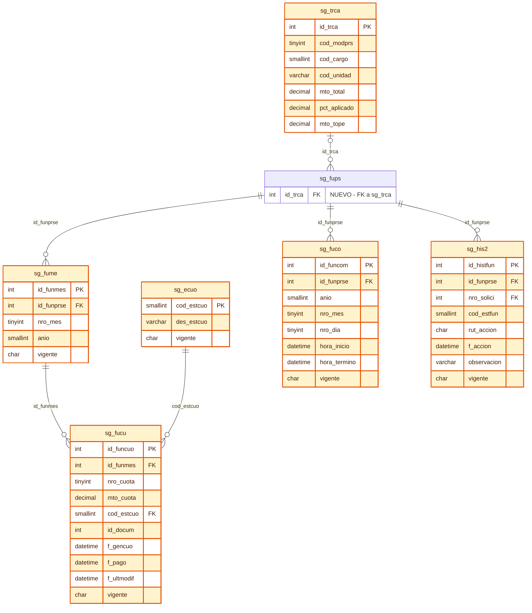

# Solicitud de Cambios BDD PDS DU288-D09/2026 Pendientes

Este documento resume solo los cambios BDD pendientes o evolutivos necesarios para completar el flujo PDS DU288-D09/2026. No incluye cambios ya integrados, como `sg_prse.cod_modprs`, `sg_tmod`, `sg_efun` o los campos DU288 ya agregados a `sg_fups`.

## Diagrama Resumido

## Resumen de Tablas y Cambios a Pedir

| Tabla | Accion solicitada | Descripcion funcional | Motivo |
| :--- | :--- | :--- | :--- |
| `sg_fups` | Modificar | Funcionario asociado a la PDS. Ya existe, pero falta agregar la referencia a la regla de tope aplicada. | Permite saber que registro de `sg_trca` se uso para calcular/congelar el tope del funcionario. |
| `sg_fume` | Crear | Meses de ejecucion aprobados por funcionario PDS. | Normaliza los meses aprobados y permite generar cuotas por mes al formalizar la PDS. |
| `sg_fucu` | Crear | Cuota habilitada por mes aprobado del funcionario. | Deja preparado el registro consultable por pagos, sin crear aun la solicitud formal de pago. |
| `sg_ecuo` | Crear | Maestro de estados de cuota. | Parametriza estados de vida de cada cuota habilitada. |
| `sg_fuco` | Reemplazar/evolucionar estructura actual | Tramos de compensacion horaria por funcionario y fecha calendario real. | La estructura actual por `dia_semana` y `cant_horas` no permite registrar fecha exacta, cruce de anio/mes ni multiples tramos. |
| `sg_his2` | Crear / integrar si se confirma negocio | Historial individual por funcionario dentro de la PDS. | Complementa `sg_hist` y `sg_apso` cuando se necesita trazabilidad parcial por funcionario, observacion, rechazo o cambio de estado individual. |
| `sg_trca` | Crear | Maestro minimo de topes DU288 solo para cargos directivos. | En esta fase solo parametriza los topes directivos de instituto explicitamente definidos. |

## Detalle de Atributos por Tabla

### `sg_fups` - Funcionario Asociado a PDS

| Atributo | Tipo sugerido | Null | Descripcion |
| :--- | :--- | :--- | :--- |
| `id_trca` | `int` | `NULL` | FK logica a `sg_trca.id_trca`. Identifica la regla/tope exacto aplicado al funcionario. |

### `sg_fume` - Meses de Ejecucion PDS

| Atributo | Tipo sugerido | Null | Descripcion |
| :--- | :--- | :--- | :--- |
| `id_funmes` | `int identity` | `NOT NULL` | PK. Identificador del mes aprobado. |
| `id_funprse` | `int` | `NOT NULL` | FK a `sg_fups.id_funprse`. Funcionario PDS asociado. |
| `nro_mes` | `tinyint` | `NOT NULL` | Numero de mes calendario aprobado, de 1 a 12. |
| `anio` | `smallint` | `NOT NULL` | Anio del mes de ejecucion aprobado. |
| `vigente` | `char(1)` | `NOT NULL` | Vigencia logica del mes aprobado. Valores esperados: `S` / `N`. |

### `sg_fucu` - Cuota Habilitada por Mes PDS

| Atributo | Tipo sugerido | Null | Descripcion |
| :--- | :--- | :--- | :--- |
| `id_funcuo` | `int identity` | `NOT NULL` | PK. Identificador de la cuota habilitada. |
| `id_funmes` | `int` | `NOT NULL` | FK a `sg_fume.id_funmes`. Mes aprobado desde el cual nace la cuota. |
| `nro_cuota` | `tinyint` | `NOT NULL` | Numero de cuota del funcionario dentro de la PDS. |
| `tot_cuotas` | `tinyint` | `NOT NULL` | Total de cuotas generadas para el funcionario dentro de la PDS. |
| `cod_estcuo` | `smallint` | `NOT NULL` | FK a `sg_ecuo.cod_estcuo`. Estado actual de la cuota. |
| `id_docum` | `int` | `NULL` | Documento/evidencia asociado en etapa posterior de pago, si corresponde. |
| `f_gencuo` | `datetime` | `NOT NULL` | Fecha y hora de generacion de la cuota al formalizar/archivar la PDS. |
| `f_pago` | `datetime` | `NULL` | Fecha y hora en que la cuota queda pagada, si aplica. |
| `f_ultmodif` | `datetime` | `NOT NULL` | Fecha y hora de ultima actualizacion de la cuota. |
| `vigente` | `char(1)` | `NOT NULL` | Vigencia logica de la cuota. Valores esperados: `S` / `N`. |

### `sg_ecuo` - Estado de Cuota

| Atributo | Tipo sugerido | Null | Descripcion |
| :--- | :--- | :--- | :--- |
| `cod_estcuo` | `smallint` | `NOT NULL` | PK. Codigo de estado de cuota. |
| `des_estcuo` | `varchar(100)` | `NOT NULL` | Descripcion del estado de cuota. |
| `vigente` | `char(1)` | `NOT NULL` | Vigencia del estado. Valores esperados: `S` / `N`. |

Datos iniciales:

| cod_estcuo | des_estcuo | vigente |
| ---: | :--- | :--- |
| 1 | Generada | S |
| 2 | Disponible | S |
| 3 | Solicitada | S |
| 4 | Autorizada | S |
| 5 | Pagada | S |
| 6 | Rechazada | S |
| 7 | Bloqueada | S |

### `sg_fuco` - Compensacion Horaria por Fecha

| Atributo | Tipo sugerido | Null | Descripcion |
| :--- | :--- | :--- | :--- |
| `id_funcom` | `int identity` | `NOT NULL` | PK. Identificador del tramo de compensacion. |
| `id_funprse` | `int` | `NOT NULL` | FK a `sg_fups.id_funprse`. Funcionario PDS asociado. |
| `anio` | `smallint` | `NOT NULL` | Anio calendario real de la compensacion. |
| `nro_mes` | `tinyint` | `NOT NULL` | Mes calendario real de la compensacion, de 1 a 12. |
| `nro_dia` | `tinyint` | `NOT NULL` | Dia calendario real de la compensacion. |
| `hora_inicio` | `datetime` | `NOT NULL` | Hora de inicio del tramo compensado. En Sybase 12 puede usarse `datetime` usando la porcion horaria. |
| `hora_termino` | `datetime` | `NOT NULL` | Hora de termino del tramo compensado. En Sybase 12 puede usarse `datetime` usando la porcion horaria. |
| `vigente` | `char(1)` | `NOT NULL` | Vigencia logica del tramo. Valores esperados: `S` / `N`. |

### `sg_his2` - Historial Individual por Funcionario

| Atributo | Tipo sugerido | Null | Descripcion |
| :--- | :--- | :--- | :--- |
| `id_histfun` | `int identity` | `NOT NULL` | PK. Identificador del evento historico por funcionario. |
| `id_funprse` | `int` | `NOT NULL` | FK a `sg_fups.id_funprse`. Funcionario de la PDS afectado. |
| `nro_solici` | `int` | `NOT NULL` | FK logica a `sg_soli.nro_solici`. Solicitud madre para trazabilidad cruzada. |
| `cod_estfun` | `smallint` | `NULL` | Estado del funcionario luego de la accion, si aplica. |
| `rut_accion` | `char(9)` | `NOT NULL` | Usuario que ejecuto la accion sobre el funcionario. |
| `f_accion` | `datetime` | `NOT NULL` | Fecha y hora del evento. |
| `observacion` | `varchar(500)` | `NULL` | Comentario o motivo de aprobacion, observacion, devolucion, rechazo o exclusion parcial. |
| `vigente` | `char(1)` | `NOT NULL` | Vigencia logica del registro. Valores esperados: `S` / `N`. |

Notas:

1. `sg_his2` no reemplaza `sg_hist`; lo complementa a nivel de funcionario.
2. Solo debe integrarse si negocio confirma trazabilidad parcial por funcionario como requisito formal.
3. Si se integra, debe usarse para registrar exclusiones, rechazos parciales, observaciones y cambios de estado individuales.

### `sg_trca` - Reglas y Topes DU288

| Atributo | Tipo sugerido | Null | Descripcion |
| :--- | :--- | :--- | :--- |
| `id_trca` | `int identity` | `NOT NULL` | PK. Identificador de la regla/tope. |
| `cod_modprs` | `tinyint` | `NOT NULL` | Modalidad PDS. Para DU288-D09/2026 usar `2`. |
| `cod_cargo` | `smallint` | `NOT NULL` | Cargo SISPER al que aplica el tope. En esta fase corresponde a `3120`. |
| `cod_unidad` | `varchar(20)` | `NULL` | Codigo de unidad/instituto asociado al cargo directivo. |
| `mto_total` | `decimal(12,0)` | `NOT NULL` | Total base usado como referencia para el cálculo. |
| `pct_aplicado` | `decimal(5,2)` | `NULL` | Porcentaje aplicado sobre la base, cuando corresponde. |
| `mto_tope` | `decimal(12,0)` | `NOT NULL` | Tope mensual final asociado al cargo directivo. |

Datos iniciales base:

| id_trca | cod_modprs | cod_cargo | cod_unidad | mto_total | pct_aplicado | cod_forcal | mto_tope |
| ---: | ---: | ---: | :--- | :--- | ---: | ---: | :--- | ---: |
| 1 | 2 | 3120 | 16150000 | DIRECTOR INST. INNOVACION Y EMPRENDIMIENTO | 5291266 | 35.00 | F | 1851943 |
| 2 | 2 | 3120 | pendiente | DIRECTOR INST. INFORMATICA EDUCATIVA | 5291266 | 50.00 | F | 2645633 |
| 3 | 2 | 3120 | pendiente | DIRECTOR INST. AGROINDUSTRIAS | 5291266 | 48.50 | F | 2566751 |
| 4 | 2 | 3120 | pendiente | DIRECTOR INST. DESARROLLO LOCAL Y REGIONAL | 5291266 | 48.30 | F | 2554357 |
| 5 | 2 | 3120 | pendiente | DIRECTOR INST. ESTUDIOS INDIGENAS E INTERCULTURALES | 5291266 | 46.70 | F | 2471469 |
| 6 | 2 | 3120 | pendiente | DIRECTOR INST. MEDIO AMBIENTE | 5291266 | 45.30 | F | 2397930 |

Notas:

1. En este pendiente `sg_trca` queda restringida solo a cargos directivos explicitamente definidos.
2. No se deben agregar registros academicos, tecnicos, administrativos ni auxiliares en esta fase.
3. Los campos economicos requeridos para esta etapa son solo `mto_total`, `pct_aplicado` y `mto_tope`.

