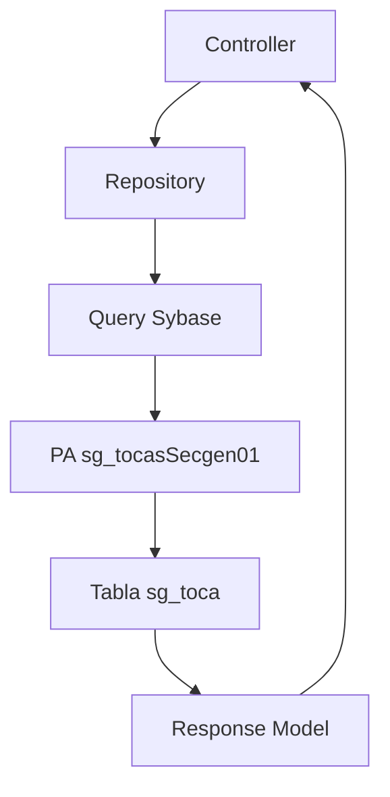

# Trazabilidad integración PA `sg_tocasSecgen01` hasta controller

## Objetivo

Documentar cómo se integró el PA de tope normativo por cargo/unidad desde base de datos hasta el controller del backend, para usarlo como referencia cuando se deba crear una nueva funcionalidad similar.

La integración creada permite consultar si el contrato evaluado de un funcionario tiene un tope especial configurado en `secgen_db.dbo.sg_toca`.

Esta funcionalidad no reemplaza el cálculo general de PA13. Solo resuelve si existe un tope especial por `cod_cargo + cod_unidad`.

## Regla funcional

`sg_toca` queda acotada a topes especiales por cargo y unidad.

En esta fase contiene los topes para:

- `cod_cargo = 3120`
- unidades de Institutos Independientes
- vigencia abierta o por rango de fechas

El resultado esperado es:

- `tiene_tope_cargo = 'S'` si existe regla vigente en `sg_toca`
- `tiene_tope_cargo = 'N'` si no existe regla vigente
- `mto_tope` solo cuando existe regla
- `cod_cargo` y `cod_unidad` del contrato evaluado

## Flujo implementado



## Archivos creados o modificados

### 1. PA SQL

Archivo:

```text
nuevo_workflow_fase_2/template-du09/cambios_pa_solicitud_wf/maestros/sg_tocasSecgen01.sql
```

Procedimiento:

```sql
Analisis2.sg_tocasSecgen01
```

Parámetros:

```sql
@rut_person  char(9)
@id_contrato int = NULL
@fecha_eval  datetime = NULL
```

Retorna:

```text
tiene_tope_cargo
mto_tope
cod_cargo
cod_unidad
f_inicio
f_termino
```

Regla:

- si se informa `@id_contrato`, usa ese contrato;
- si no se informa, busca el contrato principal vigente/en trámite;
- cruza `cod_cargo + cod_unidad` contra `sg_toca`;
- valida `vigente = 'S'`;
- valida vigencia por `f_inicio` y `f_termino`.

### 2. Query Sybase backend

Archivo:

```text
sg-solicitudes-backend/src/db-assets/sybase-assets/queries/service-provision-request/service-provision-request.ts
```

Query agregada:

```ts
selectNormativeStaffPositionCap
```

Ejecuta:

```sql
EXECUTE secgen_db.Analisis2.sg_tocasSecgen01
```

### 3. Modelo de respuesta

Archivo:

```text
sg-solicitudes-backend/src/models/response/service-provision/normative-staff-position-cap-response.model.ts
```

Clase:

```ts
NormativeStaffPositionCapResponse
```

Campos:

```ts
tieneTopeCargo: string
mtoTope?: number
codCargo?: number
codUnidad?: string
fechaInicio?: string
fechaTermino?: string
```

Mapeo desde PA:

| PA | Backend |
| --- | --- |
| `tiene_tope_cargo` | `tieneTopeCargo` |
| `mto_tope` | `mtoTope` |
| `cod_cargo` | `codCargo` |
| `cod_unidad` | `codUnidad` |
| `f_inicio` | `fechaInicio` |
| `f_termino` | `fechaTermino` |

### 4. Export del modelo

Archivo:

```text
sg-solicitudes-backend/src/models/response/service-provision/index.ts
```

Export agregado:

```ts
export * from './normative-staff-position-cap-response.model';
```

### 5. Repository

Archivo:

```text
sg-solicitudes-backend/src/repositories/storedProcedures/service-provision-request-procedures.repository.ts
```

Método agregado:

```ts
selectNormativeStaffPositionCap(
  rutPerson: string,
  idContrato?: number | null,
  fechaEval?: string | null,
  connect = true,
  disconnect = true
): Promise<NormativeStaffPositionCapResponse>
```

Responsabilidad:

- normalizar RUT;
- enviar `id_contrato` o `NULL`;
- enviar `fecha_eval` o `NULL`;
- ejecutar query `selectNormativeStaffPositionCap`;
- mapear respuesta con `NormativeStaffPositionCapResponse.fromProcedure`;
- devolver `{ tieneTopeCargo: 'N' }` si no hay filas o si falla la consulta.

### 6. Controller

Archivo:

```text
sg-solicitudes-backend/src/controllers/service-provision/service-provision-request.controller.ts
```

Endpoint agregado:

```http
GET /requests/service-provision/normative/staff-position-cap
```

Query params:

```text
rutPerson   requerido
idContrato  opcional
fechaEval   opcional
```

Método:

```ts
getNormativeStaffPositionCap(...)
```

Llama a:

```ts
this.serviceProvisionRequestProceduresRepository.selectNormativeStaffPositionCap(...)
```

## Ejemplo de uso

```http
GET /requests/service-provision/normative/staff-position-cap?rutPerson=070671514&idContrato=3907
```

Respuesta con tope:

```json
{
  "tieneTopeCargo": "S",
  "mtoTope": 1851943,
  "codCargo": 3120,
  "codUnidad": "16150000",
  "fechaInicio": "2026-01-01 00:00:00.000",
  "fechaTermino": null
}
```

Respuesta sin tope:

```json
{
  "tieneTopeCargo": "N"
}
```

## Patrón para futuras integraciones PA → Backend → Controller

Cuando se cree una nueva funcionalidad basada en PA, seguir este orden:

1. Crear PA SQL en la carpeta correspondiente.
2. Definir claramente:
   - objetivo del PA;
   - parámetros de entrada;
   - salida esperada;
   - reglas que aplica;
   - reglas que no aplica.
3. Agregar query en el archivo Sybase correspondiente.
4. Crear modelo de respuesta específico.
5. Exportar el modelo en `models/response/.../index.ts`.
6. Agregar método en repository.
7. Agregar endpoint en controller.
8. Compilar backend.
9. Recién después conectar frontend/store si corresponde.

## Reglas de diseño aplicadas

- No usar `Du288` en nombres nuevos si la funcionalidad puede describirse como normativa.
- Usar prefijo `Normative` para respuestas o métodos asociados a reglas normativas.
- No mezclar tablas de topes con validación de inhabilidad.
- No reutilizar modelos antiguos de catálogo si la respuesta nueva tiene otra semántica.
- No cambiar frontend hasta que backend quede estable.

## Relación con otros PA

| Componente | Responsabilidad |
| --- | --- |
| `sg_fupssSecgen13` | Obtiene contrato/base laboral/tope general del funcionario |
| `sg_fupssSecgen14` | Valida habilitación normativa del cargo |
| `sg_tocasSecgen01` | Consulta tope especial por cargo y unidad en `sg_toca` |

## Verificación realizada

Backend compilado con:

```bash
npm run build
```

Resultado:

```text
lb-tsc OK
```

## Pendiente siguiente

Definir si `selectNormativeStaffPositionCap` debe:

1. consumirse desde frontend como endpoint independiente; o
2. integrarse dentro del flujo principal de perfil del funcionario, para que PA13 + PA14 + sg_toca devuelvan un perfil final ya resuelto.

La opción recomendada para evitar lógica duplicada en frontend es integrar el resultado en el perfil normativo final del funcionario en backend.
